# Hearth — system design

How the system is put together, how a request moves through it, and what the
data looks like. Written so an engineer new to the project can orient in one
sitting.

**Scope:** what exists today — slices 0 and 1, self-serve sign-up and
household provisioning (which shipped ahead of slice 2 in the build order, see
`docs/HANDOVER.md`), and all five features of slice 2 (Money), now complete:
Accounts — a household records what it owns and owes by hand and sees a net
worth built from it; Transactions — the ledger a household logs expenses,
income and transfers into, categorised and filterable, which is also what
turns an account's balance from a copy of its opening figure into a real
sum; Budget — an envelope per category with pace, built directly on
Transactions' own month totals, plus the category management (rename,
create, archive) the design folds into its Edit-budget modal rather than a
dedicated screen; Goals — a savings target with an optional date, its
progress kept as a contributions ledger rather than an account balance, and
the manual move that finally gives Budget's unspent money somewhere to go;
and Bills — a household's recurring fixed costs on a one-off, monthly,
quarterly or yearly cadence, whose due date survives a short month by
clamping a stored anchor day rather than the date itself (§5), and whose
"mark paid" writes a real expense transaction into `transactions` — the one
place in Money something outside Transactions writes its ledger — so Budget,
Spending by person and net worth all move the moment a bill is settled.
Marriage's first feature, Retros, is code-complete, reviewed and now walked:
its three tables and their relationships (§6), its route group and both
guards (§4), and its frontend — `RetrosPage.tsx`'s five screen states, a real
history list and twelve-month mood chart (task 11), the selected month's full
detail (`RetroDetail.tsx`, task 12) and the Start/Edit modal (`RetroModal.tsx`,
tasks 13–14: mood, the two textareas, a live budget-and-goals check-in, an
action composer and a "carry an unfinished action forward" offer) — are all
built (§5, §7). The gap this paragraph used to name — a draft retro's delete
route and its frontend hook with no screen calling either — closed in the
same round `RetroModal.tsx` was given a Discard-draft control (`4d719b8`);
`removeAction` (deleting a single action) is the one write `useRetro` still
exposes with no caller, and stays that way deliberately — no mockup or task
brief ever asked for it (`docs/LEARNING.md` pattern 15). **Retros' own
fifteen-criterion browser walk (Task 17) has run and passed, 15 of 15**
(2026-08-18), the same bar every Money feature was held to before its
tracker row could read ✅, recorded in
`docs/superpowers/plans/2026-08-16-hearth-retros-verification.md`. Vision,
Marriage's second feature, is code-complete, reviewed and now walked,
code-shaped the same way Retros is: its four tables and their relationships,
including the cross-feature edge into `goals` (§6), its two routes joining
Retros' own route group (§4), `VisionService` and its two ports —
`VisionRepository`/`GoalProgressReader` (§3) — are all built (§5, "Vision —
a whole-document replace"), and its frontend — `VisionPage.tsx`,
`PillarCard.tsx` and `MilestoneGrid.tsx` (Vision spec's task 11) render the
theme hero, pillar measures and longer-horizon milestones `useVision`
exposes (task 10), and `VisionModal.tsx` (Vision spec's task 12) is the
whole-document editor all three of `onEdit`'s call sites now open — the
header's Edit vision button, the "+ Add milestone" tile and the empty
state's own call to action — so a household can both see a year's vision
and set one (§7). **Vision's own fifteen-criterion browser walk has run and
passed, 15 of 15** (2026-08-29), the same bar every Money feature and Retros
were held to before their tracker rows could read ✅, recorded in
`docs/superpowers/plans/2026-08-28-hearth-vision-verification.md` — so its
rows in `docs/FEATURE_TRACKER.md` now stand on the same "reviewed and
walked" footing Retros carries in this paragraph, not the code and
`make test` alone the way Bills and Goals stood between their own last code
task and their walk. Agreements has
not been started. Family is not built. See
`docs/FEATURE_TRACKER.md` section 6 for exactly which of Marriage's rows are
done, including the two deliberate divergences from the design spec's own
prose the walk found and left as shipped.
Overview is **partly** built: `/` carries an interim page composed of six of
the design's seven cards (the money row of four, Marriage's "Next retro",
"This week" and "Vision 2026" — the header's own "+ Add" button is not a
card) that Money and Marriage can now supply, plus the Vision check-in strip
(inside the Next retro card, not a card of its own), a setup
checklist and a quick-create menu, and it grows into the designed Overview as
Family arrives rather than being replaced (§7). It adds no
endpoint, no table and no port — it is composition over what Accounts,
Transactions, Budget, Goals, Bills and Vision already expose. The UX-repair round of
2026-07-31 that preceded it shipped no feature at all — it bounded the page
container, removed the two unbuilt spaces from the navigation along with
their four routes, and rewrote copy; Marriage's route, guard and sidebar
entry came back together in the same change that built `RetrosPage.tsx`
(§4, §7) — where any of these rounds changed the shape of something drawn
here, the change is recorded at that diagram (§7 in particular).

**Telegram sign-in is code-complete and has been walked in a browser against
a real bot, 2026-09-01.** It adds a second *delivery channel* for the sign-in
and sign-up links Hearth already mints — a new outbound-only adapter (§2),
three new ports plus one interface the adapter declares for itself (§3), one
new public route (§4), a new flow (§5), two new tables and a `signups` table
that now names either an email address or a Telegram chat (§6), and one new
control on the sign-in screen (§7). It changes what a token *travels over*,
never what a token is, who may hold one, or what consuming one does: no new
session-issuing code exists anywhere in it. **It is off unless configured** —
`TELEGRAM_BOT_TOKEN` and `TELEGRAM_BOT_USERNAME` must both be set or both be
empty, and both empty — which is what `deploy/.env` on the production box
says, and this change has not been deployed there anyway — leaves the route
answering `404` and the poller never started. Every numbered criterion and
every unnumbered check passed against `HearthOinkBot`, a real BotFather bot,
on `make dev`: a stranger's `/start` produced a sign-up link that provisioned
a household with no email address at all, and — the discriminating result —
a bound chat's `/start` produced a **sign-in** link rather than a second
sign-up, so `Accounts.ByChatID` found the binding and took the returning-user
branch instead of ever minting a second household.
`docs/superpowers/plans/2026-09-01-telegram-sign-in-verification.md` is that
walk, written out and recorded as run. Its rows in
`docs/FEATURE_TRACKER.md` are ✅ for exactly that reason — this
document draws code that is built, reviewed, and now verified the same way
every other feature here is.
`docs/adr/0004-telegram-as-a-second-delivery-channel.md` carries why Telegram
rather than WhatsApp or SMS, and why the link comes back to the device that
taps it.

**This is deployed.** Hearth has run at <https://oink.mywire.org> since
2026-08-15, on one Hetzner CX23 in Falkenstein, serving a real household. §1
carries the production topology; it is a drawing of something running, not a
plan. `docs/adr/0002-first-production-host.md` records the host choice and its
same-day amendment moving the region to the EU, and
`docs/superpowers/plans/2026-08-10-hearth-production-verification.md` records
what was verified on the live box and what was not.

**Backups run nightly to Cloudflare R2**, `age`-encrypted with a key that is
deliberately not on the box, and the restore path has been exercised end to end
against a real backup — all eleven tables and every monetary value came back
intact. What is still missing is the **escrow**: no second person holds the
private key, so no restore has ever been performed by anyone but the owner.
§8's Backups row carries both halves.

---

## 1 · Containers

What runs, and what talks to what.

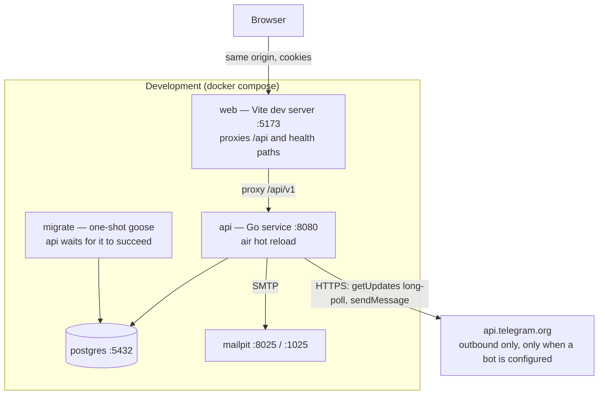
```mermaid
graph TD
    Browser["Browser"]

    subgraph dev["Development (docker compose)"]
        Web["web — Vite dev server :5173<br/>proxies /api and health paths"]
        API["api — Go service :8080<br/>air hot reload"]
        PG[("postgres :5432")]
        Mail["mailpit :8025 / :1025"]
        Migrate["migrate — one-shot goose<br/>api waits for it to succeed"]
    end

    TG["api.telegram.org<br/>outbound only, only when a bot is configured"]

    Browser -->|"same origin, cookies"| Web
    Web -->|"proxy /api/v1"| API
    API --> PG
    API -->|SMTP| Mail
    API -->|"HTTPS: getUpdates long-poll, sendMessage"| TG
    Migrate --> PG
```

**Telegram is the only arrow here that leaves the machine, and it points
outward.** Bot updates arrive by `getUpdates` long-polling *from inside* the
`api` process — there is no webhook, so no new route faces the internet and
nothing has to be re-registered when the hostname changes (which on a free DDNS
hostname is a live possibility). The alternative, `POST /telegram/webhook`,
would have been a public unauthenticated route whose only guard is a shared
secret header, in a codebase whose rule is that a route without its guard has
no second line of defence.

**The two Telegram values reach the container from `.env`, and they are the
only two in `docker-compose.yml` that do.** Every other value for the dev `api`
service is written into the compose file directly; a bot token is a credential,
so it is passed through as `${TELEGRAM_BOT_TOKEN:-}` instead, defaulting to
empty so a machine with no `.env` still boots with the feature off. Without that
passthrough the Docker path would read a token in `.env` and never see it —
`make dev-local` sources `.env` itself and would have worked, `make dev` would
not, and the only symptom is a `404` and a button that hides itself. In
production the same values arrive through `env_file: [.env]` on the `api`
service, which already carried everything.

**Exactly one process may long-poll.** Telegram hands each update to a single
`getUpdates` caller, so a second `api` replica would silently steal updates and
the symptom would be "Telegram sign-in works about half the time". That is true
on one box today and invisible until it bites, which is why it is written both
here and in `Poller`'s own doc comment, and why §8 carries it as an operational
constraint rather than only as a code comment.

The browser only ever talks to one origin. In development Vite proxies `/api` to
the Go service; in production nginx serves the built bundle and proxies the same
path. There is no CORS configuration anywhere, because there is never a
cross-origin request.

`api` declares `depends_on: migrate` with `service_completed_successfully`, so a
fresh `docker compose up` always applies the schema before `api` starts. That
guarantee has a gap `make up` does not close: Compose only re-evaluates a
`depends_on` condition when it recreates the *depending* service, so a stack
left running across a newly added migration keeps its already-succeeded
`migrate` container and never reruns it — `make up` against an already-running
stack silently misses new migrations. `make dev-local` sidesteps this by
running `make migrate` explicitly before it starts anything; `make up` and a
bare `docker compose up` do not. See `docs/HANDOVER.md`.

**Production differs in three ways that matter:** the `web` container is nginx
serving static files; TLS termination in front is mandatory — cookies are
`Secure` outside development, so without TLS the browser never returns the
session cookie; and only nginx's config sets `X-Real-IP` to `$remote_addr` and
suppresses `True-Client-IP`, which is what stops a client from spoofing the
sign-up per-IP rate limiter's key (§4). Development has no nginx service at
all — Vite proxies `/api` straight to `api:8080` with no header rewriting — so
the per-IP limiter is fully spoofable there; see `docs/HANDOVER.md`.

### The production topology — running since 2026-08-15

**This is a drawing of something that runs.** Hearth is live at
<https://oink.mywire.org> on a Hetzner CX23 in Falkenstein, serving a real
household from a browser-walked install. Nine of the twelve verification
criteria pass; `docs/superpowers/plans/2026-08-10-hearth-production-verification.md`
records each one, including what it was checked against rather than assumed
from.

Two properties of this box were measured on it, not inferred, and both are
worth carrying:

- **A reboot recovers unattended in about 26 seconds**, with the data, the
  signed-in session and the TLS certificate all intact. The certificate
  survives because it lives in the `caddy-data` volume; re-issuing on every
  boot would spend Let's Encrypt's per-hostname budget for nothing.
- **`migrate` does not re-run on reboot, and `api` starts anyway.**
  `depends_on: service_completed_successfully` is honoured by
  `docker compose up`, **not** by the daemon's restart policy. Harmless with
  migrations already applied, and the reason a deploy must go through
  `deploy/deploy.sh` rather than a reboot.

One thing here is genuinely not built rather than merely undeployed: **there
are no backups**. `deploy/backup.sh` and `deploy/restore.sh` exist and the
restore has been rehearsed on a laptop, but no `age` key, bucket, `rclone`
remote or cron exists on this box. The `Backup` node below is drawn because the
script targets it, not because anything has been written there. Until that
changes, losing the box loses the household.

`docs/adr/0002-first-production-host.md` carries why this shape was chosen and
why the region moved to the EU; `deploy/README.md` is the runbook for operating
it.

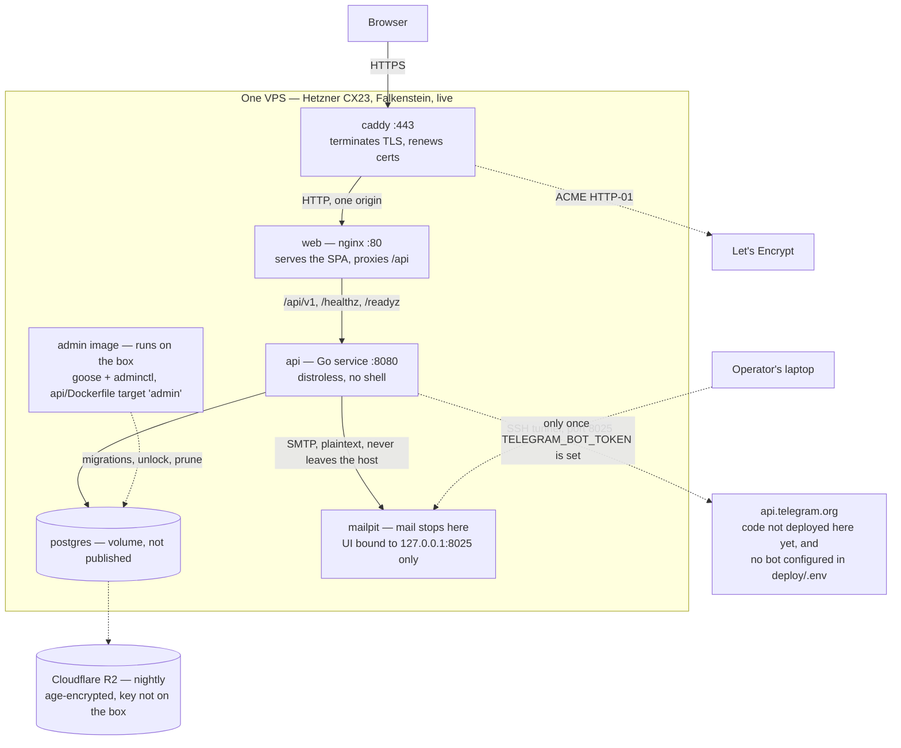
```mermaid
graph TD
    Browser["Browser"]
    LE["Let's Encrypt"]

    subgraph host["One VPS — Hetzner CX23, Falkenstein, live"]
        Caddy["caddy :443<br/>terminates TLS, renews certs"]
        Nginx["web — nginx :80<br/>serves the SPA, proxies /api"]
        API["api — Go service :8080<br/>distroless, no shell"]
        PG[("postgres — volume, not published")]
        Mailpit["mailpit — mail stops here<br/>UI bound to 127.0.0.1:8025 only"]
        Admin["admin image — runs on the box<br/>goose + adminctl, api/Dockerfile target 'admin'"]
    end

    Operator["Operator's laptop"]
    Backup[("Cloudflare R2 — nightly<br/>age-encrypted, key not on the box")]
    TG["api.telegram.org<br/>code not deployed here yet, and<br/>no bot configured in deploy/.env"]

    Browser -->|HTTPS| Caddy
    Caddy -->|"HTTP, one origin"| Nginx
    Nginx -->|"/api/v1, /healthz, /readyz"| API
    API --> PG
    API -->|"SMTP, plaintext, never leaves the host"| Mailpit
    Operator -.->|"SSH tunnel, port 8025"| Mailpit
    Caddy -.->|"ACME HTTP-01"| LE
    Admin -.->|"migrations, unlock, prune"| PG
    PG -.-> Backup
    API -.->|"only once TELEGRAM_BOT_TOKEN is set"| TG
```

Five things about this shape are not obvious from the boxes.

**Mail stops at the box, and that is deliberate rather than unfinished.** There
is no relay in this diagram because the install runs on a free DDNS hostname
whose DNS refuses `TXT` records, so DKIM cannot be published and no hosted relay
will verify the domain. Rather than send unauthenticated mail into spam folders
and call it delivered, sign-up links, invites and magic links land in Mailpit and
are read by hand over an SSH tunnel. `docs/adr/0003-mail-stays-on-the-box.md`
carries the full reasoning and the exit condition — the day a third person needs
to receive mail.

Two consequences worth carrying: **that inbox is a complete authentication
bypass**, since every magic link in it grants an account with no password, which
is why 8025 is published as `127.0.0.1:8025` and never `0.0.0.0`; and TLS is
untouched by any of it, because Caddy's ACME challenge is HTTP-01 over port 80
and needs no DNS record at all. The DDNS restriction bites only on mail.

**Caddy exists to renew certificates, not to route.** nginx already does the
routing, and `web/nginx.conf` carries a security control in its header
rewriting that would have to be re-implemented if Caddy served the SPA
directly. Caddy sits in front purely so TLS issuance and renewal are automatic
for as long as the product runs — a certbot cron is the kind of thing that
works for six years and then quietly stops.

**That second proxy would break the per-IP rate limiter, and nginx is now told
about it.** With Caddy in front, the `$remote_addr` nginx sees is *Caddy's*
address on every request, so the `X-Real-IP` it sets would be the same value for
every caller and `middleware.RealIP` would key the whole world to one bucket
(§4). `web/nginx.conf` therefore carries `set_real_ip_from 172.28.0.0/16`,
`real_ip_header X-Forwarded-For` and an explicit `real_ip_recursive off`, which
resolve `$remote_addr` back to the real client. Invisible when wrong — the
limiter does not error, it just stops limiting — so it was proven rather than
assumed: two containers on the compose network get two independent budgets,
where before the change the second inherited the first's exhausted one.

The trusted range is the **whole `172.28.0.0/16` compose subnet, not Caddy
alone**, because Docker assigns Caddy's address from that subnet and a `/32`
would need pinning. It is the same string as the `hearth` network's `subnet:` in
`deploy/docker-compose.prod.yml`, and the two must move together. That means any
container on the network can present an `X-Forwarded-For` nginx will believe —
accepted, because such a container can also reach `api:8080` directly, where
`middleware.RealIP` has no trusted-proxy list at all, so narrowing the CIDR
would close one of two equivalent routes. What the boundary actually rests on is
that internet traffic reaches nginx only through Caddy, which replaces
`X-Forwarded-For` rather than forwarding a caller's. Putting anything in front
of *Caddy* is a `trusted_proxies` change in `deploy/Caddyfile`, not a CIDR
change here.

**The admin image is a second image, not a shell added to the first.** The prod
API image is `distroless/static-debian12:nonroot` with `ENTRYPOINT
["/app/api"]`: no shell, no `goose`, no `adminctl`, and that stays true. So
`api/Dockerfile` carries a third target, `admin`, on the same distroless base,
holding `/app/goose`, `/app/adminctl` and `/app/migrations`. The production
surface grows by two static binaries rather than by a shell or a Go toolchain.
It reaches the database two ways, both in `deploy/docker-compose.prod.yml`: as
the one-shot `migrate` service that `api` waits on with
`service_completed_successfully`, and as a `profiles: [manual]` `admin` service
never started by `up` and reached with `docker compose run --rm admin …` for
`unlock-household`, `reset-password`, `create-invite` and `prune`. Every one of
those commands is written out in `deploy/README.md`.

The dashes on this node do **not** mean "missing" — `Caddy -.-> LE` and
`PG -.-> Backup` use them too, for occasional rather than request-path traffic.
What has not happened is that none of it has run on a real box: the images are
built by CI and the amd64 `goose` binary has been executed under emulation, but
no migration has been applied to a production database. That is a deployment
gap, not a capability gap — during a lockout there *is* a recovery path, and it
is `adminctl unlock-household`.

**The Telegram node is drawn dashed because it is a capability this box has and
does not use.** Two separate reasons, and both hold: this change has not been
deployed to the box yet, and `deploy/.env` there sets neither
`TELEGRAM_BOT_TOKEN` nor `TELEGRAM_BOT_USERNAME` — so even after a deploy,
`config.Load` leaves the feature off, `POST /api/v1/auth/telegram/start` answers
`404` and the poller is never started. Turning it on is two `.env` values and a restart of a build that
carries migration `00011_telegram` — no code change, and no inbound port,
because the connection is outbound. It is drawn
rather than omitted because the shape an operator needs to know is that
switching it on puts **a third party on the recovery path**: every sign-in and
sign-up link sent over Telegram is readable by Telegram, exactly as every link
in Mailpit is readable by whoever can reach that inbox.
`docs/INFRASTRUCTURE.md` carries that as a dependency row rather than leaving
it as a diagram footnote.

---

## 2 · Backend layers

Clean architecture. Dependencies point inward only, and `make lint-arch`
enforces it mechanically — including in test files.

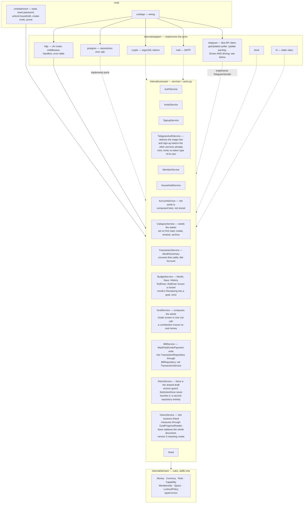
```mermaid
graph TD
    subgraph cmd["cmd/"]
        Main["cmd/api — wiring"]
        Admin["cmd/adminctl — seed, reset-password,<br/>unlock-household, create-invite, prune"]
    end

    subgraph adapters["internal/adapter/ — implements the ports"]
        HTTP["http — chi router, middleware,<br/>handlers, error table"]
        PGA["postgres — repositories over sqlc"]
        Crypto["crypto — argon2id, tokens"]
        MailA["mail — SMTP"]
        TelegramA["telegram — Bot API client,<br/>getUpdates poller, update parsing.<br/>Driven AND driving: see below"]
        Clock["clock"]
        FX["fx — static rates"]
    end

    subgraph usecase["internal/usecase/ — services + ports.go"]
        Auth["AuthService"]
        Invite["InviteService"]
        Signup["SignupService"]
        TelegramAuth["TelegramAuthService — delivers the magic-link<br/>and sign-up tokens the other services already<br/>mint; mints no token type of its own"]
        Member["MemberService"]
        House["HouseholdService"]
        Account["AccountService — net worth is<br/>composed here, not stored"]
        Category["CategoryService — seeds the starter<br/>set on first read; create, rename, archive"]
        Transaction["TransactionService — MonthSummary<br/>converts then adds, like Account"]
        Budget["BudgetService — Month, Save, History,<br/>RollOver; RollOver moves a closed<br/>month's Remaining into a goal, once"]
        Goal["GoalService — composes the whole<br/>Goals screen in one List call;<br/>a contribution moves no real money"]
        Bill["BillService — MarkPaid/UndoPayment write<br/>into TransactionRepository through<br/>BillRepository, not TransactionService"]
        Retro["RetroService — Save is the shared-draft<br/>version guard; SetActionDone never<br/>touches it, a second repository entirely"]
        Vision["VisionService — Get resolves linked<br/>measures through GoalProgressReader;<br/>Save replaces the whole document,<br/>version 0 meaning create"]
        Seed["Seed"]
    end

    subgraph domain["internal/domain/ — rules, stdlib only"]
        Rules["Money · Currency · Role · Capability<br/>Membership · Space · LockoutPolicy<br/>typed errors"]
    end

    Main --> HTTP
    Main --> PGA
    Main --> Crypto
    Main --> MailA
    Main --> TelegramA
    Admin --> usecase
    HTTP --> usecase
    usecase --> domain
    PGA -.->|implements ports| usecase
    Crypto -.-> usecase
    MailA -.-> usecase
    TelegramA -.->|implements TelegramSender| usecase
    Clock -.-> usecase
    FX -.-> usecase
```

Solid arrows are compile-time dependencies. Dotted arrows are adapters
satisfying an interface declared in `usecase/ports.go` — the dependency still
points inward, which is why every service is testable against in-memory doubles.

**One relationship in this system has no arrow here at all, and the absence is
the point.** `adapter/telegram`'s `Poller` calls
`TelegramAuthService.HandleStart`, but the package never imports `usecase` —
`grep -rn "internal/usecase" api/internal/adapter/telegram/` finds nothing,
test files included. It depends on `StartHandler`, an interface it declares
itself (`poller.go:12`), which `*usecase.TelegramAuthService` satisfies
structurally and which `cmd/api/main.go` alone connects. So there is no
compile-time edge to draw between those two packages, and drawing one would
tell a reader the compiler is already checking that relationship. It is not:
`main.go`'s `var _ telegram.StartHandler = (*usecase.TelegramAuthService)(nil)`
is what does. §3 carries the full reasoning.

**Two rules that shape everything else:**

- No `pgx`, `chi` or other infrastructure type escapes the adapter layer. A
  missing row becomes `domain.ErrNotFound` at that boundary, never `pgx.ErrNoRows`
  further up.
- **No service takes an actor parameter.** Services enforce what is *valid*;
  middleware enforces who is *asking*. Authorisation exists in exactly one place.
- **`adapter/telegram` both serves the usecase layer and drives it, and it does
  the second one without importing it.** Its `Client` is an ordinary *driven*
  adapter — it satisfies `usecase.TelegramSender`, declared in `ports.go`,
  exactly as `adapter/mail` satisfies `Mailer` (the dotted arrow). Its `Poller`
  is a *driving* adapter — an inbound `/start` is an inbound request, it simply
  arrives over a long-poll this process opened itself rather than over a
  listener. **But it drives differently from `adapter/http`, and the difference
  is the thing to understand before touching it.** `adapter/http` imports
  `usecase` and holds concrete services (`router.go`'s `Deps` names
  `*usecase.AuthService` and thirteen others), which is the solid arrow you see
  from `HTTP`. `adapter/telegram` imports nothing from `usecase` at all;
  it declares `StartHandler` locally and lets `main.go` supply something that
  fits. So the driving edge here is **inverted** — the adapter states the shape
  it needs, and the wiring, not the compiler, connects it — which is why there
  is no arrow between those two boxes and why the assertion in `main.go` exists.
  `make lint-arch` passes either way, but for a stronger reason in this case:
  the package has no inward-pointing import to check. Nothing in
  `internal/domain` or `internal/usecase` may ever import this package or any
  Telegram type — that is the boundary the arrows, and the one missing arrow,
  are drawing.
- **Which currencies are selectable is a domain rule, not an HTTP filter.**
  `domain.ParseCurrency` stays permissive — it accepts any active ISO 4217
  code, because the household `PATCH` path has always accepted arbitrary
  active codes and must keep accepting whatever is already stored.
  `domain.SelectableCurrencies`/`ParseSelectableCurrency` add a second, tighter
  gate on top for the one path that is choosing a currency for the first time.
  See §5's self-serve sign-up flow.

---

## 3 · Ports and their adapters

`usecase/ports.go` is the contract between the layers.

| Port | Implemented by | Notes |
|---|---|---|
| `UserRepository` | `adapter/postgres` | Includes the transactional `CreateWithMembership` |
| `HouseholdRepository`, `MembershipRepository`, `SessionRepository`, `MagicLinkRepository`, `LoginAttemptRepository`, `InviteRepository`, `SignupRepository`, `SpaceRepository`, `NotificationRepository` | `adapter/postgres` | Ten narrow repositories rather than one wide one |
| `AccountRepository` | `adapter/postgres` | Eleventh. Accounts joined to the owner's display name (`AccountView`); its `MembershipBelongsToHousehold` is what stops an account being assigned to a member of a different household. `AccountView.Balance` is now a real sum — see §5. `MonthlyMovements` is its newest method: one row per account per calendar month with any transaction, summed in that account's own currency (no FX conversion in SQL, the same division of labour `MonthTotals` already draws for `TransactionRepository`) — the twelve-month trend's only new read, and its filter is deliberately `ListAccounts`'s own balance expression split by month, kept identical on purpose (§5) |
| `CategoryRepository` | `adapter/postgres` | Twelfth. `List` respects `sort_order`, the order the design draws rather than alphabetical; `EnsureSeeded` is idempotent under two concurrent first requests through one `INSERT ... ON CONFLICT DO NOTHING` against `UNIQUE(household_id, name)`, never a read-then-write. Budget grows it with `Create`, `Rename` and `SetArchived` — a category is referenced by transactions and budget lines, so it archives rather than deletes, the same reasoning `accounts.archived_at` already uses for a different table; `sort_order`'s own concurrent-create window is a known, accepted, cosmetic tie (see `docs/LEARNING.md`) |
| `TransactionRepository` | `adapter/postgres` | Thirteenth. Keyset-paged `List` (a cursor is the last row's date and id, not an offset); `Update` never merges a patch — `TransactionService` turns a partial `PATCH` into a complete `domain.Transaction` first; `MonthTotals` returns rows rather than a SQL `SUM`, because a sum is only correct within one currency and the FX conversion lives in the service, not the repository |
| `BudgetRepository` | `adapter/postgres` | Fourteenth. `Get` returns `domain.ErrNotFound` for an unbudgeted month, which the service turns into the empty state, not an error; `Upsert` replaces one household-month wholesale in a single transaction — parent row upserted on `(household_id, month)`, every existing line deleted, every new line inserted, category ownership validated first — never a merge, so a category the caller left out of the payload is unambiguously gone after the call; `History` returns the closed months in range that actually have a budget row, never zero-filled; `RollOverToGoal` writes a `goal_contributions` row **and** stamps `budgets.rolled_over_at`/`rollover_goal_id` in one transaction — the stamp is a conditional `UPDATE ... WHERE rolled_over_at IS NULL`, so a second concurrent call finds no row to update and answers `ErrRolloverAlreadyDone` rather than writing a second contribution (§5) |
| `GoalRepository` | `adapter/postgres` | Fifteenth. `List`/`Get` return each goal's stored fields plus the one figure only SQL can cheaply supply — the summed `contributed` — leaving percent, status and required-monthly to `domain.` arithmetic in the service; `Create` writes the goal and, when a starting balance is given, its opening contribution in one transaction, so a goal with a missing opening contribution cannot exist; `DeleteContribution` clears a rolled-over month's stamp in the same transaction as the delete when the row being removed is that month's rollover (§5). The port's own doc comment carries a warning no other repository needs: `goal_contributions.household_id` has no database-level constraint tying it to its own `goal_id`'s household, so every method that reads or writes a contribution filters by `household_id` **and** `goal_id` together, never by contribution id alone |
| `BillRepository` | `adapter/postgres` | Sixteenth. `List`'s `includeArchived` is the same UNION-not-filter-swap contract as `AccountRepository`/`GoalRepository`. `RecordPayment` writes the expense (`transactions`), the payment (`bill_payments`) and the advanced `next_due` in one transaction — a bill left advanced with no payment, or a payment with no expense, is not a state this port can produce; `UndoPayment` reverses all three the same way, refusing any payment that is not the bill's most recent with `*domain.BillPaymentNotLatestError`. `MonthTotals` cannot come from `bills` alone — a bill already paid this month has `next_due` in the *next* one — so it unions `bill_payments` (by `due_on`) with still-unpaid live bills (by `next_due`); the two halves filter archived bills differently on purpose (§5). `bill_payments.household_id` carries the same unenforced-by-the-database warning as `goal_contributions`: every method filters by `household_id` **and** `bill_id` together, never by payment id alone (§6) |
| `AccountLookup`, `CategoryLookup` | `adapter/postgres` (`*AccountRepo` and `*CategoryRepo` already satisfy them) | Narrower ports `TransactionService` depends on instead of the full repositories above — interface segregation: it needs an account's currency and household, and whether a category id belongs to this household and what kind it is, never `List` or `EnsureSeeded`. `BillService.MarkPaid` depends on this same `AccountLookup`, for the same reason and to the same effect: the pay-from account's currency, not a value Bills stores of its own (§5). `BillService.Create`/`Update` depend on the same `CategoryLookup` too: a bill's category is copied onto the real expense `MarkPaid` writes, so it has to satisfy the ledger's own rule — this household's, and an expense category — or the spend lands in Budget's `Spent` and in no category row at all |
| `RetroRepository` | `adapter/postgres` | Seventeenth. `Create` answers `ErrAlreadyExists` on the `UNIQUE(household_id, month)` clash; `Update` takes the caller-normalised month and version it loaded, and tells "the retro is gone" (`ErrNotFound`, from a recheck read) from "someone saved first" (`ErrRetroChanged`, from a zero-row `UPDATE ... WHERE version = $n`) apart — never merges (§5); `Complete` is idempotent on the caller's own `at`; `DeleteDraft` puts `WHERE completed_at IS NULL` in the SQL itself, not a service `if`, so a zero-row match on a finished retro is `ErrNotFound`, not a silent no-op (`docs/LEARNING.md`'s Bills `SetBillNextDue` entry is the same defect shape this port was built to avoid) |
| `RetroActionRepository` | `adapter/postgres` | Eighteenth. `Add` writes the action and its assignees in one transaction, so a bad assignee id leaves no orphan action; `carriedFrom` is validated through a join back to `retros` requiring the same household before it is trusted, and a malformed id is refused rather than silently read as SQL NULL (`docs/LEARNING.md`) — "fail closed on values you did not construct" applied to a field the client supplies directly. `OpenInMonth` backs both the modal's "Still open from July" offer and Overview's `openActionCount` |
| `VisionRepository` | `adapter/postgres` | Nineteenth. `Get` returns `domain.ErrNotFound` for a year never set, which `VisionService` turns into the empty vision the screen renders (decision 9) — the repository never invents a row. `Save` replaces the whole document — parent upserted, every child deleted and reinserted — in one transaction, under the same two-shape version guard `RetroRepository.Update` established: `version == 0` is a create, refused with `domain.ErrVisionChanged` if a row has appeared since the caller read the empty vision; `version > 0` is an update, `WHERE version = $n`, with a zero-row result re-read to tell "the vision is gone" apart from "someone saved first." The existence check runs on the transaction's own connection, never the pool-backed `Get` — calling `Get` from inside `Save`'s own `pgx.BeginFunc` would hold one pool connection while asking the pool for a second, which starves it under concurrent saves (`docs/LEARNING.md`). A measure naming a goal outside this household is refused inside the same transaction with `domain.ErrVisionGoalUnknown` — the `vision_measures` foreign key alone only proves the goal exists *somewhere* |
| `GoalProgressReader` | `adapter/postgres` (`*GoalRepo` already satisfies it) | Unnumbered, like `AccountLookup`/`CategoryLookup` above — a narrow port, not a repository. One method wide on purpose, the same interface-segregation reasoning as those two, for a caller in the opposite direction: `VisionService` needs one thing from Goals, the progress of a handful of goal ids, not the forty-line `GoalRepository` contract. `ProgressByIDs` returns an entry only for an id that exists in the caller's own household; a missing id is a miss, not an error — a measure whose goal was deleted renders as a label with no figure (spec decision 8), not a failed page. Counts an *archived* goal as found, deliberately: archiving is not deletion anywhere else in this product, so a measure linked to an archived goal keeps its figure |
| `TelegramLinkRepository` | `adapter/postgres` | Twentieth. Stores the pending deep-link nonces, hashed, that carry a browser's sign-in request across to Telegram. `Consume` stamps `consumed_at` **and** records the redeeming `chat_id` in one statement, because the chat is unknown when the nonce is minted — the browser has not met Telegram yet — so redemption is the only moment the two can be joined, and a redemption that failed to record its chat would be a rate limit that silently never fires. Absent, expired or already consumed all return `domain.ErrNotFound` from one guarded `UPDATE`, the same shape `MagicLinkRepository.Consume` uses. `CountLinksSince` lives here, on the *link* repository, and not on `TelegramAccountRepository`, because the per-chat limit has to bind chats that have no account yet: a stranger repeating `/start` has no user row to count against |
| `TelegramAccountRepository` | `adapter/postgres` | Twenty-first, and one method wide. `ByChatID` resolves a chat to the user it is bound to, or `domain.ErrNotFound` — which is the entire branch key of the Telegram flow: found means "send a sign-in link", not found means "send a sign-up link" (§5). The binding is *written* by `SignupRepository.Provision`, inside its existing transaction, not by this port; there is no `Bind` method here on purpose, because a chat id a caller could pass in is exactly the substitution `Provision`'s own doc comment refuses |
| `TelegramSender` | `adapter/telegram` | The Telegram twin of `Mailer`, and justified the same way: the usecase layer must not hold an HTTP client, and `TelegramAuthService` must be testable against a double. One method, `SendMessage(ctx, chatID, text)` — plain text, no template system, exactly as the mailer has none |
| `PasswordHasher`, `TokenGenerator` | `adapter/crypto` | argon2id with cost from config; tokens are random, stored hashed |
| `Mailer` | `adapter/mail` | SMTP; TLS policy and credentials from config |
| `Clock` | `adapter/clock` | So lockout windows and expiry are deterministic in tests |
| `FXRateProvider` | `adapter/fx` | Static table today (SGD↔IDR only); a live provider drops in behind it. `AccountService` is its second caller, converting each account into the household's primary currency before summing (§5) |

**`telegram.StartHandler` is the one interface in this system declared outside
`usecase/ports.go`, and it points the other way.** Every port in the table above
is declared by `usecase` and implemented by an adapter. `StartHandler` —
`HandleStart(ctx, chatID int64, payload string) error` — is declared by the
*adapter*, in `poller.go`, and satisfied by `*usecase.TelegramAuthService`. That
is a legal direction for a **driving** adapter, and `adapter/http` is the other
one: it drives by *importing* `usecase` and holding concrete services, where
this package drives without importing `usecase` at all (§2's missing arrow).
Either shape would have been allowed; this one keeps the adapter's own tests
free of the usecase package — `poller_test.go`'s `handlerSpy` satisfies
`StartHandler` with a `sync.Mutex` and a slice, and that file imports nothing
from `usecase` either. The cost is that no compiler check ties the two
signatures together at the point either is written, so `cmd/api/main.go`
carries `var _ telegram.StartHandler = (*usecase.TelegramAuthService)(nil)` —
the one file where both packages are already visible — so a signature drifting
on either side fails the build naming the interface.

**`SignupRepository` gained one method and widened two behaviours**, rather than
a Telegram-specific repository being added beside it. `CreateForTelegram` writes
a signup row whose channel is a chat rather than an address; it and `Create` are
mutually exclusive per row, enforced by the `signups_have_exactly_one_channel`
database constraint (§6). `ByTokenHash` now returns `TelegramChatID *int64`
beside `Email`, and `Provision` binds the chat as a **fifth statement inside the
transaction it already ran** (§5). The chat id is read from the signup row that
transaction is claiming, never taken as a parameter — the same rule that
paragraph already stated for the email address, and here it is the whole point
of the feature: a caller-substitutable chat id would let someone bind a
household to a chat they control rather than the one that actually completed the
sign-up.

`BankSyncProvider` is specified but has no consumer yet. Accounts, the first
feature built against this port table, shipped manual entry only and needed no
port for it — a port with one implementation and no second caller is the wrong
shape. It arrives when CSV import gives it a second implementation to
abstract over, not automatically "with the Money slice". Automatic sync via
SGFinDex is not available to an app like this.

`LoginAttemptRepository`, `SignupRepository` and `TelegramLinkRepository` all
carry a `Prune(ctx, before)` method, because all three back the three tables a
stranger can grow without ever holding an account (§6 explains why).
`telegram_link_requests` is the third — the nonce table: a link nobody ever
redeemed has no `chat_id`, so nothing else bounds how many a stranger can
mint. `adminctl prune` is their only caller, and refuses an `--older-than`
under seven days so it can never reach inside `domain.LockoutPolicy.Window`
and clear a lockout that is still live.

---

## 4 · Request pipeline

Every `/api/v1` request passes through the same chain. The order is the security
model.

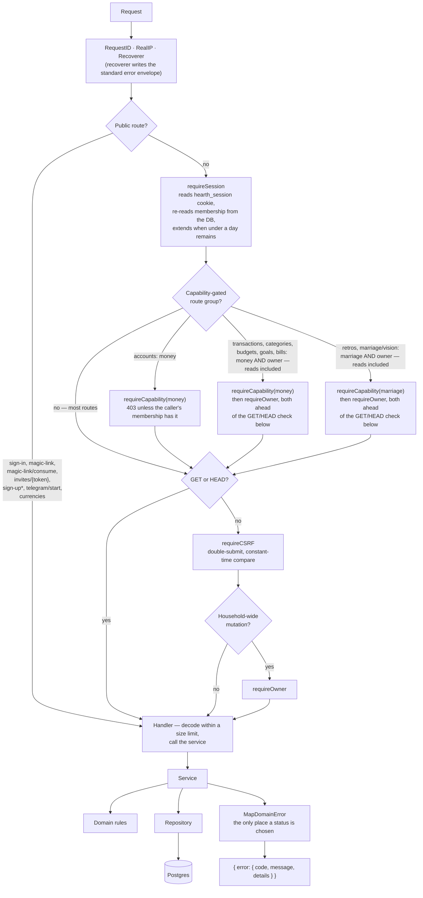
```mermaid
graph TD
    Req["Request"] --> RID["RequestID · RealIP · Recoverer<br/>(recoverer writes the standard error envelope)"]
    RID --> Public{"Public route?"}

    Public -->|"sign-in, magic-link,<br/>magic-link/consume,<br/>invites/{token},<br/>sign-up*, telegram/start,<br/>currencies"| Handler
    Public -->|no| Session["requireSession<br/>reads hearth_session cookie,<br/>re-reads membership from the DB,<br/>extends when under a day remains"]

    Session --> Cap{"Capability-gated<br/>route group?"}
    Cap -->|"accounts: money"| RequireCap["requireCapability(money)<br/>403 unless the caller's membership has it"]
    Cap -->|"transactions, categories,<br/>budgets, goals, bills: money AND owner —<br/>reads included"| RequireCapTxn["requireCapability(money)<br/>then requireOwner, both ahead<br/>of the GET/HEAD check below"]
    Cap -->|"retros, marriage/vision:<br/>marriage AND owner — reads included"| RequireCapRetro["requireCapability(marriage)<br/>then requireOwner, both ahead<br/>of the GET/HEAD check below"]
    Cap -->|"no — most routes"| Safe{"GET or HEAD?"}
    RequireCap --> Safe
    RequireCapTxn --> Safe
    RequireCapRetro --> Safe
    Safe -->|yes| Handler
    Safe -->|no| CSRF["requireCSRF<br/>double-submit, constant-time compare"]

    CSRF --> Owner{"Household-wide<br/>mutation?"}
    Owner -->|yes| RequireOwner["requireOwner"]
    Owner -->|no| Handler
    RequireOwner --> Handler

    Handler["Handler — decode within a size limit,<br/>call the service"] --> Service["Service"]
    Service --> Domain["Domain rules"]
    Service --> Repo["Repository"]
    Repo --> DB[("Postgres")]
    Service --> MapErr["MapDomainError<br/>the only place a status is chosen"]
    MapErr --> Resp["{ error: { code, message, details } }"]
```

**The membership is re-read on every request**, never cached in the session row.
A capability change therefore takes effect on the caller's very next request;
session revocation is belt-and-braces rather than the enforcement mechanism.

**Accounts are the first routes `requireCapability` ever gates.** The
middleware existed since slice 1 with no route using it, which made the
promise that the server enforces capabilities independently of the UI
vacuous. It sits before the `GET`/`HEAD` check because reads need it too — a
member without the `money` capability is refused `GET /api/v1/accounts` just
as firmly as a write. On the four accounts write routes it is stacked ahead of
`requireOwner`: today that is redundant, because
`domain.ValidateMembershipChange` refuses an owner who does not hold every
capability, so "an owner without `money`" is not a representable state — but
the alternative is for these routes to lean on an invariant enforced in a
different layer for a different reason, and if that invariant is ever relaxed
every route depending on it would open silently. One extra middleware call is
the cheaper price. (This is unrelated to the frontend's own `RequireCapability`
component, §7 — a presentation guard that, at the time accounts shipped,
already existed for the `/money` and `/marriage` placeholders; this is the
first time the *server* enforces one. `/marriage`'s route was deleted in
`110ab0a` and came back in task 10 as `/marriage/retros`, so
`RequireCapability` today guards both `/money`'s subtree and
`/marriage/retros`, and the server-side gate below is the enforcement either
way regardless of which routes the frontend happens to offer.)

**Transactions, categories, budgets, goals, bills and retros are the routes
where `requireOwner` gates a `GET`.** Every other owner-gated route in this
table only reaches `requireOwner` after the `CSRF` check, which by
construction means never on a read. These groups instead run
`requireCapability` (`money` for the first five, `marriage` for retros) then
`requireOwner` before the GET/HEAD branch even exists, so a limited member is
refused the ledger — and the budget, goals, bills and retros screens —
themselves, not merely their writes. `requireOwner` on retros is redundant
today, the identical reasoning the money group's own paragraph above gives:
`domain.ErrLimitedCannotHoldMarriage` already refuses a limited member the
`marriage` capability one layer down, so "a limited member holding it anyway"
is not a representable state — but the route does not lean on that alone,
for the same reason accounts' four write routes don't lean on
`ValidateMembershipChange` alone. This is deliberate, not copied from
accounts by mistake: a limited member's accounts view already renders names
with every amount blank (§5); applied to a ledger, a budget screen, a goal
card, a bill row or a retro, that is nothing but figures or private
conversation — a table whose every figure would be blank, next to a "Spent
this month" that has to be absent rather than shown as zero, a page of caps
and pace with nothing left to show, a card
whose whole point is a progress ring and a dollar figure, or a due date with
an amount beside it — the page would read as broken rather than merely
restricted. So for a limited member the `money` capability on Transactions,
Budget, Goals and Bills means only "see which accounts this household has"
(via `/accounts`), and nothing about the ledger, the budget, a goal or a bill
at all. Budget's spec named this explicitly as the Transactions shape reused
for the same reason (decision 8); Goals' own spec (decision 10) reused it a
third time, and Bills a fourth, rather than any of them inventing a new one.

**`PUT /budgets/{month}` sits in its own `requireCSRF` sub-group**, separate
from the one wrapping the category-write routes and the transaction writes,
even though both sub-groups sit at the identical point in the chain (inside
`requireCapability(money)` + `requireOwner`, ahead of the handler). The two
groups can now each grow their own route list without editing the other's —
a deliberate seam, not an accident of how the router file happened to be
structured. `POST /budgets/{month}/rollover` joins `PUT`'s group rather than
starting a third: both are budget-month writes behind the identical
money+owner+CSRF stack, and there is no reason for the two to diverge the way
budgets and transactions were kept apart above. The six Goals write routes
(create, update, archive, restore, add contribution, delete contribution)
form their own third `requireCSRF` sub-group, for the same reason as the
first two — Goals can grow its own route list without touching budgets',
transactions', or categories'.

**Two public routes are wrapped in an extra middleware, `rateLimitByIP` — and
they hold separate buckets on purpose.** It is a per-process, in-memory token
bucket keyed on the request's resolved IP.

- `POST /auth/sign-up` — **5/hour**. It is the only sign-up route that can
  trigger outbound mail without a token already proving an address, so it is
  the one an unbounded loop would hit; the preview and complete routes need a
  token that was mailed to a real address and so are not on that path.
- `POST /auth/telegram/start` — **20/hour**, in its own limiter *instance*, not
  the sign-up group's. Two reasons, and the second is the one that matters:
  the limits differ because this route sends no mail and writes only a nonce
  row, so it is cheaper to serve; and sharing one bucket would mean a person
  who has just signed up finds Telegram sign-in already spent, and vice versa —
  one control silently disabling an unrelated one. Twenty is also generous
  enough that the *real* limit on this flow is the per-chat one below, which is
  the one that can actually be reached by a person tapping a button.

Neither per-IP bucket is the whole defence. Telegram sign-in's second and
tighter limit is per **chat**, enforced in `TelegramAuthService.HandleStart`
against `telegram_link_requests` rather than in memory: at most **three links
are delivered to one chat per hour**, and the fourth `/start` is refused
(`CountLinksSince` includes the row just consumed, so `count > 3` refuses on
the fourth redemption). Without it, a chat spamming `/start` would be a free
path to burn magic-link and signup rows past any per-IP limit, because the IP
that presses `/start` is Telegram's, not the person's.

### Route table

| Method | Path | Guards |
|---|---|---|
| POST | `/auth/sign-in` | none — this *is* the credential check |
| POST | `/auth/magic-link` | none — always 202 |
| POST | `/auth/magic-link/consume` | none — the token is the credential |
| POST | `/auth/sign-up` | none, plus a per-IP token bucket (5/hour) — always 202, the same silent contract as magic-link |
| GET | `/auth/sign-up/{token}` | none — the token is the credential |
| POST | `/auth/sign-up/{token}/complete` | none |
| POST | `/auth/telegram/start` | none, plus its **own** per-IP token bucket (20/hour), separate from sign-up's — takes no body and no identifier, so there is nothing to probe; **`404` when no bot is configured**, which is the same answer any unrouted path gets, so an install without Telegram gives nothing away and the frontend hides the control on that response (§7) |
| GET | `/auth/me` | session |
| POST | `/auth/sign-out` | session · CSRF |
| GET | `/invites/{token}` | none — the token is the credential |
| POST | `/invites/{token}/accept` | none |
| GET | `/currencies` | none — read before a session exists (sign-up's currency select) and after one (Settings) |
| GET | `/household`, `/household/members`, `/spaces`, `/notification-preferences` | session |
| PATCH | `/household`, `/notification-preferences` | session · CSRF · owner |
| POST | `/household/members/invite`, `/spaces` | session · CSRF · owner |
| PATCH · DELETE | `/household/members/{id}` | session · CSRF · owner |
| GET | `/accounts` | session · money |
| POST | `/accounts` | session · money · CSRF · owner |
| PATCH | `/accounts/{id}` | session · money · CSRF · owner |
| POST | `/accounts/{id}/archive`, `/accounts/{id}/restore` | session · money · CSRF · owner |
| GET | `/transactions`, `/categories` | session · money · owner — owner gates the read, unlike accounts |
| POST | `/transactions` | session · money · owner · CSRF |
| PATCH · DELETE | `/transactions/{id}` | session · money · owner · CSRF |
| GET | `/budgets/{month}`, `/budgets/history` | session · money · owner — same reasoning as the transactions/categories reads above |
| PUT | `/budgets/{month}` | session · money · owner · CSRF — its own CSRF sub-group, not the one below |
| POST | `/budgets/{month}/rollover` | session · money · owner · CSRF — joins `PUT`'s CSRF sub-group, not a new one |
| POST | `/categories` | session · money · owner · CSRF |
| PATCH | `/categories/{id}` | session · money · owner · CSRF |
| POST | `/categories/{id}/archive`, `/categories/{id}/restore` | session · money · owner · CSRF |
| GET | `/goals`, `/goals/{id}/contributions` | session · money · owner — same reasoning as the transactions/categories/budgets reads above |
| POST | `/goals` | session · money · owner · CSRF |
| PATCH | `/goals/{id}` | session · money · owner · CSRF |
| POST | `/goals/{id}/archive`, `/goals/{id}/restore` | session · money · owner · CSRF |
| POST | `/goals/{id}/contributions` | session · money · owner · CSRF |
| DELETE | `/goals/{id}/contributions/{contributionId}` | session · money · owner · CSRF |
| GET | `/bills` | session · money · owner — same reasoning as the transactions/categories/budgets/goals reads above |
| POST | `/bills` | session · money · owner · CSRF |
| PATCH | `/bills/{id}` | session · money · owner · CSRF |
| POST | `/bills/{id}/archive`, `/bills/{id}/restore` | session · money · owner · CSRF |
| POST | `/bills/{id}/pay` | session · money · owner · CSRF — writes the payment, the expense and the advanced due date in one transaction (§5) |
| DELETE | `/bills/{id}/payments/{paymentId}` | session · money · owner · CSRF — reverses all three |
| GET | `/retros`, `/retros/{month}` | session · marriage · owner — owner gates the read, same reasoning as the money-group reads above |
| POST | `/retros` | session · marriage · owner · CSRF |
| PATCH | `/retros/{month}` | session · marriage · owner · CSRF |
| POST | `/retros/{month}/complete` | session · marriage · owner · CSRF |
| DELETE | `/retros/{month}` | session · marriage · owner · CSRF — draft only; `WHERE completed_at IS NULL` sits in the SQL itself, not a service `if` (§5) |
| POST | `/retros/{month}/actions` | session · marriage · owner · CSRF |
| PATCH | `/retros/{month}/actions/{id}` | session · marriage · owner · CSRF — the tick; deliberately does not touch the retro's own `version` (§5) |
| DELETE | `/retros/{month}/actions/{id}` | session · marriage · owner · CSRF |
| GET | `/marriage/vision` | session · marriage · owner — same reasoning as the retro reads above; the year comes from `?year=`, range-checked against `domain.MinVisionYear`/`MaxVisionYear` before the service is ever called (an unchecked value would let Postgres's `int16` column silently wrap a wildly out-of-range year onto another one, §5); a year nobody has saved answers 200 with an empty document at version 0, never 404 — the empty state IS the page |
| PUT | `/marriage/vision/{year}` | session · marriage · owner · CSRF — joins the retro writes' own CSRF sub-group, not a new one; replaces the whole document under a version guard, the same shape `PUT /budgets/{month}` uses |
| GET | `/healthz`, `/readyz` | none — outside `/api/v1` |

Three test matrices walk the live router and assert this: every non-public
route rejects an unauthenticated caller, every mutating route requires CSRF,
and every owner-gated route rejects a limited member. A route added without
its guard fails a test rather than shipping. All four sign-up-and-currency
routes are named explicitly, rather than exempted by prefix, in the
unauthenticated matrix; the CSRF and owner matrices name the two mutating ones
among them (`POST /auth/sign-up`, `POST /auth/sign-up/{token}/complete`) —
the two GETs are not mutating and so are not walked by those two matrices at
all. A route added later under `/auth/sign-up` is therefore checked like any
other, not silently waved through by a prefix skip.

**`POST /auth/telegram/start` is named in all three matrices**, and it is worth
seeing why it needed an entry in each rather than being covered by the sign-up
exemptions: it does not sit under `/auth/sign-up`, so no prefix would have
reached it, which is the naming convention above paying off the first time
something tested it. In each matrix its exemption comment records the *reason*,
not just the fact — it is public because no session exists yet, it is pre-CSRF
because there is no session to fixate, and it answers `404` rather than `401` or
`403` when no bot is configured, which each matrix would otherwise flag as a
route that forgot its guard. `telegram_api_test.go` then walks the route's own
behaviour in four tests: the `200` body shape
(`TestTelegramStartReturnsADeepLink`), the `404`-when-unconfigured answer
(`TestTelegramStartIs404WhenTheFeatureIsOff`), the per-IP bucket
(`TestTelegramStartIsRateLimitedPerIP`), and — the one that pins the decision
above rather than merely the behaviour —
`TestTelegramStartHasItsOwnRateLimitBudgetSeparateFromSignUp`, which exhausts
sign-up's budget and then asserts this route still answers.

**The owner-gated matrix signs in as a second limited-member fixture** —
`calendar`, `chores` **and** `money` — rather than the original one, which
holds only `calendar` and `chores`. Signing in as the original would have had
every accounts write route refused at `requireCapability` before the request
ever reached `requireOwner`, so the walk would have passed without ever
exercising the guard it is named after; see `docs/LEARNING.md`. Two more tests
pin the capability gate and the redaction rule directly:
`TestAccountsListRequiresTheMoneyCapability` and
`TestAccountsAreRedactedForALimitedMember`.

**Transactions needed a fifth, dedicated matrix rather than reusing the
generic owner-gated one**, because that one only ever walks mutating routes
and the whole point of Transactions' guard order is that `GET /transactions`
and `GET /categories` are owner-gated too.
`TestTransactionRoutesRequireMoneyAndOwner` asserts an exact expected status
per route rather than "not 401/403" — the looser form once let three routes
panic on a nil dependency in the test harness and pass anyway, recovered into
a `500` that the assertion could not tell apart from a correctly-enforced
guard; see `docs/LEARNING.md`.

**Budget adds two more matrices of its own, following the same shape rather
than folding into Transactions' existing one**: `TestBudgetRoutesRequireMoneyAndOwner`
plus `TestBudgetWriteRouteRequiresCSRF` for the three `/budgets` routes, and
`TestCategoryWriteRoutesRequireMoneyAndOwner` plus
`TestCategoryWriteRoutesRequireCSRF` for the four category-write routes —
kept separate from `TestTransactionRoutesRequireMoneyAndOwner` rather than
adding rows to it, so each feature's own route list can grow without editing
a test file it does not own.

**`POST /budgets/{month}/rollover` is a row in Budget's own two matrices, not
a third**, since it shares that group's exact guard stack (§4 above). Goals
gets its own pair in `goals_api_test.go` —
`TestGoalRoutesRequireMoneyAndOwner` and `TestGoalWriteRoutesRequireCSRF` —
covering all eight `/goals` routes, the same one-file-per-feature split.
Bills follows the identical shape in `bills_api_test.go` —
`TestBillsRoutesRequireMoneyAndOwner` and `TestBillsWriteRoutesRequireCSRF` —
for all seven `/bills` routes, asserting an exact expected status per route
rather than "not 401/403", the same discipline Transactions' own matrix
established (above) after a looser assertion once let a nil-dependency panic
recover into a `500` indistinguishable from a correctly-enforced guard.

**Retros joins as its own `marriage_api_test.go`, the same one-file-per-feature
split**, walking every route against no session, a limited member, an owner
without CSRF, and an owner with it. Its guard test needed something none of
the money-group matrices did: a limited member who holds `marriage` cannot be
built by inserting a row, because `membership_repo.go` carries a database
`CHECK` constraint, `limited_members_have_no_marriage`, that refuses the
insert outright. The state the test needs to construct is one the schema
itself makes impossible to create, so the fixture is built against a
`MembershipRepository` double instead of a real insert — the only way to
represent a state the database will not store — with the two application-layer
guards (`requireCapability`, `requireOwner`) still proven independently
through it (`docs/LEARNING.md`).

---

## 5 · Key flows

### Sign in, with the lockout

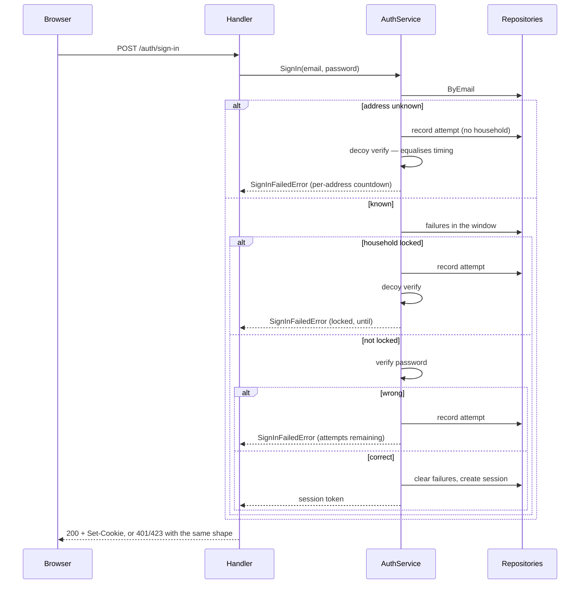
```mermaid
sequenceDiagram
    participant B as Browser
    participant H as Handler
    participant A as AuthService
    participant R as Repositories

    B->>H: POST /auth/sign-in
    H->>A: SignIn(email, password)
    A->>R: ByEmail

    alt address unknown
        A->>R: record attempt (no household)
        A->>A: decoy verify — equalises timing
        A-->>H: SignInFailedError (per-address countdown)
    else known
        A->>R: failures in the window
        alt household locked
            A->>R: record attempt
            A->>A: decoy verify
            A-->>H: SignInFailedError (locked, until)
        else not locked
            A->>A: verify password
            alt wrong
                A->>R: record attempt
                A-->>H: SignInFailedError (attempts remaining)
            else correct
                A->>R: clear failures, create session
                A-->>H: session token
            end
        end
    end

    H-->>B: 200 + Set-Cookie, or 401/423 with the same shape
```

Three failures inside fifteen minutes lock the **household's password sign-in**
for fifteen minutes. Magic link is never gated by the lock — that is the
recovery path. The decoy verification exists so argon2's cost cannot distinguish
the branches.

### Magic link — deliberately silent

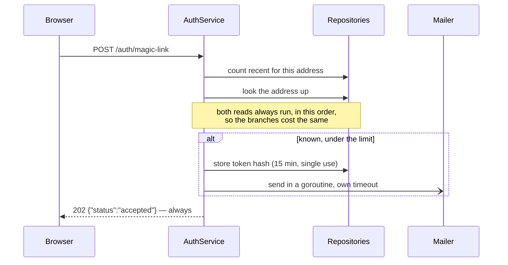
```mermaid
sequenceDiagram
    participant B as Browser
    participant A as AuthService
    participant R as Repositories
    participant M as Mailer

    B->>A: POST /auth/magic-link
    A->>R: count recent for this address
    A->>R: look the address up
    Note over A,R: both reads always run, in this order,<br/>so the branches cost the same
    alt known, under the limit
        A->>R: store token hash (15 min, single use)
        A-)M: send in a goroutine, own timeout
    end
    A-->>B: 202 {"status":"accepted"} — always
```

Nothing about the response reveals whether the address exists, including when
the rate limit is exhausted or the send fails. **The frontend is therefore the
only place a send failure can surface**, which is why the sent panel carries
retry copy.

### Invite acceptance — one transaction

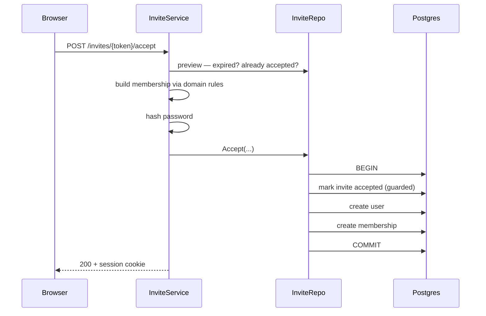
```mermaid
sequenceDiagram
    participant B as Browser
    participant I as InviteService
    participant R as InviteRepo
    participant DB as Postgres

    B->>I: POST /invites/{token}/accept
    I->>R: preview — expired? already accepted?
    I->>I: build membership via domain rules
    I->>I: hash password
    I->>R: Accept(...)
    R->>DB: BEGIN
    R->>DB: mark invite accepted (guarded)
    R->>DB: create user
    R->>DB: create membership
    R->>DB: COMMIT
    I-->>B: 200 + session cookie
```

All three writes are one transaction. Split apart, a failure in the middle leaves
an orphaned user holding the unique email index and the invite becomes
permanently unacceptable. The invite is claimed *first*, so two concurrent
accepts serialise on that row and the loser gets a clean conflict.

### Self-serve sign-up — provisioning is one transaction

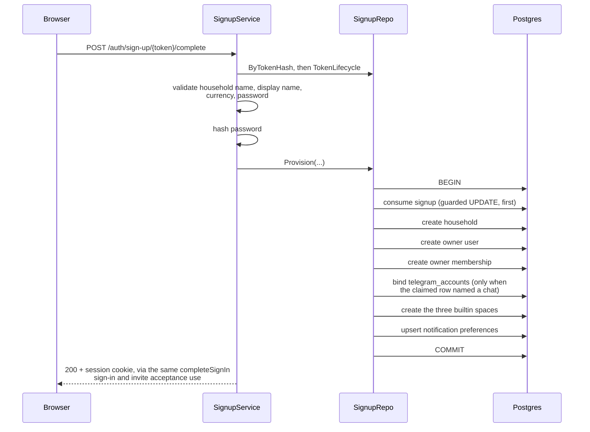
```mermaid
sequenceDiagram
    participant B as Browser
    participant S as SignupService
    participant R as SignupRepo
    participant DB as Postgres

    B->>S: POST /auth/sign-up/{token}/complete
    S->>R: ByTokenHash, then TokenLifecycle
    S->>S: validate household name, display name,<br/>currency, password
    S->>S: hash password
    S->>R: Provision(...)
    R->>DB: BEGIN
    R->>DB: consume signup (guarded UPDATE, first)
    R->>DB: create household
    R->>DB: create owner user
    R->>DB: create owner membership
    R->>DB: bind telegram_accounts (only when<br/>the claimed row named a chat)
    R->>DB: create the three builtin spaces
    R->>DB: upsert notification preferences
    R->>DB: COMMIT
    S-->>B: 200 + session cookie, via the same completeSignIn<br/>sign-in and invite acceptance use
```

The `validate ... currency ...` step runs the currency the caller chose
through `domain.ParseSelectableCurrency`, not the more permissive
`domain.ParseCurrency` that the household `PATCH` path uses. `ParseCurrency`
is the single reference for "is this a currency at all" and stays that way —
it must keep accepting whatever currency is already stored on an existing
household. `ParseSelectableCurrency` adds a second, narrower gate on top:
only ISO 4217 codes with two minor units, the same list
`domain.SelectableCurrencies()` filters `GET /api/v1/currencies` down to, so
the sign-up form's own currency select and what `Complete` will actually
accept cannot drift apart. The reason either gate exists at all is
`Money.String()`: it renders an amount as `fmt.Sprintf("%s%s %d.%02d", ...)` —
two decimal places, hard-coded — so a household provisioned with, say, JPY
(0 minor units) or KWD (3) would have had every amount rendered 100× wrong
from the moment it existed. Delete `SelectableCurrencies` and
`ParseSelectableCurrency` only once `Money` itself knows about minor units;
until then they are what keeps the sign-up path from offering a currency the
money path cannot render.

**The `bind telegram_accounts` step is conditional on the claimed row, not on a
parameter, and it is inside this transaction rather than after it.** A signup
row names exactly one channel — an email address or a Telegram chat, never both
and never neither, enforced by a database `CHECK` (§6) — and `Provision` reads
whichever it finds on the row it is already claiming. Two consequences worth
stating, because both are the reason this shape was chosen over the obvious one:

- **`SignupService` gained no new dependency and no new branch.** It hands
  `Provision` a signup id, and the row decides which channel it belongs to.
  `AuthService` is untouched, `SignupDeps` is unchanged, and all four `Mailer`
  send sites are untouched. That is what "Telegram is a delivery channel, not
  an identity" means in code.
- **A caller cannot substitute the chat.** The chat id reaches the `users` row
  from the row being claimed, exactly as the email address already did — the
  reasoning `signup_repo.go` had already written down for the address, applied
  unchanged to the chat. A chat id passed in as an argument would let someone
  bind a household to a chat they control instead of the one that actually
  completed the sign-up, which is account takeover with extra steps.
- **After the commit would be too late.** A household that exists with its chat
  unbound is an account its owner can never sign in to again: the sign-up token
  is spent, and for a Telegram sign-up there is no email address to fall back
  on. That is precisely the failure the `guarding-partial-writes` skill exists
  for, so the bind is a statement in the transaction, never a second write.

A household can now come into existence three ways: `adminctl seed`
(development only), an invite accepted into a household that already exists,
and this — a stranger with no prior relationship to anyone provisions their
own, reached either from a mailed link or from a Telegram chat. `Provision` is one transaction for the same reason
`InviteRepository.Accept` is: a failure partway through would leave a `users`
row occupying `users.email`'s unique index with no membership under it, and
that address could then never sign up again — there is no retry that could
create a second user with the same email.

The signup is consumed *first*, before any insert — not last, the way it reads
most naturally if you write it top-down. With consume-last, the guarded
`UPDATE` would still run, but it would not be what stops two concurrent
completions of one token: `users.email`'s unique index would be, because the
second `CreateUser` collides on it. That gets the loser `409 ALREADY_EXISTS`
instead of the correct `410 TOKEN_EXPIRED`, and turns the guard into
decoration. Consume-first makes the guarded `UPDATE` itself the real
serialiser — the same choice `InviteRepository.Accept` already made by
marking the invite accepted before writing anything else.

`Request` (not diagrammed — it always answers `202` with nothing to show for
it) mirrors the magic-link flow's silence: the per-address count and the
"does this address have an account" read both run unconditionally, in the
same order, on every call. **Both branches now write a `signups` row** too —
a fresh address via `Create`, a registered one via `CreateConsumed` (a row
born already consumed, so it can never provision anything and its token is
never mailed). That second write exists purely so the registered branch's own
rate-limit counter advances: without it, an already-registered address could
be sent unlimited "you already have an account" mail while a fresh address's
mail stopped at three an hour — the exact oracle this endpoint exists to
close, expressed as mail volume instead of a status code. See
`docs/LEARNING.md`.

### Telegram — a second delivery channel, and the link comes back to the tapper

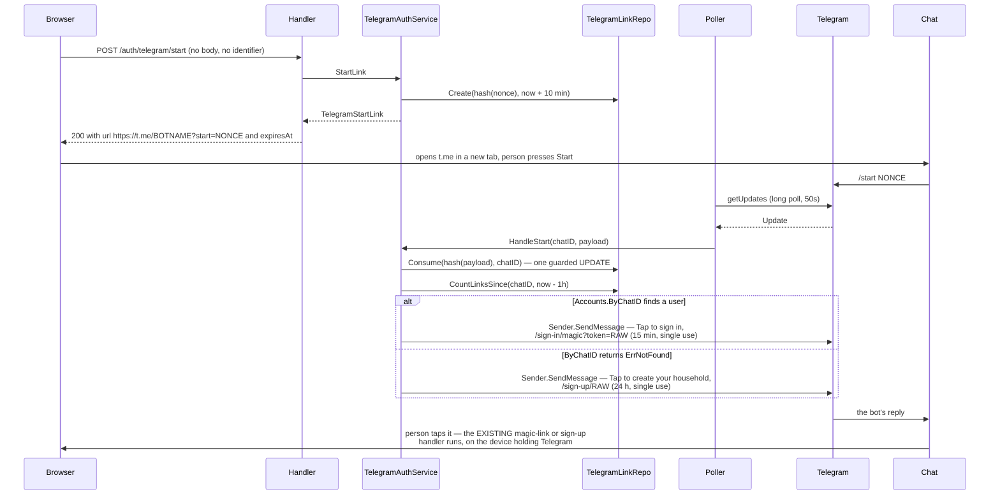
```mermaid
sequenceDiagram
    participant B as Browser
    participant H as Handler
    participant T as TelegramAuthService
    participant L as TelegramLinkRepo
    participant P as Poller
    participant TG as Telegram
    participant C as Chat

    B->>H: POST /auth/telegram/start (no body, no identifier)
    H->>T: StartLink
    T->>L: Create(hash(nonce), now + 10 min)
    T-->>H: TelegramStartLink
    H-->>B: 200 with url https://t.me/BOTNAME?start=NONCE and expiresAt
    B->>C: opens t.me in a new tab, person presses Start
    C->>TG: /start NONCE
    P->>TG: getUpdates (long poll, 50s)
    TG-->>P: Update
    P->>T: HandleStart(chatID, payload)
    T->>L: Consume(hash(payload), chatID) — one guarded UPDATE
    T->>L: CountLinksSince(chatID, now - 1h)
    alt Accounts.ByChatID finds a user
        T->>TG: Sender.SendMessage — Tap to sign in,<br/>/sign-in/magic?token=RAW (15 min, single use)
    else ByChatID returns ErrNotFound
        T->>TG: Sender.SendMessage — Tap to create your household,<br/>/sign-up/RAW (24 h, single use)
    end
    TG->>C: the bot's reply
    C->>B: person taps it — the EXISTING magic-link or sign-up<br/>handler runs, on the device holding Telegram
```

`T` is `TelegramAuthService` throughout: it never touches HTTP or Telegram
itself. The `200` is written by the handler, and both replies leave through
`Sender.SendMessage`, which in production is `adapter/telegram`'s `Client` —
the same separation `Mailer` already draws, and the reason this service is
testable against two in-memory doubles.

**No new session-issuing code exists in this flow at all.** Step by step it
mints a nonce, spends it, and then calls `MagicLinkRepository.Create` or
`SignupRepository.CreateForTelegram` — the same two token types, the same two
expiries (15 minutes, 24 hours), the same two consume handlers. A parallel
Telegram token table would have meant two expiry rules, two rate limits and two
oracle analyses drifting apart, and the second one would be the one nobody
reviews.

**The session lands on the device that taps, and that is the security property,
not a limitation.** The obvious alternative — the browser starts the flow and
polls for completion — has an account-takeover hole with no credentials
involved: the nonce is minted by one browser and then bound to whichever chat
redeems it, so an attacker could start a flow, send the `t.me/…` link to a
victim ("tap this for me"), and have their own browser signed in as that
victim. Because the link comes back *into the chat* and signs in *there*,
forwarding it gives the forwarder nothing. The cost is that a desktop user needs
Telegram Desktop or Telegram Web on the same machine as the browser; that is
accepted, and `docs/adr/0004-telegram-as-a-second-delivery-channel.md` records
what a safe cross-device version would need (a confirmation code typed back into
the originating browser, binding both ends).

**The consume happens before the rate-limit check, deliberately.** Read
top-down it looks backwards — why spend the nonce on an attempt you are about
to refuse? Because a refusal that left the nonce unspent would be retryable with
the same link until the hour rolled over, which is not a limit. Spending first
makes every refused attempt cost the caller a nonce.

**One refusal message covers five different situations, word for word.**
`telegramDeadLinkMessage` — *"That sign-in link has expired. Start again from
the app."* — is the answer for an unknown nonce, an expired one, an
already-consumed one, a chat over its three-per-hour limit, **and** a `/start`
that arrives while the global daily sign-up ceiling is breached. Any wording
that distinguished them would let a caller confirm which one they hit by
probing; "rate-limited" and "the platform is over its daily ceiling" are both
facts a caller should not be able to establish. This is the same silence
`POST /auth/magic-link`'s always-`202` buys, expressed as chat copy instead of a
status code. It also means a test asserting `strings.Contains(reply, "expired")`
proves almost nothing — see `docs/LEARNING.md`, where doing exactly that shipped
an oracle with the suite green.

**The two *successful* replies do differ by branch, and that is safe here.** A
sign-in link and a sign-up link are distinguishable, which is normally the exact
tell an enumeration analysis hunts for. It is safe in this flow because the only
recipient is the owner of the chat, who already knows whether they have an
account, and `chat_id` is never caller-supplied — it arrives inside an `Update`
Telegram itself delivers over the long-poll connection this process opened. No
third party observes the difference. This paragraph exists because the next
reader will flag it and should find the reasoning already written down; if
`chat_id` ever became caller-suppliable — an unsigned webhook, a debug endpoint,
a replayed update accepted without verifying its source — this reasoning would
need revisiting *before* that change shipped.

**There is no enumeration oracle on the route itself**, because
`POST /auth/telegram/start` accepts no identifier at all. There is nothing to
probe. That is strictly better than `POST /auth/magic-link`, which takes an
address and needs `AuthService.decoy()` plus timing equalisation to stay quiet.

**Failure modes, all of them deliberate:**

- **The offset lives in memory.** After a restart Telegram redelivers updates it
  was never acknowledged for, so one `/start` can be processed twice. That is
  safe *because* the nonce was already consumed: the second pass takes the
  already-consumed branch and the bot repeats the expiry message. Recorded
  rather than left to luck.
- **The offset advances past updates the poller ignores.** Leaving it behind an
  update nobody acted on would make Telegram redeliver it forever and the loop
  would never progress.
- **Network errors back off and the loop never exits** — capped exponential
  backoff, logged at warn. The API has to keep serving HTTP while Telegram is
  unreachable.
- **Each dispatch recovers from a panic.** The poller is a bare goroutine and
  chi's `middleware.Recoverer` does not cover it, so an unrecovered panic would
  take down the whole process and every unrelated in-flight request. The
  `recover` wraps one update's dispatch, not the loop, so a panicking handler
  costs one update rather than the poller. Same pattern as `sendMagicLinkAsync`.
- **Shutdown cancels an in-flight `HandleStart`.** The poller is handed the
  process's `signal.NotifyContext` and passes it through, and nothing waits on
  the goroutine. Accepted: `HandleStart` holds no multi-statement transaction —
  every repository call it makes is one atomic statement — so cancellation
  cannot leave a half-written invariant. The worst durable outcome is a nonce
  spent with no reply, which the person recovers from by pressing the button
  again. `cmd/api/main.go` carries the trade-off at the line, including what
  would have to change (a `WaitGroup`, and a supervisor timeout longer than the
  send) if this loop ever writes more than one row.
- **Telegram being down degrades partially.** Telegram sign-in stops; the email
  path is unaffected; sessions already issued are unaffected.

**What Telegram is *not* used for: invites.** An invite still goes to an email
address and is still relayed from Mailpit by hand on the live install. A
shareable `t.me/…?start=inv_<token>` link is the natural follow-up and is
deliberately not in this slice; `docs/FEATURE_TRACKER.md` carries it as a ⬜ row
so it is a gap on the map rather than an assumption.

### Accounts — net worth is composed on read, not stored

```mermaid
sequenceDiagram
    participant B as Browser
    participant H as Handler
    participant Repo as AccountRepository
    participant Svc as AccountService
    participant FX as FXRateProvider

    B->>H: GET /api/v1/accounts
    H->>Repo: List(householdID, includeArchived)
    alt caller's role is not owner
        H-->>B: 200 { accounts: only visible-to-limited rows,<br/>balance/openingBalance/balanceAsOf/summary all absent }
    else owner
        H->>Svc: Summary(householdID, views, today)
        loop each counted account
            Svc->>FX: Rate(account currency, primary) unless already primary
            Svc->>Svc: convert, then Add — domain.Money.Add<br/>refuses two different currencies
        end
        Svc->>Repo: MonthlyMovements(householdID, since)
        Svc->>Svc: trend() — walk each counted account's live<br/>balance back twelve months by these deltas;<br/>the newest point reuses the value the loop<br/>above already converted, never reconverts it
        Svc-->>H: NetWorthSummary { ..., Trend }
        H-->>B: 200 { accounts, summary: { ..., trend } }
    end
```

One endpoint answers both halves of the screen — the list and the summary —
because they describe the same set of rows and must agree; a second endpoint
would mean writing the redaction rule below twice.

**Convert, then add.** `domain.Money.Add` refuses to add two different
currencies, deliberately, so summing raw balances first and converting after
would fail the moment a household holds a second currency — invisible to a
single-currency test. Each account converts into the household's primary
currency before any `Add`; rounding happens once per account and the total is
never re-rounded, so the figure is deterministic. See `docs/LEARNING.md`.

**A limited member's response omits every amount, not just the totals.**
Showing the family total while hiding individual balances was rejected: with
the list of which accounts exist and a running total, the individual balances
become inferable as accounts are added and removed. So `summary` is omitted
entirely, and each visible account's `balance`/`openingBalance`/`balanceAsOf`
keys are absent — not zeroed, because a zeroed balance still reads as a real
one. `openingBalance` is redacted for the same reason as `balance`: it is an
amount, and on a young account it is close enough to the current one to be
just as revealing.

**An unconvertible account doesn't vanish from the total silently, and an
entirely unconvertible household never shows a zero.**
`NetWorthSummary.Computable` is false only when at least one live account
exists and none of them could be converted — the state a household reaches by
changing its primary currency in Settings while `fx.StaticProvider` knows only
SGD↔IDR. Zero is a claim about the household's money; the truth in that state
is that it cannot be computed, so the screen says so instead of showing S$0.00.
A household with no accounts at all is computable and genuinely zero — that
distinction is why the guard counts non-archived accounts actually considered,
not the raw row count (`docs/LEARNING.md`).

**`AccountView.Balance` is now a real sum, computed in SQL, not in Go.**
Before Transactions existed there was nothing to add, so `Balance` was a copy
of `opening_balance_minor`; `AccountRepository`'s query has always shaped
`Balance` as a sum for exactly this reason (see its doc comment). Now it is
one: the query subtracts every transaction on the `from_account_id` side and
adds every transaction — or its `received_amount_minor`, for the destination
leg of a cross-currency transfer — on the `to_account_id` side, both filtered
to `occurred_on >= opening_balance_as_of` — an opening balance is the figure
at the *start* of its day, so a transaction dated on that same day already
moves it (`docs/LEARNING.md`, pattern 13). That is the same boundary
Transactions' own ledger marks strictly-before and explains on each affected
row rather than hiding (§5's Transactions flow, below). The sum happens
once, in the repository's SQL; `AccountService.Summary` still converts and
adds each account's already-summed balance exactly as it did before this
feature, unchanged.

**Which is why `accountDTO` now carries `openingBalance` as well as
`balance`.** The two were one number until this feature, and a client that
has only `balance` to prefill the account edit form from will write today's
figure back as `opening_balance_minor` — moving the household's net worth by
every transaction since, on an edit that never meant to touch the balance.
The wire therefore carries both figures, the form is labelled "Starting
balance" so the field cannot be mistaken for the one on the account row, and
`AccountView`'s own doc comment says which of the two may ever be written
back. A value whose meaning changes has to change its consumers with it;
`docs/LEARNING.md` records what this cost when it did not.

**The twelve-month trend is derived, the same way the balance above it is —
there is no snapshot table.** `summary.trend` did not need one: `Summary`
already holds every counted account's live, converted balance from the loop
in the diagram above; `trend()` (`api/internal/usecase/networth_trend.go`)
walks each one backwards, month by month, subtracting that month's delta from
`MonthlyMovements`. Every one of the twelve bars is recomputed on every
`GET /accounts`; nothing about the trend is written or scheduled anywhere. A
gap in a household's history (an account not yet tracked back that far) is
`nil`, never `0`, all the way from `domain.Money` through the wire's
`netWorthMinor: null` to the chart drawing no bar at all for that month — a
zero is a claim about the household's money, and the true answer for an
untracked month is that there is nothing to claim.

**The newest bar equals the headline figure by construction, not by
coincidence.** `trend()` never reconverts the current month: for the newest
point it reuses the exact `domain.Money` the loop above already added into
the headline, so the two cannot disagree even if the FX provider is asked
twice in one request and answers differently — nothing here forbids a live
provider from doing that. Older months are converted at *today's* rate, not
the rate that held at the time, because there is no historical rate table;
the chart shows how balances moved with the exchange rate held still, which
is the more useful of the two questions anyway (an account whose balance
never moved should not appear to rise and fall because a currency did).

### Transactions — the ledger and month-to-date spend, one request

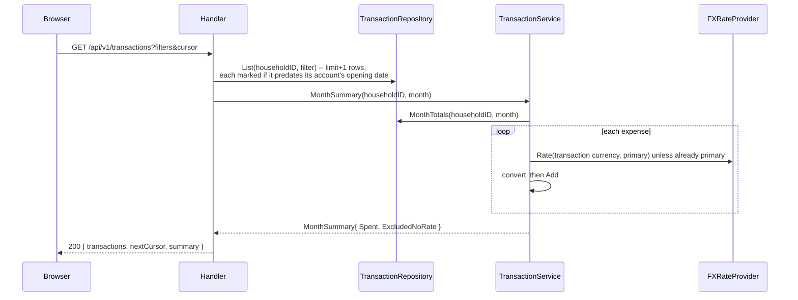
```mermaid
sequenceDiagram
    participant B as Browser
    participant H as Handler
    participant Repo as TransactionRepository
    participant Svc as TransactionService
    participant FX as FXRateProvider

    B->>H: GET /api/v1/transactions?filters&cursor
    H->>Repo: List(householdID, filter) -- limit+1 rows,<br/>each marked if it predates its account's opening date
    H->>Svc: MonthSummary(householdID, month)
    Svc->>Repo: MonthTotals(householdID, month)
    loop each expense
        Svc->>FX: Rate(transaction currency, primary) unless already primary
        Svc->>Svc: convert, then Add
    end
    Svc-->>H: MonthSummary{ Spent, ExcludedNoRate }
    H-->>B: 200 { transactions, nextCursor, summary }
```

One endpoint answers the ledger and "Spent this month" together, for the same
reason `GET /accounts` answers the list and net worth together: the two
describe the same rows and a second endpoint risks them disagreeing.

**An absent `month` parameter means the current month, for both halves.**
`parseTransactionFilter` sets the summary's month *and* `filter.Month` from the
same default, so the ledger and the figures above it always describe the same
month. They did not always: the default set only the summary's month and left
`filter.Month` zero — which `TransactionFilter` documents as "every month" — so
the screen read "0 in August 2026" above ten July rows. `month=all` is the one
deliberate way out and widens the **list only**: the summary stays on the
current month, because `MonthSummary` answers for exactly one calendar month by
construction (`TransactionRepository.MonthTotals` returns that month's rows so
the usecase layer can convert currencies before summing, and the single-month
bound is the stated reason it may return rows rather than a SQL `SUM`). The
frontend therefore drops the count and names the month beside the spend figure
whenever the list is widened, so no figure ever sits unlabelled over rows it
does not describe. Any other unrecognised `month` value is still refused with
422 `INVALID_MONTH` — the widening is one spelled word, never a fallback.
`nextCursor` is opaque — the date and id of the last row of the page, never
something the frontend constructs — so a later change to sort order or paging
predicate cannot become a breaking change to the client; `transactions_household_date_idx
(household_id, occurred_on DESC, id DESC)` is what lets the keyset cursor walk
an index instead of sorting a heap.

**A transaction dated before its account's opening balance is kept, listed,
and marked — not refused, and not silently absorbed into the balance.** It is
still counted in `Spent`, because the money was actually spent; only the
*balance* — the sum described above — ignores it, because a balance is
anchored to a figure someone asserted was true on a date and this transaction
predates that assertion. A transfer can predate one side's opening date and
not the other's, so the mark is two independent fields
(`beforeFromAccountOpeningBalance` / `beforeToAccountOpeningBalance`), each
naming the account, not one flag that would be half true for a transfer.

### Budget — one screen, one request; the PUT always replaces the whole month

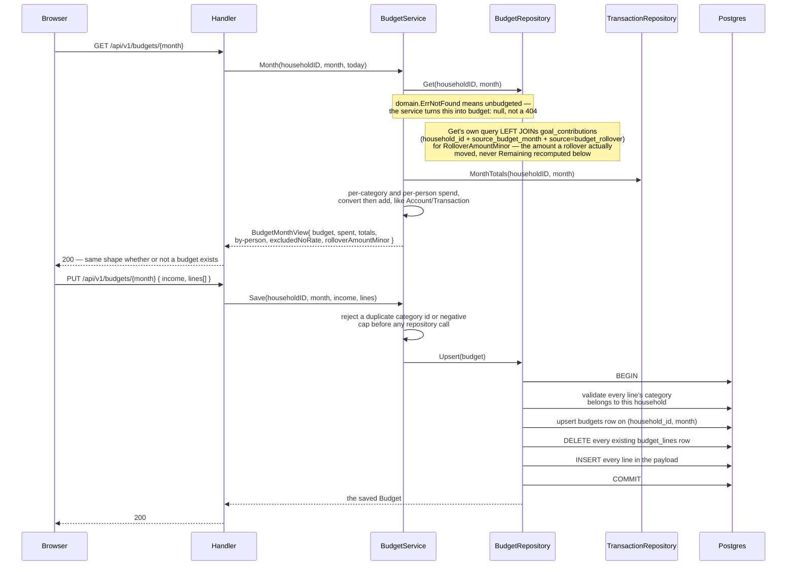
```mermaid
sequenceDiagram
    participant B as Browser
    participant H as Handler
    participant Svc as BudgetService
    participant Repo as BudgetRepository
    participant TxnRepo as TransactionRepository
    participant DB as Postgres

    B->>H: GET /api/v1/budgets/{month}
    H->>Svc: Month(householdID, month, today)
    Svc->>Repo: Get(householdID, month)
    Note over Svc,Repo: domain.ErrNotFound means unbudgeted —<br/>the service turns this into budget: null, not a 404
    Note over Repo: Get's own query LEFT JOINs goal_contributions<br/>(household_id + source_budget_month + source=budget_rollover)<br/>for RolloverAmountMinor — the amount a rollover actually<br/>moved, never Remaining recomputed below
    Svc->>TxnRepo: MonthTotals(householdID, month)
    Svc->>Svc: per-category and per-person spend,<br/>convert then add, like Account/Transaction
    Svc-->>H: BudgetMonthView{ budget, spent, totals,<br/>by-person, excludedNoRate, rolloverAmountMinor }
    H-->>B: 200 — same shape whether or not a budget exists

    B->>H: PUT /api/v1/budgets/{month} { income, lines[] }
    H->>Svc: Save(householdID, month, income, lines)
    Svc->>Svc: reject a duplicate category id or negative<br/>cap before any repository call
    Svc->>Repo: Upsert(budget)
    Repo->>DB: BEGIN
    Repo->>DB: validate every line's category<br/>belongs to this household
    Repo->>DB: upsert budgets row on (household_id, month)
    Repo->>DB: DELETE every existing budget_lines row
    Repo->>DB: INSERT every line in the payload
    Repo->>DB: COMMIT
    Repo-->>H: the saved Budget
    H-->>B: 200
```

**A third endpoint answers a whole screen in one request**, the same shape
`GET /accounts` and `GET /transactions` already use: the figures and the raw
data describe the same rows and must never be free to disagree, so there is
one query to keep in sync, not two. `GET /budgets/{month}` returns `"budget":
null` plus the spend figures even for a month with no caps at all — the
empty state needs to know the month's spend to invite "Import last month",
and a 404 would make the frontend special-case the one screen that is
allowed to have nothing.

`GET /budgets/{month}` also carries `rolloverAmountMinor` (nullable, moving
in lockstep with `rolledOverAt`/`rolloverGoalId`) — the fix for a defect the
final whole-branch review found: `remainingMinor` on this same response is
`Budgeted − Spent`, **recomputed on every call** from whatever transactions
exist in the month right now, so it is not a safe thing to render next to a
past-tense "moved into X" sentence once a rollover has happened. A backdated
transaction, or an edit or delete in an already-rolled-over month — none of
them blocked anywhere in this codebase — used to change that sentence's own
number after the fact. `rolloverAmountMinor` is read off the
`goal_contributions` row the rollover actually wrote (`household_id` +
`source_budget_month` + `source = 'budget_rollover'`, a lookup the partial
unique index `goal_contributions_one_rollover_per_month` guarantees returns
at most one row), via a `LEFT JOIN` added to `BudgetRepository.Get`'s own
query — not a new column on `budgets`. `Upsert` and `History` still build a
`domain.Budget` too, but neither result ever reaches the month response
(`BudgetService.Month` builds its `Budget` through `Get` alone), so their
own `RolloverAmountMinor` is always `nil` and nothing ever observes that.

**`PUT` is a full replace, never a merge, in one transaction.** The
Edit-budget modal always holds the entire budget client-side — every capped
category, not a diff — so replace is what makes "the caller removed a cap"
unambiguous: a line simply absent from the payload is gone after the call,
rather than needing a separate "delete this line" operation the frontend
would have to track alongside "add" and "change". Category ownership is
validated *inside* the same transaction as the delete-then-insert, before
either runs, so a foreign-household category id in one line rolls the whole
month back rather than leaving the parent row updated with its lines
half-replaced — the same "any two writes that must both happen need a
transaction" rule invite acceptance and self-serve sign-up already apply
(§5 above), extended here to a delete-and-reinsert pair instead of a set of
inserts. `BudgetService.Save` also re-derives every cap through
`domain.NewMoney` before the repository ever sees it, so a caller cannot
make a stored `Budget` carry a currency the household does not have — the
repository still relabels to the household's own primary currency
regardless, but that must never be the only thing standing between a bad
currency and a stored row.

### Goals — a contribution moves no real money; a rollover is one transaction each way

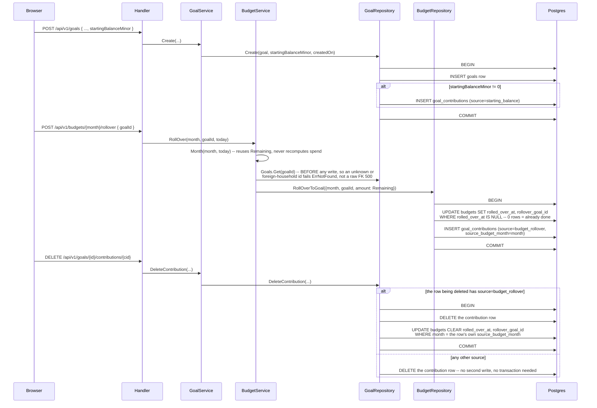
```mermaid
sequenceDiagram
    participant B as Browser
    participant H as Handler
    participant GSvc as GoalService
    participant BSvc as BudgetService
    participant GRepo as GoalRepository
    participant BRepo as BudgetRepository
    participant DB as Postgres

    B->>H: POST /api/v1/goals { ..., startingBalanceMinor }
    H->>GSvc: Create(...)
    GSvc->>GRepo: Create(goal, startingBalanceMinor, createdOn)
    GRepo->>DB: BEGIN
    GRepo->>DB: INSERT goals row
    alt startingBalanceMinor != 0
        GRepo->>DB: INSERT goal_contributions (source=starting_balance)
    end
    GRepo->>DB: COMMIT

    B->>H: POST /api/v1/budgets/{month}/rollover { goalId }
    H->>BSvc: RollOver(month, goalId, today)
    BSvc->>BSvc: Month(month, today) -- reuses Remaining, never recomputes spend
    BSvc->>GRepo: Goals.Get(goalId) -- BEFORE any write, so an unknown or<br/>foreign-household id fails ErrNotFound, not a raw FK 500
    BSvc->>BRepo: RollOverToGoal({month, goalId, amount: Remaining})
    BRepo->>DB: BEGIN
    BRepo->>DB: UPDATE budgets SET rolled_over_at, rollover_goal_id<br/>WHERE rolled_over_at IS NULL -- 0 rows = already done
    BRepo->>DB: INSERT goal_contributions (source=budget_rollover,<br/>source_budget_month=month)
    BRepo->>DB: COMMIT

    B->>H: DELETE /api/v1/goals/{id}/contributions/{cid}
    H->>GSvc: DeleteContribution(...)
    GSvc->>GRepo: DeleteContribution(...)
    alt the row being deleted has source=budget_rollover
        GRepo->>DB: BEGIN
        GRepo->>DB: DELETE the contribution row
        GRepo->>DB: UPDATE budgets CLEAR rolled_over_at, rollover_goal_id<br/>WHERE month = the row's own source_budget_month
        GRepo->>DB: COMMIT
    else any other source
        GRepo->>DB: DELETE the contribution row -- no second write, no transaction needed
    end
```

**A contribution moves no real money.** `goal_contributions` is a ledger a
household writes to by hand — starting balance, a manual top-up, a rollover —
never a join against `transactions` or a debit against an `accounts` row. A
goal earmarks; it does not hold. Goal progress and account balances are
therefore independent figures, and nothing in this system reconciles them:
an account can be overdrawn while every goal reads fully funded, and that is
not a bug to fix by wiring the two together — Goals spec decision 1 rejected
that as the larger, later feature (it would drag in the transactions schema,
the ledger UI and the cross-currency transfer rules for a screen whose whole
point today is to exist without any of that).

**The rollover writes a contribution and stamps the month in one
transaction, and deleting that contribution clears the stamp in the same
transaction — the invariant runs both ways.** `RollOverToGoal` cannot leave a
stamped month with no contribution, or a contribution with no stamp; deleting
a `budget_rollover` contribution cannot leave the stamp behind either, because
`GoalRepository.DeleteContribution` reads the deleted row's own
`source_budget_month` and clears `budgets.rolled_over_at`/`rollover_goal_id`
for that exact month inside the same transaction as the delete. Leaving either
half undone would strand the household in an unrecoverable state: a month
claiming it rolled over with no money in any goal to show for it, or the
reverse, and a retry refused by `ErrRolloverAlreadyDone` either way — the
shape `guarding-partial-writes` exists to catch. `Goals.Get(goalID)` runs
*before* `RollOverToGoal` for a related, narrower reason: `RollOverToGoalInput.GoalID`
reaches the repository's SQL in a value position, so an id that does not
exist — or belongs to a different household — would otherwise reach a
foreign-key violation and surface as an unmapped `500` instead of this
method's own `domain.ErrNotFound` (a gap Task 5's review found and Task 7's
dispatch carried forward as a hard requirement).

**A goal carries an explicit currency; a budget does not.** `budgets` and
`budget_lines` have no `currency` column at all (§6) — a budget is one
month's plan, denominated in the household's primary currency by
construction, and a primary-currency change silently restating one month was
an accepted cost. A goal accumulates for years, so the same silence would
restate a multi-year total and every contribution behind it; `accounts`
already carries currency per row for the identical reason. `goals.currency`
defaults to the household's primary at creation but is **not** patchable —
changing it would restate every contribution already summed under the old
one, so a currency change means archiving the goal and creating a new one,
not editing the field.

**`Remaining` can read higher than the household's true unspent figure, and
`RollOver` moves `Remaining` anyway — a known, deliberate limitation, not a
bug to close by blocking the button.** `BudgetService.Month`'s `Remaining` is
`Budgeted − Spent`, and `Spent` excludes any expense with no available
exchange rate (§5's Budget flow, `excludedNoRate`). On a month with such
exclusions, the true unspent figure is *lower* than `Remaining`, and a
rollover moves the (possibly inflated) `Remaining` into the goal regardless.
The owner's ruling (2026-08-01): move it, but say what was excluded — the
rollover offer names the excluded count right next to the button whenever
`excludedNoRate > 0` (`BudgetRolloverCard.tsx`, commit `8a1114b`, reusing
Budget's own exclusion copy), and the button stays enabled. This is
information, not a refusal, and it is deliberate: do not "fix" this by
blocking the button on a positive exclusion count without a further product
conversation.

### Bills — marking paid writes into Transactions; undo reverses all three writes

```mermaid
sequenceDiagram
    participant B as Browser
    participant H as Handler
    participant Svc as BillService
    participant Acct as AccountLookup
    participant Repo as BillRepository
    participant DB as Postgres

    B->>H: POST /api/v1/bills/{id}/pay { amountMinor, paidOn }
    H->>Svc: MarkPaid(...)
    Svc->>Repo: Get(householdID, billID)
    alt bill is archived
        Svc-->>H: BillNotPayableError{BillArchived}
    else NextDue is nil -- a settled one-off
        Svc-->>H: BillNotPayableError{BillSettled}
    else payable
        Svc->>Acct: Get(householdID, payFromAccountID)
        alt pay-from account is archived
            Svc-->>H: BillNotPayableError{PayFromAccountArchived}
        else
            Svc->>Svc: currency := account's own currency --<br/>transaction.go:232's identical rule;<br/>a test asserts the two agree
            Svc->>Svc: next, ok := domain.NextDue(cadence, dueOn, anchorDay)<br/>-- advances from the DUE date, never PaidOn
            Svc->>Repo: RecordPayment(...)
            Repo->>DB: BEGIN
            Repo->>DB: INSERT transactions (kind=expense,<br/>currency=account's)
            Repo->>DB: INSERT bill_payments (due_on, paid_on, amount,<br/>transaction_id) -- UNIQUE(bill_id, due_on)<br/>-> ErrAlreadyExists on a double-pay
            Repo->>DB: UPDATE bills SET next_due<br/>WHERE household_id AND id -- 0 rows -> ErrNotFound,<br/>rolls the whole transaction back
            Repo->>DB: COMMIT
            Repo-->>H: BillPaymentView
        end
    end

    B->>H: DELETE /api/v1/bills/{id}/payments/{paymentId}
    H->>Svc: UndoPayment(...)
    Svc->>Repo: UndoPayment(...)
    Repo->>DB: BEGIN
    Repo->>DB: SELECT the payment, and MAX(due_on) for this bill
    alt payment is not the bill's most recent
        Repo-->>H: BillPaymentNotLatestError{MostRecentDueOn}
    else is the most recent
        Repo->>DB: DELETE the bill_payments row
        Repo->>DB: DELETE the transactions row, if still linked
        Repo->>DB: UPDATE bills SET next_due = the undone<br/>payment's own due_on
        Repo->>DB: COMMIT
    end
```

**Marking a bill paid writes into `transactions` from outside Transactions —
the only place in Money that happens, and it is allowed because the
alternative is a bill that pays itself with no ledger trace at all.** The
expense `RecordPayment` writes is what feeds Budget's `Spent`, the daily pace
figures, Spending by person and net worth; a household that marks a bill paid
and sees none of those move would rightly distrust the feature. What keeps it
honest is the same rule Transactions enforces on itself: the expense's
currency is the pay-from **account's** currency, resolved through
`AccountLookup` — the identical assignment `TransactionService.Create` makes
at `usecase/transaction.go:232`, `t.Amount.Currency = fromCurrency` — never
a value Bills stores or infers on its own. `TestMarkPaidWritesTheExpenseInTheAccountsCurrency`
asserts the two agree, so a bill on an IDR account writes an IDR expense even
if the bill's own display figure is read in a stale currency somewhere else.
The amount and date are `MarkPayment`'s own caller-supplied fields, not the
bill's stored `amount_minor` re-read — a utility bill varies month to month,
and paying it once must not silently rewrite what the household expects to
owe next time.

**Marking paid is three rows in one database transaction, and undo reverses
all three.** `RecordPayment` writes the expense, the payment row and the
advanced `next_due` inside one `BEGIN...COMMIT`; a bill left advanced with no
payment, or a payment with no expense, is a state this port cannot produce. A
review found the third write (`SetBillNextDue`) was originally a bare `:exec`
with no rows-affected check, so a household/bill mismatch — nothing in the
schema ties `bill_payments.household_id` or `transactions.household_id` to
the bill's own household by a foreign key — would have committed the expense
and the payment while silently leaving `next_due` untouched: the exact
partial state the transaction exists to prevent, arriving through a silent
no-op rather than a caught error. Fixed to the same `:one ... RETURNING id`
shape `DeleteBillPayment` already used two lines away, so a zero-row match
now rolls the whole transaction back as `domain.ErrNotFound`
(`docs/LEARNING.md`). `UndoPayment` mirrors this the other way — delete the
payment, delete its transaction if the link still points at one (it is
nullable: deleting the expense from the Transactions page must not erase the
record that the bill was paid), and rewind `next_due` to the undone
occurrence's own `due_on` — all in one transaction, and it refuses any
payment that is not the bill's most recent
(`*domain.BillPaymentNotLatestError`): undoing an older one would rewind
`next_due` behind a period that is still paid, and the screen would show a
due date for money already spent.

**`NextDue` clamps to the destination month's last day using a stored anchor
day, never the date it is advancing from.** Go's `time.Time.AddDate(0, 1, 0)`
on 31 January returns 3 March — it normalises "31 February" forward instead
of refusing it — so a bill due on the 31st would walk off the end of every
short month if the code simply added a month. `NextDue` clamps `anchorDay`,
not `from.Day()`, to the destination month's real length each time it
advances: 31 Jan → 28 Feb → 31 Mar. Clamping the already-clamped value is why
`bills.due_anchor_day` is its own column rather than derived from `next_due`
on the fly — deriving it would make the clamp one-way: advancing from a
`next_due` of 28 Feb would give 28 Mar, and a bill due on the 31st would
silently become a bill due on the 28th forever after its first February.

**`MonthTotals` cannot be computed from `bills` alone, and its two halves
filter archived bills differently on purpose.** A monthly bill paid on 8
July has `next_due = 8 August` the moment it is paid, so a query filtering
`bills.next_due` into July misses the entire "paid so far" half of the
figure — `BillRepository.MonthTotals` unions `bill_payments` (by `due_on`)
with still-unpaid live bills (by `next_due`) to get both halves right. The
unpaid half excludes an archived bill — nobody intends to pay it again, so it
is not a current obligation — while the paid half includes it: the money
already left the household, and archiving a bill afterwards must not
retroactively empty the month it was paid in.

**`BillsView` composes the whole screen in one call**, the same shape every
other Money screen uses: every bill row (with `DueSoon`/`Overdue`/`Settled`
computed server-side, so the rule lives in one place), the paid-this-month
list, and the summary — due this month, paid so far, the next-due bill, and
the subscriptions rollup (`AnnualEquivalentMinor`, converted like every other
cross-currency sum, with `ExcludedNoRate` naming what could not convert
rather than silently dropping it). `Settled` exists because a live bill can
have `NextDue == nil` — a paid one-off — which the design's own "Due soon"
and "Later" formulas both define as requiring a non-null due date; without
the flag there would be no way to tell "genuinely far out" from "done, and
deliberately not archived so the household can still see it" (`00008_bills.sql`'s
own comment on `next_due`).

**A bill with no payer is why Spending by person gained an Unattributed
row.** `paid_by_membership_id` is optional on a bill the same way it is on a
transaction, but before Bills existed, a payer-less transaction was rare
enough that `BudgetService`'s by-person grouping (`usecase/budget.go:252`)
simply dropped it — every real transaction until now had a human behind it. A
bill autopaying with no named person makes that the common case, not the
exception, so the grouping now emits an explicit `Unattributed` row rather
than silently under-counting the month's spend.

### Retros — one shared draft, a version guard that a tick deliberately bypasses

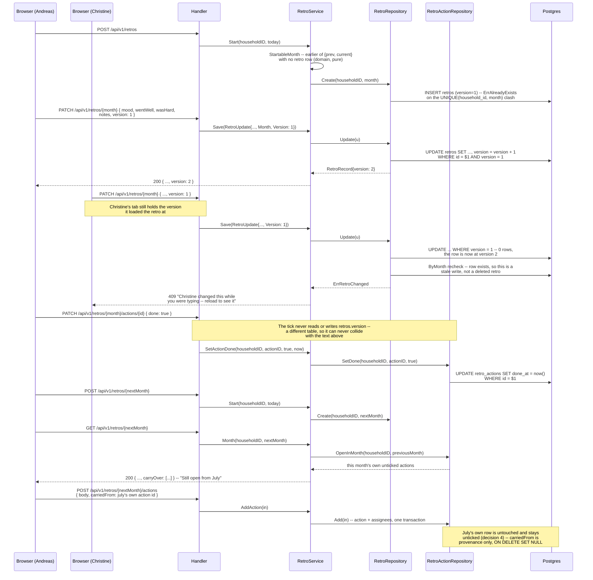
```mermaid
sequenceDiagram
    participant B1 as Browser (Andreas)
    participant B2 as Browser (Christine)
    participant H as Handler
    participant Svc as RetroService
    participant RRepo as RetroRepository
    participant ARepo as RetroActionRepository
    participant DB as Postgres

    B1->>H: POST /api/v1/retros
    H->>Svc: Start(householdID, today)
    Svc->>Svc: StartableMonth -- earlier of {prev, current}<br/>with no retro row (domain, pure)
    Svc->>RRepo: Create(householdID, month)
    RRepo->>DB: INSERT retros (version=1) -- ErrAlreadyExists<br/>on the UNIQUE(household_id, month) clash

    B1->>H: PATCH /api/v1/retros/{month} { mood, wentWell, wasHard,<br/>notes, version: 1 }
    H->>Svc: Save(RetroUpdate{..., Month, Version: 1})
    Svc->>RRepo: Update(u)
    RRepo->>DB: UPDATE retros SET ..., version = version + 1<br/>WHERE id = $1 AND version = 1
    RRepo-->>Svc: RetroRecord{version: 2}
    Svc-->>B1: 200 { ..., version: 2 }

    B2->>H: PATCH /api/v1/retros/{month} { ..., version: 1 }
    Note over B2,H: Christine's tab still holds the version<br/>it loaded the retro at
    H->>Svc: Save(RetroUpdate{..., Version: 1})
    Svc->>RRepo: Update(u)
    RRepo->>DB: UPDATE ... WHERE version = 1 -- 0 rows,<br/>the row is now at version 2
    RRepo->>DB: ByMonth recheck -- row exists, so this is a<br/>stale write, not a deleted retro
    RRepo-->>Svc: ErrRetroChanged
    Svc-->>B2: 409 "Christine changed this while<br/>you were typing -- reload to see it"

    B1->>H: PATCH /api/v1/retros/{month}/actions/{id} { done: true }
    Note over H,ARepo: The tick never reads or writes retros.version --<br/>a different table, so it can never collide<br/>with the text above
    H->>Svc: SetActionDone(householdID, actionID, true, now)
    Svc->>ARepo: SetDone(householdID, actionID, true)
    ARepo->>DB: UPDATE retro_actions SET done_at = now()<br/>WHERE id = $1

    B1->>H: POST /api/v1/retros/{nextMonth}
    H->>Svc: Start(householdID, today)
    Svc->>RRepo: Create(householdID, nextMonth)
    B1->>H: GET /api/v1/retros/{nextMonth}
    H->>Svc: Month(householdID, nextMonth)
    Svc->>ARepo: OpenInMonth(householdID, previousMonth)
    ARepo-->>Svc: this month's own unticked actions
    Svc-->>B1: 200 { ..., carryOver: [...] } -- "Still open from July"
    B1->>H: POST /api/v1/retros/{nextMonth}/actions<br/>{ body, carriedFrom: july's own action id }
    H->>Svc: AddAction(in)
    Svc->>ARepo: Add(in) -- action + assignees, one transaction
    Note over ARepo,DB: July's own row is untouched and stays<br/>unticked (decision 4) -- carriedFrom is<br/>provenance only, ON DELETE SET NULL
```

**The `version` guard exists because a retro is one shared draft with no
per-line ownership** (decision 1) — either partner can open it and type into
the same two textareas, so two browsers editing at once is the normal case,
not an edge one. `retros.version` increments on every successful `Update`,
and a save sends back the version it loaded; a mismatch means someone else's
save landed first, and the repository refuses the write rather than merging
the two drafts or silently letting the second save win (decision 6). The
copy the household sees — "Christine changed this while you were typing —
reload to see it" — never claims the partner's text was lost, because it
was not: `Update` writes nothing on a stale version, so the only thing that
needs recovering is the *other* browser's own unsent paragraph, which is
still sitting in its own textarea. `RetroRepository.Update`'s own doc
comment (`ports.go`) is where a future editor would look to change this, and
it says why the check has to be a single `WHERE id = $1 AND version = $2`
rather than a read-then-compare: a check-then-write can itself race, the
same class of bug `docs/LEARNING.md`'s database catalogue already carries for
Bills' `SetBillNextDue`.

**Ticking an action deliberately never touches `retros.version`, and that is
not an oversight — it is the reason the guard can exist at all without
making the screen unusable.** `retro_actions.done_at` lives in its own table;
`SetActionDone` writes only that row. Actions get ticked all month long,
well after retro night, by whichever partner does the thing first — if
ticking bumped the same `version` the text guard reads, then the household's
normal use of the actions list (one box ticked most days) would collide with
the other partner's next attempt to edit a stray line in the notes, and every
such collision would show the "reload" banner for a save that touched
nothing the other person cared about. Splitting the two into different
tables is what lets "two people editing shared prose" and "two people ticking
independent boxes" have different concurrency rules, without either one
degrading the other. This is why `RetroActionRepository` is its own port
(§3) rather than a second set of methods on `RetroRepository` — the two
tables are guarded by two genuinely different rules, not by convention.

**Carrying an action forward writes a new row; it never moves the old one.**
`OpenInMonth` reads the *immediately previous* month's unticked actions only
(decision 4 — a household that skipped four months is not handed an
unbounded backlog the night they come back), and `AddAction` with
`carriedFrom` set inserts a fresh `retro_actions` row on the new month with
`carried_from` pointing at the original; the original stays exactly as it
was, still unticked, still on July's own retro. Nothing here is a move or an
update — carrying an action is structurally the same write as adding a brand
new one, with one extra foreign key naming where it came from
(`ON DELETE SET NULL`, so deleting July's own row can never take August's
copy of it down too).

### Vision — a whole-document replace, and a `version: 0` that means "create"

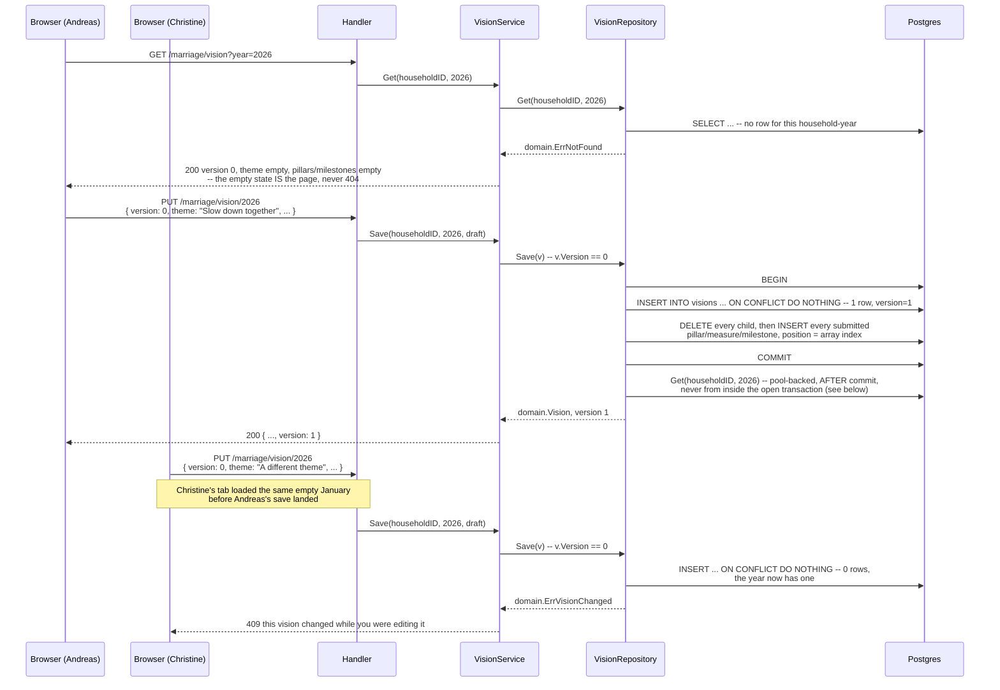
```mermaid
sequenceDiagram
    participant B1 as Browser (Andreas)
    participant B2 as Browser (Christine)
    participant H as Handler
    participant Svc as VisionService
    participant VRepo as VisionRepository
    participant DB as Postgres

    B1->>H: GET /marriage/vision?year=2026
    H->>Svc: Get(householdID, 2026)
    Svc->>VRepo: Get(householdID, 2026)
    VRepo->>DB: SELECT ... -- no row for this household-year
    VRepo-->>Svc: domain.ErrNotFound
    Svc-->>B1: 200 version 0, theme empty, pillars/milestones empty<br/>-- the empty state IS the page, never 404

    B1->>H: PUT /marriage/vision/2026<br/>{ version: 0, theme: "Slow down together", ... }
    H->>Svc: Save(householdID, 2026, draft)
    Svc->>VRepo: Save(v) -- v.Version == 0
    VRepo->>DB: BEGIN
    VRepo->>DB: INSERT INTO visions ... ON CONFLICT DO NOTHING -- 1 row, version=1
    VRepo->>DB: DELETE every child, then INSERT every submitted<br/>pillar/measure/milestone, position = array index
    VRepo->>DB: COMMIT
    VRepo->>DB: Get(householdID, 2026) -- pool-backed, AFTER commit,<br/>never from inside the open transaction (see below)
    VRepo-->>Svc: domain.Vision, version 1
    Svc-->>B1: 200 { ..., version: 1 }

    B2->>H: PUT /marriage/vision/2026<br/>{ version: 0, theme: "A different theme", ... }
    Note over B2,H: Christine's tab loaded the same empty January<br/>before Andreas's save landed
    H->>Svc: Save(householdID, 2026, draft)
    Svc->>VRepo: Save(v) -- v.Version == 0
    VRepo->>DB: INSERT ... ON CONFLICT DO NOTHING -- 0 rows,<br/>the year now has one
    VRepo-->>Svc: domain.ErrVisionChanged
    Svc-->>B2: 409 this vision changed while you were editing it
```

**`version: 0` on the wire means two different things depending on direction,
and that is deliberate, not overloaded.** `GET` sends it to mean "nobody has
saved this year yet"; `PUT` reads it back to mean "create it" rather than
"blind overwrite." Without that meaning, the first save of a January is the
one place the guard in decision 10 could not work at all: both owners open
the modal on the same blank year, both hold the version `GET` gave them —
which would have to be *something* — and whichever one saves second either
silently wins (no guard) or is refused for having "the wrong version" of a
document that never existed (a confusing refusal for a household's very
first save). Routing `version == 0` to `CreateVision ... ON CONFLICT DO
NOTHING` gives the create path the exact same "someone else won" answer,
`domain.ErrVisionChanged`, that a stale update gets — one error the frontend
already has a banner for, not a second one to build.

**The existence check on a stale `UPDATE` must run on the open transaction's
own connection, never on the pool-backed `Get`.** A zero-row `UPDATE ...
WHERE version = $n` is ambiguous — the row could be gone, or another save
could have landed first — and telling those apart needs a second read
(`RetroRepository.Update`'s own pattern, the Retros flow just above).
`VisionRepo.Save`
originally ran that second read through `r.Get`, which acquires its own
connection from the pool; called from inside `pgx.BeginFunc`, which is
already holding one connection checked out, that is a request for a *second*
connection while the first is still in use. One concurrent save hits this by
luck; enough concurrent version-guarded saves hit it at once, against
`pool.go`'s `MaxConns`, and every one blocks forever waiting for a connection
none of the others can release — a self-deadlock, not a slowdown, and now
its own `docs/LEARNING.md` entry. The fix routes the
existence check through `q`, the transaction-scoped `*sqlcgen.Queries` the
open transaction already holds, never back out to the pool.

**A save deletes and reinserts every child row, so a measure's id never
survives an edit — nothing outside its own vision references one, so
nothing breaks (spec decision 5).** The read-back after `Save` runs
deliberately *after* `COMMIT`, on the pool rather than the closed
transaction: Postgres's own MVCC guarantees it sees this write's committed
state or a later one, never an in-progress one, so the only race is another
save landing in the gap between commit and read-back — which hands the
caller a valid, current document and a valid version token, just possibly
not the exact content their own write produced. No lost update either way,
the same "hand back what's actually stored" contract
`RetroRepository.Update`'s own doc comment already promises.

**`measure_is_typed_or_linked`'s third branch is what stops deleting a goal
from breaking Vision, and it is currently reachable only by SQL, not by the
product.** `vision_measures.goal_id` is `ON DELETE SET NULL` (§6) — a
*referential action*, which Postgres executes as an `UPDATE` on the measure
row, and Postgres enforces `CHECK` constraints on every `UPDATE`, not only on
`INSERT`. A CHECK with only "typed" and "linked" branches would leave that
`UPDATE` writing `goal_id`, `target_value` and `current_value` all `NULL` —
a row satisfying neither branch — so deleting the goal would fail with a
constraint violation raised **inside the Goals feature**, the one place
nobody debugging it would think to look at Vision. The third branch is
exactly the broken-link state decision 8 already describes how to render, so
the database is permitted to reach it only because `SET NULL` produces it;
the domain still refuses to *create* one directly (a `PUT` naming neither a
goal nor a target is `422`). **There is no `DELETE /goals/{id}` route in
this product today** — `GoalRepository` carries no `Delete` method at all,
and Goals only ever archives (`SetArchived`, the same shape Accounts and
Bills use) — so this branch cannot be exercised through the app as it
stands; `TestDeletingALinkedGoalUnlinksTheMeasureInsteadOfFailing` proves it
directly against Postgres with a raw `DELETE FROM goals`, the only way to
reach it today. The constraint is defence for the day a real delete path
arrives, not dead code: an archived goal keeps its link and its figure
regardless (archiving is not deletion anywhere else in this product either),
so the branch currently guards a schema-level possibility rather than a
reachable user action — worth knowing before treating "goal deletion" as a
tested product flow rather than a tested database one.

**`GoalProgressReader.ProgressByIDs` turns a missing id into a blank
figure, never an error, which is what makes decision 8's rendering rule a
lookup miss rather than an exception path.** A measure whose `goal_id` has
gone `NULL` — by the mechanism above, or a link that simply failed to
resolve — is not in the map `ProgressByIDs` returns; `VisionService.Get`
reads that absence and sets `MeasureView.HasFigure = false`, so the page
renders the label with a short named explanation and no number, never a
stale or a zero one (the same "blank the figure and say why" rule Accounts
applies when a primary-currency change leaves net worth uncomputable). An
*archived* goal is still found and still keeps its figure — `ProgressByIDs`
must not filter on `archived_at` the way `GoalRepository.List`'s
`includeArchived` switch does, because archiving is not deletion here either
and Vision always wants the figure a linked measure is pointing at.

### What the frontend loads

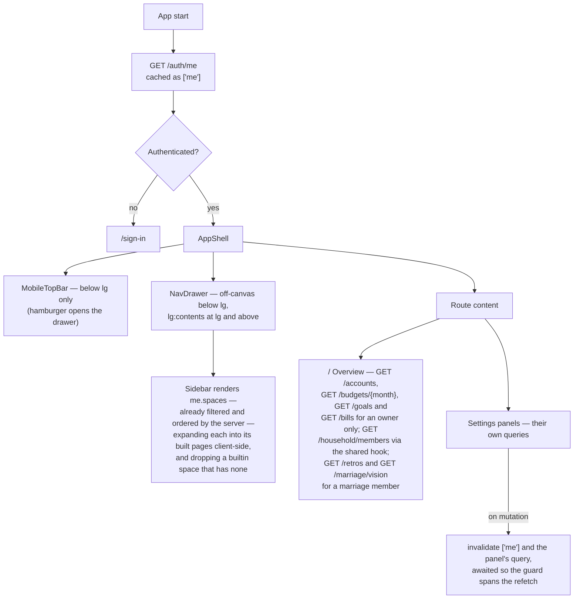
```mermaid
graph TD
    Boot["App start"] --> Me["GET /auth/me<br/>cached as ['me']"]
    Me --> Guard{"Authenticated?"}
    Guard -->|no| SignIn["/sign-in"]
    Guard -->|yes| Shell["AppShell"]
    Shell --> Bar["MobileTopBar — below lg only<br/>(hamburger opens the drawer)"]
    Shell --> Drawer["NavDrawer — off-canvas below lg,<br/>lg:contents at lg and above"]
    Drawer --> Sidebar["Sidebar renders me.spaces —<br/>already filtered and ordered by the server —<br/>expanding each into its built pages client-side,<br/>and dropping a builtin space that has none"]
    Shell --> Page["Route content"]
    Page --> Overview["/ Overview — GET /accounts,<br/>GET /budgets/{month}, GET /goals and<br/>GET /bills for an owner only; GET<br/>/household/members via the shared hook;<br/>GET /retros and GET /marriage/vision<br/>for a marriage member"]
    Page --> Settings["Settings panels — their own queries"]
    Settings -->|"on mutation"| Invalidate["invalidate ['me'] and the panel's query,<br/>awaited so the guard spans the refetch"]
```

**The shell follows one responsive convention, everywhere: `sm` (640px) is
where a page's own content reflows — auth cards, page gutters, modal field
pairs — and `lg` (1024px) is the one breakpoint that changes the *shell*
itself.** Below `lg`, `Sidebar` sits inside `NavDrawer`, off-canvas and
reached through `MobileTopBar`'s hamburger; at `lg` and above, the original
two-column grid (`grid-cols-[236px_1fr]`, unchanged since before this
project's mobile round) is back, exactly as it was. No third breakpoint is
introduced for the shell, and a page component never needs to know which of
the two rendering modes it is in.

**One more rule holds codebase-wide, and it is easy to undo by habit: every
full-height box is sized in `dvh`, never `vh`.** On iOS Safari `100vh` is the
*large* viewport — the height as though the URL bar were already hidden — so a
box built against it puts its bottom edge underneath the toolbar on first
paint. That is not a cosmetic margin: `AccountModal`'s content measures 665px
against roughly 650px of visible height on an iPhone, which puts its submit
button exactly where a thumb cannot reach. All fourteen viewport-height rules
in `web/src` — `Modal`, `NavDrawer`, `AppShell`, `RequireAuth`, the route
fallback and every auth screen — use `dvh`/`min-h-dvh` for that reason, and
nothing in this stack's tooling (headless Chrome, jsdom) reproduces the
toolbar, so a `vh` that creeps back in will not be caught by any test here.

**`NavDrawer` is what makes that restoration free, and `lg:contents` is why.**
At `lg` and above `NavDrawer`'s wrapper carries `lg:contents`, which makes the
element stop generating a box at all — its `<div>` disappears from layout
entirely, and `Sidebar` becomes AppShell's grid child directly, precisely as
if `NavDrawer` were never there. `position` and `transform` — the two
properties that hold the closed drawer off-canvas below `lg` — have no effect
on a `display: contents` element, so neither needs an `lg:` counterpart to
undo it. `visibility` is the one
exception, and it is why `NavDrawer`'s closed state carries an explicit
`lg:visible`: unlike `position`/`transform`, `visibility` is an *inherited*
CSS property, and `display: contents` suppresses the box, not the
inheritance. Without `lg:visible`, the desktop sidebar — whose drawer is
normally *closed* — would inherit `invisible` from its own wrapper and render
as a 236px column nobody can see. The lesson generalises past this one
component: `display: contents` opts an element out of the properties that
require a box (layout, backgrounds, hit-testing) but not out of the ones that
merely inherit, and a `contents` wrapper hiding a normally-open child with
`visibility` needs the same override.

`/auth/me` returns the user, household, membership, capabilities and visible
spaces in one response, so the shell renders without a request waterfall. The
sidebar never filters or re-sorts `me.spaces` client-side — duplicating that
rule is how the two drift. It does expand each space into its built pages: a
client-side map (`SPACE_PAGES` in `Sidebar.tsx`) turns a space with built
pages into the design's uppercase group label plus one link per page, one
page or several alike — Money renders as "MONEY" over Finances,
Transactions, Budget, Goals and Bills; Marriage renders as "MARRIAGE" over
its two pages, Retros and Vision & goals (Vision spec's task 11 added the
second — see "Route table" §4 and the marriage/ entry below).

**Overview fetches nothing of its own.** Its seven requests are the ones
Accounts, Budget, Goals, Bills, Retros, Vision and Settings already make,
through the same hooks and the same cache keys, so a figure on the front
door cannot disagree with the same figure on the screen it links to — the
browser walk checks exactly that (net worth on `/` against net worth on
`/money`). `useGoals` is the same hook `GoalsPage` itself calls, so the "X
of Y on track" figure on Overview's Goals card and the same count on
`/money/goals` share one cache entry rather than risking two independent
reads of `GET /goals` disagreeing; `NextBillCard` reuses `useBills` the
identical way, against `/money/bills`'s own cache entry, and gained no
query of its own — the `enabled` option `useBills` grew for exactly this
reuse (Task 11) predates `NextBillCard` by several tasks. `NextRetroCard`
reuses `useRetros` the same way again, against `/marriage/retros`'s own
cache entry, reading `openActionCount` rather than `actionCount` — the two
disagree the moment a retro's actions are partly ticked, and
`docs/LEARNING.md` carries the gap between them as its own entry.
`VisionCard` and `NextRetroCard`'s own check-in strip (Vision spec's task
13) push the pattern one step further: both call `useVision(currentVisionYear())`
directly rather than either taking the data as a prop from the other, because
`useVision` (unlike `useBills`/`useGoals`) was never given an `enabled`
option — a member without `marriage` must still never be allowed to call it,
so the only gate available is `OverviewPage` choosing not to mount either
component at all. That leaves *two* independent callers on Overview alone,
plus `VisionPage`'s own third — all three key off `visionQueryKey(year)`, so
a household that glances at Overview and then opens `/marriage/vision` in
the same visit still costs one `GET /marriage/vision` call, not three.
One of those hooks is new
only in the sense that it stopped being three: `useHouseholdMembers` was
declared privately and identically in `AccountModal`, `TransactionsPage` and
`MembersPanel`, all against `["household", "members"]`, sharing one cache
entry by coincidence rather than by construction; Overview would have been
the fourth copy, so it is now one module in `features/settings/`. `Budget`
and Overview likewise share `currentMonth()` (`features/money/month.ts`),
which reads the *local* calendar — the two screens must agree on which month
"this month" is, and the API container's own clock is UTC.

**A builtin space the map does not name renders nothing at all.** Since
`110ab0a`, Family is exactly that: it had a single "destination" whose whole
content was the sentence "Arriving in slice N", the team's own planning
vocabulary shown to a customer, so the page and its route were deleted and
its `SPACE_PAGES` entry with them. Marriage was in the identical state from
`110ab0a` until task 10, when its own route, guard and `SPACE_PAGES` entry
(one page, Retros) all came back together — splitting them across tasks
would have left a route nobody could reach or a sidebar link to a 404, the
same reasoning `110ab0a` itself gives for deleting all three of a space's
pieces together rather than leaving one behind. The rule keys off
`isBuiltin`, **not** off the absence of a pages entry — a *custom* space
created through "+ New space" has no map entry either and must keep
appearing, because a household that just made a space needs to see that it
exists. So there are three cases, not two: a space with built pages → the
group label plus one link per page, whether it has one shipped page (Marriage
today) or several (Money); a custom space → its name as plain text, since it
has no route to link to; a *builtin* space with no built page (Family) →
nothing rendered. Marriage's return is what first exercised the
group-label-plus-one-link shape for a real space — the single-link rendering
branch that used to special-case exactly one page had already been deleted
as unreachable once every remaining builtin space had two or more (Money),
so nothing in `SpaceLink` needed to change; the general branch already
handled `pages.length === 1` the same as `length > 1`. The map, not the
server payload, decides how many links a space produces; the server payload
still decides which spaces are *visible to this member* at all and in what
order, and Settings' own Spaces panel lists Marriage and Family regardless of
either one's navigation state, because the spaces themselves — unlike their
navigation — were never touched.

---

## 6 · Data model


```mermaid
erDiagram
    households ||--o{ memberships : has
    households ||--o{ invites : has
    households ||--o{ sessions : scopes
    households ||--o{ spaces : has
    households ||--o{ login_attempts : scopes
    households ||--|| notification_preferences : has
    households ||--o{ accounts : owns
    memberships ||--o{ accounts : "may own (nullable = shared)"
    households ||--o{ categories : has
    households ||--o{ transactions : has
    categories ||--o{ transactions : "labels (nullable, SET NULL)"
    memberships ||--o{ transactions : "paid by (nullable, SET NULL)"
    accounts ||--o{ transactions : "from (nullable, CASCADE)"
    accounts ||--o{ transactions : "to (nullable, CASCADE)"
    households ||--o{ budgets : has
    budgets ||--o{ budget_lines : has
    categories ||--o{ budget_lines : caps
    households ||--o{ goals : has
    goals ||--o{ goal_contributions : has
    households ||--o{ goal_contributions : scopes
    goals ||--o{ budgets : "may receive a rollover (nullable)"
    households ||--o{ bills : has
    accounts ||--o{ bills : "pays from (NOT NULL, supplies currency)"
    categories ||--o{ bills : "labels (nullable, SET NULL)"
    memberships ||--o{ bills : "paid by (nullable, SET NULL)"
    bills ||--o{ bill_payments : has
    households ||--o{ bill_payments : scopes
    transactions ||--o| bill_payments : "the expense it wrote (nullable, SET NULL)"
    households ||--o{ retros : has
    retros ||--o{ retro_actions : has
    retro_actions ||--o{ retro_action_assignees : has
    memberships ||--o{ retro_action_assignees : "assigned to (CASCADE)"
    households ||--o{ visions : "has, one per year (UNIQUE household_id, year)"
    visions ||--o{ vision_pillars : has
    vision_pillars ||--o{ vision_measures : has
    goals ||--o{ vision_measures : "may be linked (nullable, SET NULL)"
    visions ||--o{ vision_milestones : has
    users ||--o{ memberships : holds
    users ||--o{ sessions : owns
    users ||--o{ magic_links : owns
    users ||--o{ login_attempts : may_reference
    users ||--o{ invites : invited_by
    users ||--o| telegram_accounts : "may be bound to one chat (UNIQUE both ways)"

    households {
        uuid id PK
        text name
        text family_name
        char primary_currency
        bool show_secondary_currency
        char secondary_currency
        text fx_rate_mode
    }
    users {
        uuid id PK
        citext email "nullable — children have none"
        text password_hash "nullable"
        text display_name
        text avatar_initial
    }
    memberships {
        uuid id PK
        uuid household_id FK
        uuid user_id FK
        text role "owner | limited"
        text_array capabilities "calendar chores money marriage"
    }
    invites {
        uuid id PK
        uuid household_id FK
        citext email
        text role
        bytea token_hash
        uuid invited_by FK
        timestamptz expires_at
        timestamptz accepted_at
    }
    sessions {
        uuid id PK
        bytea token_hash
        uuid user_id FK
        uuid household_id FK
        timestamptz expires_at
        timestamptz revoked_at
    }
    magic_links {
        uuid id PK
        uuid user_id FK
        bytea token_hash
        timestamptz expires_at
        timestamptz consumed_at
    }
    signups {
        uuid id PK
        citext email "nullable — NULL for a Telegram sign-up"
        bigint telegram_chat_id "nullable — NULL for an email sign-up"
        bytea token_hash
        timestamptz expires_at
        timestamptz consumed_at "nullable"
    }
    telegram_accounts {
        uuid id PK
        uuid user_id FK "NOT NULL, UNIQUE, ON DELETE CASCADE"
        bigint chat_id "NOT NULL, UNIQUE"
        timestamptz linked_at
    }
    telegram_link_requests {
        uuid id PK
        bytea nonce_hash "NOT NULL, UNIQUE"
        timestamptz expires_at
        timestamptz consumed_at "nullable — set with chat_id, never alone"
        bigint chat_id "nullable — CHECK ties it to consumed_at"
        timestamptz created_at
    }
    login_attempts {
        uuid id PK
        uuid household_id FK "nullable"
        uuid user_id FK "nullable"
        citext email
        bool succeeded
        timestamptz at
    }
    spaces {
        uuid id PK
        uuid household_id FK
        text key
        text name
        text visibility "everyone | parents_only | custom"
        int position
        text required_capability
    }
    accounts {
        uuid id PK
        uuid household_id FK
        text nickname
        text type "cash | investment | property | loan | credit_card"
        uuid owner_membership_id FK "nullable — NULL means shared"
        bigint opening_balance_minor
        char opening_balance_currency
        date opening_balance_as_of
        bool count_toward_net_worth "default true"
        bool visible_to_limited_members "default false"
        timestamptz archived_at "nullable — never deleted"
    }
    categories {
        uuid id PK
        uuid household_id FK
        text name
        text kind "expense | income"
        int sort_order "the design's order, not alphabetical"
        timestamptz archived_at "nullable — never deleted"
    }
    transactions {
        uuid id PK
        uuid household_id FK
        text kind "expense | income | transfer"
        date occurred_on "a date, not a timestamptz — a household has no timezone"
        text description
        uuid category_id FK "nullable — SET NULL, never on a transfer"
        uuid paid_by_membership_id FK "nullable — SET NULL"
        uuid from_account_id FK "nullable — CASCADE"
        uuid to_account_id FK "nullable — CASCADE"
        bigint amount_minor "CHECK > 0 — sign comes from kind, not the value"
        char amount_currency
        bigint received_amount_minor "nullable — transfer only"
        char received_amount_currency "nullable, paired with the amount above"
    }
    budgets {
        uuid id PK
        uuid household_id FK
        date month "always the first of the month"
        bigint expected_income_minor "nullable — not provided"
        timestamptz rolled_over_at "nullable — whole with rollover_goal_id, CHECK"
        uuid rollover_goal_id FK "nullable — no ON DELETE, goals are never deleted"
        timestamptz created_at
        timestamptz updated_at
    }
    budget_lines {
        uuid id PK
        uuid budget_id FK "ON DELETE CASCADE"
        uuid category_id FK
        bigint cap_minor "CHECK >= 0"
    }
    goals {
        uuid id PK
        uuid household_id FK
        text name
        bigint target_amount_minor "CHECK > 0"
        char currency "explicit — unlike budgets, see the notes below"
        date target_month "nullable — no date means no on-track status"
        bigint planned_monthly_minor "CHECK >= 0"
        timestamptz archived_at "nullable — never deleted"
        timestamptz created_at
        timestamptz updated_at
    }
    goal_contributions {
        uuid id PK
        uuid goal_id FK
        uuid household_id FK "redundant with the goal's own — every read scopes by both"
        bigint amount_minor "CHECK non-zero — a downward correction is a negative row"
        date occurred_on
        text note
        text source "manual | starting_balance | budget_rollover"
        date source_budget_month "nullable — set only for source=budget_rollover"
        timestamptz created_at
    }
    bills {
        uuid id PK
        uuid household_id FK
        text name
        bigint amount_minor "CHECK > 0"
        text cadence "one_off | monthly | quarterly | yearly"
        date next_due "nullable — NULL only for a settled one-off"
        smallint due_anchor_day "CHECK 1-31 — the clamp target, kept apart from next_due"
        uuid category_id FK "nullable — SET NULL"
        uuid pay_from_account_id FK "NOT NULL — no currency column; this supplies it"
        uuid paid_by_membership_id FK "nullable — SET NULL"
        bool autopay "default false — display only, nothing schedules a payment"
        bool is_subscription "default false"
        timestamptz archived_at "nullable — never deleted"
        timestamptz created_at
        timestamptz updated_at
    }
    bill_payments {
        uuid id PK
        uuid bill_id FK
        uuid household_id FK "redundant with the bill's own — every read scopes by both"
        date due_on "the occurrence settled, NOT paid_on — every month figure keys off this"
        date paid_on
        bigint amount_minor "CHECK > 0 — may differ from the bill's own amount_minor"
        uuid transaction_id FK "nullable — ON DELETE SET NULL"
        timestamptz created_at
    }
    retros {
        uuid id PK
        uuid household_id FK
        date month "first of the month — UNIQUE(household_id, month)"
        smallint mood "CHECK 1-5, nullable — nullable and never 0 (a draft nobody rated)"
        text went_well "NOT NULL, defaults to empty"
        text was_hard "NOT NULL, defaults to empty"
        text notes "NOT NULL, defaults to empty"
        timestamptz completed_at "nullable — NULL is the whole draft concept, no status column"
        integer version "NOT NULL DEFAULT 1 — the concurrency guard, §5"
        timestamptz created_at
        timestamptz updated_at
    }
    retro_actions {
        uuid id PK
        uuid retro_id FK
        text body "NOT NULL"
        timestamptz done_at "nullable — the tick, never touches retros.version"
        uuid carried_from FK "nullable — ON DELETE SET NULL, provenance only"
        timestamptz created_at "ordering is created_at, id — no position column, see the notes below"
    }
    retro_action_assignees {
        uuid action_id PK "also FK to retro_actions — composite PK with membership_id, ON DELETE CASCADE"
        uuid membership_id PK "also FK to memberships — ON DELETE CASCADE"
    }
    visions {
        uuid id PK
        uuid household_id FK
        smallint year "CHECK 1900-2200 — UNIQUE(household_id, year), one row per calendar year"
        text theme "NOT NULL, defaults to empty — a row can exist while blank (GET never 404s)"
        text description "NOT NULL, defaults to empty"
        integer version "NOT NULL DEFAULT 1 — the concurrency guard; 0 never appears here, only on the wire"
        timestamptz created_at
        timestamptz updated_at
    }
    vision_pillars {
        uuid id PK
        uuid vision_id FK
        smallint position "UNIQUE(vision_id, position) — assigned from array order on save, no reordering UI yet"
        text name "NOT NULL"
        text description "NOT NULL, defaults to empty"
    }
    vision_measures {
        uuid id PK
        uuid pillar_id FK
        smallint position "UNIQUE(pillar_id, position)"
        text label "NOT NULL"
        integer current_value "nullable — typed measures only"
        integer target_value "nullable — typed measures only"
        uuid goal_id FK "nullable — ON DELETE SET NULL, linked measures only"
    }
    vision_milestones {
        uuid id PK
        uuid vision_id FK
        smallint year "CHECK 1900-2200 — independent of visions.year, usually years ahead"
        text title "NOT NULL"
        text note "NOT NULL, defaults to empty"
        smallint position "UNIQUE(vision_id, position)"
    }
```

Notes that are not obvious from the shapes:

- **Only hashes are stored** — passwords, session tokens, magic-link tokens,
  invite tokens and sign-up tokens. A raw token exists in memory and in an
  email, never in a column.
- **Every household-scoped table carries `household_id`, with two shapes of
  exception.** Repository methods take it as their first argument after the
  context wherever it is present. `magic_links` and `signups` carry neither:
  a magic link identifies a user, not a membership, so it scopes through
  `user_id` instead; a sign-up identifies a verified address with no user or
  household behind it yet. Separately, six tables carry **no**
  `household_id` at all because each is reached only through a parent that
  already has one, and scoping is a join rather than a filter:
  `budget_lines` (`budget_id` → `budgets.household_id`), `retro_actions`
  (`retro_id` → `retros.household_id`), `retro_action_assignees`
  (`action_id` → `retro_actions` → `retros.household_id`, two joins deep),
  `vision_pillars` (`vision_id` → `visions.household_id`),
  `vision_milestones` (`vision_id` → `visions.household_id`) and
  `vision_measures` (`pillar_id` → `vision_pillars` →
  `visions.household_id`, two joins deep — the same depth as
  `retro_action_assignees`, and every method on `VisionRepository` is scoped
  by `householdID` in SQL against the parent `visions` row for exactly that
  reason). **`telegram_link_requests` is a third shape, and the only one of
  its kind:** it carries no `household_id`, no `user_id` and no parent to join
  through at all — not even a nullable one — because a nonce is minted before
  anyone is known. The browser that asks for it has no session, and the chat
  that will redeem it has not been met yet; the row's *only* identity is the
  hash of a secret, and `chat_id` arrives later, at redemption. Nothing may
  ever be authorised from a row in this table on its own — its whole job is to
  be spent once and counted.
  `goal_contributions` and `bill_payments` look like the same shape —
  each has a parent id too — but take the *opposite*, more defensive one:
  both carry their own `household_id` despite the parent join already
  existing, because that foreign key alone carries no database-level
  guarantee the parent belongs to the caller's household (their own notes
  below say why).
- **`login_attempts` allows both foreign keys to be null**, so an attempt against
  an unknown address is recorded without revealing whether it exists.
- **`signups` has no `user_id`**, unlike `magic_links`. There is no user yet —
  only a verified address — which is also why the row carries no household
  name or display name: those are collected on the screen the mailed token
  leads to, after verification, so a stranger cannot submit a sign-up for
  someone else's address with a household of their own choosing. `email` is
  deliberately not unique; several live tokens for one address are fine,
  and the first one consumed wins.
- **A `signups` row names exactly one channel, and the database is what says
  so.** `email` stopped being `NOT NULL` and `telegram_chat_id` arrived beside
  it, under `CHECK ((email IS NULL) <> (telegram_chat_id IS NULL))` — the
  constraint named `signups_have_exactly_one_channel`. A row carrying both
  channels, or neither, is refused by Postgres rather than reasoned about in
  Go. `SignupService` still has a `default` branch that refuses a channel-less
  row (`signupChannel`), which is not redundancy for its own sake: the
  constraint protects the table, the `switch` protects against anything that
  ever reaches this code past the table — a fixture, a double, a future
  migration — and "fail closed on values you did not construct" applies to a
  value read back from a column just as much as to one off the wire. **The
  migration needed no backfill**, which was confirmed rather than assumed:
  `ADD CONSTRAINT ... CHECK` validates existing rows at migration time, this is
  the first migration here to constrain a table that already holds production
  data, and every existing row has a non-NULL `email` and (after the
  `ADD COLUMN`) a NULL `telegram_chat_id`, so the predicate holds for all of
  them.
- **`users.email` needed no change at all.** It has been nullable since
  `00002_identity.sql`, because a limited member — typically a child — has
  never had an address of their own. A Telegram-provisioned owner is simply the
  second kind of user with no email, and every path that already tolerated the
  first tolerates this one.
- **Both `telegram_accounts` unique constraints are load-bearing, in opposite
  directions.** `UNIQUE(chat_id)` stops two users binding the same chat, which
  would make a sign-in ambiguous — `ByChatID` would have to pick one.
  `UNIQUE(user_id)` stops one user accumulating chats, which would make a
  revocation miss one. Neither is a tidiness constraint.
- **`telegram_link_requests` now has a `Prune`, closed in the whole-branch fix
  wave, 2026-09-01.** `signups` and `login_attempts` are the other two tables
  a stranger can grow without holding an account, and `adminctl prune`
  already covered them; `PruneTelegramLinkRequests` joins them, mirroring
  `PruneSignups`'s own retention condition (and the same seven-day floor
  reasoning) exactly. It was a small row (a hash, two timestamps, a bigint)
  bounded in rate by the per-chat and per-IP limits, so it was a slow leak
  rather than a hole — but it was a real gap, and is not one any longer.
- **Database constraints mirror the domain rules** rather than trusting the
  application: a limited member cannot hold `marriage`, an owner must hold all
  four capabilities, and capabilities must come from the known set.
  `accounts` gets the same treatment: `liabilities_are_not_negative` refuses a
  negative balance on a `loan` or `credit_card` row, mirroring the sign rule
  `domain.AccountType.SignedNetWorthAmount` enforces in code — worth stating
  twice because the failure it prevents (a debt counted as an asset) is silent
  and wrong in the flattering direction.
- **Money is `int64` minor units plus an ISO 4217 code** everywhere. `float64`
  never appears in a monetary path.
- **`accounts.owner_membership_id` is nullable and means shared, not unset.**
  There is deliberately no separate `is_shared` boolean — a row that both
  names an owner and claims to be shared would have nothing to resolve that
  disagreement. `ON DELETE SET NULL` is what makes a removed member's accounts
  fall back to shared with no application code running.
- **An account is archived, never deleted.** `archived_at` takes it out of the
  accounts list, net worth and the breakdown, but a transaction that later
  references it keeps working — there is nowhere in the design to remove an
  account at all, so this is an addition the design does not draw.
- **An account's currency lives on the row, not inherited from the
  household.** A household's primary currency can change in Settings; the
  account's balance was denominated in whatever it was denominated in, and
  rewriting it on a household-currency change would silently restate history.
- **There is deliberately no `updated_at` on `accounts`.** No other table in
  this schema has one, nothing in the application would maintain it, and a
  column named "last updated" that nothing ever changes is a lie the next
  reader will believe. The question it would answer — when was this balance
  last true — is answered better by `opening_balance_as_of`.
- **`transactions.household_id` and `categories.household_id` are `ON DELETE
  CASCADE`**, the same as every other household-scoped table: a household's
  own bookkeeping and its own spending taxonomy leave when the household does.
  `category_id` and `paid_by_membership_id` are `ON DELETE SET NULL`, the same
  reasoning `accounts.owner_membership_id` uses for a removed member — losing
  a label is the least valuable thing a row can lose, and refusing the
  deletion instead would mean an owner cannot remove a departed member without
  first reassigning every transaction they ever paid for.
- **`from_account_id` and `to_account_id` are `ON DELETE CASCADE`, and
  `RESTRICT` was the first instinct.** The application never deletes an
  account — accounts archive, never delete — so a restrict looked free: this
  clause is unreachable in ordinary use. It is wrong anyway. It fires in
  exactly one case — deleting a household cascades to its accounts — and a
  `RESTRICT` from transactions would make that cascade fail partway through,
  with no way to delete a household that has ever recorded a transaction.
  `CASCADE` is the behaviour that is correct on the one path that ever reaches
  it and irrelevant everywhere else. Found by reasoning about the cascade
  before the schema shipped, not by a test; a test that deletes a household
  with transactions in it now exists (`docs/LEARNING.md`).
- **A transaction is hard-deleted; an account never is.** Nothing references a
  transaction, so there is no history to orphan by removing one — unlike an
  account, which transactions themselves reference. `DELETE
  /api/v1/transactions/{id}` really deletes the row and answers `204`, the one
  response in this product allowed to carry no body.
- **`budgets` and `budget_lines` carry no `currency` column at all.** A cap
  is a plan, not a transaction, and it lives in the household's primary
  currency by construction (Budget spec decision 9). Changing the
  household's primary currency in Settings changes what an existing cap
  *means* — the same accepted trade-off the accounts currency-change screen
  already documents, restated here rather than "fixed" by adding a column no
  other monetary-plan table in this schema has either.
- **`budgets.month` is the existence check for "is a budget set for this
  month".** A household's caps could have lived directly on `categories`
  instead, but a cap-on-category table has nowhere to hold expected income
  and no way to tell "never budgeted" apart from "budgeted, then every cap
  removed" — both would read as zero rows. The parent-and-lines shape keeps
  those two states distinguishable: `budgets` row present, `budget_lines`
  empty, is a real, closed-out zero; no `budgets` row at all is the empty
  state.
- **Archiving a category leaves its `budget_lines` rows exactly as they
  were.** `category_id` on `budget_lines` has no `ON DELETE SET NULL` the
  way `transactions.category_id` does, because there is no delete to guard
  against — a category only ever archives. A month capped against a
  category since archived still renders that cap, named and marked
  archived, so history stays true to what the household actually budgeted;
  only new caps and new transactions stop offering it.
- **`budget_lines.budget_id` is `ON DELETE CASCADE`** — nothing deletes a
  `budgets` row today, since Budget's own `PUT` upserts rather than
  replacing the parent, but the cascade exists for the same reason
  `accounts`'s cascade from `households` does: if a household is ever
  deleted, its budgets should not survive it as orphaned rows with no parent
  a query would ever reach.
- **`goals` carries an explicit `currency`; `budgets` and `budget_lines`
  carry none at all.** A budget is one month's plan, implicitly in the
  household's primary currency, and a primary-currency change silently
  restating one month was an accepted cost (above). A goal accumulates for
  years, so the same silence would restate a multi-year total and every
  contribution behind it — `accounts` stores currency per row for the
  identical reason. `goals.currency` is set once, at creation, and is not
  patchable: `usecase.GoalUpdate` carries no field for it at all, so a
  currency change is type-refused one layer up, not merely policy-refused
  here.
- **A contribution moves no real money.** `goal_contributions` is a ledger a
  household writes to by hand; it is never derived from `transactions` or
  `accounts`, and nothing in this schema reconciles the two. See §5's Goals
  flow for what that costs and why it was chosen anyway.
- **`goal_contributions.household_id` has no database-level constraint tying
  it to its own `goal_id`'s household.** A row could in principle carry a
  `household_id` that disagrees with the goal it names. Every
  `GoalRepository` method that reads or writes a contribution filters by
  `household_id` **and** `goal_id` together for exactly this reason — never
  by contribution id or goal id alone — which is why `List`/`Get`'s
  `contributed` sum is the one place in this schema still trusted to join on
  `goal_id` alone (the real query and its in-memory test double are
  deliberately consistent on this one point). `GoalRepository`'s own doc
  comment in `usecase/ports.go` states the underlying warning in full.
- **`goal_contributions_one_rollover_per_month` is belt-and-braces beside the
  conditional `UPDATE` in `RollOverToGoal`.** The application-level guard
  (`WHERE rolled_over_at IS NULL`) is what actually stops a second rollover
  in ordinary use; the unique index on `(household_id, source_budget_month)
  WHERE source = 'budget_rollover'` means even a future code path that
  forgets that guard cannot write two rollover contributions for one
  household-month.
- **`budgets.rollover_stamp_is_whole` refuses a half-set stamp at the
  database level**, not only in the repository's own transaction:
  `rolled_over_at` and `rollover_goal_id` must be both null or both set.
  `rollover_goal_id` carries no `ON DELETE` clause, because goals are never
  deleted (the same reasoning `accounts` and `categories` already apply) —
  an archived goal keeps a past rollover's reference readable.
- **A goal is archived, never deleted; a contribution is hard-deleted.**
  Contributions reference a goal, and a rolled-over month names one, so
  deleting a goal would strand rows and blank a past month's record — the
  `accounts` precedent, for the `accounts` reason. A contribution has the
  opposite shape: nothing references one, so deleting it — including a
  `starting_balance` or `budget_rollover` row — is the same reasoning
  Transactions applies to a transaction (§5), and it is how a household
  undoes a mistyped figure or a rollover it wants to redo.
- **`bills` carries no `currency` column, unlike `goals`.** It is
  denominated in whatever the pay-from account's currency is, because
  `TransactionService.Create` already forces an expense's currency to its
  from-account's (`usecase/transaction.go:232`) — a currency stored on
  `bills` itself would be overwritten the moment a payment wrote its
  transaction, and the two would disagree in the meantime. Do not add one;
  the migration's own comment says so.
- **`due_anchor_day` is a column, not derived from `next_due`, because
  clamping the destination month's last day is one-way.** 31 Jan clamps to
  28 Feb; advancing from a `next_due` of 28 would give 28 Mar, and a bill
  due on the 31st would silently walk itself off the 31st forever. See §5's
  Bills flow for the mechanism.
- **`only_a_one_off_has_no_next_due` is the one schema-level guarantee that
  a NULL `next_due` always means "settled one-off".** Anything else with a
  NULL there would be a bug that vanished from every list — `BillView`'s own
  `Settled` flag (§5) exists downstream of this constraint holding.
- **`bill_payments.household_id` has no database-level constraint tying it
  to its own `bill_id`'s household**, the identical gap
  `goal_contributions.household_id` has against its `goal_id` (above).
  `BillRepository`'s own doc comment in `usecase/ports.go` carries the same
  warning: every method filters by `household_id` **and** `bill_id`
  together, never by payment id alone.
- **`bill_payments.transaction_id` is `ON DELETE SET NULL`, not `CASCADE`.**
  Deleting the expense from the Transactions page must not erase the
  household's record that the bill was paid — the payment row's own
  `amount_minor` and `paid_on` survive regardless of what happens to the
  ledger entry that once backed them.
- **`UNIQUE (bill_id, due_on)` is belt-and-braces beside `BillService`'s own
  checks** — a double-clicked "Mark paid" cannot write two payments for one
  occurrence; `RecordPayment` translates the violation to
  `domain.ErrAlreadyExists` rather than surfacing a raw constraint error.
- **A bill is archived, never deleted — `bill_payments` references it**,
  the same `accounts`/`categories`/`goals` reasoning applied to a fourth
  table. A payment itself is never deleted either; `DELETE
  /bills/{id}/payments/{paymentId}` is the undo flow (§5), not a generic
  delete, and it always reverses the payment's own three writes rather than
  removing the row alone.
- **`retro_actions` has no `position` column, and that is a decision, not an
  oversight.** An explicit ordering integer needs a writer, and the only safe
  one is `max(position) + 1` computed inside the insert — which two partners
  adding an action in the same moment can still collide on, since nothing
  else in this feature serialises that path (`retros.version` covers the
  retro's text, not its actions). The design draws no reordering control
  anywhere, so the column would exist only to create that race. Insertion
  order is the order, `ORDER BY created_at, id`, with `id` as a stable
  tiebreak for two inserts landing in the same microsecond. Adding
  drag-to-reorder later means adding the column *then*, with a rule for
  writing it, not inheriting one that was never assigned a writer.
- **`carried_from` is provenance, not a move, and `ON DELETE SET NULL` is
  why.** Carrying an action forward (§5) inserts a new row on the new
  month's retro with `carried_from` pointing at the original; deleting
  July's own row must never delete August's copy of it, so the reference is
  nullable and clears rather than cascades. A malformed id reaching this
  column from a request body is refused at the repository, not silently
  read as SQL NULL — the one field on this table a client supplies directly,
  and `docs/LEARNING.md` carries the instance where that distinction
  mattered.
- **`retro_action_assignees` is a join table, not two boolean columns.** The
  design draws exactly `A` and `C` against an action, but nothing in this
  product caps a household at two owners — the invite modal offers "Parent"
  freely, and last-owner protection only guarantees at least one. Two
  columns would encode a limit that does not exist; a join table does not.
  `membership_id`, not a user id, for the same reason
  `transactions.paid_by_membership_id` is a membership id — a removed member
  behaves the way removed members already behave everywhere else in this
  schema.
- **`visions.year` is a `smallint`, not a `date`, unlike `retros.month`.** A
  retro happens on a specific date (the first of a month); a vision is a
  calendar year with no day inside it to anchor a `date` column to.
- **`visions.theme` and `.description` default to empty rather than merely
  being `NOT NULL`**, because `GET` returns a real, renderable row for a year
  nobody has saved (decision 9) — the simplest way to make that true is a row
  that is allowed to exist while still blank, not a sentinel or a second
  "unset" state layered on top.
- **`vision_measures.goal_id` is `ON DELETE SET NULL`, and
  `measure_is_typed_or_linked`'s third (all-`NULL`) branch exists only
  because of it — removing that branch breaks Goals, not Vision.** See "Vision
  — a whole-document replace" in §5 for the full mechanism (a referential
  `SET NULL` is an `UPDATE`, and `CHECK` constraints run on every `UPDATE`)
  and for how little of the product can reach it today (no `DELETE
  /goals/{id}` route exists — Goals only archives).
- **`vision_milestones.year` is deliberately independent of `visions.year`,
  with no constraint tying the two.** The design's own milestones sit years
  ahead of the vision they belong to (2027, 2029, 2032 inside a 2026 vision)
  — a milestone is a future waypoint the vision aims at, not an event that
  happened during the vision's own year.
- **`vision_pillars`, `vision_measures` and `vision_milestones` all carry an
  explicit `position`, unlike `retro_actions`, which deliberately has
  none.** `retro_actions`' own note above explains why an explicit position
  needs a safe writer and `retro_actions` never had one — two partners could
  add an action at the same moment with no way to serialise it. Vision has no
  such race: `PUT /marriage/vision/{year}` replaces every child of one
  document in a single transaction, so `position` is assigned from the
  submitted array's own index by a single writer, and the design numbers its
  pillars visibly ("Pillar 1", "Pillar 2"), so the order is something the
  household sees rather than an accident of insertion.
- **A save deletes and reinserts every child row, so no child id survives an
  edit.** Nothing outside a vision references one of its own pillars,
  measures or milestones, so nothing breaks; the day something does (a
  comment on a measure, a history of its value) is the change that has to
  introduce stable ids, with its own rule for preserving them across a save.

---

## 7 · Frontend structure

```
web/src/
  api/client.ts        apiFetch — the only way the app talks to the server:
                       CSRF header, credentials, error envelope decoding,
                       401 handling
  components/          generic primitives only (Modal, on native <dialog>)
  features/
    auth/              sign-in, invite, magic-link, sign-up screens and hooks.
                       SignInScreen also carries the "Continue with Telegram"
                       control: it opens the popup SYNCHRONOUSLY inside the
                       click handler -- a blank tab first, pointed at the URL
                       once POST /auth/telegram/start resolves -- because
                       WebKit gates window.open on the synchronous gesture
                       call stack and an awaited fetch reliably breaks that
                       gate. Opening in onSuccess instead is the textbook
                       OAuth-popup-blocked-on-Safari failure, and no test in
                       this suite can see it: jsdom's window.open stub has no
                       user-activation model at all (docs/LEARNING.md pattern
                       3). A hard-blocked popup still returns null, so the
                       URL is then rendered as a real link rather than
                       swallowed. A 404 -- no bot configured on this install
                       -- hides the control for the rest of the screen's life
                       rather than showing an error nobody can act on, and
                       every click clears both per-attempt banners first, not
                       only on success: this file already documented two
                       earlier fixes for an error banner surviving a state
                       transition, and this control would have been the
                       third (docs/LEARNING.md pattern 1).
                       SignUpCompleteScreen is channel-aware: GET
                       /auth/sign-up/{token} now returns channel alongside
                       email, parsed as a "email" | "telegram" union rather
                       than a bare string so an unrecognised value fails
                       loudly instead of rendering the wrong screen. A
                       Telegram sign-up renders a sentence saying so, never
                       the read-only email box -- an empty read-only input
                       reads as a field somebody forgot to fill in, which is
                       the "looks automatic but is not" shape this product
                       has refused twice before.
    shell/             AppShell (sidebar + the 1204px content column every
                       page renders inside), Sidebar, MobileTopBar and
                       NavDrawer (the below-lg off-canvas nav; lg:contents
                       restores the desktop grid unchanged), RequireAuth,
                       RequireCapability
    settings/          members, spaces, currency, notifications
    money/             Finances page — net worth (now with its twelve-month
                       trend, NetWorthChart.tsx, inline SVG the same way
                       marriage/MoodChart.tsx draws its own line — no
                       charting dependency, and a month with no figure
                       breaks the bar rather than drawing a zero), breakdown,
                       accounts and recent-transactions cards, the add/edit modal,
                       archive and restore; the Transactions page —
                       filterable ledger, the add/edit/delete transaction
                       modal (Task 15's component, this is its only
                       caller), mounted at /money/transactions (Task 17);
                       the Budget page — set state, empty state with
                       templates, the Edit-budget modal (category create/
                       rename/archive queued through it), the History
                       modal and month picker, mounted at /money/budget;
                       the Goals page — cards in a 2-up grid, the New/Edit
                       goal modal, the contributions panel (add/delete,
                       listed by source), the Monthly contributions card,
                       and the Budget page's own rollover card, mounted at
                       /money/goals; the Bills page — Due soon / Later /
                       Archived lists, the Add/Edit bill modal, Mark paid
                       and its undo, and the Subscriptions panel, mounted
                       at /money/bills (replacing moneySplatRoute, the
                       last route that ever used it)
    overview/          the interim Overview at / — six of the design's
                       seven cards Money and Marriage can supply (net worth,
                       reusing money/NetWorthCard, so it now also carries
                       the month-to-date change badge (`▲ 2.1% this month`)
                       — but never NetWorthChart itself, which stays
                       Finances-only by design, since this card's job is a
                       headline, not a breakdown; this month's budget;
                       goals on track; the next bill, reading the same
                       useBills hook /money/bills itself uses; the next
                       retro, reading the same useRetros hook /marriage/retros
                       itself uses, beneath it the retro's own openActionCount
                       -- the design's "carried-over actions" figure, §5, and
                       (Vision spec's task 13) the Vision check-in strip
                       beneath that, "Vision check-in: <year> theme —
                       '<theme>'", gated on the theme being non-empty rather
                       than a second version check; and VisionCard, one line
                       per pillar showing that pillar's FIRST measure with
                       its live figures rather than the design's own three
                       flat commitment lines -- a third shape the design
                       never records how to store -- reading the same
                       useVision hook /marriage/vision itself uses, omitted
                       entirely (not an empty quotation) for a year with no
                       vision yet), a setup checklist, and the "+ Add"
                       quick-create menu
    marriage/          RetrosPage -- header (title, subtitle, done-count
                       clause, privacy badge, start-retro button), the
                       five screen states (first-run, a draft in progress,
                       normal, owner-only, load failure), and its mount
                       points. The owner-only state is unreachable live:
                       RequireCapability redirects a limited member to /
                       before this page ever mounts, and the
                       limited_members_have_no_marriage CHECK means anyone
                       who does pass that guard is already an owner --
                       kept as defence in depth, not dead code (router.go's
                       own comment on the group, lines 292-299).
                       retro-history holds RetroHistoryList (rows
                       grouped by year, current year expanded, older years
                       behind the design's "Show 2025 (7 more)" disclosure
                       over data the one GET /retros fetch already returned,
                       never a second request) and MoodChart (twelve points
                       as inline SVG, no charting dependency -- a month with
                       no finished retro, or a finished one with no mood,
                       breaks the line rather than drawing a zero).
                       retro-detail-mount holds RetroDetail (went well, was
                       hard, the actions list with a real, keyboard-focusable
                       checkbox per row and per-assignee initials -- the
                       tick writes through useRetro's setActionDone, never
                       the retro's own version, §5 -- and notes) once a
                       month is selected, and the Start/Edit modal
                       (RetroModal -- mood, the two textareas,
                       MoneyCheckInPanel's live budget-and-goals read
                       (decision 3, stored nowhere), a "+ Add an action"
                       composer, and the "Still open from July" carry-over
                       offer). useRetros/useRetro read and write /retros;
                       retroQueryKeys.ts holds both hooks' cache keys so
                       either can invalidate the other's without a
                       circular import. useRetro also exposes discardDraft
                       (DELETE /retros/{month}), now called by RetroModal's
                       own Discard-draft control, and removeAction (DELETE
                       /retros/{month}/actions/{id}), still real, tested,
                       and, as of this document, not called by any
                       component -- deliberately, since no mockup or task
                       brief ever asked for deleting a single action
                       (docs/LEARNING.md pattern 15). Mounted at
                       /marriage/retros

                       VisionPage -- header (title, subtitle, Edit vision
                       button), a green theme hero (year label, theme in
                       literal quotes, description), a three-column
                       PillarCard grid and the "Longer horizon"
                       MilestoneGrid panel, plus the loading/error/
                       owner-only/empty states RetrosPage already
                       established just above. No marriage-duration block
                       beside the theme hero -- Vision spec decision 2, the
                       design draws "Married · 14 years · Feb 14, 2012" but
                       nothing in this product stores a wedding date, so the
                       hero renders theme and description full width
                       instead. version: 0 (visionSchema) means the year has
                       no vision yet and renders an empty state with its own
                       call to action, never a grid of blank cards.
                       PillarCard renders one pillar's "Pillar N" label,
                       name, description and measures -- a measure with
                       hasFigure: false (a linked goal deleted, a link that
                       failed to resolve, or a kind this build does not
                       recognise, measureDTO's own comment) renders its
                       label and no number at all, never "0 of 0" or "0%",
                       the one place this rule is expressed. MilestoneGrid
                       renders one card per milestone (year, title, note)
                       plus a dashed "+ Add milestone" tile. All three of
                       onEdit's call sites -- the header's Edit vision
                       button, "+ Add milestone" and the empty state's own
                       call to action -- open VisionModal (Vision spec's
                       task 12), the whole-document editor: theme, a year
                       select offering only the previous/current/next
                       calendar year (changing it writes back to
                       VisionPage's own `year` state, so the same mounted
                       useVision(year) call refetches and the modal reseeds
                       every field from the newly loaded year), description,
                       every pillar's name/description/measures and every
                       milestone, saved together in one PUT. The measure
                       editor adds the two fields the design's own modal
                       never drew (spec decision 7) -- a pillar's own
                       description and, per measure, a label plus either a
                       typed current/target pair or a linked-goal picker,
                       never both; switching modes clears the other's
                       inputs rather than leaving a hidden stale value that
                       would still submit. A stale version (409
                       VISION_CHANGED) latches a one-way conflict banner
                       decided from the response's own error code, whose
                       only action reloads the year and discards the local
                       draft outright rather than resuming it in place.
                       Every pillar's and the vision's own description
                       renders nothing when empty, not an empty block --
                       the empty-vision response carries "" on the wire,
                       never null. useVision reads and writes
                       /marriage/vision; visionQueryKeys.ts holds its cache
                       key and currentVisionYear() the same way
                       retroQueryKeys.ts does for Retros. Mounted at
                       /marriage/vision
    placeholder/       named stand-ins for unbuilt areas, and only for areas
                       a household can already reach. Empty of callers as of
                       this feature: / stopped using it when the interim
                       Overview shipped, and Bills' own route was the last
                       one still pointing at it (moneySplatRoute). The
                       component is unreferenced dead code today, kept
                       rather than deleted because Family will want it
                       again the moment it grows a route with no page
                       behind it yet — see `docs/FEATURE_TRACKER.md`
  routes/router.tsx        the route tree; its header comment is the route
                           list, kept beside the code it describes
  routes/publicRoutes.ts   the one list of pre-auth routes and API prefixes;
                           a test walks the route tree and fails if a
                           pre-auth screen escapes it
```

**Finances replaces the placeholder at `/money`**, and now carries a
recent-transactions strip — five newest, reading through the same
`useTransactions({})` query the Transactions page's own default (unfiltered)
state resolves to, so the two share one cache entry rather than the strip
standing up a second endpoint. `/money/transactions`, `/money/budget`,
`/money/goals` and `/money/bills` are all real routes, siblings of `/money`
nested under the same `moneyGuardRoute` (a literal path segment beats a
catch-all, so each was declared and added to that route's children ahead of
the splat while one still existed). **`/money/$` itself is gone.** Bills was
its last remaining reason to exist — every other page in Money had already
claimed its own literal segment — so `/money/bills` replaced the splat
outright rather than joining beside it (commit `946630e`); there is no
catch-all left anywhere under `/money`. The sidebar still renders from the
server's own filtered, ordered space list, but Transactions is what expired
the flat-links deferral and Budget, Goals and Bills are what grew it a
third, fourth and fifth link in turn: Money takes the design's grouped
form — an uppercase "MONEY" label over Finances (`/money`), Transactions
(`/money/transactions`), Budget (`/money/budget`), Goals (`/money/goals`)
and Bills (`/money/bills`) — via the `SPACE_PAGES` map in `Sidebar.tsx` (see
"What the frontend loads" above).

**`/marriage/retros` is Marriage's own return to the app** (task 10),
mirroring the shape every capability-gated `/money/*` route already takes:
`marriageGuardRoute` (`RequireCapability cap="marriage"`) nested under
`shellRoute`. Task 10 gave it one child (`retros`) and no index route,
which meant a caller who typed bare `/marriage` matched a real route
(unlike before task 10) but saw the sidebar with a blank content area,
neither a page nor a 404 (`docs/LEARNING.md`'s frontend section has the full
mechanism of why — a guard route with children but no index matches the
bare parent path too). **Vision spec's task 11 added `/marriage/vision`
(`VisionPage`) as Marriage's second child, and closed that gap with it**:
`marriageIndexRoute` (path `"/"`, `beforeLoad` throwing
`redirect({ to: "/marriage/retros" })`) now sends bare `/marriage` to
Retros, the same "first page wins" choice `moneyIndexRoute` already made for
Money — though Money's own index route *is* its first page (`FinancesPage`)
rather than redirecting to a sibling, since Finances has no separate URL of
its own the way Retros does. `SPACE_PAGES.marriage` renders the identical
grouped label-plus-links shape Money uses, now with two links (Retros,
Vision & goals) — the single-link branch that shape used to have a separate
code path for was already deleted as unreachable before Marriage first
needed it (task 10), so no rendering logic changed for either link, only the
map entries.

**`/` is a real page, and it is the only one with no capability guard above
it.** Every other screen sits behind `RequireAuth` *and* `RequireCapability`,
so "what does a limited member see here?" is answered by the router before the
component mounts. Overview has no such guard — it is the one page every member
of a household reaches — so its access shapes are decided *inside* the
component, and they are three normal renders rather than one render plus edge
cases:

| Caller | What renders | Why |
|---|---|---|
| owner | net worth card, budget card, goals card, next bill card, setup checklist, "+ Add" | the only caller `GET /budgets/{month}`, `GET /goals` and `GET /bills` admit, and the only one who may write an account, a transaction, a budget, a goal or a bill |
| limited, holds `money` | a panel saying amounts are hidden, linking to Finances | `GET /accounts` answers 200 but **omits `summary` entirely** rather than zeroing it (§5); with no budget card, no goals card, no next bill card and no checklist either, this panel is the only thing on the page |
| limited, no `money` | a single "You don't have access to Money" panel | `GET /accounts` answers 403 |

Two details here are load-bearing and neither is visible from the route table
alone. First, **`/accounts` and `/budgets/{month}`/`/goals`/`/bills` do not carry
the same guards** — accounts is `requireCapability(money)`, the other three
are that *and* `requireOwner` — so the budget, goals and next bill cards are
all owner-only, and `useBudget`/`useGoals`/`useBills` each take an `enabled`
flag rather than being called unconditionally: a limited member must not
fire a request that can only 403 and cache the failure. Second,
**the absent `summary` is the only signal the frontend has** that a caller may
not see amounts, so the page must never synthesise one; a zero there would be a
claim about the household's money. The middle row of that table is the one that
shipped broken — it rendered nothing at all until a browser walk found it, and
every unit test passed both before and after, because each asserted only that
something was *absent* (see `docs/LEARNING.md` pattern 2).

The checklist is derived entirely from data the page already holds — no
endpoint of its own — and disappears once its three steps are done, so an
established household is not shown a permanent chore list. It has three steps,
not the four an onboarding flow suggests: an emailed invite writes only to the
`invites` table (§6) while `GET /household/members` reads memberships joined to
users, so a pending invite is not a row there and an "invite your partner" step
could only tick once the partner accepted.

**`/marriage`, `/marriage/$` and `/family/calendar` were deleted together**
in `110ab0a`, with the placeholders they rendered, because a navigation row
whose only content was "Arriving in slice N" reads as broken. Task 10
restored `/marriage` in the shape of `/marriage/retros`, alongside its
`SPACE_PAGES` entry and its `RequireCapability` guard, all in the same
change — splitting them across tasks would have left a route nobody could
reach or a sidebar link to a 404. `/family/calendar` is still gone; nothing
has rebuilt Family yet, so that URL still falls through to `rootRoute`'s
`notFoundComponent` exactly as `/marriage` used to. Two consequences follow
from *where* that component sits, and `router.tsx`'s header comment records
both because neither is visible from the route list alone. `rootRoute` sits
**above** the pathless `RequireAuth`/`AppShell` pair rather than below it, so
the 404 renders shell-less — no sidebar, and today no link home, which makes
`/family/calendar` a dead end rather than a route that offers a way out. And
`RequireAuth` never runs for it, so a signed-out visitor following an old
`/family/calendar` bookmark gets bare "Page not found." text instead of the
sign-in screen every real route bounces them to. Both are accepted for now:
this is a link to a feature that does not exist, not a route anything should
point at. Both stop being acceptable the moment `notFoundComponent` grows
real content or a route moves relative to `authenticatedRoute`, so
`router.test.tsx` pins the fall-through rather than leaving it to be
rediscovered.

**Every page renders inside a 1204px column**, centred by `AppShell` — the
design's own content width (a 1440px canvas less the 236px sidebar), not a
taste. Before it, the grid's `1fr` handed each page the whole monitor: on a
2752px display the ledger's heading and its "+ Add transaction" button
measured 2407px apart, and a Settings toggle sat far from the label naming
it. Pages keep their own padding; the column only bounds them, which is why
adding it changed no page's internal layout. Nothing in the unit suite could
see the defect — jsdom lays nothing out — so the numbers come from a real
browser (`docs/superpowers/plans/2026-07-31-hearth-ux-repair-verification.md`).

**Route guards are presentation, not security.** The server enforces
independently; `RequireAuth` and `RequireCapability` exist so the UI does not
render something the user will be refused. The `/family/calendar`
fall-through above is the same rule read from the other side: a URL with no
route gets no guard either, and it is the server that would refuse the data
regardless.

`publicRoutes.ts` replaces two hand-maintained lists that used to live in
`api/client.ts` and `api/unauthorizedRedirect.ts`, with nothing tying either to
the route tree — the exact gap that once let the 401 handler bounce a pre-auth
screen off itself. Sign-up added two more pre-auth routes and one more API
prefix, which is what made the duplication stop being optional.

---

## 8 · Operational shape

| | |
|---|---|
| Migrations | goose, applied by a one-shot container before `api` starts |
| Generated SQL | sqlc, from `internal/adapter/postgres/queries/*.sql` — `make sqlc` |
| Sessions | opaque random token, hashed at rest, 30 days, extended on use, revocable |
| CSRF | double-submit cookie, compared in constant time, mutating methods only |
| Mail | Mailpit in development **and, for now, in production too** — the first install runs on a free DDNS hostname whose DNS refuses `TXT` records, so DKIM cannot be published and no hosted relay will verify it (`docs/adr/0003-mail-stays-on-the-box.md`). Mail is read by hand over an SSH tunnel; the inbox is an authentication bypass, so 8025 is bound to `127.0.0.1` only. `SMTP_TLS_MODE=none` is set explicitly, since it defaults to `mandatory` outside development and Mailpit speaks plaintext. TLS policy and credentials come from config, so a real relay is four `.env` values and no code |
| Telegram | **Off unless configured**, and both values travel together: `config.Load` refuses a boot where exactly one of `TELEGRAM_BOT_TOKEN`/`TELEGRAM_BOT_USERNAME` is set, the same both-or-neither rule `SMTP_USERNAME`/`SMTP_PASSWORD` already follow, because a half-configured channel misbehaves silently. Both empty — which is what `deploy/.env` on the production box says, and this change is not deployed there yet in any case — means `POST /auth/telegram/start` answers `404`, the poller never starts, and `adminctl` (which runs `config.Load` before every subcommand) is unaffected. **Exactly one process may call `getUpdates`:** Telegram hands each update to a single caller, so a second `api` replica would silently steal updates and the symptom would be "sign-in works about half the time" — an operational constraint on ever scaling this service horizontally, not just a code comment (§1). Outbound only; no webhook, so nothing new faces the internet. The bot token is never logged in any branch, including error paths — `client.go` builds its errors from the method name rather than the request URL, because Telegram's own API URLs embed the token in the path and a `*url.Error` carries that URL |
| Seeding | `adminctl seed`, refused unless `APP_ENV=development` **and** the database host is local — both checked before the connection opens |
| Retention | `adminctl prune --older-than=<days>` (default 30, floor 7) deletes consumed/expired `signups`, stale `login_attempts` and — closed in the whole-branch fix wave, 2026-09-01 — consumed/expired `telegram_link_requests`, the third table a stranger can grow without an account (`PruneTelegramLinkRequests` mirrors `PruneSignups`'s own retention condition exactly). `magic_links`, `invites` and `sessions` still grow forever, a real gap rather than a decision (§6) |
| Rate limiting | Per-address (3/hour) and a global daily ceiling (1000, reset at midnight, not a rolling 24 hours), both counted from `signups` so a restart cannot reset them — and the Telegram sign-up path counts against that **same** global ceiling, deliberately, so a flood of `/start` cannot run the shared counter up and silently stop email sign-up while having no ceiling of its own. Telegram adds two more: per-**chat**, at most 3 links delivered per hour, counted from `telegram_link_requests` (so a restart cannot reset it either), and a second per-IP bucket of 20/hour on `POST /auth/telegram/start`, in its own limiter instance so it and sign-up cannot spend each other's budget (§4). Per-IP (5/hour on sign-up) is an in-memory token bucket in the HTTP layer — process-local, spoofable in development, and keyed to the *proxy* rather than the client if a proxy is put in front of nginx without `set_real_ip_from`; Caddy is in front in production, so `web/nginx.conf` carries that directive over the compose subnet and it is verified, not assumed (both in §1). The per-IP limit binds before the global one by construction (5 × 24 = 120 ≪ 1000) so one IP alone can never exhaust the global ceiling — but that arithmetic covers only the **email** sign-up path, whose every request to `/auth/sign-up` arrives over HTTP from the stranger's own IP and passes through that 5/hour bucket on the way to the shared counter. **The Telegram sign-up path has no per-IP bound at all.** The row that actually advances the shared global counter is written by `sendSignUp` (`telegram_auth.go`), reached only from the poller processing a Telegram update — the IP on that request is Telegram's own long-poll host, not the stranger's, so no per-IP bucket sees it (the 20/hour bucket on `POST /auth/telegram/start`, above, limits only how often a *browser* can mint a nonce, a step upstream of and separate from a chat sending `/start`). What actually bounds a Telegram sign-up flood is the per-**chat** limit (3/hour, above) plus the same shared global daily ceiling the email path counts against |
| Health | `/healthz` ignores the database; `/readyz` pings it |
| Hosting | **Live since 2026-08-15** at <https://oink.mywire.org> — one Hetzner CX23 in Falkenstein running `deploy/docker-compose.prod.yml` (project `hearth-prod`, deliberately not the dev stack's `hearth`). `docs/adr/0002-first-production-host.md` carries the choice and its 2026-08-15 amendment: `CPX11` was renamed out of existence and Singapore does not sell the cheap `CX` line, so the region moved to the EU and the household now crosses ~195 ms of ocean — measured from the owner's network, not estimated. Follows `docs/adr/0001-optimise-for-exit-cost.md`: hosts are picked for how cheaply we can leave them |
| Deploying | `deploy/deploy.sh <git-sha>` — one command, plus `--current` and `--rollback`. CI builds three SHA-tagged images on every push to `main`; **the box never updates itself**, by design (spec decision 3), because rollback is image-only and a bad migration needs a restore rather than a rollback. The script refuses `latest` and refuses a tag absent from the registry **before** it writes `.env`, so a typo cannot leave the file pointing at something unpullable; it records the previous tag before changing anything, so `--rollback` survives a run that dies partway; and it verifies rather than assumes — `migrate` exited `0` (checked with `ps -a`, since Compose hides exited one-shot services), nothing restart-looping, `/readyz` answering on the public domain. Every guard and a full deploy/rollback/redeploy round trip were exercised on the live box on 2026-08-15 |
| TLS | Caddy in front, automatic Let's Encrypt issuance and renewal (§1). **Issued first try on 2026-08-15** for `oink.mywire.org` and verified from outside (`ssl_verify_result 0`, `http://` → `308`); it survives a reboot from the `caddy-data` volume without re-issuing. Neither `api` nor `web` terminates TLS itself, and both are unusable without something that does — cookies are `Secure` outside development, confirmed on the wire: `HttpOnly; Secure; SameSite=Lax` |
| Backups | **Running nightly since 2026-08-15**, and the recovery loop is proven with real values, not just row counts. `deploy/backup.sh` dumps in **plain SQL** (readable by any future Postgres and by a human), gzips, encrypts with `age` and uploads to Cloudflare R2, pinging a heartbeat only after a successful upload. The private key is **not on the box** — only the public recipient — so a box compromise yields ciphertext. `deploy/restore.sh` is the reverse, with a fail-closed guard refusing any DSN that looks like the live database; a restore from the real R2 object reproduced all eleven tables and every monetary value exactly. The cron was tested as cron runs it (`env -i`, crontab `PATH` only), which matters because cron's default `PATH` excludes `/usr/local/bin` where `rclone` lives. 🟡 **Two gaps remain:** the escrow envelope does not exist, so no restore has ever used a *second* person's copy of the key; and no lifecycle rule prunes old dumps yet |
| Production administration | **Proven on the live box.** `api/Dockerfile`'s `admin` target puts `goose` and `adminctl` on the same distroless base as `api`, and `deploy/docker-compose.prod.yml` wires it two ways: the one-shot `migrate` service `api` waits on, and a `profiles: [manual]` `admin` service for `unlock-household`, `reset-password`, `create-invite` and `prune`. All eight migrations were applied to the production database by the `migrate` service on first boot and re-applied cleanly across a deploy, a rollback and a redeploy. `goose status` has been run against the live database through the `admin` image. The `adminctl` subcommands remain unexercised in production — every one is written out in `deploy/README.md` |

---

## Keeping this document true

This describes the system as it is, not as it was planned. When a feature ships,
an interface changes, a table is added or a flow is reshaped, update the diagram
it affects in the same change — a diagram nobody trusts is worse than none.

Use the `maintaining-system-design` skill; it says what to check and how to keep
the diagrams honest.
