# Hearth — system design

How the system is put together, how a request moves through it, and what the
data looks like. Written so an engineer new to the project can orient in one
sitting.

**Scope:** what exists today — slices 0 and 1, self-serve sign-up and
household provisioning (which shipped ahead of slice 2 in the build order, see
`docs/HANDOVER.md`), and all five features of slice 2 (Money), now complete:
Accounts — a household records what it owns and owes by hand and sees a net
worth built from it; Transactions — the ledger a household logs expenses,
income and transfers into, categorised and filterable, which is also what
turns an account's balance from a copy of its opening figure into a real
sum; Budget — an envelope per category with pace, built directly on
Transactions' own month totals, plus the category management (rename,
create, archive) the design folds into its Edit-budget modal rather than a
dedicated screen; Goals — a savings target with an optional date, its
progress kept as a contributions ledger rather than an account balance, and
the manual move that finally gives Budget's unspent money somewhere to go;
and Bills — a household's recurring fixed costs on a one-off, monthly,
quarterly or yearly cadence, whose due date survives a short month by
clamping a stored anchor day rather than the date itself (§5), and whose
"mark paid" writes a real expense transaction into `transactions` — the one
place in Money something outside Transactions writes its ledger — so Budget,
Spending by person and net worth all move the moment a bill is settled.
**A sixth Money feature now exists that the design does not draw: Portfolio** —
investment holdings with fractional quantities, average-cost basis, a dated
price per holding, and a **period report** saying what each holding earned over
a quarter, a half-year or a year. `design/Household Dashboard.dc.html` shows
"Investments & CPF" only as a slice of the net-worth breakdown, so this is
milestones 1 and 2 of `.claude/prds/investment-portfolio-tracking.prd.md`
rather than a design feature. **It is deliberately invisible to net worth and
to the twelve-month trend** — both pages say so on their face — because folding
holdings in is milestone 3 and needs a decision first about whether an
investment account also carries uninvested cash. The moomoo import is milestone
4 and is **not built**.
Marriage's first feature, Retros, is code-complete, reviewed and now walked:
its three tables and their relationships (§6), its route group and both
guards (§4), and its frontend — `RetrosPage.tsx`'s five screen states, a real
history list and twelve-month mood chart (task 11), the selected month's full
detail (`RetroDetail.tsx`, task 12) and the Start/Edit modal (`RetroModal.tsx`,
tasks 13–14: mood, the two textareas, a live budget-and-goals check-in, an
action composer and a "carry an unfinished action forward" offer) — are all
built (§5, §7). The gap this paragraph used to name — a draft retro's delete
route and its frontend hook with no screen calling either — closed in the
same round `RetroModal.tsx` was given a Discard-draft control (`4d719b8`);
`removeAction` (deleting a single action) is the one write `useRetro` still
exposes with no caller, and stays that way deliberately — no mockup or task
brief ever asked for it (`docs/LEARNING.md` pattern 15). **Retros' own
fifteen-criterion browser walk (Task 17) has run and passed, 15 of 15**
(2026-08-18), the same bar every Money feature was held to before its
tracker row could read ✅, recorded in
`docs/superpowers/plans/2026-08-16-hearth-retros-verification.md`. Vision,
Marriage's second feature, is code-complete, reviewed and now walked,
code-shaped the same way Retros is: its four tables and their relationships,
including the cross-feature edge into `goals` (§6), its two routes joining
Retros' own route group (§4), `VisionService` and its two ports —
`VisionRepository`/`GoalProgressReader` (§3) — are all built (§5, "Vision —
a whole-document replace"), and its frontend — `VisionPage.tsx`,
`PillarCard.tsx` and `MilestoneGrid.tsx` (Vision spec's task 11) render the
theme hero, pillar measures and longer-horizon milestones `useVision`
exposes (task 10), and `VisionModal.tsx` (Vision spec's task 12) is the
whole-document editor all three of `onEdit`'s call sites now open — the
header's Edit vision button, the "+ Add milestone" tile and the empty
state's own call to action — so a household can both see a year's vision
and set one (§7). **Vision's own fifteen-criterion browser walk has run and
passed, 15 of 15** (2026-08-29), the same bar every Money feature and Retros
were held to before their tracker rows could read ✅, recorded in
`docs/superpowers/plans/2026-08-28-hearth-vision-verification.md` — so its
rows in `docs/FEATURE_TRACKER.md` now stand on the same "reviewed and
walked" footing Retros carries in this paragraph, not the code and
`make test` alone the way Bills and Goals stood between their own last code
task and their walk. **Agreements, Marriage's third and last feature, is
code-complete and reviewed across eighteen tasks** (`915edba`): its four
tables and their relationships, including the cycle `agreements` and
`agreement_proposals` close on each other (§6), its port and the two
repository files behind it, its seven routes joining Retros' and Vision's own
route group (§3, §4), `AgreementService` and the propose → sign lifecycle
(§5, "Agreements — propose → sign"), and its frontend — `AgreementsPage.tsx`,
the three modals and the read-only "To discuss" block Retros gains — are all
built (§7). **Its own fifteen-criterion browser walk has not run yet**; that
is a separate task, and this document does not claim it has passed. Family is
not built. See `docs/FEATURE_TRACKER.md` section 6 for exactly which of
Marriage's rows are done, including the two deliberate divergences from the
design spec's own prose Retros' walk found and left as shipped, and
Agreements' rows, which read "code-complete, walk pending" until that walk
runs.
Overview is **partly** built: `/` carries an interim page composed of six of
the design's seven cards (the money row of four, Marriage's "Next retro",
"This week" and "Vision 2026" — the header's own "+ Add" button is not a
card) that Money and Marriage can now supply, plus the Vision check-in strip
(inside the Next retro card, not a card of its own), a setup
checklist and a quick-create menu, and it grows into the designed Overview as
Family arrives rather than being replaced (§7). It adds no
endpoint, no table and no port — it is composition over what Accounts,
Transactions, Budget, Goals, Bills and Vision already expose. The UX-repair round of
2026-07-31 that preceded it shipped no feature at all — it bounded the page
container, removed the two unbuilt spaces from the navigation along with
their four routes, and rewrote copy; Marriage's route, guard and sidebar
entry came back together in the same change that built `RetrosPage.tsx`
(§4, §7) — where any of these rounds changed the shape of something drawn
here, the change is recorded at that diagram (§7 in particular).

**Telegram sign-in is code-complete and has been walked in a browser against
a real bot, 2026-09-01.** It adds a second *delivery channel* for the sign-in
and sign-up links Hearth already mints — a new outbound-only adapter (§2),
three new ports plus one interface the adapter declares for itself (§3), one
new public route (§4), a new flow (§5), two new tables and a `signups` table
that now names either an email address or a Telegram chat (§6), and one new
control on the sign-in screen (§7). It changes what a token *travels over*,
never what a token is, who may hold one, or what consuming one does: no new
session-issuing code exists anywhere in it. **It is off unless configured** —
`TELEGRAM_BOT_TOKEN` and `TELEGRAM_BOT_USERNAME` must both be set or both be
empty, and both empty — which is what `deploy/.env` on the production box
says, and this change has not been deployed there anyway — leaves the route
answering `404` and the poller never started. Every numbered criterion and
every unnumbered check passed against `HearthOinkBot`, a real BotFather bot,
on `make dev`: a stranger's `/start` produced a sign-up link that provisioned
a household with no email address at all, and — the discriminating result —
a bound chat's `/start` produced a **sign-in** link rather than a second
sign-up, so `Accounts.ByChatID` found the binding and took the returning-user
branch instead of ever minting a second household.
`docs/superpowers/plans/2026-09-01-telegram-sign-in-verification.md` is that
walk, written out and recorded as run. Its rows in
`docs/FEATURE_TRACKER.md` are ✅ for exactly that reason — this
document draws code that is built, reviewed, and now verified the same way
every other feature here is.
`docs/adr/0004-telegram-as-a-second-delivery-channel.md` carries why Telegram
rather than WhatsApp or SMS, and why the link comes back to the device that
taps it.

**The operator's outbound message inspector is merged to `main` as
`3eddbe2` (PR #17), 2026-09-04, and reaches the box only when
`deploy/deploy.sh` runs with that SHA.** It is the platform admin
surface's third feature (after the authorization axis, flags and audit log
in PR #15, and households and metrics in PR #16): a new port and its one
adapter (§2, §3), two new routes in the existing `/admin` granted group
(§4), and a new screen, `/admin/mail` (§7). It adds no table. `MailOutbox`
reads Mailpit's own HTTP API rather than storing anything — `AdminOutboxService`
extracts links from a body the port already fetched (`domain.ExtractLinks`,
stdlib only, §2), so the HTML part never reaches the HTTP layer, and the
adapter deliberately never calls Mailpit's `link-check` endpoint, which
issues a real request to every URL it reports on and would spend the very
single-use tokens this screen exists to hand out. `MAILPIT_API_URL` unset
means the two routes answer `503` rather than an empty list. **Its own
fifteen-criterion browser walk ran 2026-09-04 and passed 15 of 15** — like
Telegram and every other feature this preamble names, it is now verified
against the running app, not only built and reviewed. The walk found and
fixed one real defect: adding this feature's third nav link pushed the
shared operator header 14px past a 305px viewport on every `/admin/*`
route, fixed with `flex-wrap` on `AdminShell.tsx`'s nav and pinned by a
mutation-checked `AdminShell.test.tsx`. See
`docs/superpowers/plans/2026-09-04-hearth-outbound-inspector-verification.md`.

**The operator's read-only database browse is merged to `main` as `a44b111`,
[PR #18](https://github.com/oandrz/Household/pull/18), 2026-09-04 —
code-complete, reviewed, and walked: its fifteen-criterion
browser walk ran the same day and passed 15 of 15**
(`docs/superpowers/plans/2026-09-04-hearth-database-browse-verification.md`),
so the diagrams it touches carry no caveat that the other features' do not.
The one thing that is still true and is *not* about verification: production
ships with `DATABASE_READONLY_URL` unset, so these structures exist on the
live box but the panel behind them answers `503 DB_BROWSE_NOT_CONFIGURED`
until an operator runs `deploy/PROVISION.md` section 10. It is the platform admin
surface's fourth and last feature, and the only one with a dependency
outside this repository: a `SELECT`-only Postgres role, `hearth_readonly`,
created by `deploy/readonly-role.sql` during provisioning rather than by a
migration. Structurally it adds **a second connection pool** in the same
process (§1), a new port `DatabaseBrowser` with two implementations (§3),
one hand-written pgx repository in a package otherwise generated by sqlc
(§2), two routes in the existing `/admin` granted group (§4) and one screen,
`/admin/database` (§7). It adds no table — a role is cluster-level, which is
also why it is in no backup this product takes (`deploy/README.md`'s
Restoring). **It ships dark**: `DATABASE_READONLY_URL` is deliberately unset
in production, so the deployed panel says it is not configured until an
operator runs `deploy/PROVISION.md` §10. Design:
`docs/superpowers/specs/2026-09-04-hearth-database-browse-design.md`.

**This is deployed.** Hearth has run at <https://oink.mywire.org> since
2026-08-15, on one Hetzner CX23 in Falkenstein, serving a real household. §1
carries the production topology; it is a drawing of something running, not a
plan. `docs/adr/0002-first-production-host.md` records the host choice and its
same-day amendment moving the region to the EU, and
`docs/superpowers/plans/2026-08-10-hearth-production-verification.md` records
what was verified on the live box and what was not.

**Backups run nightly to Cloudflare R2**, `age`-encrypted with a key that is
deliberately not on the box, and the restore path has been exercised end to end
against a real backup — all eleven tables and every monetary value came back
intact. **The escrow exists and has been used**: a printed copy of the key is
held outside this machine, and on 2026-08-15 a restore was run from that paper
copy alone (`docs/INFRASTRUCTURE.md`, "The escrow envelope"). §8's Backups row
carries the detail.

---

## 1 · Containers

What runs, and what talks to what.

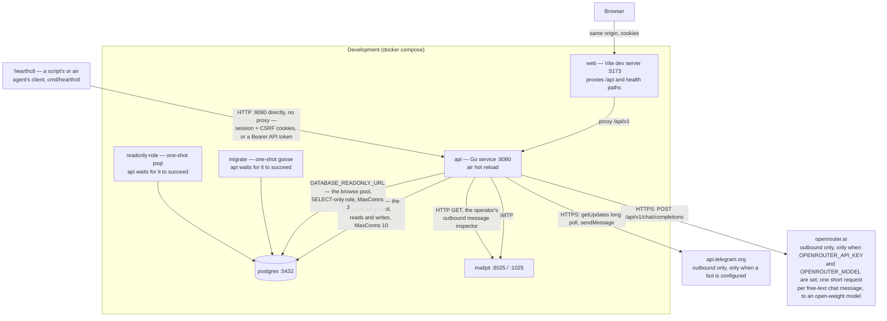

**`api` now both writes to Mailpit and reads from it, over two different
protocols.** `MAILPIT_API_URL` is hardcoded in this file's `api` service,
`http://mailpit:8025`, the same way `SMTP_ADDR` is — Mailpit's address on
the dev network is fixed, not a secret, so there is nothing here for the
Telegram pair's `${VAR:-}` passthrough treatment to protect; hardcoding it
means the inspector works out of the box on every developer's machine
rather than defaulting to "not configured" and inviting someone to go
looking for a bug in the screen that is not there. It reads Mailpit's own
HTTP API through `adapter/mail/mailpit_outbox.go` (`GET /api/v1/messages`
and `GET /api/v1/message/{id}` — never `link-check`, see §3's `MailOutbox`
row) so a platform admin can retrieve a link at `/admin/mail` without
opening the container. In production, by contrast, `MAILPIT_API_URL` is a
value in `.env` rather than something hardcoded here (§1's production
topology diagram, below), so it stays capable of being left unset: unset,
the arrow simply does not fire, `Deps.AdminOutbox` is nil, and the two
routes it backs answer `503`.

**Telegram and OpenRouter are the only arrows here that leave the machine,
and both point outward.** OpenRouter is called only from the Telegram chat
handler — `main.go` builds the parser inside the Telegram branch — so with no
bot configured it is never called. Bot updates arrive by `getUpdates` long-polling *from inside* the
`api` process — there is no webhook, so no new route faces the internet and
nothing has to be re-registered when the hostname changes (which on a free DDNS
hostname is a live possibility). The alternative, `POST /telegram/webhook`,
would have been a public unauthenticated route whose only guard is a shared
secret header, in a codebase whose rule is that a route without its guard has
no second line of defence.

**Six values reach the dev container from `.env`, and they are the only ones
in `docker-compose.yml` that do:** the Telegram pair, the OpenRouter pair and
the digest pair (`NUDGES_AT`, `NUDGES_TIMEZONE`). Every other value for the dev
`api` service is written into the compose file directly; a bot token or an API
key is a credential, so each is passed through as `${TELEGRAM_BOT_TOKEN:-}`
instead, defaulting to empty so a machine with no `.env` still boots with the
feature off. The digest pair is not a secret; it travels the same way because
it means nothing without the bot. Without that
passthrough the Docker path would read a token in `.env` and never see it —
`make dev-local` sources `.env` itself and would have worked, `make dev` would
not, and the only symptom is a `404` and a button that hides itself. In
production the same values arrive through `env_file: [.env]` on the `api`
service, which already carried everything.

**Exactly one process may long-poll.** Telegram hands each update to a single
`getUpdates` caller, so a second `api` replica would silently steal updates and
the symptom would be "Telegram sign-in works about half the time". That is true
on one box today and invisible until it bites, which is why it is written both
here and in `Poller`'s own doc comment, and why §8 carries it as an operational
constraint rather than only as a code comment.

The browser only ever talks to one origin. In development Vite proxies `/api` to
the Go service; in production nginx serves the built bundle and proxies the same
path. There is no CORS configuration anywhere, because there is never a
cross-origin request.

`api` declares `depends_on: migrate` with `service_completed_successfully`, so a
fresh `docker compose up` always applies the schema before `api` starts. That
guarantee has a gap `make up` does not close: Compose only re-evaluates a
`depends_on` condition when it recreates the *depending* service, so a stack
left running across a newly added migration keeps its already-succeeded
`migrate` container and never reruns it — `make up` against an already-running
stack silently misses new migrations. `make dev-local` sidesteps this by
running `make migrate` explicitly before it starts anything; `make up` and a
bare `docker compose up` do not. See `docs/HANDOVER.md`.

**`readonly-role` is provisioning, not schema, and runs the same one-shot
shape as `migrate` for that reason** — a `CREATE ROLE` needs the
`CREATEROLE` attribute, a privilege the role migrations run as need not
hold, so it cannot be a goose migration, and creating a role is not a
change to the shape of the data. It runs `deploy/readonly-role.sql`
against Postgres as `hearth`, after `migrate` completes, creating
`hearth_readonly`: a role that can
`SELECT` every table in `public` (including tables migrated in later, via
`ALTER DEFAULT PRIVILEGES FOR ROLE hearth`) and nothing else, with
`default_transaction_read_only` and a 3-second `statement_timeout` set on
the role itself rather than left to whatever opens a connection. The
timeout is belt and braces — `readonly_pool.go` sets it again as a
connection runtime parameter, so an older box whose role never got the
setting is still bounded. The read-only flag is role-side only. The same file is what the Go
test suite runs against every disposable test container
(`testsupport.StartPostgres`), so both environments provision the identical
role from one script — see `docs/superpowers/specs/2026-09-04-hearth-database-browse-design.md`
decision 5. `api` gets `DATABASE_READONLY_URL` pointed at this role
unconditionally, the same hardcoding reasoning as `MAILPIT_API_URL` above,
and `depends_on: readonly-role` with `service_completed_successfully` next
to its `migrate` dependency — so it carries the same staleness gap noted
above: a stack left running across a newly added `deploy/readonly-role.sql`
change keeps its already-succeeded `readonly-role` container and never
reruns it.

**`api` opens Postgres twice, and the second connection is the whole guard.**
The two `api --> postgres` edges above are two `pgxpool`s in one process:
`DATABASE_URL` as `hearth`, which every repository uses, and
`DATABASE_READONLY_URL` as `hearth_readonly`, which only the operator's
database browse uses. That is not defence in depth added on top of a careful
adapter — it is the reason the adapter is allowed to build SQL at all. The
browse's whole job is a `SELECT` list and a `FROM` clause chosen at call time
from the catalogue, so it is the one hand-written pgx repository in a package
otherwise generated by sqlc (§3), and a mistake in a query built that way is
not hypothetical. Over the read-only pool it is also not *dangerous*: the
role is granted `SELECT` and nothing else, and Postgres refuses the write
before the query planner cares what the string said. **The guard is
Postgres's, not this codebase's** — which is what makes it worth a second
pool rather than a second code path.

Two things enforce that the second pool really is the second role.
`postgres.OpenReadOnly` runs a privilege check in `AfterConnect` — not once
at boot, but on **every** connection the pool ever opens, so it stays true
after a reconnect and after somebody grants the role something at 2 a.m. If
that connection can `INSERT` into `users`, the process refuses to start
rather than serving a "read-only" browse through a writable connection. And
`NewBrowseRepo` takes a `*ReadOnlyDB`, a distinct type from the `*DB` every
other repository holds, so handing it the application pool does not compile.

**`DATABASE_READONLY_URL` is set unconditionally here in development** — the
same hardcoding reasoning as `MAILPIT_API_URL` above: a developer must not
have to configure a feature to discover it exists. In production it is a
value in `.env` and is currently **unset by the product owner's decision**,
so the panel is off there; see the production topology below and
`deploy/PROVISION.md` §10 for turning it on.

**Production differs in three ways that matter:** the `web` container is nginx
serving static files; TLS termination in front is mandatory — cookies are
`Secure` outside development, so without TLS the browser never returns the
session cookie; and the API believes a client address only from a proxy it
was told to trust. `trustedProxyRealIP` reads `X-Real-IP`, and only when the
connecting peer is inside `TRUSTED_PROXY_CIDRS` — production sets the compose
subnet, and unset trusts nobody — while nginx is what sets `X-Real-IP` from
`$remote_addr`, which is what stops a client from spoofing the sign-up
per-IP rate limiter's key (§4). Development has no nginx service and sets no
trusted range, so a client-sent `X-Real-IP` is ignored there and every
browser request shares the Vite proxy container's address: one rate-limit
bucket for the whole dev stack, not a spoofable one; see `docs/HANDOVER.md`.

### The production topology — running since 2026-08-15

**This is a drawing of something that runs.** Hearth is live at
<https://oink.mywire.org> on a Hetzner CX23 in Falkenstein, serving a real
household from a browser-walked install. Nine of the twelve verification
criteria pass; `docs/superpowers/plans/2026-08-10-hearth-production-verification.md`
records each one, including what it was checked against rather than assumed
from.

Two properties of this box were measured on it, not inferred, and both are
worth carrying:

- **A reboot recovers unattended in about 26 seconds**, with the data, the
  signed-in session and the TLS certificate all intact. The certificate
  survives because it lives in the `caddy-data` volume; re-issuing on every
  boot would spend Let's Encrypt's per-hostname budget for nothing.
- **`migrate` does not re-run on reboot, and `api` starts anyway.**
  `depends_on: service_completed_successfully` is honoured by
  `docker compose up`, **not** by the daemon's restart policy. Harmless with
  migrations already applied, and the reason a deploy must go through
  `deploy/deploy.sh` rather than a reboot.

**Backups run nightly, since 2026-08-15.** The `deploy` user's crontab runs
`deploy/backup.sh` at 19:17 UTC (03:17 in Singapore; cron on this box ignores
`CRON_TZ` — `docs/INFRASTRUCTURE.md`): `pg_dump`, gzip, `age`, an `rclone`
upload to Cloudflare R2, and only then a heartbeat ping to healthchecks.io, so a
run that fails anywhere stays silent and the missing ping is the alarm. The
private key is not on the box, so a stolen box yields ciphertext. A real backup
has been pulled back out of R2 and restored — once with the owner's key and
once with the key typed off the escrowed paper copy — and all eleven tables and
every monetary value came back. R2 keeps each dump 90 days, behind a 30-day
bucket lock.

`docs/adr/0002-first-production-host.md` carries why this shape was chosen and
why the region moved to the EU; `deploy/README.md` is the runbook for operating
it.

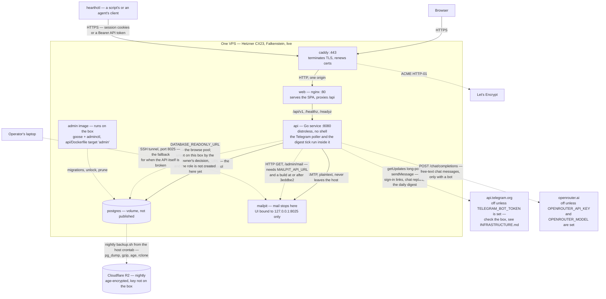

Ten things about this shape are not obvious from the boxes.

**Mail stops at the box, and that is deliberate rather than unfinished.** There
is no relay in this diagram because the install runs on a free DDNS hostname
whose DNS refuses `TXT` records, so DKIM cannot be published and no hosted relay
will verify the domain. Rather than send unauthenticated mail into spam folders
and call it delivered, sign-up links, invites and magic links land in Mailpit and
are read by hand over an SSH tunnel. `docs/adr/0003-mail-stays-on-the-box.md`
carries the full reasoning and the exit condition — the day a third person needs
to receive mail.

Two consequences worth carrying: **that inbox is a complete authentication
bypass**, since every magic link in it grants an account with no password, which
is why 8025 is published as `127.0.0.1:8025` and never `0.0.0.0`; and TLS is
untouched by any of it, because Caddy's ACME challenge is HTTP-01 over port 80
and needs no DNS record at all. The DDNS restriction bites only on mail.

**Caddy exists to renew certificates, not to route.** nginx already does the
routing, and `web/nginx.conf` carries a security control in its header
rewriting that would have to be re-implemented if Caddy served the SPA
directly. Caddy sits in front purely so TLS issuance and renewal are automatic
for as long as the product runs — a certbot cron is the kind of thing that
works for six years and then quietly stops.

**That second proxy would break the per-IP rate limiter, and nginx is now told
about it.** With Caddy in front, the `$remote_addr` nginx sees is *Caddy's*
address on every request, so the `X-Real-IP` it sets would be the same value for
every caller and `trustedProxyRealIP` would key the whole world to one bucket
(§4). `web/nginx.conf` therefore carries `set_real_ip_from 172.28.0.0/16`,
`real_ip_header X-Forwarded-For` and an explicit `real_ip_recursive off`, which
resolve `$remote_addr` back to the real client. Invisible when wrong — the
limiter does not error, it just stops limiting — so it was proven rather than
assumed: two containers on the compose network get two independent budgets,
where before the change the second inherited the first's exhausted one.

The trusted range is the **whole `172.28.0.0/16` compose subnet, not Caddy
alone**, because Docker assigns Caddy's address from that subnet and a `/32`
would need pinning. It is the same string as the `hearth` network's `subnet:` in
`deploy/docker-compose.prod.yml`, and the two must move together. That means any
container on the network can present an `X-Forwarded-For` nginx will believe —
accepted, because such a container can also reach `api:8080` directly, and
the API trusts the same `172.28.0.0/16` for `X-Real-IP` (`TRUSTED_PROXY_CIDRS`
in `deploy/docker-compose.prod.yml`, which must move together with the
subnet and nginx's `set_real_ip_from`), so narrowing only nginx's CIDR would
close one of two equivalent routes. Until 2026-09-13 the API used chi's
`middleware.RealIP`, which believed those headers from any caller at all. What the boundary actually rests on is
that internet traffic reaches nginx only through Caddy, which replaces
`X-Forwarded-For` rather than forwarding a caller's. Putting anything in front
of *Caddy* is a `trusted_proxies` change in `deploy/Caddyfile`, not a CIDR
change here.

**The admin image is a second image, not a shell added to the first.** The prod
API image is `distroless/static-debian12:nonroot` with `ENTRYPOINT
["/app/api"]`: no shell, no `goose`, no `adminctl`, and that stays true. So
`api/Dockerfile` carries a third target, `admin`, on the same distroless base,
holding `/app/goose`, `/app/adminctl` and `/app/migrations`. The production
surface grows by two static binaries rather than by a shell or a Go toolchain.
It reaches the database two ways, both in `deploy/docker-compose.prod.yml`: as
the one-shot `migrate` service that `api` waits on with
`service_completed_successfully`, and as a `profiles: [manual]` `admin` service
never started by `up` and reached with `docker compose run --rm admin …` for
`unlock-household`, `reset-password`, `create-invite` and `prune`. Every one of
those commands is written out in `deploy/README.md`.

The dashes on this node do **not** mean "missing" — `Caddy -.-> LE` and
`PG -.-> Backup` use them too, for occasional rather than request-path traffic.
The `migrate` half has run for real: every migration was applied to the
production database on first boot and again across a deploy, a rollback and a
redeploy on 2026-08-15, and `goose status` has been run through the `admin`
image (§8). The `adminctl` subcommands are still unexercised on the box — but
during a lockout there *is* a recovery path, and it is
`adminctl unlock-household`.

**The Telegram node is drawn dashed because it is off unless configured, and
this file cannot tell you whether the box configures it.** With
`TELEGRAM_BOT_TOKEN` and `TELEGRAM_BOT_USERNAME` both empty, `config.Load`
leaves the feature off, `POST /api/v1/auth/telegram/start` answers `404` and
the poller is never started. What the box's own `deploy/.env` says has changed
at least once, and `docs/INFRASTRUCTURE.md`'s Telegram row records it with its
uncertainty — check the box, not this page. Turning it on is two `.env` values
and `docker compose up -d api` (not `restart`, which keeps the old environment)
on a build that carries the Telegram migrations — no code change, and no
inbound port, because the connection is outbound. It is drawn rather than
omitted because the shape an operator needs to know is that switching it on
puts **a third party on the recovery path**: every sign-in and sign-up link
sent over Telegram is readable by Telegram, exactly as every link in Mailpit is
readable by whoever can reach that inbox. `docs/INFRASTRUCTURE.md` carries that
as a dependency row rather than leaving it as a diagram footnote. **Since
2026-09-08 the same connection carries household data too, not only links:**
`/balance` and `/recent` answer in the chat, and the daily digest sends bill
names and amounts and budget categories with what was spent against them
(`usecase/nudge.go`). Commands are refused to anyone but an owner with Money
([ADR 8](adr/0008-authorisation-at-each-channels-inbound-edge.md)), but what is
sent is readable by Telegram all the same.

**The second `api -.-> Mailpit` arrow is merged as `3eddbe2` (PR #17,
2026-09-04), and reaches the box only once `deploy/deploy.sh` has run with that
SHA or later** — this file does not know whether it has; `IMAGE_TAG` in the
box's `deploy/.env` does. It is the same "capability, check the box for
traffic" shape the Telegram arrow has above. It is the operator's
outbound message inspector: `GET /admin/mail` and `GET /admin/mail/{id}`
read Mailpit's own HTTP API — `/api/v1/messages` and `/api/v1/message/{id}`,
never `/api/v1/message/{id}/link-check`, which issues a real request to
every link it reports on and would spend the very single-use tokens this
screen exists to hand out (§3's `MailOutbox` row). `MAILPIT_API_URL` unset leaves
`Deps.AdminOutbox` nil and both routes answer `503`; set, it needs no new
Compose entry, because `api` already shares this network with `mailpit` and
already depends on it. It does not replace the SSH tunnel above — that stays
the fallback for when the API itself is what is unreachable — it only
removes the tunnel as the *only* way to hand someone their link. Its own
fifteen-criterion browser walk ran 2026-09-04 and passed 15 of 15, finding
and fixing one real defect — the third nav link this feature added pushed
the shared operator header 14px past a 305px viewport on every `/admin/*`
route, fixed with `flex-wrap` on `AdminShell.tsx`'s nav (see
`docs/superpowers/plans/2026-09-04-hearth-outbound-inspector-verification.md`).

**The second `api -.-> postgres` arrow is the operator's database browse, and
it is dashed for a reason no other dashed arrow here has: the code is merged
(`a44b111`, PR #18) and the *decision* is that this box stays without it.** The product owner chose on 2026-09-04 to ship it dark — merge and
deploy with `DATABASE_READONLY_URL` unset — so the deployed panel says it is
not configured and names the variable, and no `hearth_readonly` role exists
on this database. Two consequences worth stating rather than leaving to be
rediscovered. First, turning it on is **not** a deploy: it is
`deploy/PROVISION.md` §10, run on the box, which generates a password, runs
`deploy/readonly-role.sql` and adds one `.env` line. Second, the role is
**cluster-level and outside the migration path**, so `backup.sh` — one
database, `--no-privileges` — captures neither the role nor its grants.
Restoring this box into a working state means running that script again;
it is idempotent, so "after every restore" is the whole rule
(`deploy/README.md`'s Restoring). This is the admin surface's first genuinely
infrastructural dependency, and the reason the browse was always sequenced
last of the four.

**`hearthctl` is a second client through the same front door, not a side
door.** Port 8080 is not published here — unlike development, where the first
diagram in this section shows it calling `api` directly — so in production it
speaks HTTPS to the public origin, and Caddy, nginx's header rewriting and every
guard in §4 apply to it exactly as they do to the browser. That is deliberately
unlike `adminctl`, which runs inside the `admin` image and talks to Postgres
directly. On a headless machine it signs in with a personal API token
([ADR 7](adr/0007-personal-api-tokens.md)): `Authorization: Bearer hearth_…`,
which needs no CSRF header and can never reach `/admin` or mint more tokens.
The repository records its walks against the development stack, not against
this box. §8's Automation client row has the rest.

**Two kinds of scheduled work run on this box, deliberately in two places.**
The backup is the host's crontab (`deploy/crontab.example`): a `pg_dump` of the
whole database that needs nothing from `api`. The daily digest is a goroutine
inside `api`, beside the Telegram poller
([ADR 9](adr/0009-scheduled-work-runs-inside-the-api.md)): it acts on a
member's behalf, and cron would have needed either a direct database path or a
new shared-secret endpoint to do that. It ticks every fifteen minutes and a
claimed row in `nudge_deliveries` decides whether a tick sends anything, so a
restart delays the day's message by at most fifteen minutes and never sends it
twice. It is off unless `NUDGES_AT` and `NUDGES_TIMEZONE` are set, and needs the
Telegram pair — which is why it has no arrow of its own: it leaves through the
Telegram one.

**`openrouter.ai` is the one outbound call that carries what a person typed.**
A plain sentence sent to the bot goes to an open-weight model through
OpenRouter, comes back as a proposed expense or income, is shown to the person,
and is written only when they answer `/yes`. It is off unless
`OPENROUTER_API_KEY` and `OPENROUTER_MODEL` are both set, and `main.go` builds
it only inside the Telegram branch, so with no bot it is never called.
`docs/INFRASTRUCTURE.md` records where the key lived as of 2026-09-08.

---

## 2 · Backend layers

Clean architecture. Dependencies point inward only, and `make lint-arch`
enforces it mechanically — including in test files.

```mermaid
graph TD
    subgraph cmd["cmd/"]
        Main["cmd/api — wiring"]
        Admin["cmd/adminctl — seed, reset-password,<br/>unlock-household, create-invite, prune,<br/>grant/revoke/list-platform-admin, unlock-admin"]
        CLI["cmd/hearthctl — HTTP client only:<br/>login, whoami, list, api, the five<br/>typed inserts, routes. Imports nothing<br/>from internal/"]
    end

    subgraph adapters["internal/adapter/ — implements the ports"]
        HTTP["http — chi router, middleware,<br/>handlers, error table"]
        PGA["postgres — repositories over sqlc,<br/>plus BrowseRepo, the one hand-written<br/>pgx file, over its own read-only pool"]
        Crypto["crypto — argon2id, tokens"]
        MailA["mail — SMTP, and MailOutbox<br/>(reads Mailpit's own HTTP API)"]
        TelegramA["telegram — Bot API client,<br/>getUpdates poller, update parsing,<br/>and Commander: the channel's inbound<br/>guard for chat commands (ADR 8).<br/>Also the daily digest's outbound channel.<br/>Driven AND driving: see below"]
        OpenRouterA["openrouter — IntentParser over<br/>OpenRouter's OpenAI-dialect chat API, plain<br/>net/http, one forced tool call reads a sentence<br/>into an intent. Built only when OPENROUTER_API_KEY<br/>+ _MODEL are set; never writes"]
        IntentShared["intent — the parser's non-wire half:<br/>the prompt, the tool schema, and the<br/>fail-closed reader of its arguments"]
        Clock["clock"]
        FX["fx — static rates"]
    end

    subgraph usecase["internal/usecase/ — services + ports.go"]
        Auth["AuthService"]
        Invite["InviteService"]
        Signup["SignupService"]
        TelegramAuth["TelegramAuthService — delivers the magic-link<br/>and sign-up tokens the other services already<br/>mint; mints no token type of its own"]
        TelegramLink["TelegramLinkService — Start/Status/Confirm/<br/>Unlink: connects an ALREADY-EXISTING account<br/>to a chat from Settings. Writes the binding;<br/>HandleStart above never does (ADR 10)"]
        TelegramCmd["TelegramCommandService — /spend, /income,<br/>/balance, /recent, /nudges: names to ids, amount in the<br/>account's currency, update id as the key.<br/>Takes no actor: the adapter's Commander is the guard (ADR 8)"]
        Nudge["NudgeService — the daily digest (stage 6):<br/>Compose from BillsReader + BudgetReader, RunOnce<br/>claims a nudge_deliveries row before each send.<br/>Rules, no model. Recipients query = ADR 8 outbound"]
        Member["MemberService"]
        House["HouseholdService"]
        Account["AccountService — net worth is<br/>composed here, not stored"]
        Category["CategoryService — seeds the starter<br/>set on first read; create, rename, archive"]
        Transaction["TransactionService — MonthSummary<br/>converts then adds, like Account"]
        Budget["BudgetService — Month, Save, History,<br/>RollOver; RollOver moves a closed<br/>month's Remaining into a goal, once"]
        Goal["GoalService — composes the whole<br/>Goals screen in one List call, one<br/>card in View; a contribution moves<br/>no real money"]
        Bill["BillService — MarkPaid/UndoPayment write<br/>into TransactionRepository through<br/>BillRepository, not TransactionService;<br/>View builds one bill the way List does"]
        Retro["RetroService — Save is the shared-draft<br/>version guard; SetActionDone never<br/>touches it, a second repository entirely"]
        Vision["VisionService — Get resolves linked<br/>measures through GoalProgressReader;<br/>Save replaces the whole document,<br/>version 0 meaning create"]
        AdminSvc["AdminService — IsPlatformAdmin, flags<br/>read/write, RecordAudit; takes no actor<br/>parameter for any permission decision"]
        AdminDirectorySvc["AdminDirectoryService — Overview (metrics + search),<br/>Household (members, invites, lockout);<br/>reads across every household; no writes"]
        AdminReauth["AdminReauthService — Verify, against<br/>its own ledger, never login_attempts"]
        AdminOutbox["AdminOutboxService — List/Message;<br/>the only place domain.ExtractLinks runs,<br/>so HTML never reaches the HTTP layer"]
        AdminBrowse["AdminBrowseService — Tables/Rows;<br/>clamps limit and refuses a negative offset,<br/>then calls the port. Knows no SQL"]
        Seed["Seed"]
    end

    subgraph domain["internal/domain/ — rules, stdlib only"]
        Rules["Money · Currency · Role · Capability<br/>Membership · Space · LockoutPolicy<br/>PlatformAdmin · Flag/FlagSet<br/>ColumnIsRedacted · typed errors"]
    end

    Main --> HTTP
    Main --> PGA
    Main --> Crypto
    Main --> MailA
    Main --> TelegramA
    Admin --> usecase
    HTTP --> usecase
    usecase --> domain
    PGA -.->|implements ports| usecase
    Crypto -.-> usecase
    MailA -.-> usecase
    TelegramA -.->|implements TelegramSender| usecase
    Clock -.-> usecase
    FX -.-> usecase
```

Solid arrows are compile-time dependencies. Dotted arrows are adapters
satisfying an interface declared in `usecase/ports.go` — the dependency still
points inward, which is why every service is testable against in-memory doubles.

**One relationship in this system has no arrow here at all, and the absence is
the point.** `adapter/telegram`'s `Poller` calls
`TelegramAuthService.HandleStart`, but the package never imports `usecase` —
`grep -rn "internal/usecase" api/internal/adapter/telegram/` finds nothing,
test files included. It depends on `StartHandler`, an interface it declares
itself (`poller.go:12`), which `*usecase.TelegramAuthService` satisfies
structurally and which `cmd/api/main.go` alone connects. So there is no
compile-time edge to draw between those two packages, and drawing one would
tell a reader the compiler is already checking that relationship. It is not:
`main.go`'s `var _ telegram.StartHandler = (*usecase.TelegramAuthService)(nil)`
is what does. §3 carries the full reasoning.

**`AdminDirectoryService` is a second admin service rather than four more
methods on `AdminService`, and it is the only thing that reads across
household boundaries in the product's own vocabulary.** (`AdminBrowseService`
below crosses them too, and further — but it reads raw tables through a
different pool and does not know what a household *is*, so it is not a
counterexample to the sentence, it is a different kind of read.)
`AdminService` is "who is a platform admin,
feature flags, the audit log"; describing it *and* cross-household reads would
need the word "and", which `CLAUDE.md` names as the moment to split
(`2026-09-02-hearth-admin-households-design.md`, decision 8). Composing the
same screen from the existing household-scoped ports was the alternative and
was rejected: every one of them answers for exactly one household, so listing
every household would have meant new methods on four ports and an N+1 call per
count. It holds two ports — `AdminDirectoryRepository`, new and read-only, and
`LoginAttemptRepository`, reused unchanged so that "this household is locked
out of sign-in" has one definition rather than the drill-in's own copy of the
rule (§3). Neither is drawn above, because this diagram draws services and
adapters and never ports; §3's table is where every port in this system is
listed. Like every other service here it takes no actor parameter — the
`/admin` guards in §4 are the only gate, and they are the whole reason a
cross-household read is safe to exist at all.

**`AdminOutboxService` is its own service too, following the same reasoning
as `AdminDirectoryService` rather than becoming five more methods on
`AdminService`.** It holds one port, `MailOutbox`, and does exactly two
things: clamps the list's limit (default 50, maximum 200 — its own
constants, not the directory's, because the two limits answer different
questions), and, on `Message` only, calls `domain.ExtractLinks` on the body
`MailOutbox.Message` returned. That second point is where "the HTML part
never leaves the usecase layer" is enforced — `OutboxMessageView`, the type
the HTTP layer receives, has no `HTML` field at all, so adding it back would
be the first step of building the rendered-email view the design spec
rejected. `MailOutbox` and `MailpitOutbox`, its one implementation, are not
drawn above for the same reason `AdminDirectoryRepository` is not: this
diagram draws services and adapters, never ports.

**`AdminBrowseService` is the thinnest service in this diagram, and the
thinness is the design.** It holds one port, `DatabaseBrowser`, and does two
things before delegating: defaults an absent `limit` to 50 and **clamps**
anything above 100 down to 100, and refuses a negative `offset` with
`ErrInvalidOffset`. Clamp and refuse are deliberately different answers to
what look like the same kind of input — asking for 5,000 rows is a
reasonable request with a bounded answer, where `offset=-1` is not a request
at all. It knows no SQL, no table names and no redaction rule: the redaction
predicate is `domain.ColumnIsRedacted(name, dataType, udtName)` (stdlib only,
testable as a table of column names and types), and applying it is the
adapter's job, because the adapter is where it can be applied *inside the
`SELECT` list* so the secret bytes never leave Postgres. **It takes two type
strings because `information_schema.data_type` is not always a type name**:
for an array it reports `ARRAY` and for a domain or an extension type it
reports `USER-DEFINED`, so `bytea[]` — an array of hashes, one of the two
likeliest shapes a future secret takes — would go unredacted by a rule
reading `data_type` alone. `udt_name` carries the real name (`_bytea`), and
both are matched. A *domain* over `bytea` still escapes, because resolving one
needs `pg_type.typbasetype` and this package may not read a catalogue; what
covers that is `browse_repo_test.go`'s schema sweep, which walks `pg_type`
itself and fails the day a migration adds one. The guarantee is written down
that way in the spec's decision 8 and in ADR 5 rather than as an absolute,
because an overstated guarantee is the one that stops being maintained. A service that filtered redacted values in Go
would have had them in this process first, which is the thing the design
refuses (spec decision 7).

**Two rules that shape everything else:**

- No `pgx`, `chi` or other infrastructure type escapes the adapter layer. A
  missing row becomes `domain.ErrNotFound` at that boundary, never `pgx.ErrNoRows`
  further up.
- **No service takes an actor parameter.** Services enforce what is *valid*;
  middleware enforces who is *asking*. Authorisation exists in exactly one place.
- **`adapter/telegram` both serves the usecase layer and drives it, and it does
  the second one without importing it.** Its `Client` is an ordinary *driven*
  adapter — it satisfies `usecase.TelegramSender`, declared in `ports.go`,
  exactly as `adapter/mail` satisfies `Mailer` (the dotted arrow). Its `Poller`
  is a *driving* adapter — an inbound `/start` is an inbound request, it simply
  arrives over a long-poll this process opened itself rather than over a
  listener. **But it drives differently from `adapter/http`, and the difference
  is the thing to understand before touching it.** `adapter/http` imports
  `usecase` and holds concrete services (`router.go`'s `Deps` names
  `*usecase.AuthService` and thirteen others), which is the solid arrow you see
  from `HTTP`. `adapter/telegram` imports nothing from `usecase` at all;
  it declares `StartHandler` locally and lets `main.go` supply something that
  fits. So the driving edge here is **inverted** — the adapter states the shape
  it needs, and the wiring, not the compiler, connects it — which is why there
  is no arrow between those two boxes and why the assertion in `main.go` exists.
  `make lint-arch` passes either way, but for a stronger reason in this case:
  the package has no inward-pointing import to check. Nothing in
  `internal/domain` or `internal/usecase` may ever import this package or any
  Telegram type — that is the boundary the arrows, and the one missing arrow,
  are drawing.
- **Which currencies are selectable is a domain rule, not an HTTP filter.**
  `domain.ParseCurrency` stays permissive — it accepts any active ISO 4217
  code, because the household `PATCH` path has always accepted arbitrary
  active codes and must keep accepting whatever is already stored.
  `domain.SelectableCurrencies`/`ParseSelectableCurrency` add a second, tighter
  gate on top for the one path that is choosing a currency for the first time.
  See §5's self-serve sign-up flow.

---

## 3 · Ports and their adapters

`usecase/ports.go` is the contract between the layers.

| Port | Implemented by | Notes |
|---|---|---|
| `UserRepository` | `adapter/postgres` | Includes the transactional `CreateWithMembership` |
| `HouseholdRepository`, `MembershipRepository`, `SessionRepository`, `MagicLinkRepository`, `LoginAttemptRepository`, `InviteRepository`, `SignupRepository`, `SpaceRepository`, `NotificationRepository` | `adapter/postgres` | Ten narrow repositories rather than one wide one |
| `AccountRepository` | `adapter/postgres` | Eleventh. Accounts joined to the owner's display name (`AccountView`); its `MembershipBelongsToHousehold` is what stops an account being assigned to a member of a different household. `AccountView.Balance` is now a real sum — see §5. `MonthlyMovements` is its newest method: one row per account per calendar month with any transaction, summed in that account's own currency (no FX conversion in SQL, the same division of labour `MonthTotals` already draws for `TransactionRepository`) — the twelve-month trend's only new read, and its filter is deliberately `ListAccounts`'s own balance expression split by month, kept identical on purpose (§5) |
| `CategoryRepository` | `adapter/postgres` | Twelfth. `List` respects `sort_order`, the order the design draws rather than alphabetical; `EnsureSeeded` is idempotent under two concurrent first requests through one `INSERT ... ON CONFLICT DO NOTHING` against `UNIQUE(household_id, name)`, never a read-then-write. Budget grows it with `Create`, `Rename` and `SetArchived` — a category is referenced by transactions and budget lines, so it archives rather than deletes, the same reasoning `accounts.archived_at` already uses for a different table; `sort_order`'s own concurrent-create window is a known, accepted, cosmetic tie (see `docs/LEARNING.md`) |
| `TransactionRepository` | `adapter/postgres` | Thirteenth. Keyset-paged `List` (a cursor is the last row's date and id, not an offset); `Update` never merges a patch — `TransactionService` turns a partial `PATCH` into a complete `domain.Transaction` first; `MonthTotals` returns rows rather than a SQL `SUM`, because a sum is only correct within one currency and the FX conversion lives in the service, not the repository |
| `BudgetRepository` | `adapter/postgres` | Fourteenth. `Get` returns `domain.ErrNotFound` for an unbudgeted month, which the service turns into the empty state, not an error; `Upsert` replaces one household-month wholesale in a single transaction — parent row upserted on `(household_id, month)`, every existing line deleted, every new line inserted, category ownership validated first — never a merge, so a category the caller left out of the payload is unambiguously gone after the call; `History` returns the closed months in range that actually have a budget row, never zero-filled; `RollOverToGoal` writes a `goal_contributions` row **and** stamps `budgets.rolled_over_at`/`rollover_goal_id` in one transaction — the stamp is a conditional `UPDATE ... WHERE rolled_over_at IS NULL`, so a second concurrent call finds no row to update and answers `ErrRolloverAlreadyDone` rather than writing a second contribution (§5) |
| `GoalRepository` | `adapter/postgres` | Fifteenth. `List`/`Get` return each goal's stored fields plus the one figure only SQL can cheaply supply — the summed `contributed` — leaving percent, status and required-monthly to `domain.` arithmetic in the service; `Create` writes the goal and, when a starting balance is given, its opening contribution in one transaction, so a goal with a missing opening contribution cannot exist; `DeleteContribution` clears a rolled-over month's stamp in the same transaction as the delete when the row being removed is that month's rollover (§5). The port's own doc comment carries a warning no other repository needs: `goal_contributions.household_id` has no database-level constraint tying it to its own `goal_id`'s household, so every method that reads or writes a contribution filters by `household_id` **and** `goal_id` together, never by contribution id alone |
| `BillRepository` | `adapter/postgres` | Sixteenth. `List`'s `includeArchived` is the same UNION-not-filter-swap contract as `AccountRepository`/`GoalRepository`. `RecordPayment` writes the expense (`transactions`), the payment (`bill_payments`) and the advanced `next_due` in one transaction — a bill left advanced with no payment, or a payment with no expense, is not a state this port can produce; `UndoPayment` reverses all three the same way, refusing any payment that is not the bill's most recent with `*domain.BillPaymentNotLatestError`. `MonthTotals` cannot come from `bills` alone — a bill already paid this month has `next_due` in the *next* one — so it unions `bill_payments` (by `due_on`) with still-unpaid live bills (by `next_due`); the two halves filter archived bills differently on purpose (§5). `bill_payments.household_id` carries the same unenforced-by-the-database warning as `goal_contributions`: every method filters by `household_id` **and** `bill_id` together, never by payment id alone (§6) |
| `HoldingRepository`, `HoldingEventRepository`, `HoldingValuationRepository` | `adapter/postgres` (all three in `holding_repo.go`) | Seventeenth to nineteenth — three narrow ports over three tables rather than one object with fifteen methods, the same interface-segregation rule the nine before them follow. `HoldingRepository.List`'s `includeArchived` is the UNION-not-filter-swap contract again. **`HoldingEventRepository` is the one worth reading twice.** `ListByHolding` returns events ordered `(occurred_on, created_at, id)` and the port's doc comment calls that a CONTRACT, not a preference: `occurred_on` is a date, so buying and selling the same morning is a tie, and `domain.Holding.Position` sorts *stably* — it keeps whatever order it is handed. On identical same-day events, buy-then-sell realises 750 where sell-then-buy realises 1000, so the repository's ORDER BY is what makes a household's realised gain deterministic. `InsertWithFold`/`DeleteWithFold` exist because reading, folding and writing as three calls is not equivalent to doing them atomically: they take a row lock on the holding, list its events inside the same transaction, and hand them to the caller's fold, writing only if it accepts. The fold stays in the domain; the port owns the transaction and the lock, never the rule (§5) |
| `HoldingIncomeRepository` | `adapter/postgres` (`holding_repo.go`) | Twentieth. The dividends a holding paid and the charges made against it. **It has no ordering contract and no fold-inside-the-write**, and the contrast with `HoldingEventRepository` directly above is the point: income enters no average-cost pool, so no invariant spans two rows, no order changes the answer, and there is nothing for a lock to protect. Addition is commutative; the event fold is not |
| `HoldingCounter` | `adapter/postgres` (`*HoldingRepo` already satisfies it) | Unnumbered, like `AccountLookup`/`GoalProgressReader` — a narrow port for one question asked in the opposite direction. It now answers two: whether an ACCOUNT still holds anything (which stops an account's type changing under its holdings), and whether a HOUSEHOLD does (which stops its primary currency changing under them — every holding event records its cost in the currency the books were kept in at the time, and nothing in the data can restate it). `AccountService` patches an account's `Type` freely, so without this an owner could turn a brokerage into a cash account while it still held 300g of gold, leaving holdings anchored to a type `HoldingService` would never have accepted. One method: does this account still hold anything. `AccountDeps.Holdings` is **required, not optional** — a nil there would silently disable the guard, and a guard you can switch off by forgetting a field is not a guard |
| `AccountLookup`, `CategoryLookup` | `adapter/postgres` (`*AccountRepo` and `*CategoryRepo` already satisfy them) | Narrower ports `TransactionService` depends on instead of the full repositories above — interface segregation: it needs an account's currency and household, and whether a category id belongs to this household and what kind it is, never `List` or `EnsureSeeded`. `BillService.MarkPaid` depends on this same `AccountLookup`, for the same reason and to the same effect: the pay-from account's currency, not a value Bills stores of its own (§5). `BillService.Create`/`Update` depend on the same `CategoryLookup` too: a bill's category is copied onto the real expense `MarkPaid` writes, so it has to satisfy the ledger's own rule — this household's, and an expense category — or the spend lands in Budget's `Spent` and in no category row at all |
| `RetroRepository` | `adapter/postgres` | Seventeenth. `Create` answers `ErrAlreadyExists` on the `UNIQUE(household_id, month)` clash; `Update` takes the caller-normalised month and version it loaded, and tells "the retro is gone" (`ErrNotFound`, from a recheck read) from "someone saved first" (`ErrRetroChanged`, from a zero-row `UPDATE ... WHERE version = $n`) apart — never merges (§5); `Complete` is idempotent on the caller's own `at`; `DeleteDraft` puts `WHERE completed_at IS NULL` in the SQL itself, not a service `if`, so a zero-row match on a finished retro is `ErrNotFound`, not a silent no-op (`docs/LEARNING.md`'s Bills `SetBillNextDue` entry is the same defect shape this port was built to avoid) |
| `RetroActionRepository` | `adapter/postgres` | Eighteenth. `Add` writes the action and its assignees in one transaction, so a bad assignee id leaves no orphan action; `carriedFrom` is validated through a join back to `retros` requiring the same household before it is trusted, and a malformed id is refused rather than silently read as SQL NULL (`docs/LEARNING.md`) — "fail closed on values you did not construct" applied to a field the client supplies directly. `OpenInMonth` backs both the modal's "Still open from July" offer and Overview's `openActionCount` |
| `VisionRepository` | `adapter/postgres` | Nineteenth. `Get` returns `domain.ErrNotFound` for a year never set, which `VisionService` turns into the empty vision the screen renders (decision 9) — the repository never invents a row. `Save` replaces the whole document — parent upserted, every child deleted and reinserted — in one transaction, under the same two-shape version guard `RetroRepository.Update` established: `version == 0` is a create, refused with `domain.ErrVisionChanged` if a row has appeared since the caller read the empty vision; `version > 0` is an update, `WHERE version = $n`, with a zero-row result re-read to tell "the vision is gone" apart from "someone saved first." The existence check runs on the transaction's own connection, never the pool-backed `Get` — calling `Get` from inside `Save`'s own `pgx.BeginFunc` would hold one pool connection while asking the pool for a second, which starves it under concurrent saves (`docs/LEARNING.md`). A measure naming a goal outside this household is refused inside the same transaction with `domain.ErrVisionGoalUnknown` — the `vision_measures` foreign key alone only proves the goal exists *somewhere* |
| `GoalProgressReader` | `adapter/postgres` (`*GoalRepo` already satisfies it) | Unnumbered, like `AccountLookup`/`CategoryLookup` above — a narrow port, not a repository. One method wide on purpose, the same interface-segregation reasoning as those two, for a caller in the opposite direction: `VisionService` needs one thing from Goals, the progress of a handful of goal ids, not the forty-line `GoalRepository` contract. `ProgressByIDs` returns an entry only for an id that exists in the caller's own household; a missing id is a miss, not an error — a measure whose goal was deleted renders as a label with no figure (spec decision 8), not a failed page. Counts an *archived* goal as found, deliberately: archiving is not deletion anywhere else in this product, so a measure linked to an archived goal keeps its figure |
| `GoalLookup` | `adapter/postgres` (`*GoalRepo` already satisfies it) | Unnumbered, the same narrow-port shape as `GoalProgressReader` directly above. One method, `Get`, and `BudgetDeps.Goals` is typed as this rather than the whole `GoalRepository` (2026-09-13): `BudgetService.RollOver` reads the target goal before `BudgetRepository.RollOverToGoal` writes, and that is the only thing Budget ever asks Goals. Held as the full nine-method repository, the budget service could create goals or delete contributions with nothing in the type system saying it should not |
| `TelegramLinkRepository` | `adapter/postgres` | Twentieth. Stores the pending deep-link nonces, hashed, that carry either a browser's sign-in request or a signed-in member's link request across to Telegram — the same table, told apart by `user_id` (§6). `Create(ctx, userID, nonceHash, expiresAt) (id, error)` **now returns the new row's id** — a port signature change, landed with the linking feature — because `TelegramLinkService.Start` hands that id straight back to the browser to poll `Status` with; the plain sign-in nonce (`TelegramAuthService.StartLink`) still calls `Create` with `userID ""` and simply discards the id, since a sign-in nonce is never polled by row id at all. `Consume` stamps `consumed_at` **and** records the redeeming `chat_id` **and now `chat_username`** in one statement, because the chat is unknown when the nonce is minted — the browser has not met Telegram yet — so redemption is the only moment they can be joined, and a redemption that failed to record its chat would be a rate limit that silently never fires; it returns a `TelegramLinkRedemption{ID, UserID}`, not the row itself, because `HandleStart`'s branch (link vs sign-in/sign-up) is exactly that pair. Absent, expired or already consumed all return `domain.ErrNotFound` from one guarded `UPDATE`, the same shape `MagicLinkRepository.Consume` uses. `ByID` reads one row back for the browser that minted it — deliberately with no ownership check of its own, so a caller that skipped the `row.UserID == session user` comparison is a bug in the caller, not a silently-safe repository (ADR 8: authorisation is not this layer's job). `CountLinksSince` (per chat, unchanged) still lives here rather than on `TelegramAccountRepository`, because the per-chat limit has to bind chats that have no account yet — a stranger repeating `/start` has no user row to count against. `CountMintsSince` is new and per **user**: it bounds how many link nonces one signed-in member can mint in an hour (decision 12, three), a table-growth control rather than a security one, since the session minting is already authenticated |
| `TelegramAccountRepository` | `adapter/postgres` | Twenty-first. `ByChatID` resolves a chat to the user it is bound to, or `domain.ErrNotFound` — which is the entire branch key of the Telegram sign-in flow: found means "send a sign-in link", not found means "send a sign-up link" (§5). The binding is now written from **two** call sites, and this repository's own doc comment was rewritten to say so rather than to explain why `Create` did not exist: inside `SignupRepository.Provision`'s existing transaction, when a stranger creates a household from a chat, and by `Create(ctx, TelegramBinding) error`, called by `TelegramLinkService.Confirm` when a member who already has an account connects their chat from Settings. `Create` answers `domain.ErrAlreadyExists` for either `UNIQUE` — one chat per user, one user per chat — without distinguishing which: the caller already knows which side it was asking about (a fresh sign-up binds a chat that must be free; `Confirm` binds a user who must have no chat yet) and picks the sentence, rather than the repository guessing at intent. `ByUserID` reads a user's own binding back, `TelegramBinding{UserID, ChatID, ChatUsername, LinkedAt}`, and `Delete` removes it, idempotently — removing a binding that is not there is not an error, because the caller's goal ("this user has no chat") is already true. Both directions of the binding stay `UNIQUE` in the database, and that constraint, not any check in Go, is what makes a sign-in — and now a confirm — unambiguous |
| `PlatformAdminRepository` | `adapter/postgres` | Twenty-second. `Get`/`Grant`/`Revoke`/`List` over `platform_admins`. `Grant` has exactly one call site in the whole repository outside test code — `adminctl`'s `runGrantPlatformAdmin` — which is the property [ADR 5](adr/0005-platform-admin-authorization.md) exists to keep true; there is no `AdminService` method that calls it, on purpose, since granting is not a decision the running service ever makes |
| `NudgeRepository` | `adapter/postgres` | The daily digest's at-most-once ledger and opt-out ([ADR 9](adr/0009-scheduled-work-runs-inside-the-api.md)). `Recipients` is the authorisation for the outbound direction: `telegram_accounts ⋈ memberships` keeping only owners with Money whose chat has not said `/nudges off` — a postgres test plants each excluded shape. `Claim` is `INSERT … ON CONFLICT DO NOTHING` on `(chat_id, household_id, day)`, insert-first like the transaction idempotency key; `Release` deletes it after a failed send; `Prune` keeps a month. `BillsReader` and `BudgetReader` are the two narrow reads `NudgeService` declares, satisfied by the bill and budget services |
| `APITokenRepository` | `adapter/postgres` | Personal API tokens ([ADR 7](adr/0007-personal-api-tokens.md)): `Create` stores only the SHA-256 and an 8-character prefix; `ByTokenHash` is the live lookup (revoked or expired is `ErrNotFound`, like `GetLiveSession`); `Revoke` is user-scoped so a guessed id from another member is a miss; `RevokeAllForUser` sits beside `SessionRepository.RevokeAllForUser` in `MemberService.revokeCredentials`; `Touch` is throttled by the caller to one write an hour |
| `IntentParser` | `adapter/openrouter` | The Telegram bot's free-text reader (stage 5b of the chat-commands spec): an open-weight model through OpenRouter's OpenAI-dialect API over plain `net/http`, up to three model ids tried in order. One implementation and one caller, which is normally the wrong shape for a port — it is one anyway because the implementation is a third-party API behind a key, and the product must behave identically without it: `nil` means "commands only". (A Claude adapter was its second implementation for one day, 2026-09-08, and was removed when the owner chose free models; git has it.) The prompt, the `log_transaction` schema, and the reader that turns the model's arguments into an `Intent` and fails closed on any kind it did not name live in `adapter/intent`, apart from the HTTP, because the reader is the last line between a model's output and the ledger and earns its own tests. The port returns text fields, never ids, so what the person confirms is what they can read. The Commander caps every call at 30 s, because the poller handles one update at a time and a stalled provider would hold every chat |
| `FeatureFlagRepository` | `adapter/postgres` | Twenty-third. `OverridesFor` is the one query `requireSession` runs on every authenticated request — both the global and the household layer in a single `UNION ALL` statement, never two round trips. `key` carries no foreign key to a registry table, because the registry (`domain.AllFlags`) is compile-time; a row can outlive the `const` that named it, and `SetHousehold`/`ClearHousehold` are two different operations on purpose — setting a household's override to `false` and removing the override row entirely are different states downstream, not the same write with a different value |
| `AdminAuditRepository` | `adapter/postgres` | Twenty-fourth, append-only by convention rather than by any database privilege, and **write-only**: `Record` is its one method, there is no `Delete`, and `adminctl prune` does not touch `admin_audit_log`. It had a `Recent` read and `AdminService.RecentAudit` over it for the audit screen; when that screen was descoped (2026-09-02, `docs/FEATURE_TRACKER.md`) the read stayed behind with no production caller, and it was deleted on 2026-09-13. The log is read through `psql`, or through the read-only database browse (§4), which audits its own reads. Tests that need to see what `Record` wrote query the table directly |
| `AdminReauthAttemptRepository` | `adapter/postgres` | Twenty-fifth, and the reason a fifth login-adjacent table exists at all rather than reusing `LoginAttemptRepository`: `FailuresSince`, `Record` and `ClearFailures` run against `admin_reauth_attempts`, keyed on `user_id`, never `household_id` — see §6 and [ADR 5](adr/0005-platform-admin-authorization.md) for the blast-radius reasoning `login_attempts`' own household scoping would have carried over silently if this port had wrapped that table instead of adding its own |
| `AdminDirectoryRepository` | `adapter/postgres` | Twenty-sixth. `Metrics`/`SearchHouseholds`/`Household`, read-only, and the one port that reads across household boundaries *in the product's own vocabulary* — every other repository in this table answers for a single household, which is why composing this screen out of them would have meant new methods on four ports and an N+1 call per counter. (`DatabaseBrowser` below crosses them too, but it reads whatever table it is asked for and has no concept of a household at all, so it is a different kind of read rather than a second directory.) Its SQL file is the only place `COALESCE(last_seen_at, created_at)` appears, so "when was this session last used" has exactly one definition (§6); `SearchHouseholds` reaches its matching member through a `LEFT JOIN` onto `users` itself rather than onto the lateral subquery, because sqlc types a column selected through a derived table as non-nullable and the scan then fails at runtime on the first household with no member match (`docs/LEARNING.md`) |
| `TelegramSender` | `adapter/telegram` | The Telegram twin of `Mailer`, and justified the same way: the usecase layer must not hold an HTTP client, and `TelegramAuthService` must be testable against a double. One method, `SendMessage(ctx, chatID, text)` — plain text, no template system, exactly as the mailer has none |
| `PasswordHasher`, `TokenGenerator` | `adapter/crypto` | argon2id with cost from config; tokens are random, stored hashed |
| `Mailer` | `adapter/mail` | SMTP; TLS policy and credentials from config. An unrecognised `SMTP_TLS_MODE` maps to mandatory TLS, never to plaintext: `config.Load` refuses a bad value first, so this is the second line, and a second line that fails open would silently turn encryption off the day the first one is loosened (2026-09-13) |
| `MailOutbox` | `adapter/mail` (`MailpitOutbox`, its only implementation) | Reads what `Mailer` sent, rather than what it is about to — the operator's outbound message inspector, added 2026-09-04. `Recent(ctx, limit) (OutboxPage, error)` and `Message(ctx, id) (OutboxMessage, error)` hand back the body exactly as Mailpit holds it, unprocessed: extraction is `AdminOutboxService`'s job (§2), not the adapter's, so "which strings are links" stays testable without an HTTP server. Two Mailpit endpoints only, `GET /api/v1/messages` and `GET /api/v1/message/{id}` — a test asserts no third path is ever requested, because `GET /api/v1/message/{id}/link-check` looks like the obvious third and is not: it issues a real HTTP request to every URL it finds, and every URL in a Hearth email is a live single-use token. `Message` reports `domain.ErrNotFound` for an id Mailpit's own store no longer holds (it keeps no volume, so a restart empties it) and both methods report `usecase.ErrOutboxUnavailable` — a distinct error, because an operator needs different advice for "no such message" than for "Mailpit is down" — when the upstream cannot be reached, times out, or answers a body the adapter cannot map (a message with no recipient, since every Hearth template addresses exactly one). A 5-second timeout and no retries, the same reasoning `TokenGenerator`'s neighbours use for a same-host dependency: a slow answer means something is wrong, not far away |
| `DatabaseBrowser` | `adapter/postgres` — **two** implementations: `BrowseRepo` (live) and `UnavailableBrowse` (a stand-in) | The operator's read-only database browse, added 2026-09-04. `Tables(ctx)` and `Rows(ctx, table, limit, offset)`. Every **cell** comes back already rendered as text — no driver type, no `any`, nothing a caller could write through; the counts beside them (`TableInfo.RowCount`, `RowPage.Total`/`Limit`/`Offset`) are plain `int64`/`int`, because a number the screen formats is not data read out of a household's row. That is not only the clean-architecture rule: it is what lets the implementation render a redacted column as a literal *inside its own `SELECT` list*, so the secret bytes never leave Postgres (spec decision 7). The contract is three clauses and all three are load-bearing: `domain.ErrNotFound` for a table this role cannot see — whether it does not exist or the role has no privilege on it, which is one answer on purpose, since the role's privileges are the guard and probing them would be the leak; `usecase.ErrBrowseUnavailable` for a failure of the *connection* rather than of the request; and never write, never be reachable through a connection that could. `BrowseRepo` is the one hand-written pgx repository in a package otherwise generated by sqlc, because sqlc turns *fixed* SQL into typed Go and this repository's whole job is a `SELECT` list and a `FROM` clause chosen at call time from `information_schema`. Its constructor takes a `*ReadOnlyDB` and nothing else, so it cannot be built over the application pool; every table name is matched against the catalogue first and quoted with `pgx.Identifier` second, never concatenated from a request, and **schema-qualified** as `public.<table>` — the lookup pins `table_schema = 'public'`, so a read that resolved through `search_path` instead could name a different relation from the one just validated, and the symptom would be an `ORDER BY` on a column that relation does not have; `ColumnInfo.DataType` is a name for a human to read rather than a catalogue value to branch on (`citext`, `text[]`, not `USER-DEFINED` and `ARRAY` — see `displayType`), while redaction is decided separately on the raw `data_type` **and** `udt_name`; and paging is `ORDER BY` the primary key, falling back to `ctid` — `OFFSET` without `ORDER BY` silently repeats and skips rows the moment anything writes between two pages (spec decision 10). **`UnavailableBrowse` is the second implementation and exists so that two different failures stay two different answers**: `DATABASE_READONLY_URL` unset leaves `Deps.AdminBrowse` nil and answers `DB_BROWSE_NOT_CONFIGURED`, while a variable that *is* set over a pool that could not be opened is wired with this stand-in and answers `DB_BROWSE_UNAVAILABLE`, carrying the boot failure so the log can say why. Without it an operator restoring onto a fresh box would be told to set a variable already in their `.env` (§4, and `cmd/api/main.go`'s `openBrowse`). It is Liskov-honest rather than a stub: `ErrBrowseUnavailable` is the port's own contract for "the store is there, I could not reach it", so no caller special-cases it |
| `AgreementRepository` | `adapter/postgres` — one implementation across **two files**, `agreement_repo.go` (the pool-backed reads and the section writes) and `agreement_write_repo.go` (the two transactional writes) | **Twenty-seventh.** `Document` composes the whole screen in four list queries — sections, live agreements, open proposals, accepted proposals — and never a per-proposal round trip; the version, the `01..N` numbering and the awaiting lists are all derived above it, in `AgreementService`, from those four slices. Two methods run transactions and both do so because they write more than one row: `CreateProposal` writes the proposal **and** the proposer's own implicit signature (decision 5) — a proposal without it is one nobody has agreed to, including its author — and `Sign` reads the proposal's status, locks the *target agreement* row (decision 12, not the proposal: locking the proposal serialises two signatures on that proposal and nothing else, so an edit and a remove aimed at the same agreement would both pass their checks and both land), upserts the signature, applies the change when the signature completes the live owner set, and stamps the status, all on the transaction's own connection. Reaching back to the pool from inside either would ask for a second connection while holding the first — the defect `VisionRepository.Save` already carries a note about. A target that has moved since the proposal was written answers `domain.ErrAgreementChanged` and writes nothing; the section unique key is mapped by constraint name to `domain.ErrAgreementSectionNameTaken`, because a generic `ErrAlreadyExists` leaves the screen unable to say which collision happened |
| `Clock` | `adapter/clock` | So lockout windows and expiry are deterministic in tests |
| `FXRateProvider` | `adapter/fx` | Static table today (SGD↔IDR only); a live provider drops in behind it. `AccountService` is its second caller, converting each account into the household's primary currency before summing (§5) |

**`telegram.StartHandler` is the one interface in this system declared outside
`usecase/ports.go`, and it points the other way.** Every port in the table above
is declared by `usecase` and implemented by an adapter. `StartHandler` —
`HandleStart(ctx, chatID int64, payload, username string) error` — is declared by the
*adapter*, in `poller.go`, and satisfied by `*usecase.TelegramAuthService`. That
is a legal direction for a **driving** adapter, and `adapter/http` is the other
one: it drives by *importing* `usecase` and holding concrete services, where
this package drives without importing `usecase` at all (§2's missing arrow).
Either shape would have been allowed; this one keeps the adapter's own tests
free of the usecase package — `poller_test.go`'s `handlerSpy` satisfies
`StartHandler` with a `sync.Mutex` and a slice, and that file imports nothing
from `usecase` either. The cost is that no compiler check ties the two
signatures together at the point either is written, so `cmd/api/main.go`
carries `var _ telegram.StartHandler = (*usecase.TelegramAuthService)(nil)` —
the one file where both packages are already visible — so a signature drifting
on either side fails the build naming the interface.

**`SignupRepository` gained one method and widened two behaviours**, rather than
a Telegram-specific repository being added beside it. `CreateForTelegram` writes
a signup row whose channel is a chat rather than an address; it and `Create` are
mutually exclusive per row, enforced by the `signups_have_exactly_one_channel`
database constraint (§6). `ByTokenHash` now returns `TelegramChatID *int64`
beside `Email`, and `Provision` binds the chat as a **fifth statement inside the
transaction it already ran** (§5). The chat id is read from the signup row that
transaction is claiming, never taken as a parameter — the same rule that
paragraph already stated for the email address, and here it is the whole point
of the feature: a caller-substitutable chat id would let someone bind a
household to a chat they control rather than the one that actually completed the
sign-up.

**`SessionRepository` gained `GrantAdmin`, and later `Touch`,** rather than a
second table joined to `sessions` by its token hash. `GrantAdmin`'s own doc
comment states the one thing a future editor must not do: "it writes one
column: session extension and this must not overwrite each other." All three
statements are single-column `UPDATE`s on purpose — `Extend` touches
`expires_at` only, `GrantAdmin` touches `admin_grant_expires_at` only, and
`Touch` touches `last_seen_at` only — so widening any of them into a
whole-row `UPDATE` would silently reset the others the next time a session
extends, an admin re-authenticates, or any authenticated request arrives.
`Touch` is the newest and the most frequently called of the three, which is
what makes the rule worth restating rather than assuming: it runs on ordinary
traffic, not on a rare admin action, so a widened `UPDATE` there would clear
grants and expiries continuously. A nil expiry *clears* the grant rather than
being a distinct "revoke" call, the same
nullable-means-unset shape `accounts.owner_membership_id` already uses (§6).

`BankSyncProvider` is specified but has no consumer yet. Accounts, the first
feature built against this port table, shipped manual entry only and needed no
port for it — a port with one implementation and no second caller is the wrong
shape. It arrives when CSV import gives it a second implementation to
abstract over, not automatically "with the Money slice". Automatic sync via
SGFinDex is not available to an app like this.

`LoginAttemptRepository`, `SignupRepository` and `TelegramLinkRepository` all
carry a `Prune(ctx, before)` method, because all three back the three tables a
stranger can grow without ever holding an account (§6 explains why).
`telegram_link_requests` is the third — the nonce table: a link nobody ever
redeemed has no `chat_id`, so nothing else bounds how many a stranger can
mint. `adminctl prune` is their only caller, and refuses an `--older-than`
under seven days so it can never reach inside `domain.LockoutPolicy.Window`
and clear a lockout that is still live.

---

## 4 · Request pipeline

Every `/api/v1` request passes through the same chain. The order is the security
model.

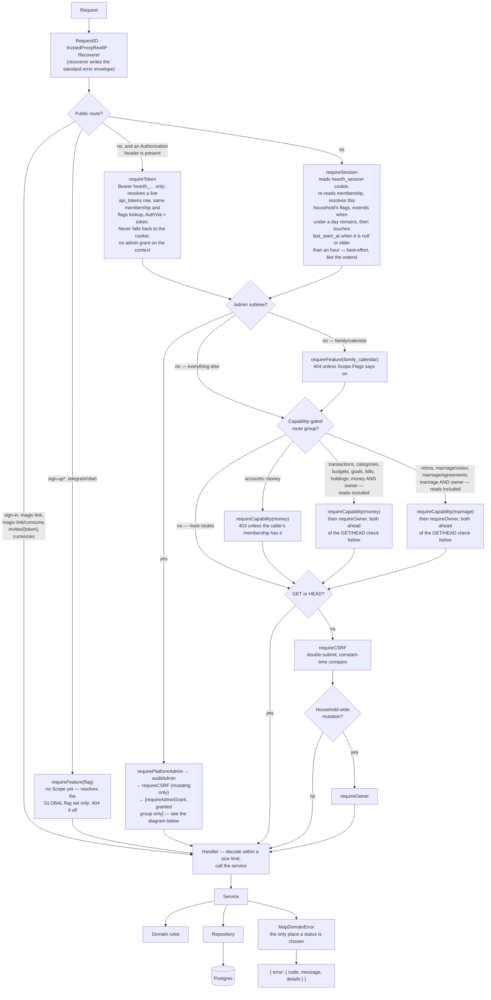

**The membership is re-read on every request**, never cached in the session row.
A capability change therefore takes effect on the caller's very next request;
session revocation is belt-and-braces rather than the enforcement mechanism.

**`requireSession` also stamps `sessions.last_seen_at`, but at most once an
hour per session** (`sessionTouchInterval`), and only when the column is null
or already that stale. It is the last write in the chain and it is
**best-effort in exactly the way the extend above is**: a failed `UPDATE` is
logged and the request continues, because a usage timestamp that could not be
written must never turn an already-authenticated request into a 401. The
throttle is what makes the column affordable — without it every authenticated
request would carry a write. It exists for one reader, the operator's "active
in the last 7 days" tile (`2026-09-02-hearth-admin-households-design.md`,
decision 3), and it is a *use* timestamp rather than a sign-in one on purpose:
sessions live 30 days and are extended in place, so `sessions.created_at`
reads a daily user on a phone as gone for a month.

**A request that carries an `Authorization` header never reaches the cookie
branch.** `requireSession` hands it to `requireToken`, which resolves
`Bearer hearth_…` to a live `api_tokens` row, makes the same membership and
flags lookups, and builds a Scope with `AuthVia = token`; a bad token beside
a good cookie is still a 401, because a caller who sent a token meant to use
it ([ADR 7](adr/0007-personal-api-tokens.md)). `requireCSRF` then skips only
for that Scope, and `requireCookieSession` refuses it on the two routes that
mint and revoke tokens.

**`requireSession` also resolves this household's feature flags on every
authenticated request, uncached**, in the same breath as the membership
re-read above — one extra indexed query
(`feature_flags UNION ALL household_feature_flags WHERE household_id = $1`),
never a cache, because one box and a handful of households make a stale flag
after an admin toggle a worse defect than the query. The result sits on
`Scope.Flags` beside `Membership`; a failure to resolve it answers `500`
through `logAndWriteInternal`, deliberately not `MapDomainError` — routing it
through the domain-error table would let a wrapped `ErrNotFound` someday turn
a database outage into the same clean `404` a disabled flag answers, telling
every caller the whole product had been switched off rather than reporting a
fault.

**`requireFeature` answers `404`, never `403`, and runs in two different
places for two different reasons.** On the public routes above it — the ones
with no session yet — it resolves the **global** flag set only: a household's
own override is meaningless before a household is known, and treating it as
"on" by accident would be the failure mode a fallback like this exists to
avoid. That fallback is precisely why enforcement is one middleware rather
than a middleware plus a helper public handlers remember to call themselves —
a hand-rolled check as a handler's first line is the shape that gets forgotten
on the next public route, and forgetting it fails **open**. Once a session
exists, `requireFeature` instead reads the household-resolved `Scope.Flags`
`requireSession` already built, which is why `family/calendar` (the flag's
only consumer today, dark by default) needs no second database round trip of
its own.

### The `/admin` subtree

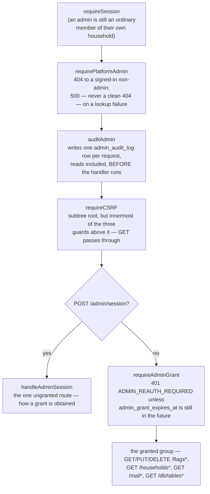

Two orderings here are deliberate enough to need writing down, because both
read as "obviously the other way round" until the failure mode each one
prevents is named.

**`requireCSRF` sits at the subtree root — covering every route added here,
today or later — but innermost of the three guards ahead of it, not
outermost.** Rooting it there rather than wrapping only `POST /admin/session`
means a mutating route added to the granted group next year is CSRF-checked
by construction, with no test able to forget it; nesting it around one route
today would leave tomorrow's route with no guard and nothing to notice.
Innermost, rather than ahead of `requirePlatformAdmin` and `auditAdmin`, is
what makes a CSRF-rejected request still leave its audit row — a forgery
aimed at a real platform admin is exactly the event `admin_audit_log` exists
to make visible, and a CSRF check placed in front of the audit write would
refuse such a request without a trace of it ever existing.

**`auditAdmin` writes its row before the handler runs**, proven by a
panicking test double whose panic unwinds past the middleware to `recoverer`
— a row that only appeared *after* a successful response would prove nothing
about a handler that panics or times out, which is the case an audit log
exists to catch. The row's `Target` is the request's full path, `r.URL.Path`,
never chi's per-route `{key}`/`{householdID}` parameters: `chi`'s
`FindRoute` — the thing that would populate them — runs inside `routeHTTP`,
after every subtree middleware including this one, so they are simply not
yet available at the point this write happens. The path itself already
contains every value those parameters would have held, so nothing is lost.
**`Detail` now carries one thing the path does not: the request's raw query
string, as `detail.query`, whenever there is one.** `r.URL.RawQuery` *is*
available this early — it is parsed from the request line, not from a route
match — and the households search is the reason it is recorded: "the operator
searched for `christine@`" is a fact the log should hold, and a search that
answers with a customer's household while the audit row says only
`GET /api/v1/admin/households` is an incomplete record of what was looked at.
It is written in the middleware, so it applies to every admin route rather
than to the one that prompted it; `Detail` stays an empty object on a request
with no query string.

**The outbound message inspector's audit row is the same shape, with one
consequence worth spelling out because it is easy to miss.**
`/admin/mail/{messageID}`'s id is part of the path, so `Target` names the
exact message that was opened — but the row never carries who received it.
`auditAdmin` cannot look the recipient up: it writes before chi has matched
the route, so nothing about what `{messageID}` *means* is known yet, only
the raw path string it sits inside. Recovering the recipient costs opening
the same message again, for as long as Mailpit still holds it — accepted,
because the alternative is either a second audit row per view (double-
counting the one action this log exists to make countable) or a new
handler-to-middleware channel built to carry a single fact that is one click
away.

**The database browse needed no audit change at all, and that is worth
saying because the design nearly specified one.** Its two routes want the
table name and the offset recorded. The table name is a path segment and the
offset is a query parameter, so `Target` (`r.URL.Path`) and `detail.query`
(`r.URL.RawQuery`) already carry both — the middleware written for the
households search covers the browse for free. So the surface that can read
every household's finances leaves one row per page turn, written before the
handler runs, and not one line of that was added by this feature. It is also
why paging lives in the URL rather than in component state: the URL *is* the
audit record.

**The accepted limit, named rather than left for someone to rediscover:** an
unauthenticated caller gets `401`, not `404`, on `/api/v1/admin/*`, because
`requireSession` necessarily runs before `requirePlatformAdmin` can look
anything up — `TestEveryProtectedRouteRejectsAnUnauthenticatedCaller` requires
exactly that 401 of every protected route in this codebase. So a stranger
with no credentials at all can already tell the admin subtree apart from a
genuinely unrouted path, by status code alone. This is accepted, not
overlooked: `GET /auth/me` carries `isPlatformAdmin` for every caller (§7), so
the surface's *existence* was never the secret — what the 404-to-a-signed-in-
non-admin guard buys is narrower and still real, that a household member
poking at the API from inside a live session learns nothing. See
[ADR 5](adr/0005-platform-admin-authorization.md) for the full reasoning,
including the walk finding that a *locked* admin surface is discoverable only
by submitting the re-auth form, which itself counts as another failure.

**Accounts are the first routes `requireCapability` ever gates.** The
middleware existed since slice 1 with no route using it, which made the
promise that the server enforces capabilities independently of the UI
vacuous. It sits before the `GET`/`HEAD` check because reads need it too — a
member without the `money` capability is refused `GET /api/v1/accounts` just
as firmly as a write. On the four accounts write routes it is stacked ahead of
`requireOwner`: today that is redundant, because
`domain.ValidateMembershipChange` refuses an owner who does not hold every
capability, so "an owner without `money`" is not a representable state — but
the alternative is for these routes to lean on an invariant enforced in a
different layer for a different reason, and if that invariant is ever relaxed
every route depending on it would open silently. One extra middleware call is
the cheaper price. (This is unrelated to the frontend's own `RequireCapability`
component, §7 — a presentation guard that, at the time accounts shipped,
already existed for the `/money` and `/marriage` placeholders; this is the
first time the *server* enforces one. `/marriage`'s route was deleted in
`110ab0a` and came back in task 10 as `/marriage/retros`, so
`RequireCapability` today guards both `/money`'s subtree and
`/marriage/retros`, and the server-side gate below is the enforcement either
way regardless of which routes the frontend happens to offer.)

**Transactions, categories, budgets, goals, bills, holdings and retros are the routes
where `requireOwner` gates a `GET`.** Every other owner-gated route in this
table only reaches `requireOwner` after the `CSRF` check, which by
construction means never on a read. These groups instead run
`requireCapability` (`money` for the first five, `marriage` for retros) then
`requireOwner` before the GET/HEAD branch even exists, so a limited member is
refused the ledger — and the budget, goals, bills and retros screens —
themselves, not merely their writes. `requireOwner` on retros is redundant
today, the identical reasoning the money group's own paragraph above gives:
`domain.ErrLimitedCannotHoldMarriage` already refuses a limited member the
`marriage` capability one layer down, so "a limited member holding it anyway"
is not a representable state — but the route does not lean on that alone,
for the same reason accounts' four write routes don't lean on
`ValidateMembershipChange` alone. This is deliberate, not copied from
accounts by mistake: a limited member's accounts view already renders names
with every amount blank (§5); applied to a ledger, a budget screen, a goal
card, a bill row or a retro, that is nothing but figures or private
conversation — a table whose every figure would be blank, next to a "Spent
this month" that has to be absent rather than shown as zero, a page of caps
and pace with nothing left to show, a card
whose whole point is a progress ring and a dollar figure, or a due date with
an amount beside it — the page would read as broken rather than merely
restricted. So for a limited member the `money` capability on Transactions,
Budget, Goals and Bills means only "see which accounts this household has"
(via `/accounts`), and nothing about the ledger, the budget, a goal or a bill
at all. Budget's spec named this explicitly as the Transactions shape reused
for the same reason (decision 8); Goals' own spec (decision 10) reused it a
third time, and Bills a fourth, rather than any of them inventing a new one.

**`PUT /budgets/{month}` sits in its own `requireCSRF` sub-group**, separate
from the one wrapping the category-write routes and the transaction writes,
even though both sub-groups sit at the identical point in the chain (inside
`requireCapability(money)` + `requireOwner`, ahead of the handler). The two
groups can now each grow their own route list without editing the other's —
a deliberate seam, not an accident of how the router file happened to be
structured. `POST /budgets/{month}/rollover` joins `PUT`'s group rather than
starting a third: both are budget-month writes behind the identical
money+owner+CSRF stack, and there is no reason for the two to diverge the way
budgets and transactions were kept apart above. The six Goals write routes
(create, update, archive, restore, add contribution, delete contribution)
form their own third `requireCSRF` sub-group, for the same reason as the
first two — Goals can grow its own route list without touching budgets',
transactions', or categories'.

**Two public routes are wrapped in an extra middleware, `rateLimitByIP` — and
they hold separate buckets on purpose.** It is a per-process, in-memory token
bucket keyed on the request's resolved IP.

- `POST /auth/sign-up` — **5/hour**. It is the only sign-up route that can
  trigger outbound mail without a token already proving an address, so it is
  the one an unbounded loop would hit; the preview and complete routes need a
  token that was mailed to a real address and so are not on that path.
- `POST /auth/telegram/start` — **20/hour**, in its own limiter *instance*, not
  the sign-up group's. Two reasons, and the second is the one that matters:
  the limits differ because this route sends no mail and writes only a nonce
  row, so it is cheaper to serve; and sharing one bucket would mean a person
  who has just signed up finds Telegram sign-in already spent, and vice versa —
  one control silently disabling an unrelated one. Twenty is also generous
  enough that the *real* limit on this flow is the per-chat one below, which is
  the one that can actually be reached by a person tapping a button.

Neither per-IP bucket is the whole defence. Telegram sign-in's second and
tighter limit is per **chat**, enforced in `TelegramAuthService.HandleStart`
against `telegram_link_requests` rather than in memory: at most **three links
are delivered to one chat per hour**, and the fourth `/start` is refused
(`CountLinksSince` includes the row just consumed, so `count > 3` refuses on
the fourth redemption). Without it, a chat spamming `/start` would be a free
path to burn magic-link and signup rows past any per-IP limit, because the IP
that presses `/start` is Telegram's, not the person's.

**Account linking adds a fourth limit, per *user*, at mint rather than at
redemption.** `TelegramLinkService.Start` refuses a fourth link nonce a
signed-in member mints inside an hour (`CountMintsSince`,
`telegramLinkMintsPerHourLimit = 3`, `429`) — table-growth control, not a
security control, since a session minting it is already authenticated. This
is bound at a different point in the flow from the per-chat limit above on
purpose: the per-chat limit bounds *redemption* and has to, because a
stranger's chat has no user row to count against yet; the per-user limit
bounds *minting*, which a session can now do with no chat involved at all.
**The link branch inside `HandleStart` is taken *before* the per-chat
`CountLinksSince` check, not after** (`docs/adr/0010-binding-a-chat-needs-a-confirm.md`'s
sibling design decision, spec decision 4) — a link nonce that redeemed and
carries a `user_id` is already *pending* by the time the rate limit would
run, so checking the limit first would have the chat told "that link is
dead" while the browser's Confirm button still worked. Redemption on this
path mints no token at all, which is what makes skipping the per-chat check
here safe: that check exists to stop a chat farming *sign-in and sign-up*
rows, and a link redemption writes neither.

### Route table

| Method | Path | Guards |
|---|---|---|
| POST | `/auth/sign-in` | none — this *is* the credential check |
| POST | `/auth/magic-link` | none — always 202 |
| POST | `/auth/magic-link/consume` | none — the token is the credential |
| POST | `/auth/sign-up` | none, plus a per-IP token bucket (5/hour) and `requireFeature(signups_open)` (global set — no session exists) — always 202, the same silent contract as magic-link |
| GET | `/auth/sign-up/{token}` | none, plus `requireFeature(signups_open)` — a half-finished sign-up must not be completable once registration closes |
| POST | `/auth/sign-up/{token}/complete` | none, plus `requireFeature(signups_open)`, same group as the row above |
| POST | `/auth/telegram/start` | none, plus its **own** per-IP token bucket (20/hour), separate from sign-up's, and `requireFeature(telegram_sign_in)` (global set) — takes no body and no identifier, so there is nothing to probe; **`404`** both when no bot is configured and when the flag is off, the same answer any unrouted path gets, so an install without Telegram gives nothing away and the frontend hides the control on that response (§7) |
| GET | `/auth/telegram` | session · `requireFeature(telegram_sign_in)` · CSRF · **cookie** session (`requireCookieSession`) — one group of five routes carries all four guards, `tl.Use` in that order, including the two reads: `requireCSRF` returns early for `GET`/`HEAD`/`OPTIONS` (`middleware_csrf.go`) so the polling route needs no header and the router needs no second group. This user's own binding — connected (chat, `linkedAt`) or not; a member with no chat bound gets `200 {"connected":false}`, not a `404`, because that is the ordinary case for most members reaching Settings. `Deps.TelegramLink` nil (no bot configured) answers `404`, distinct from `Deps.Telegram` above — the sign-in route and the five link/unlink routes are gated on two different `Deps` fields, wired from the same `cfg.TelegramEnabled()` check in `main.go`, so "no bot" still answers identically on both |
| POST | `/auth/telegram/link` | same group as the row above — mints a link nonce carrying this session's `user_id`, returns `{id, url, expiresAt}`; **`429`** on the fourth mint inside an hour (`CountMintsSince`, decision 12: per-**user**, table-growth control, not a security one — the session is already authenticated) |
| GET | `/auth/telegram/link/{id}` | same group — the derived status of one link request the panel polls every 3s while `waiting`/`pending`: `waiting`, `pending` (+ chat `@username`), `connected`, `refused` (+ reason), `expired`. `{id}` is the row id, not the nonce; a row belonging to another member is `404`, never `403`, the same rule every other route in this API follows so a row id cannot be tested for existence |
| POST | `/auth/telegram/link/{id}/confirm` | same group — writes the binding, re-checking everything `Status` derived (row belongs to this session, consumed, not expired, neither side already bound) because minutes can pass between a poll and a click and the other chat can be bound in between; `409` with one of `ErrTelegramChatTaken`/`ErrTelegramAlreadyLinked`/`ErrTelegramLinkNotPending` on a real conflict |
| DELETE | `/auth/telegram` | same group — removes the binding; `200 {"connected":false}`, not `204`, so `apiFetch` never meets an ok response it cannot parse; `409 ErrTelegramUnlinkWouldLockOut` when `users.email IS NULL`, because a Telegram-only account has no other door back in (§5) |
| GET | `/auth/me` | session (cookie or token) |
| POST | `/auth/sign-out` | session · CSRF — **403 `SESSION_REQUIRED` to a token**: a token has no session to end |
| GET | `/auth/tokens` | session (cookie or token) — names and prefixes only, never a secret |
| POST | `/auth/tokens` | **cookie** session · CSRF · `requireCookieSession` — a token cannot mint a token ([ADR 7](adr/0007-personal-api-tokens.md)); the raw token is in this one response and nowhere else |
| DELETE | `/auth/tokens/{id}` | cookie session · CSRF · `requireCookieSession` — user-scoped: another member's id is 404 |
| GET | `/invites/{token}` | none — the token is the credential |
| POST | `/invites/{token}/accept` | none |
| GET | `/currencies` | none — read before a session exists (sign-up's currency select) and after one (Settings) |
| GET | `/household`, `/household/members`, `/spaces`, `/notification-preferences` | session |
| PATCH | `/household`, `/notification-preferences` | session · CSRF · owner |
| POST | `/household/members/invite`, `/spaces` | session · CSRF · owner |
| PATCH · DELETE | `/household/members/{id}` | session · CSRF · owner |
| GET | `/family/calendar` | session · `requireFeature(family_calendar)` — no capability at all, the same as `/household`; an unbuilt page's API stub, dark by default, answering `{"events":[]}` once its flag is on rather than a stub-specific status, so the flag proves something real about the route it guards |
| POST | `/admin/session` | session · CSRF — the one admin route reachable with no grant; how a grant is obtained |
| GET | `/admin/flags` | session · admin (`requirePlatformAdmin`) · grant |
| PUT | `/admin/flags/{key}` | session · admin · grant · CSRF (covered by the subtree's own root-level CSRF, §4) |
| PUT · DELETE | `/admin/flags/{key}/households/{householdID}` | session · admin · grant · CSRF, same group as the row above |
| GET | `/admin/households?q=&limit=` | session · admin · grant — one request answers the whole page, counters and rows together, so one page view is one audit row; the query string lands in that row's `detail.query` |
| GET | `/admin/households/{householdID}` | session · admin · grant — read-only; a malformed id is refused by the handler before the service is called, answering the same `404` an unknown household does |
| GET | `/admin/mail?limit=` | session · admin · grant — the outbound message inspector's list, no body or snippet in the response; `503 MAIL_INSPECTOR_NOT_CONFIGURED` when `MAILPIT_API_URL` is unset (`Deps.AdminOutbox` is nil, the route tree unchanged either way — the `Telegram` shape), `502 MAIL_UPSTREAM_UNAVAILABLE` when Mailpit itself cannot be reached |
| GET | `/admin/mail/{messageID}` | session · admin · grant — read-only, the deliberate second click that reveals one message's links and plain text; its own audit row, distinct from the list's. `messageID` is checked against Mailpit's own 22-character id shape *before* any upstream request, refusing `400 INVALID_ID` rather than letting a typo reach Mailpit's literal `latest` id or a path-escape trick; `404` when Mailpit's own store no longer holds the id (it keeps no volume), the same two unavailability codes as the row above otherwise |
| GET | `/admin/db/tables` | session · admin · grant — the database browse's table list: every base table in `public` the read-only role can see, with its exact row count and its columns, each column flagged `redacted` or not. `503 DB_BROWSE_NOT_CONFIGURED` when `DATABASE_READONLY_URL` is unset (`Deps.AdminBrowse` nil, route tree unchanged either way — the `Telegram` and `AdminOutbox` shape), `503 DB_BROWSE_UNAVAILABLE` when it is set and the read-only connection cannot be reached. Never `404` for either: everyone who reaches this handler has already proved they are an admin with a live grant, so hiding the route would cost them the one fact that says what to fix |
| GET | `/admin/db/tables/{table}?limit=&offset=` | session · admin · grant — one page of one table, and the deliberate second click that actually reads a household's data; its own audit row, carrying the table in `Target` and the offset in `detail.query`. `{table}` is **not** validated in the handler, on purpose: the only honest check is "does the browse's own role see a table with this name", which lives in the adapter against `information_schema` and answers `404 NOT_FOUND` — a regexp here would be a second, weaker rule that could drift from the real one. `400 INVALID_RANGE` when `limit` or `offset` is present and unusable (non-integer, `limit < 1`, `offset < 0`); a `limit` **above** the cap is clamped to 100 by the service rather than refused, because asking for too many rows is a reasonable request with a bounded answer where `offset=-1` is not a request at all. Same two `503`s as the row above, plus `DB_BROWSE_UNAVAILABLE` for a query that exceeds the role's 3-second `statement_timeout` |
| GET | `/accounts` | session · money |
| POST | `/accounts` | session · money · CSRF · owner |
| PATCH | `/accounts/{id}` | session · money · CSRF · owner |
| POST | `/accounts/{id}/archive`, `/accounts/{id}/restore` | session · money · CSRF · owner |
| GET | `/transactions`, `/categories` | session · money · owner — owner gates the read, unlike accounts |
| POST | `/transactions` | session · money · owner · CSRF — an optional `Idempotency-Key` header makes the call safe to retry: same key and same fields answer the stored row with 200, same key and different fields `409 IDEMPOTENCY_KEY_REUSED` (see §5, "Idempotent create") |
| PATCH · DELETE | `/transactions/{id}` | session · money · owner · CSRF |
| GET | `/budgets/{month}`, `/budgets/history` | session · money · owner — same reasoning as the transactions/categories reads above |
| PUT | `/budgets/{month}` | session · money · owner · CSRF — its own CSRF sub-group, not the one below |
| POST | `/budgets/{month}/rollover` | session · money · owner · CSRF — joins `PUT`'s CSRF sub-group, not a new one |
| POST | `/categories` | session · money · owner · CSRF |
| PATCH | `/categories/{id}` | session · money · owner · CSRF |
| POST | `/categories/{id}/archive`, `/categories/{id}/restore` | session · money · owner · CSRF |
| GET | `/goals`, `/goals/{id}/contributions` | session · money · owner — same reasoning as the transactions/categories/budgets reads above |
| POST | `/goals` | session · money · owner · CSRF |
| PATCH | `/goals/{id}` | session · money · owner · CSRF |
| POST | `/goals/{id}/archive`, `/goals/{id}/restore` | session · money · owner · CSRF |
| POST | `/goals/{id}/contributions` | session · money · owner · CSRF |
| DELETE | `/goals/{id}/contributions/{contributionId}` | session · money · owner · CSRF |
| GET | `/holdings` | session · money · owner — a portfolio is a table whose every figure is money, so the same reasoning as the transactions/goals reads above: blanking every number leaves a page that reads as broken rather than private. `?include_archived=true` is a union, not a filter swap |
| GET | `/holdings/{id}/events`, `/holdings/{id}/valuations` | session · money · owner |
| POST | `/holdings` | session · money · owner · CSRF |
| PATCH | `/holdings/{id}` | session · money · owner · CSRF — name, instrument and unit only; currency and account are recreate-only, because a holding's currency is what every one of its events is denominated in and moving it between accounts would move money with no ledger row to say so |
| POST | `/holdings/{id}/archive`, `/holdings/{id}/restore` | session · money · owner · CSRF |
| POST | `/holdings/{id}/events` | session · money · owner · CSRF |
| DELETE | `/holdings/{id}/events/{eventId}` | session · money · owner · CSRF |
| POST | `/holdings/{id}/valuations` | session · money · owner · CSRF — POST but it **upserts**, and answers **200, never 201**: one price per holding per day, so a second write for the same date is a correction rather than a new thing |
| DELETE | `/holdings/{id}/valuations/{valuationId}` | session · money · owner · CSRF — routed, but no screen calls it yet (`docs/FEATURE_TRACKER.md` names the gap) |
| GET | `/holdings/report` | session · money · owner — `?kind=quarter\|half\|year`, `?count=` optional. **Registered before the `/holdings/{id}/…` routes and not shadowed by them**: chi prefers a static segment over a parameter, and a test says so rather than a comment hoping so. The window length defaults on the SERVER (6 quarters, 4 halves, 3 years) because the browser holding a second copy of that rule would be free to drift from the one the chart's bar budget was chosen against |
| GET | `/holdings/{id}/income` | session · money · owner |
| POST | `/holdings/{id}/income` | session · money · owner · CSRF — 201, and it does **not** upsert the way a valuation does: two dividends in one quarter are two payments, not a correction of each other |
| DELETE | `/holdings/{id}/income/{incomeId}` | session · money · owner · CSRF — the `{id}` is part of the DATABASE scope, not decoration: the delete matches on `(household_id, holding_id, id)`, so a request naming one holding cannot remove another's row. `/holdings/{id}/events/{eventId}` is scoped the same way |
| GET | `/bills` | session · money · owner — same reasoning as the transactions/categories/budgets/goals reads above |
| POST | `/bills` | session · money · owner · CSRF |
| PATCH | `/bills/{id}` | session · money · owner · CSRF |
| POST | `/bills/{id}/archive`, `/bills/{id}/restore` | session · money · owner · CSRF |
| POST | `/bills/{id}/pay` | session · money · owner · CSRF — writes the payment, the expense and the advanced due date in one transaction (§5) |
| DELETE | `/bills/{id}/payments/{paymentId}` | session · money · owner · CSRF — reverses all three |
| GET | `/retros`, `/retros/{month}` | session · marriage · owner — owner gates the read, same reasoning as the money-group reads above |
| POST | `/retros` | session · marriage · owner · CSRF |
| PATCH | `/retros/{month}` | session · marriage · owner · CSRF |
| POST | `/retros/{month}/complete` | session · marriage · owner · CSRF |
| DELETE | `/retros/{month}` | session · marriage · owner · CSRF — draft only; `WHERE completed_at IS NULL` sits in the SQL itself, not a service `if` (§5) |
| POST | `/retros/{month}/actions` | session · marriage · owner · CSRF |
| PATCH | `/retros/{month}/actions/{id}` | session · marriage · owner · CSRF — the tick; deliberately does not touch the retro's own `version` (§5) |
| DELETE | `/retros/{month}/actions/{id}` | session · marriage · owner · CSRF |
| GET | `/marriage/vision` | session · marriage · owner — same reasoning as the retro reads above; the year comes from `?year=`, range-checked against `domain.MinVisionYear`/`MaxVisionYear` before the service is ever called (an unchecked value would let Postgres's `int16` column silently wrap a wildly out-of-range year onto another one, §5); a year nobody has saved answers 200 with an empty document at version 0, never 404 — the empty state IS the page |
| PUT | `/marriage/vision/{year}` | session · marriage · owner · CSRF — joins the retro writes' own CSRF sub-group, not a new one; replaces the whole document under a version guard, the same shape `PUT /budgets/{month}` uses |
| GET | `/marriage/agreements` | session · marriage · owner — one read composes the whole screen: sections, live agreements with their derived `01..N` numbering, open proposals with who each still waits for, and the accepted-proposal log the version history modal renders. There is no separate history route, because the version is `count(accepted) + 1` and the service has already walked that slice to compute it. Not gated on `locked`: a household that has dropped below two owners still gets `200` and its whole document, read-only (decision 3), and one that has never had two owners gets `locked: true` with empty arrays — a consequence of its rows, not a special shape |
| POST | `/marriage/agreements/sections` | session · marriage · owner · CSRF — `201`, because it creates a row. A section is a label, not a promise: creating one is immediate and unsigned (decision 8). A duplicate name is `409 AGREEMENT_SECTION_NAME_TAKEN`, mapped from the unique constraint by name |
| POST | `/marriage/agreements/starter-set` | session · marriage · owner · CSRF — `200`, not `201`: it is idempotent (`ON CONFLICT DO NOTHING` over the four labels) and may create nothing. It seeds **sections only** (decision 17), so "everything on this page is here because you both agreed" stays literally true |
| POST | `/marriage/agreements/proposals` | session · marriage · owner · CSRF — `201`. The handler parses `kind` itself (decision 21), so a bad request body is `422 AGREEMENT_KIND_INVALID` and a bad database column is a fault, never the same sentinel; it blanks `sectionId` for any kind but `add`, the section being the target's, and stamps household and proposer from the route and the session. One transaction writes the proposal and the proposer's own signature |
| POST | `/marriage/agreements/proposals/{id}/agree` | session · marriage · owner · CSRF — `200`. Each action is its own POST rather than a patchable `status`, or saving a note could withdraw a proposal. The signature is an upsert, so a repeat Agree is idempotent and still closes the proposal if the set is now complete (decision 16); a target that has changed since the proposal was written is `409 AGREEMENT_CHANGED` and nothing is written |
| POST | `/marriage/agreements/proposals/{id}/park` | session · marriage · owner · CSRF — `200`. Discuss, in the browser's words: the proposal stays open and appears in the read-only block on the Retros page. The note may be `""`, but the body is always sent — an absent one is `400 INVALID_BODY` |
| POST | `/marriage/agreements/proposals/{id}/withdraw` | session · marriage · owner · CSRF — `200`, and no DELETE anywhere in this feature (decision 9). The proposer's, until the proposer is no longer an owner, when any owner may withdraw it (decision 15) — without that fallback a proposal left behind by a departed partner could never be removed by anyone. Refusal precedence is `404` → `403 AGREEMENT_NOT_PROPOSER` → `409 AGREEMENTS_NEED_TWO_OWNERS` (decision 22), because the handler must read the proposal before it can know whose it is |
| GET | `/healthz`, `/readyz` | none — outside `/api/v1` |

Three test matrices walk the live router and assert this: every non-public
route rejects an unauthenticated caller, every mutating route requires CSRF,
and every owner-gated route rejects a limited member. A route added without
its guard fails a test rather than shipping. All four sign-up-and-currency
routes are named explicitly, rather than exempted by prefix, in the
unauthenticated matrix; the CSRF and owner matrices name the two mutating ones
among them (`POST /auth/sign-up`, `POST /auth/sign-up/{token}/complete`) —
the two GETs are not mutating and so are not walked by those two matrices at
all. A route added later under `/auth/sign-up` is therefore checked like any
other, not silently waved through by a prefix skip.

**`POST /auth/telegram/start` is named in all three matrices**, and it is worth
seeing why it needed an entry in each rather than being covered by the sign-up
exemptions: it does not sit under `/auth/sign-up`, so no prefix would have
reached it, which is the naming convention above paying off the first time
something tested it. In each matrix its exemption comment records the *reason*,
not just the fact — it is public because no session exists yet, it is pre-CSRF
because there is no session to fixate, and it answers `404` rather than `401` or
`403` when no bot is configured, which each matrix would otherwise flag as a
route that forgot its guard. `telegram_api_test.go` then walks the route's own
behaviour in four tests: the `200` body shape
(`TestTelegramStartReturnsADeepLink`), the `404`-when-unconfigured answer
(`TestTelegramStartIs404WhenTheFeatureIsOff`), the per-IP bucket
(`TestTelegramStartIsRateLimitedPerIP`), and — the one that pins the decision
above rather than merely the behaviour —
`TestTelegramStartHasItsOwnRateLimitBudgetSeparateFromSignUp`, which exhausts
sign-up's budget and then asserts this route still answers.

**The owner-gated matrix signs in as a second limited-member fixture** —
`calendar`, `chores` **and** `money` — rather than the original one, which
holds only `calendar` and `chores`. Signing in as the original would have had
every accounts write route refused at `requireCapability` before the request
ever reached `requireOwner`, so the walk would have passed without ever
exercising the guard it is named after; see `docs/LEARNING.md`. Two more tests
pin the capability gate and the redaction rule directly:
`TestAccountsListRequiresTheMoneyCapability` and
`TestAccountsAreRedactedForALimitedMember`.

**Transactions needed a fifth, dedicated matrix rather than reusing the
generic owner-gated one**, because that one only ever walks mutating routes
and the whole point of Transactions' guard order is that `GET /transactions`
and `GET /categories` are owner-gated too.
`TestTransactionRoutesRequireMoneyAndOwner` asserts an exact expected status
per route rather than "not 401/403" — the looser form once let three routes
panic on a nil dependency in the test harness and pass anyway, recovered into
a `500` that the assertion could not tell apart from a correctly-enforced
guard; see `docs/LEARNING.md`.

**Budget adds two more matrices of its own, following the same shape rather
than folding into Transactions' existing one**: `TestBudgetRoutesRequireMoneyAndOwner`
plus `TestBudgetWriteRouteRequiresCSRF` for the three `/budgets` routes, and
`TestCategoryWriteRoutesRequireMoneyAndOwner` plus
`TestCategoryWriteRoutesRequireCSRF` for the four category-write routes —
kept separate from `TestTransactionRoutesRequireMoneyAndOwner` rather than
adding rows to it, so each feature's own route list can grow without editing
a test file it does not own.

**`POST /budgets/{month}/rollover` is a row in Budget's own two matrices, not
a third**, since it shares that group's exact guard stack (§4 above). Goals
gets its own pair in `goals_api_test.go` —
`TestGoalRoutesRequireMoneyAndOwner` and `TestGoalWriteRoutesRequireCSRF` —
covering all eight `/goals` routes, the same one-file-per-feature split.
Bills follows the identical shape in `bills_api_test.go` —
`TestBillsRoutesRequireMoneyAndOwner` and `TestBillsWriteRoutesRequireCSRF` —
for all seven `/bills` routes, asserting an exact expected status per route
rather than "not 401/403", the same discipline Transactions' own matrix
established (above) after a looser assertion once let a nil-dependency panic
recover into a `500` indistinguishable from a correctly-enforced guard.

**Retros joins as its own `marriage_api_test.go`, the same one-file-per-feature
split**, walking every route against no session, a limited member, an owner
without CSRF, and an owner with it. Its guard test needed something none of
the money-group matrices did: a limited member who holds `marriage` cannot be
built by inserting a row, because `membership_repo.go` carries a database
`CHECK` constraint, `limited_members_have_no_marriage`, that refuses the
insert outright. The state the test needs to construct is one the schema
itself makes impossible to create, so the fixture is built against a
`MembershipRepository` double instead of a real insert — the only way to
represent a state the database will not store — with the two application-layer
guards (`requireCapability`, `requireOwner`) still proven independently
through it (`docs/LEARNING.md`).

---

## 5 · Key flows

### Sign in, with the lockout

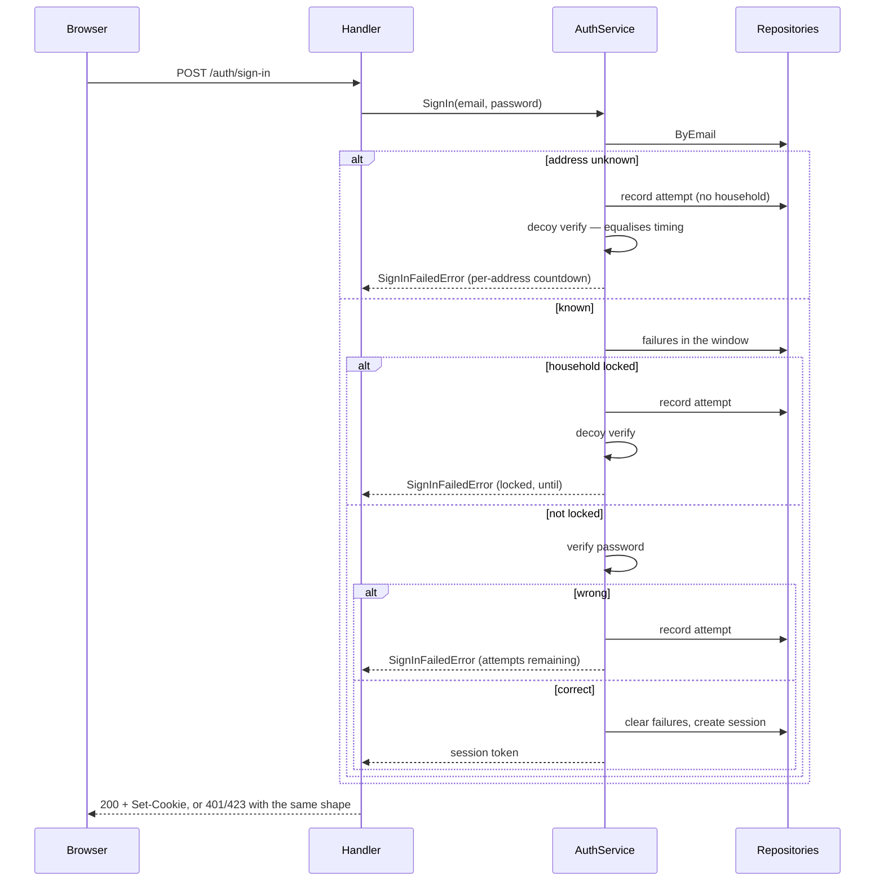

Three failures inside fifteen minutes lock the **household's password sign-in**
for fifteen minutes. Magic link is never gated by the lock — that is the
recovery path. The decoy verification exists so argon2's cost cannot distinguish
the branches.

### Magic link — deliberately silent

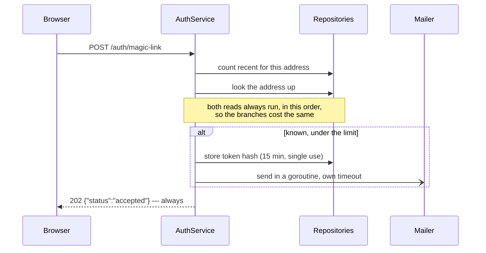

Nothing about the response reveals whether the address exists, including when
the rate limit is exhausted or the send fails. **The frontend is therefore the
only place a send failure can surface**, which is why the sent panel carries
retry copy.

### Invite acceptance — one transaction

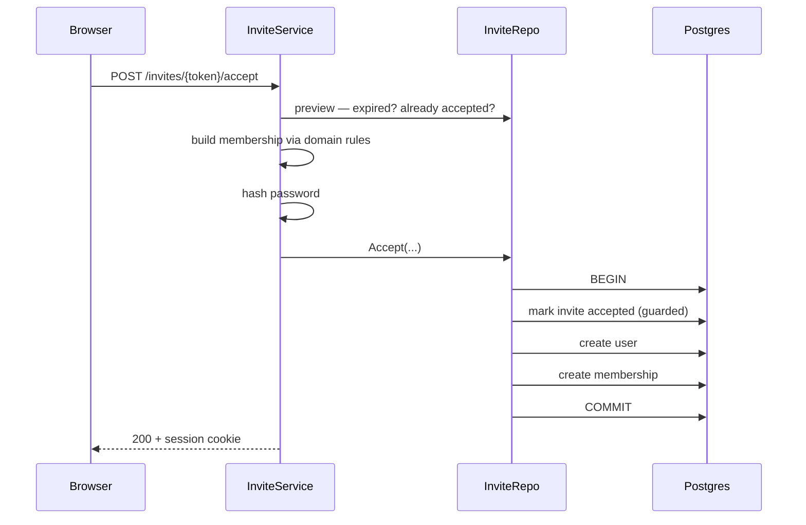

All three writes are one transaction. Split apart, a failure in the middle leaves
an orphaned user holding the unique email index and the invite becomes
permanently unacceptable. The invite is claimed *first*, so two concurrent
accepts serialise on that row and the loser gets a clean conflict.

### Self-serve sign-up — provisioning is one transaction

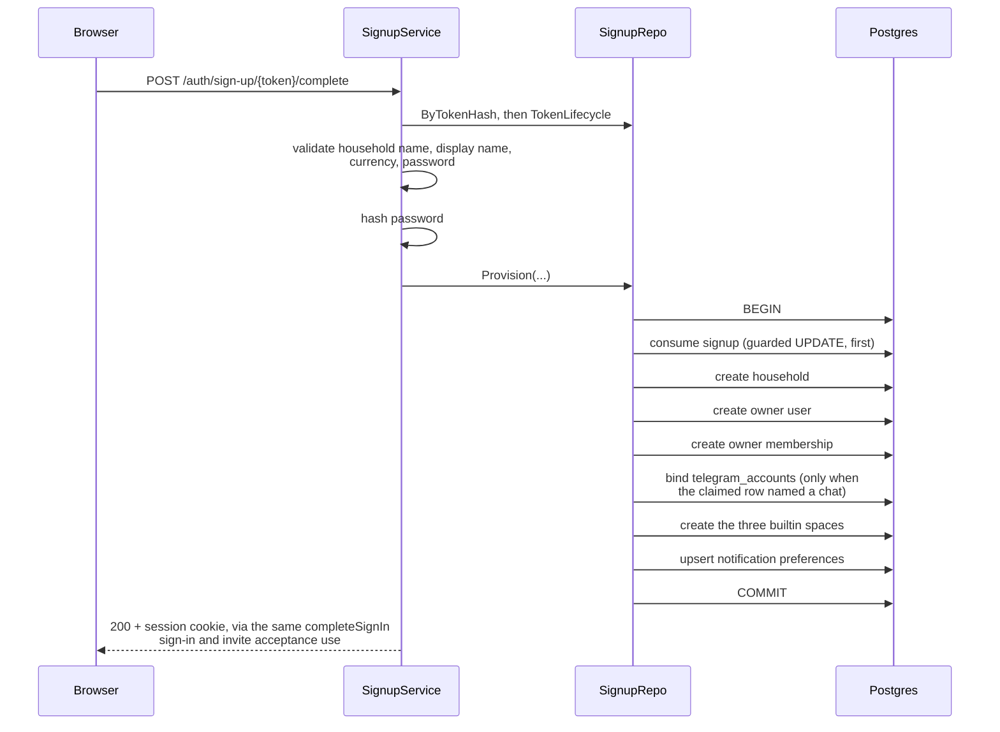

The `validate ... currency ...` step runs the currency the caller chose
through `domain.ParseSelectableCurrency`, not the more permissive
`domain.ParseCurrency` that the household `PATCH` path uses. `ParseCurrency`
is the single reference for "is this a currency at all" and stays that way —
it must keep accepting whatever currency is already stored on an existing
household. `ParseSelectableCurrency` adds a second, narrower gate on top:
only ISO 4217 codes with two minor units, the same list
`domain.SelectableCurrencies()` filters `GET /api/v1/currencies` down to, so
the sign-up form's own currency select and what `Complete` will actually
accept cannot drift apart. The reason either gate exists at all is
`Money.String()`: it renders an amount as `fmt.Sprintf("%s%s %d.%02d", ...)` —
two decimal places, hard-coded — so a household provisioned with, say, JPY
(0 minor units) or KWD (3) would have had every amount rendered 100× wrong
from the moment it existed. Delete `SelectableCurrencies` and
`ParseSelectableCurrency` only once `Money` itself knows about minor units;
until then they are what keeps the sign-up path from offering a currency the
money path cannot render.

**The `bind telegram_accounts` step is conditional on the claimed row, not on a
parameter, and it is inside this transaction rather than after it.** A signup
row names exactly one channel — an email address or a Telegram chat, never both
and never neither, enforced by a database `CHECK` (§6) — and `Provision` reads
whichever it finds on the row it is already claiming. Two consequences worth
stating, because both are the reason this shape was chosen over the obvious one:

- **`SignupService` gained no new dependency and no new branch.** It hands
  `Provision` a signup id, and the row decides which channel it belongs to.
  `AuthService` is untouched, `SignupDeps` is unchanged, and all four `Mailer`
  send sites are untouched. That is what "Telegram is a delivery channel, not
  an identity" means in code.
- **A caller cannot substitute the chat.** The chat id reaches the `users` row
  from the row being claimed, exactly as the email address already did — the
  reasoning `signup_repo.go` had already written down for the address, applied
  unchanged to the chat. A chat id passed in as an argument would let someone
  bind a household to a chat they control instead of the one that actually
  completed the sign-up, which is account takeover with extra steps.
- **After the commit would be too late.** A household that exists with its chat
  unbound is an account its owner can never sign in to again: the sign-up token
  is spent, and for a Telegram sign-up there is no email address to fall back
  on. That is precisely the failure the `guarding-partial-writes` skill exists
  for, so the bind is a statement in the transaction, never a second write.

A household can now come into existence three ways: `adminctl seed`
(development only), an invite accepted into a household that already exists,
and this — a stranger with no prior relationship to anyone provisions their
own, reached either from a mailed link or from a Telegram chat. `Provision` is one transaction for the same reason
`InviteRepository.Accept` is: a failure partway through would leave a `users`
row occupying `users.email`'s unique index with no membership under it, and
that address could then never sign up again — there is no retry that could
create a second user with the same email.

The signup is consumed *first*, before any insert — not last, the way it reads
most naturally if you write it top-down. With consume-last, the guarded
`UPDATE` would still run, but it would not be what stops two concurrent
completions of one token: `users.email`'s unique index would be, because the
second `CreateUser` collides on it. That gets the loser `409 ALREADY_EXISTS`
instead of the correct `410 TOKEN_EXPIRED`, and turns the guard into
decoration. Consume-first makes the guarded `UPDATE` itself the real
serialiser — the same choice `InviteRepository.Accept` already made by
marking the invite accepted before writing anything else.

`Request` (not diagrammed — it always answers `202` with nothing to show for
it) mirrors the magic-link flow's silence: the per-address count and the
"does this address have an account" read both run unconditionally, in the
same order, on every call. **Both branches now write a `signups` row** too —
a fresh address via `Create`, a registered one via `CreateConsumed` (a row
born already consumed, so it can never provision anything and its token is
never mailed). That second write exists purely so the registered branch's own
rate-limit counter advances: without it, an already-registered address could
be sent unlimited "you already have an account" mail while a fresh address's
mail stopped at three an hour — the exact oracle this endpoint exists to
close, expressed as mail volume instead of a status code. See
`docs/LEARNING.md`.

### Telegram — chat commands, guarded at the channel's edge

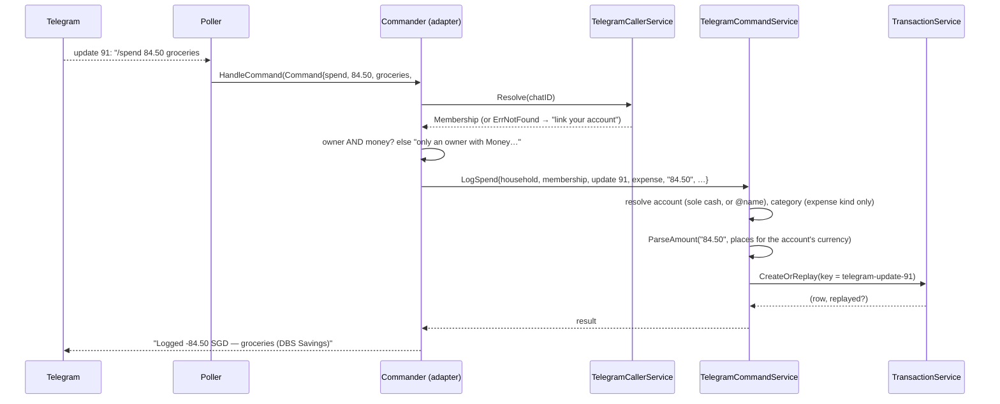

A plain sentence takes one extra hop: after the same guard, the Commander
asks `usecase.IntentParser` (the `openrouter` adapter, only when
configured, under a 30 s deadline) to read it,
shows the reading back, and writes it only on
`/yes` — keyed by the sentence's update id, held five minutes, discarded
by `/no`. The Commander is to Telegram what `requireSession → requireCapability →
requireOwner` is to a request: the one place "who may do this" is decided
for the channel, before any service runs ([ADR 8](adr/0008-authorisation-at-each-channels-inbound-edge.md)).
The resolver decides nothing; the service takes a household and a
membership it never questions. The update id is the idempotency key, so
the poller's known redelivery-after-restart becomes a replay rather than a
second row. Walked live on 2026-09-08 against a development bot, after the
first attempt with the production token went to the production poller.

### Telegram — the bot speaks first: the daily digest

```mermaid
sequenceDiagram
    participant K as runNudges (15-min tick)
    participant N as NudgeService
    participant R as NudgeRepository
    participant B as BillService / BudgetService
    participant TG as Telegram

    K->>K: NudgeDue(now, "09:00", Asia/Singapore)? no → sleep
    K->>N: RunOnce(day)
    N->>R: Recipients() — owners with Money, nudges_enabled
    loop each recipient
        N->>R: Claim(chat, household, day)
        R-->>N: false → skip (already sent, or being sent)
        N->>B: List(bills, today) · Month(budget, today)
        N->>N: due ≤ today+3 and not autopay · spent×100 ≥ cap×80
        N-->>N: nothing → keep the claim, no message
        N->>TG: sendMessage(chat, digest)
        TG-->>N: error → Release(claim); next tick retries
    end
```

No actor asks, so ADR 8's question becomes "who may receive": the
recipients query keeps only what the Commander would let through inbound,
and an opted-out chat (`/nudges off`) is simply absent from it. The claim is
written before the send, so a restart mid-run or two ticks in one hour
cannot deliver twice, and the scheduler is allowed to be sloppy because the
ledger is not ([ADR 9](adr/0009-scheduled-work-runs-inside-the-api.md)).
The digest is rules, not a model: `BillService.List` and
`BudgetService.Month` — the same reads the screens make — filtered to three
days and 80%, formatted with `domain.FormatAmount`. One zone for the whole
install is the named gap.

### Telegram — a second delivery channel, and the link comes back to the tapper

```mermaid
sequenceDiagram
    participant B as Browser
    participant H as Handler
    participant T as TelegramAuthService
    participant L as TelegramLinkRepo
    participant P as Poller
    participant TG as Telegram
    participant C as Chat

    B->>H: POST /auth/telegram/start (no body, no identifier)
    H->>T: StartLink
    T->>L: Create("", hash(nonce), now + 10 min) -> id (discarded — never polled)
    T-->>H: TelegramStartLink
    H-->>B: 200 with url https://t.me/BOTNAME?start=NONCE and expiresAt
    B->>C: opens t.me in a new tab, person presses Start
    C->>TG: /start NONCE
    P->>TG: getUpdates (long poll, 50s)
    TG-->>P: Update
    P->>T: HandleStart(chatID, payload, username)
    T->>L: Consume(hash(payload), chatID, username) — one guarded UPDATE
    alt redemption.UserID != "" — a LINK nonce, checked FIRST (decision 4)
        T->>TG: handleLinkStart — writes no binding;<br/>see "connecting an existing account" below
    else redemption.UserID == "" — an ordinary sign-in nonce
        T->>L: CountLinksSince(chatID, now - 1h)
        alt Accounts.ByChatID finds a user
            T->>TG: Sender.SendMessage — Tap to sign in,<br/>/sign-in/magic?token=RAW (15 min, single use)
        else ByChatID returns ErrNotFound
            T->>TG: Sender.SendMessage — Tap to create your household,<br/>/sign-up/RAW (24 h, single use)
        end
    end
    TG->>C: the bot's reply
    C->>B: person taps it — the EXISTING magic-link or sign-up<br/>handler runs, on the device holding Telegram
```

`T` is `TelegramAuthService` throughout: it never touches HTTP or Telegram
itself. The `200` is written by the handler, and both replies leave through
`Sender.SendMessage`, which in production is `adapter/telegram`'s `Client` —
the same separation `Mailer` already draws, and the reason this service is
testable against two in-memory doubles.

**No new session-issuing code exists in this flow at all.** Step by step it
mints a nonce, spends it, and then calls `MagicLinkRepository.Create` or
`SignupRepository.CreateForTelegram` — the same two token types, the same two
expiries (15 minutes, 24 hours), the same two consume handlers. A parallel
Telegram token table would have meant two expiry rules, two rate limits and two
oracle analyses drifting apart, and the second one would be the one nobody
reviews.

**The session lands on the device that taps, and that is the security property,
not a limitation.** The obvious alternative — the browser starts the flow and
polls for completion — has an account-takeover hole with no credentials
involved: the nonce is minted by one browser and then bound to whichever chat
redeems it, so an attacker could start a flow, send the `t.me/…` link to a
victim ("tap this for me"), and have their own browser signed in as that
victim. Because the link comes back *into the chat* and signs in *there*,
forwarding it gives the forwarder nothing. The cost is that a desktop user needs
Telegram Desktop or Telegram Web on the same machine as the browser; that is
accepted, and `docs/adr/0004-telegram-as-a-second-delivery-channel.md` records
what a safe cross-device version would need (a confirmation code typed back into
the originating browser, binding both ends).

**The consume happens before the rate-limit check, deliberately.** Read
top-down it looks backwards — why spend the nonce on an attempt you are about
to refuse? Because a refusal that left the nonce unspent would be retryable with
the same link until the hour rolled over, which is not a limit. Spending first
makes every refused attempt cost the caller a nonce.

**The link branch is checked before that rate-limit too, and for a different
reason than the one above.** `redemption.UserID != ""` is tested immediately
after `Consume`, ahead of `CountLinksSince`, not only ahead of the
sign-in/sign-up split. `CountLinksSince` exists to bound *this* path's two
writes — a magic link, a signup row — and a link nonce mints neither: it is
answered entirely in the chat, by `handleLinkStart`
(`docs/adr/0010-binding-a-chat-needs-a-confirm.md`), so there is nothing here
for that limit to protect. Ordering matters beyond tidiness: by the time
`HandleStart` reaches this point the row is already consumed and carrying a
`user_id`, which the browser's `Status` derives as *pending* — so refusing it
here on a rate limit that has nothing to do with linking would tell the chat
"that link is dead" while the browser still offered a working Confirm button.

**"Connecting an existing account" is a different flow from everything above
it, sharing only this table and this poller** — see its own subsection below.
It is what a member reaches from *Settings*, not from a stranger's `/start`,
and it writes a binding through a second call site `SignupRepository.Provision`
never touches.

**One refusal message covers five different situations, word for word.**
`telegramDeadLinkMessage` — *"That sign-in link has expired. Start again from
the app."* — is the answer for an unknown nonce, an expired one, an
already-consumed one, a chat over its three-per-hour limit, **and** a `/start`
that arrives while the global daily sign-up ceiling is breached. Any wording
that distinguished them would let a caller confirm which one they hit by
probing; "rate-limited" and "the platform is over its daily ceiling" are both
facts a caller should not be able to establish. This is the same silence
`POST /auth/magic-link`'s always-`202` buys, expressed as chat copy instead of a
status code. It also means a test asserting `strings.Contains(reply, "expired")`
proves almost nothing — see `docs/LEARNING.md`, where doing exactly that shipped
an oracle with the suite green.

**The two *successful* replies do differ by branch, and that is safe here.** A
sign-in link and a sign-up link are distinguishable, which is normally the exact
tell an enumeration analysis hunts for. It is safe in this flow because the only
recipient is the owner of the chat, who already knows whether they have an
account, and `chat_id` is never caller-supplied — it arrives inside an `Update`
Telegram itself delivers over the long-poll connection this process opened. No
third party observes the difference. This paragraph exists because the next
reader will flag it and should find the reasoning already written down; if
`chat_id` ever became caller-suppliable — an unsigned webhook, a debug endpoint,
a replayed update accepted without verifying its source — this reasoning would
need revisiting *before* that change shipped.

**There is no enumeration oracle on the route itself**, because
`POST /auth/telegram/start` accepts no identifier at all. There is nothing to
probe. That is strictly better than `POST /auth/magic-link`, which takes an
address and needs `AuthService.decoy()` plus timing equalisation to stay quiet.

**Failure modes, all of them deliberate:**

- **The offset lives in memory.** After a restart Telegram redelivers updates it
  was never acknowledged for, so one `/start` can be processed twice. That is
  safe *because* the nonce was already consumed: the second pass takes the
  already-consumed branch and the bot repeats the expiry message. Recorded
  rather than left to luck.
- **The offset advances past updates the poller ignores.** Leaving it behind an
  update nobody acted on would make Telegram redeliver it forever and the loop
  would never progress.
- **Network errors back off and the loop never exits** — capped exponential
  backoff, logged at warn. The API has to keep serving HTTP while Telegram is
  unreachable.
- **Each dispatch recovers from a panic.** The poller is a bare goroutine and
  chi's `middleware.Recoverer` does not cover it, so an unrecovered panic would
  take down the whole process and every unrelated in-flight request. The
  `recover` wraps one update's dispatch, not the loop, so a panicking handler
  costs one update rather than the poller. Same pattern as `sendMagicLinkAsync`.
- **Shutdown cancels an in-flight `HandleStart`.** The poller is handed the
  process's `signal.NotifyContext` and passes it through, and nothing waits on
  the goroutine. Accepted: `HandleStart` holds no multi-statement transaction —
  every repository call it makes is one atomic statement — so cancellation
  cannot leave a half-written invariant. The worst durable outcome is a nonce
  spent with no reply, which the person recovers from by pressing the button
  again. `cmd/api/main.go` carries the trade-off at the line, including what
  would have to change (a `WaitGroup`, and a supervisor timeout longer than the
  send) if this loop ever writes more than one row.
- **Telegram being down degrades partially.** Telegram sign-in stops; the email
  path is unaffected; sessions already issued are unaffected.

**What Telegram is *not* used for: invites.** An invite still goes to an email
address and is still relayed from Mailpit by hand on the live install. A
shareable `t.me/…?start=inv_<token>` link is the natural follow-up and is
deliberately not in this slice; `docs/FEATURE_TRACKER.md` carries it as a ⬜ row
so it is a gap on the map rather than an assumption.

### Telegram — connecting an existing account, and why the binding waits for a confirm

The flow above only ever binds a chat that a *stranger* used to create a
household. It leaves every account that signed up by email with no way to
connect a chat at all — `docs/LEARNING.md` §15's eighth instance names what
that silently cost. This flow is the second, and only other, call site that
writes a `telegram_accounts` row: a signed-in member, from Settings.

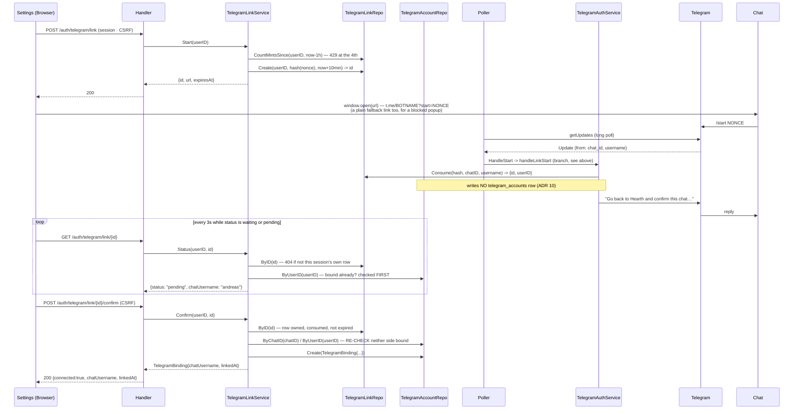

`T` is `TelegramAuthService`, the same service and the same poller dispatch
as the flow above — `handleLinkStart` is one more branch inside
`HandleStart`, not a second poller. `K` is `TelegramLinkService`, a distinct
usecase service with its own `Start`/`Status`/`Confirm`/`Unlink`, wired
separately in `main.go` and gated behind its own `Deps.TelegramLink` nil
check (§4's route table). The two services share the `telegram_link_requests`
table and nothing else.

**The binding is never written at `/start`, on purpose — this is the whole
of [ADR 10](adr/0010-binding-a-chat-needs-a-confirm.md).** A link nonce is a
bearer credential for ten minutes: anything that can read it — a forwarded
message, a shared screen, a synced clipboard — can redeem it. If redemption
alone bound the chat, redeeming a leaked link would hand the redeemer's own
chat the ability to sign in as the victim, forever, one `/start` away. So
`handleLinkStart` records *which* chat redeemed the nonce and stops there;
the only thing that writes the row is `Confirm`, called from inside the
session that minted the nonce in the first place — a session a stolen link
cannot reach, because it has neither the cookie nor the CSRF token.

**There is no pending table and no status column — decision 5.** *Consumed,
carrying a `user_id`, with no `telegram_accounts` row yet* **is** the pending
state; `Status` derives it by reading the link row once (`ByID`) and the
account binding once (`ByUserID`/`ByChatID`), never by writing a new one.
`Status` derives in this order, and the order is load-bearing: **bound
first, then refusals, then expiry.** A panel that is still polling a link that
already connected must keep reading `connected` even after `expires_at`
passes — checking expiry before the binding would flip a working connection
back to "expired" ten minutes after it succeeded, which is exactly backwards.

**`Confirm` re-checks everything `Status` derived, from scratch, against the
database — not because the earlier checks were wrong, but because minutes
pass between a poll and a click.** The other chat can be bound to someone
else, or this user's own second pending link can win a race, in that window.
`Create`'s `UNIQUE` constraints are the real gate; the Go-level checks ahead
of it exist only to turn a `23505` into the right one of `ErrTelegramChatTaken`
or `ErrTelegramAlreadyLinked` rather than a bare conflict — and when the
`UNIQUE` that actually fires disagrees with what the pre-check saw, `Confirm`
re-reads by chat id to find out which one really collided, rather than
guessing.

**The chat gets a bland answer in every case; the browser gets the real
one.** Mirrors `telegramDeadLinkMessage` from the flow above and the split
[ADR 8](adr/0008-authorisation-at-each-channels-inbound-edge.md) already
draws: a chat holding a nonce it may have stolen must not learn whether the
target account exists, already has a chat, or belongs to someone else — each
of those is a probe a stranger could run. The session that minted the nonce
has already proved who it is over HTTP, so `Status` and `Confirm` hand it a
named `domain` error (`ErrTelegramChatTaken`, `ErrTelegramAlreadyLinked`)
that the panel turns into a real sentence.

**Two columns exist only to make the confirm screen answerable by a human.**
`telegram_link_requests.chat_username` is stamped at redemption from
Telegram's `message.from`, alongside `chat_id`; `telegram_accounts.chat_username`
carries the same value onto the binding once confirmed, because the link
request it came from is pruned within the month and the panel still has to
name the connected chat long after that. Neither is read by any check —
`chat_id` is what every comparison in `Confirm` and `handleLinkStart` uses —
it is display only, for the one screen where a human, not a constraint, is
the actual gate: "does the chat I see match the one I opened Telegram from?"

**Disconnect refuses to lock anyone out.** `Unlink` reads the user first and
refuses with `ErrTelegramUnlinkWouldLockOut` when `users.email IS NULL` — a
Telegram-only account (the sign-up half of the flow above) has no other
door: `GetUserByEmail` is `WHERE email = $1`, and NULL never matches a
parameter, so there is no magic link and no `adminctl reset-password` to
reach it. The already-tracked ⬜ "attach an email address to a Telegram-only
account" is the fix for *those* accounts; until it exists, this guard is
what stands between a member and a household only `make psql` can reopen.

**Reconnecting the same chat does not restore a muted digest.** Disconnect
deletes the whole `telegram_accounts` row, and `nudges_enabled` goes with
it, so an owner who had said `/nudges off` and later relinks the same chat
is unmuted. Accepted, not a defect: reconnecting is a deliberate act, and
carrying the flag across a deleted row would mean keeping a tombstone whose
only job is remembering one boolean.

### Accounts — net worth is composed on read, not stored

```mermaid
sequenceDiagram
    participant B as Browser
    participant H as Handler
    participant Repo as AccountRepository
    participant Svc as AccountService
    participant FX as FXRateProvider

    B->>H: GET /api/v1/accounts
    H->>Repo: List(householdID, includeArchived)
    alt caller's role is not owner
        H-->>B: 200 { accounts: only visible-to-limited rows,<br/>balance/openingBalance/balanceAsOf/summary all absent }
    else owner
        H->>Svc: Summary(householdID, views, today)
        loop each counted account
            Svc->>FX: Rate(account currency, primary) unless already primary
            Svc->>Svc: convert, then Add — domain.Money.Add<br/>refuses two different currencies
        end
        Svc->>Repo: MonthlyMovements(householdID, since)
        Svc->>Svc: trend() — walk each counted account's live<br/>balance back twelve months by these deltas;<br/>the newest point reuses the value the loop<br/>above already converted, never reconverts it
        Svc-->>H: NetWorthSummary { ..., Trend }
        H-->>B: 200 { accounts, summary: { ..., trend } }
    end
```

One endpoint answers both halves of the screen — the list and the summary —
because they describe the same set of rows and must agree; a second endpoint
would mean writing the redaction rule below twice.

**Convert, then add.** `domain.Money.Add` refuses to add two different
currencies, deliberately, so summing raw balances first and converting after
would fail the moment a household holds a second currency — invisible to a
single-currency test. Each account converts into the household's primary
currency before any `Add`; rounding happens once per account and the total is
never re-rounded, so the figure is deterministic. See `docs/LEARNING.md`.

**A limited member's response omits every amount, not just the totals.**
Showing the family total while hiding individual balances was rejected: with
the list of which accounts exist and a running total, the individual balances
become inferable as accounts are added and removed. So `summary` is omitted
entirely, and each visible account's `balance`/`openingBalance`/`balanceAsOf`
keys are absent — not zeroed, because a zeroed balance still reads as a real
one. `openingBalance` is redacted for the same reason as `balance`: it is an
amount, and on a young account it is close enough to the current one to be
just as revealing.

**An unconvertible account doesn't vanish from the total silently, and an
entirely unconvertible household never shows a zero.**
`NetWorthSummary.Computable` is false only when at least one live account
exists and none of them could be converted — the state a household reaches by
changing its primary currency in Settings while `fx.StaticProvider` knows only
SGD↔IDR. Zero is a claim about the household's money; the truth in that state
is that it cannot be computed, so the screen says so instead of showing S$0.00.
A household with no accounts at all is computable and genuinely zero — that
distinction is why the guard counts non-archived accounts actually considered,
not the raw row count (`docs/LEARNING.md`).

**`AccountView.Balance` is now a real sum, computed in SQL, not in Go.**
Before Transactions existed there was nothing to add, so `Balance` was a copy
of `opening_balance_minor`; `AccountRepository`'s query has always shaped
`Balance` as a sum for exactly this reason (see its doc comment). Now it is
one: the query subtracts every transaction on the `from_account_id` side and
adds every transaction — or its `received_amount_minor`, for the destination
leg of a cross-currency transfer — on the `to_account_id` side, both filtered
to `occurred_on >= opening_balance_as_of` — an opening balance is the figure
at the *start* of its day, so a transaction dated on that same day already
moves it (`docs/LEARNING.md`, pattern 13). That is the same boundary
Transactions' own ledger marks strictly-before and explains on each affected
row rather than hiding (§5's Transactions flow, below). The sum happens
once, in the repository's SQL; `AccountService.Summary` still converts and
adds each account's already-summed balance exactly as it did before this
feature, unchanged.

**Which is why `accountDTO` now carries `openingBalance` as well as
`balance`.** The two were one number until this feature, and a client that
has only `balance` to prefill the account edit form from will write today's
figure back as `opening_balance_minor` — moving the household's net worth by
every transaction since, on an edit that never meant to touch the balance.
The wire therefore carries both figures, the form is labelled "Starting
balance" so the field cannot be mistaken for the one on the account row, and
`AccountView`'s own doc comment says which of the two may ever be written
back. A value whose meaning changes has to change its consumers with it;
`docs/LEARNING.md` records what this cost when it did not.

**The twelve-month trend is derived, the same way the balance above it is —
there is no snapshot table.** `summary.trend` did not need one: `Summary`
already holds every counted account's live, converted balance from the loop
in the diagram above; `trend()` (`api/internal/usecase/networth_trend.go`)
walks each one backwards, month by month, subtracting that month's delta from
`MonthlyMovements`. Every one of the twelve bars is recomputed on every
`GET /accounts`; nothing about the trend is written or scheduled anywhere. A
gap in a household's history (an account not yet tracked back that far) is
`nil`, never `0`, all the way from `domain.Money` through the wire's
`netWorthMinor: null` to the chart drawing no bar at all for that month — a
zero is a claim about the household's money, and the true answer for an
untracked month is that there is nothing to claim.

**The newest bar equals the headline figure by construction, not by
coincidence.** `trend()` never reconverts the current month: for the newest
point it reuses the exact `domain.Money` the loop above already added into
the headline, so the two cannot disagree even if the FX provider is asked
twice in one request and answers differently — nothing here forbids a live
provider from doing that. Older months are converted at *today's* rate, not
the rate that held at the time, because there is no historical rate table;
the chart shows how balances moved with the exchange rate held still, which
is the more useful of the two questions anyway (an account whose balance
never moved should not appear to rise and fall because a currency did).

### Transactions — an idempotent create, for callers that retry

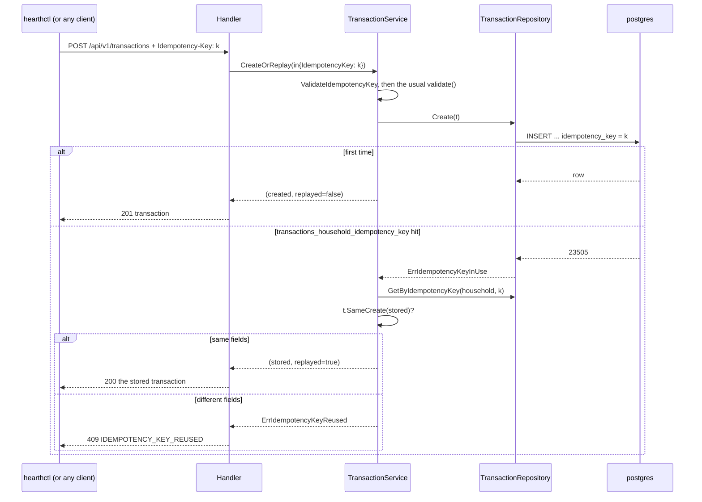

Insert first, look up second — never "check, then insert". Two retries
racing each other both pass a check; the partial unique index lets exactly
one insert win and turns the other into the replay path, with no application
lock. A replay compares every caller-controlled field and refuses a mismatch
rather than handing back a different transaction than the one asked for
(LEARNING pattern 5). The key lives on the row, so a deleted transaction
frees its key and there is no retention job. Without the header the route
behaves exactly as before; the web app never sends one. Only transactions
carry this today — they are the row an agent creates hundreds of; the
pattern is copied to a second table when one needs it, not generalised
early. Spec: `docs/superpowers/specs/2026-09-08-hearth-idempotent-import-design.md`.
`hearthctl transaction import` is the first caller: one keyed POST per CSV
row, the key derived from the row's content so a re-run of the same file is
all replays.

### Transactions — the ledger and month-to-date spend, one request

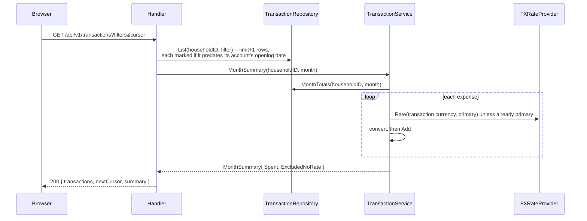

One endpoint answers the ledger and "Spent this month" together, for the same
reason `GET /accounts` answers the list and net worth together: the two
describe the same rows and a second endpoint risks them disagreeing.

**An absent `month` parameter means the current month, for both halves.**
`parseTransactionFilter` sets the summary's month *and* `filter.Month` from the
same default, so the ledger and the figures above it always describe the same
month. They did not always: the default set only the summary's month and left
`filter.Month` zero — which `TransactionFilter` documents as "every month" — so
the screen read "0 in August 2026" above ten July rows. `month=all` is the one
deliberate way out and widens the **list only**: the summary stays on the
current month, because `MonthSummary` answers for exactly one calendar month by
construction (`TransactionRepository.MonthTotals` returns that month's rows so
the usecase layer can convert currencies before summing, and the single-month
bound is the stated reason it may return rows rather than a SQL `SUM`). The
frontend therefore drops the count and names the month beside the spend figure
whenever the list is widened, so no figure ever sits unlabelled over rows it
does not describe. Any other unrecognised `month` value is still refused with
422 `INVALID_MONTH` — the widening is one spelled word, never a fallback.
`nextCursor` is opaque — the date and id of the last row of the page, never
something the frontend constructs — so a later change to sort order or paging
predicate cannot become a breaking change to the client; `transactions_household_date_idx
(household_id, occurred_on DESC, id DESC)` is what lets the keyset cursor walk
an index instead of sorting a heap.

**A transaction dated before its account's opening balance is kept, listed,
and marked — not refused, and not silently absorbed into the balance.** It is
still counted in `Spent`, because the money was actually spent; only the
*balance* — the sum described above — ignores it, because a balance is
anchored to a figure someone asserted was true on a date and this transaction
predates that assertion. A transfer can predate one side's opening date and
not the other's, so the mark is two independent fields
(`beforeFromAccountOpeningBalance` / `beforeToAccountOpeningBalance`), each
naming the account, not one flag that would be half true for a transfer.

### Budget — one screen, one request; the PUT always replaces the whole month

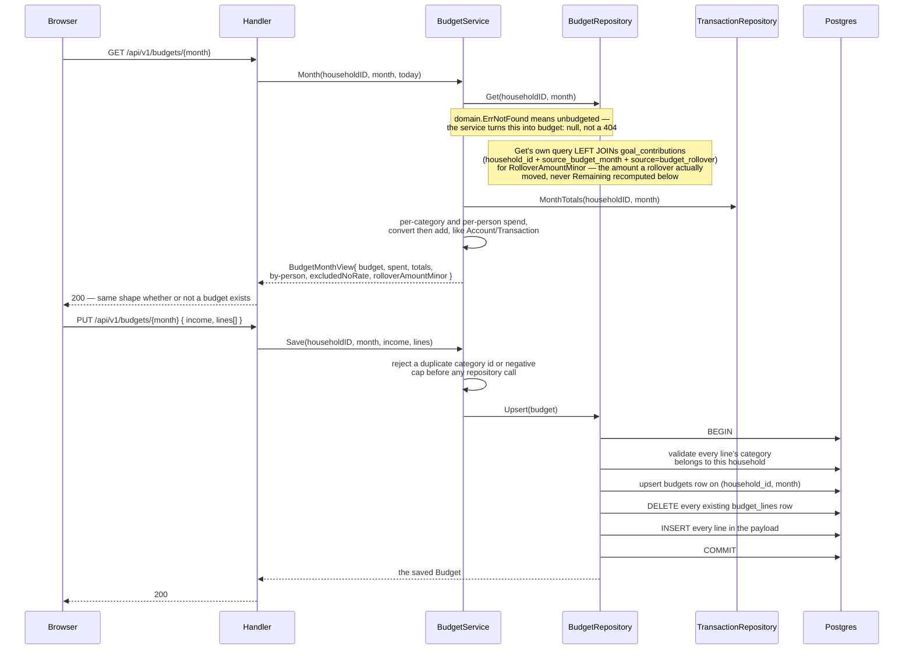

**A third endpoint answers a whole screen in one request**, the same shape
`GET /accounts` and `GET /transactions` already use: the figures and the raw
data describe the same rows and must never be free to disagree, so there is
one query to keep in sync, not two. `GET /budgets/{month}` returns `"budget":
null` plus the spend figures even for a month with no caps at all — the
empty state needs to know the month's spend to invite "Import last month",
and a 404 would make the frontend special-case the one screen that is
allowed to have nothing.

`GET /budgets/{month}` also carries `rolloverAmountMinor` (nullable, moving
in lockstep with `rolledOverAt`/`rolloverGoalId`) — the fix for a defect the
final whole-branch review found: `remainingMinor` on this same response is
`Budgeted − Spent`, **recomputed on every call** from whatever transactions
exist in the month right now, so it is not a safe thing to render next to a
past-tense "moved into X" sentence once a rollover has happened. A backdated
transaction, or an edit or delete in an already-rolled-over month — none of
them blocked anywhere in this codebase — used to change that sentence's own
number after the fact. `rolloverAmountMinor` is read off the
`goal_contributions` row the rollover actually wrote (`household_id` +
`source_budget_month` + `source = 'budget_rollover'`, a lookup the partial
unique index `goal_contributions_one_rollover_per_month` guarantees returns
at most one row), via a `LEFT JOIN` added to `BudgetRepository.Get`'s own
query — not a new column on `budgets`. `Upsert` and `History` still build a
`domain.Budget` too, but neither result ever reaches the month response
(`BudgetService.Month` builds its `Budget` through `Get` alone), so their
own `RolloverAmountMinor` is always `nil` and nothing ever observes that.

**`PUT` is a full replace, never a merge, in one transaction.** The
Edit-budget modal always holds the entire budget client-side — every capped
category, not a diff — so replace is what makes "the caller removed a cap"
unambiguous: a line simply absent from the payload is gone after the call,
rather than needing a separate "delete this line" operation the frontend
would have to track alongside "add" and "change". Category ownership is
validated *inside* the same transaction as the delete-then-insert, before
either runs, so a foreign-household category id in one line rolls the whole
month back rather than leaving the parent row updated with its lines
half-replaced — the same "any two writes that must both happen need a
transaction" rule invite acceptance and self-serve sign-up already apply
(§5 above), extended here to a delete-and-reinsert pair instead of a set of
inserts. `BudgetService.Save` also re-derives every cap through
`domain.NewMoney` before the repository ever sees it, so a caller cannot
make a stored `Budget` carry a currency the household does not have — the
repository still relabels to the household's own primary currency
regardless, but that must never be the only thing standing between a bad
currency and a stored row.

### Goals — a contribution moves no real money; a rollover is one transaction each way

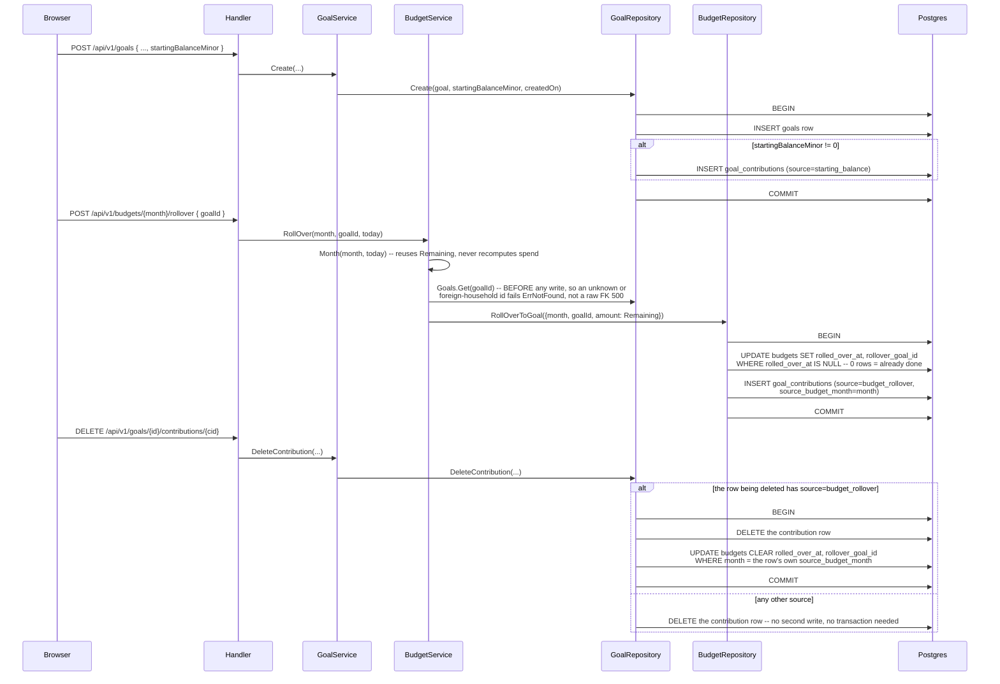

**A contribution moves no real money.** `goal_contributions` is a ledger a
household writes to by hand — starting balance, a manual top-up, a rollover —
never a join against `transactions` or a debit against an `accounts` row. A
goal earmarks; it does not hold. Goal progress and account balances are
therefore independent figures, and nothing in this system reconciles them:
an account can be overdrawn while every goal reads fully funded, and that is
not a bug to fix by wiring the two together — Goals spec decision 1 rejected
that as the larger, later feature (it would drag in the transactions schema,
the ledger UI and the cross-currency transfer rules for a screen whose whole
point today is to exist without any of that).

**The rollover writes a contribution and stamps the month in one
transaction, and deleting that contribution clears the stamp in the same
transaction — the invariant runs both ways.** `RollOverToGoal` cannot leave a
stamped month with no contribution, or a contribution with no stamp; deleting
a `budget_rollover` contribution cannot leave the stamp behind either, because
`GoalRepository.DeleteContribution` reads the deleted row's own
`source_budget_month` and clears `budgets.rolled_over_at`/`rollover_goal_id`
for that exact month inside the same transaction as the delete. Leaving either
half undone would strand the household in an unrecoverable state: a month
claiming it rolled over with no money in any goal to show for it, or the
reverse, and a retry refused by `ErrRolloverAlreadyDone` either way — the
shape `guarding-partial-writes` exists to catch. `Goals.Get(goalID)` runs
*before* `RollOverToGoal` for a related, narrower reason: `RollOverToGoalInput.GoalID`
reaches the repository's SQL in a value position, so an id that does not
exist — or belongs to a different household — would otherwise reach a
foreign-key violation and surface as an unmapped `500` instead of this
method's own `domain.ErrNotFound` (a gap Task 5's review found and Task 7's
dispatch carried forward as a hard requirement).

**A goal carries an explicit currency; a budget does not.** `budgets` and
`budget_lines` have no `currency` column at all (§6) — a budget is one
month's plan, denominated in the household's primary currency by
construction, and a primary-currency change silently restating one month was
an accepted cost. A goal accumulates for years, so the same silence would
restate a multi-year total and every contribution behind it; `accounts`
already carries currency per row for the identical reason. `goals.currency`
defaults to the household's primary at creation but is **not** patchable —
changing it would restate every contribution already summed under the old
one, so a currency change means archiving the goal and creating a new one,
not editing the field.

**`Remaining` can read higher than the household's true unspent figure, and
`RollOver` moves `Remaining` anyway — a known, deliberate limitation, not a
bug to close by blocking the button.** `BudgetService.Month`'s `Remaining` is
`Budgeted − Spent`, and `Spent` excludes any expense with no available
exchange rate (§5's Budget flow, `excludedNoRate`). On a month with such
exclusions, the true unspent figure is *lower* than `Remaining`, and a
rollover moves the (possibly inflated) `Remaining` into the goal regardless.
The owner's ruling (2026-08-01): move it, but say what was excluded — the
rollover offer names the excluded count right next to the button whenever
`excludedNoRate > 0` (`BudgetRolloverCard.tsx`, commit `8a1114b`, reusing
Budget's own exclusion copy), and the button stays enabled. This is
information, not a refusal, and it is deliberate: do not "fix" this by
blocking the button on a positive exclusion count without a further product
conversation.

### Bills — marking paid writes into Transactions; undo reverses all three writes

```mermaid
sequenceDiagram
    participant B as Browser
    participant H as Handler
    participant Svc as BillService
    participant Acct as AccountLookup
    participant Repo as BillRepository
    participant DB as Postgres

    B->>H: POST /api/v1/bills/{id}/pay { amountMinor, paidOn }
    H->>Svc: MarkPaid(...)
    Svc->>Repo: Get(householdID, billID)
    alt bill is archived
        Svc-->>H: BillNotPayableError{BillArchived}
    else NextDue is nil -- a settled one-off
        Svc-->>H: BillNotPayableError{BillSettled}
    else payable
        Svc->>Acct: Get(householdID, payFromAccountID)
        alt pay-from account is archived
            Svc-->>H: BillNotPayableError{PayFromAccountArchived}
        else
            Svc->>Svc: currency := account's own currency --<br/>transaction.go:232's identical rule;<br/>a test asserts the two agree
            Svc->>Svc: next, ok := domain.NextDue(cadence, dueOn, anchorDay)<br/>-- advances from the DUE date, never PaidOn
            Svc->>Repo: RecordPayment(...)
            Repo->>DB: BEGIN
            Repo->>DB: INSERT transactions (kind=expense,<br/>currency=account's)
            Repo->>DB: INSERT bill_payments (due_on, paid_on, amount,<br/>transaction_id) -- UNIQUE(bill_id, due_on)<br/>-> ErrAlreadyExists on a double-pay
            Repo->>DB: UPDATE bills SET next_due<br/>WHERE household_id AND id -- 0 rows -> ErrNotFound,<br/>rolls the whole transaction back
            Repo->>DB: COMMIT
            Repo-->>H: BillPaymentView
        end
    end

    B->>H: DELETE /api/v1/bills/{id}/payments/{paymentId}
    H->>Svc: UndoPayment(...)
    Svc->>Repo: UndoPayment(...)
    Repo->>DB: BEGIN
    Repo->>DB: SELECT the payment, and MAX(due_on) for this bill
    alt payment is not the bill's most recent
        Repo-->>H: BillPaymentNotLatestError{MostRecentDueOn}
    else is the most recent
        Repo->>DB: DELETE the bill_payments row
        Repo->>DB: DELETE the transactions row, if still linked
        Repo->>DB: UPDATE bills SET next_due = the undone<br/>payment's own due_on
        Repo->>DB: COMMIT
    end
```

**Marking a bill paid writes into `transactions` from outside Transactions —
the only place in Money that happens, and it is allowed because the
alternative is a bill that pays itself with no ledger trace at all.** The
expense `RecordPayment` writes is what feeds Budget's `Spent`, the daily pace
figures, Spending by person and net worth; a household that marks a bill paid
and sees none of those move would rightly distrust the feature. What keeps it
honest is the same rule Transactions enforces on itself: the expense's
currency is the pay-from **account's** currency, resolved through
`AccountLookup` — the identical assignment `TransactionService.Create` makes
in `TransactionService.validate` (`usecase/transaction.go`), `t.Amount.Currency = fromCurrency` — never
a value Bills stores or infers on its own. `TestMarkPaidWritesTheExpenseInTheAccountsCurrency`
asserts the two agree, so a bill on an IDR account writes an IDR expense even
if the bill's own display figure is read in a stale currency somewhere else.
The amount and date are `MarkPayment`'s own caller-supplied fields, not the
bill's stored `amount_minor` re-read — a utility bill varies month to month,
and paying it once must not silently rewrite what the household expects to
owe next time. The amount is optional: when a caller sends none,
`BillService.MarkPaid` pays the bill's own stored amount. That default lived
in the HTTP handler until 2026-09-13, where it read the whole bills page to
find one number and any other channel would have had to repeat it.

**Marking paid is three rows in one database transaction, and undo reverses
all three.** `RecordPayment` writes the expense, the payment row and the
advanced `next_due` inside one `BEGIN...COMMIT`; a bill left advanced with no
payment, or a payment with no expense, is a state this port cannot produce. A
review found the third write (`SetBillNextDue`) was originally a bare `:exec`
with no rows-affected check, so a household/bill mismatch — nothing in the
schema ties `bill_payments.household_id` or `transactions.household_id` to
the bill's own household by a foreign key — would have committed the expense
and the payment while silently leaving `next_due` untouched: the exact
partial state the transaction exists to prevent, arriving through a silent
no-op rather than a caught error. Fixed to the same `:one ... RETURNING id`
shape `DeleteBillPayment` already used two lines away, so a zero-row match
now rolls the whole transaction back as `domain.ErrNotFound`
(`docs/LEARNING.md`). `UndoPayment` mirrors this the other way — delete the
payment, delete its transaction if the link still points at one (it is
nullable: deleting the expense from the Transactions page must not erase the
record that the bill was paid), and rewind `next_due` to the undone
occurrence's own `due_on` — all in one transaction, and it refuses any
payment that is not the bill's most recent
(`*domain.BillPaymentNotLatestError`): undoing an older one would rewind
`next_due` behind a period that is still paid, and the screen would show a
due date for money already spent.

**`NextDue` clamps to the destination month's last day using a stored anchor
day, never the date it is advancing from.** Go's `time.Time.AddDate(0, 1, 0)`
on 31 January returns 3 March — it normalises "31 February" forward instead
of refusing it — so a bill due on the 31st would walk off the end of every
short month if the code simply added a month. `NextDue` clamps `anchorDay`,
not `from.Day()`, to the destination month's real length each time it
advances: 31 Jan → 28 Feb → 31 Mar. Clamping the already-clamped value is why
`bills.due_anchor_day` is its own column rather than derived from `next_due`
on the fly — deriving it would make the clamp one-way: advancing from a
`next_due` of 28 Feb would give 28 Mar, and a bill due on the 31st would
silently become a bill due on the 28th forever after its first February.

**`MonthTotals` cannot be computed from `bills` alone, and its two halves
filter archived bills differently on purpose.** A monthly bill paid on 8
July has `next_due = 8 August` the moment it is paid, so a query filtering
`bills.next_due` into July misses the entire "paid so far" half of the
figure — `BillRepository.MonthTotals` unions `bill_payments` (by `due_on`)
with still-unpaid live bills (by `next_due`) to get both halves right. The
unpaid half excludes an archived bill — nobody intends to pay it again, so it
is not a current obligation — while the paid half includes it: the money
already left the household, and archiving a bill afterwards must not
retroactively empty the month it was paid in.

**`BillsView` composes the whole screen in one call**, the same shape every
other Money screen uses: every bill row (with `DueSoon`/`Overdue`/`Settled`
computed server-side, so the rule lives in one place), the paid-this-month
list, and the summary — due this month, paid so far, the next-due bill, and
the subscriptions rollup (`AnnualEquivalentMinor`, converted like every other
cross-currency sum, with `ExcludedNoRate` naming what could not convert
rather than silently dropping it). `Settled` exists because a live bill can
have `NextDue == nil` — a paid one-off — which the design's own "Due soon"
and "Later" formulas both define as requiring a non-null due date; without
the flag there would be no way to tell "genuinely far out" from "done, and
deliberately not archived so the household can still see it" (`00008_bills.sql`'s
own comment on `next_due`).

**A bill with no payer is why Spending by person gained an Unattributed
row.** `paid_by_membership_id` is optional on a bill the same way it is on a
transaction, but before Bills existed, a payer-less transaction was rare
enough that `BudgetService`'s by-person grouping (`tallySpend` and `buildPersonViews` in `usecase/budget.go`)
simply dropped it — every real transaction until now had a human behind it. A
bill autopaying with no named person makes that the common case, not the
exception, so the grouping now emits an explicit `Unattributed` row rather
than silently under-counting the month's spend.

### Portfolio — the position is folded on read, and the fold runs inside the write

A holding stores no running total. What it holds, what that cost and what
selling has realised are all folded from its events on every read, the same
"composed on read, not stored" choice Accounts makes for net worth — and for the
same reason: a stored total is a second source of truth that drifts.

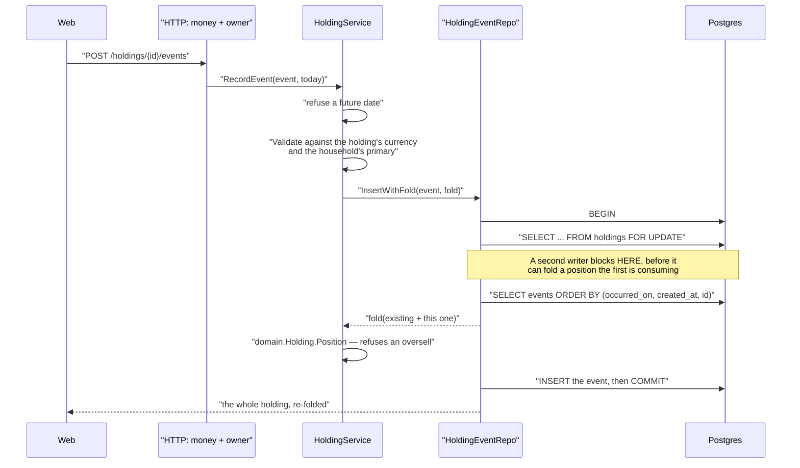

**Three things in that diagram are the feature, and each looks like a detail.**

**The lock is not decoration.** Reading the events, folding them and inserting as
three separate calls is not equivalent to doing them atomically: two sales of 30
from a holding of 50 are each legal alone and illegal together, so both would
fold the same starting position and both commit — leaving events that cannot be
folded at all, which is a page that throws every time it loads and can only be
fixed from the page that is broken. `InsertWithFold` holds the row lock from
before the fold until after the insert. `DeleteWithFold` does the same in the
other direction, for removing a purchase a later sale was costed against.

**The fold stays in the domain.** The repository owns the transaction and the
lock; the rule it enforces is the caller's own closure, which is
`domain.Holding.Position`. An adapter that decided what "oversold" means would
be authorisation's mistake in a different costume.

**The ORDER BY is a contract.** `occurred_on` is a date, so buying and selling
the same morning is a tie, and `Position` sorts *stably* — it keeps whatever
order it is handed. The repository breaks the tie by the order the events were
actually recorded, and the answer depends on it: on identical same-day events,
buy-then-sell realises 750 where sell-then-buy realises 1000.

Reads compose the same way. `GET /holdings` issues three queries — every
holding, every event, every latest price — and folds each position in memory,
rather than one query per holding. A holding nobody has priced comes back with
**no** market value rather than a zero one: `hasMarketValue: false` and a null
`valuedAt`, so the screen says "No price recorded" instead of claiming the
holding is worthless. Producing that absence is the service's job, not the
handler's, and not the page's.

**Holdings are deliberately absent from net worth.** Nothing here touches
`accounts`, the net worth composition above, or the twelve-month trend. The
response carries `notInNetWorth: true` as a wire-level fact so the page states
it rather than hard-coding the sentence — when milestone 3 folds holdings in,
the flag changes on the server and the banner follows.

#### The period report — folded from the beginning, twice per period

`GET /holdings/report` answers what each holding earned over each of the last
N periods. It reads the household's whole history once — every holding
(archived included), every event, every income row, every price — groups those
by holding, and computes in memory.

**Each period is measured at both of its ends, and each end is folded from the
beginning of the holding's life**, never from the period boundary: average cost
depends on everything bought before the window, so a fold that started at the
boundary would price a sale off the wrong basis, silently, and only for
holdings bought earlier. Twelve quarters is therefore twenty-four full folds
per holding. At a household's scale that is microseconds; `HoldingService.Report`
says in a comment where it stops being free and that the answer is folding in
SQL rather than a cache, because two paths computing the same figure is how
this report and the portfolio screen would begin to disagree.

Each end is `(market value of what is held) − (cost of what is held)`, and the
period's unrealised figure is the difference between the two ends. That shape
is what makes the PRD's central rule — *buying more must never read as profit*
— true by construction rather than by a correcting term: a purchase adds the
same amount to both sides and moves the figure by exactly zero.

**A price serves a boundary only if it was recorded inside the window that
boundary closes**, and a period opens where the previous one closed, so the
windows chain. A price typed today therefore cannot rewrite a quarter somebody
has already read. Holding nothing at an end needs no price at all — that end is
provably zero, which is what stops every mid-period purchase from blanking.

**Blanking is per component.** When a needed price is missing, `unrealised` and
`total` come back null with a `reason`; `realised`, `income` and `fees` are
still there, because no price is involved in computing them. A quarter where
the household sold at a profit and forgot to type a price is not an unknowable
quarter.

**Income never enters the fold.** `holding_income` is a separate table rather
than a third `holding_events.kind`: a dividend changes neither what is held nor
what it cost, so folding it through the average-cost pool would make every
disposal after it realise the wrong number. The report sums it beside the
position instead. Fees are stored positive and subtracted there.

**Every figure is carried in two currencies, folded rather than converted.**
`domain.Position` keeps a second cost pool in the household's own currency,
filled from the primary-currency amount the owner recorded on each event. Two
lots of the same US stock bought at different exchange rates blend to an SGD
cost per unit that is neither rate, so no single rate applied to the USD
realised figure reproduces it. This is also why the household's primary
currency cannot change while it holds anything (§3, `HoldingCounter`).

### Retros — one shared draft, a version guard that a tick deliberately bypasses

```mermaid
sequenceDiagram
    participant B1 as Browser (Andreas)
    participant B2 as Browser (Christine)
    participant H as Handler
    participant Svc as RetroService
    participant RRepo as RetroRepository
    participant ARepo as RetroActionRepository
    participant DB as Postgres

    B1->>H: POST /api/v1/retros
    H->>Svc: Start(householdID, today)
    Svc->>Svc: StartableMonth -- earlier of {prev, current}<br/>with no retro row (domain, pure)
    Svc->>RRepo: Create(householdID, month)
    RRepo->>DB: INSERT retros (version=1) -- ErrAlreadyExists<br/>on the UNIQUE(household_id, month) clash

    B1->>H: PATCH /api/v1/retros/{month} { mood, wentWell, wasHard,<br/>notes, version: 1 }
    H->>Svc: Save(RetroUpdate{..., Month, Version: 1})
    Svc->>RRepo: Update(u)
    RRepo->>DB: UPDATE retros SET ..., version = version + 1<br/>WHERE id = $1 AND version = 1
    RRepo-->>Svc: RetroRecord{version: 2}
    Svc-->>B1: 200 { ..., version: 2 }

    B2->>H: PATCH /api/v1/retros/{month} { ..., version: 1 }
    Note over B2,H: Christine's tab still holds the version<br/>it loaded the retro at
    H->>Svc: Save(RetroUpdate{..., Version: 1})
    Svc->>RRepo: Update(u)
    RRepo->>DB: UPDATE ... WHERE version = 1 -- 0 rows,<br/>the row is now at version 2
    RRepo->>DB: ByMonth recheck -- row exists, so this is a<br/>stale write, not a deleted retro
    RRepo-->>Svc: ErrRetroChanged
    Svc-->>B2: 409 "Christine changed this while<br/>you were typing -- reload to see it"

    B1->>H: PATCH /api/v1/retros/{month}/actions/{id} { done: true }
    Note over H,ARepo: The tick never reads or writes retros.version --<br/>a different table, so it can never collide<br/>with the text above
    H->>Svc: SetActionDone(householdID, actionID, true, now)
    Svc->>ARepo: SetDone(householdID, actionID, true)
    ARepo->>DB: UPDATE retro_actions SET done_at = now()<br/>WHERE id = $1

    B1->>H: POST /api/v1/retros/{nextMonth}
    H->>Svc: Start(householdID, today)
    Svc->>RRepo: Create(householdID, nextMonth)
    B1->>H: GET /api/v1/retros/{nextMonth}
    H->>Svc: Month(householdID, nextMonth)
    Svc->>ARepo: OpenInMonth(householdID, previousMonth)
    ARepo-->>Svc: this month's own unticked actions
    Svc-->>B1: 200 { ..., carryOver: [...] } -- "Still open from July"
    B1->>H: POST /api/v1/retros/{nextMonth}/actions<br/>{ body, carriedFrom: july's own action id }
    H->>Svc: AddAction(in)
    Svc->>ARepo: Add(in) -- action + assignees, one transaction
    Note over ARepo,DB: July's own row is untouched and stays<br/>unticked (decision 4) -- carriedFrom is<br/>provenance only, ON DELETE SET NULL
```

**The `version` guard exists because a retro is one shared draft with no
per-line ownership** (decision 1) — either partner can open it and type into
the same two textareas, so two browsers editing at once is the normal case,
not an edge one. `retros.version` increments on every successful `Update`,
and a save sends back the version it loaded; a mismatch means someone else's
save landed first, and the repository refuses the write rather than merging
the two drafts or silently letting the second save win (decision 6). The
copy the household sees — "Christine changed this while you were typing —
reload to see it" — never claims the partner's text was lost, because it
was not: `Update` writes nothing on a stale version, so the only thing that
needs recovering is the *other* browser's own unsent paragraph, which is
still sitting in its own textarea. `RetroRepository.Update`'s own doc
comment (`ports.go`) is where a future editor would look to change this, and
it says why the check has to be a single `WHERE id = $1 AND version = $2`
rather than a read-then-compare: a check-then-write can itself race, the
same class of bug `docs/LEARNING.md`'s database catalogue already carries for
Bills' `SetBillNextDue`.

**Ticking an action deliberately never touches `retros.version`, and that is
not an oversight — it is the reason the guard can exist at all without
making the screen unusable.** `retro_actions.done_at` lives in its own table;
`SetActionDone` writes only that row. Actions get ticked all month long,
well after retro night, by whichever partner does the thing first — if
ticking bumped the same `version` the text guard reads, then the household's
normal use of the actions list (one box ticked most days) would collide with
the other partner's next attempt to edit a stray line in the notes, and every
such collision would show the "reload" banner for a save that touched
nothing the other person cared about. Splitting the two into different
tables is what lets "two people editing shared prose" and "two people ticking
independent boxes" have different concurrency rules, without either one
degrading the other. This is why `RetroActionRepository` is its own port
(§3) rather than a second set of methods on `RetroRepository` — the two
tables are guarded by two genuinely different rules, not by convention.

**Carrying an action forward writes a new row; it never moves the old one.**
`OpenInMonth` reads the *immediately previous* month's unticked actions only
(decision 4 — a household that skipped four months is not handed an
unbounded backlog the night they come back), and `AddAction` with
`carriedFrom` set inserts a fresh `retro_actions` row on the new month with
`carried_from` pointing at the original; the original stays exactly as it
was, still unticked, still on July's own retro. Nothing here is a move or an
update — carrying an action is structurally the same write as adding a brand
new one, with one extra foreign key naming where it came from
(`ON DELETE SET NULL`, so deleting July's own row can never take August's
copy of it down too).

### Vision — a whole-document replace, and a `version: 0` that means "create"

```mermaid
sequenceDiagram
    participant B1 as Browser (Andreas)
    participant B2 as Browser (Christine)
    participant H as Handler
    participant Svc as VisionService
    participant VRepo as VisionRepository
    participant DB as Postgres

    B1->>H: GET /marriage/vision?year=2026
    H->>Svc: Get(householdID, 2026)
    Svc->>VRepo: Get(householdID, 2026)
    VRepo->>DB: SELECT ... -- no row for this household-year
    VRepo-->>Svc: domain.ErrNotFound
    Svc-->>B1: 200 version 0, theme empty, pillars/milestones empty<br/>-- the empty state IS the page, never 404

    B1->>H: PUT /marriage/vision/2026<br/>{ version: 0, theme: "Slow down together", ... }
    H->>Svc: Save(householdID, 2026, draft)
    Svc->>VRepo: Save(v) -- v.Version == 0
    VRepo->>DB: BEGIN
    VRepo->>DB: INSERT INTO visions ... ON CONFLICT DO NOTHING -- 1 row, version=1
    VRepo->>DB: DELETE every child, then INSERT every submitted<br/>pillar/measure/milestone, position = array index
    VRepo->>DB: COMMIT
    VRepo->>DB: Get(householdID, 2026) -- pool-backed, AFTER commit,<br/>never from inside the open transaction (see below)
    VRepo-->>Svc: domain.Vision, version 1
    Svc-->>B1: 200 { ..., version: 1 }

    B2->>H: PUT /marriage/vision/2026<br/>{ version: 0, theme: "A different theme", ... }
    Note over B2,H: Christine's tab loaded the same empty January<br/>before Andreas's save landed
    H->>Svc: Save(householdID, 2026, draft)
    Svc->>VRepo: Save(v) -- v.Version == 0
    VRepo->>DB: INSERT ... ON CONFLICT DO NOTHING -- 0 rows,<br/>the year now has one
    VRepo-->>Svc: domain.ErrVisionChanged
    Svc-->>B2: 409 this vision changed while you were editing it
```

**`version: 0` on the wire means two different things depending on direction,
and that is deliberate, not overloaded.** `GET` sends it to mean "nobody has
saved this year yet"; `PUT` reads it back to mean "create it" rather than
"blind overwrite." Without that meaning, the first save of a January is the
one place the guard in decision 10 could not work at all: both owners open
the modal on the same blank year, both hold the version `GET` gave them —
which would have to be *something* — and whichever one saves second either
silently wins (no guard) or is refused for having "the wrong version" of a
document that never existed (a confusing refusal for a household's very
first save). Routing `version == 0` to `CreateVision ... ON CONFLICT DO
NOTHING` gives the create path the exact same "someone else won" answer,
`domain.ErrVisionChanged`, that a stale update gets — one error the frontend
already has a banner for, not a second one to build.

**The existence check on a stale `UPDATE` must run on the open transaction's
own connection, never on the pool-backed `Get`.** A zero-row `UPDATE ...
WHERE version = $n` is ambiguous — the row could be gone, or another save
could have landed first — and telling those apart needs a second read
(`RetroRepository.Update`'s own pattern, the Retros flow just above).
`VisionRepo.Save`
originally ran that second read through `r.Get`, which acquires its own
connection from the pool; called from inside `pgx.BeginFunc`, which is
already holding one connection checked out, that is a request for a *second*
connection while the first is still in use. One concurrent save hits this by
luck; enough concurrent version-guarded saves hit it at once, against
`pool.go`'s `MaxConns`, and every one blocks forever waiting for a connection
none of the others can release — a self-deadlock, not a slowdown, and now
its own `docs/LEARNING.md` entry. The fix routes the
existence check through `q`, the transaction-scoped `*sqlcgen.Queries` the
open transaction already holds, never back out to the pool.

**A save deletes and reinserts every child row, so a measure's id never
survives an edit — nothing outside its own vision references one, so
nothing breaks (spec decision 5).** The read-back after `Save` runs
deliberately *after* `COMMIT`, on the pool rather than the closed
transaction: Postgres's own MVCC guarantees it sees this write's committed
state or a later one, never an in-progress one, so the only race is another
save landing in the gap between commit and read-back — which hands the
caller a valid, current document and a valid version token, just possibly
not the exact content their own write produced. No lost update either way,
the same "hand back what's actually stored" contract
`RetroRepository.Update`'s own doc comment already promises.

**`measure_is_typed_or_linked`'s third branch is what stops deleting a goal
from breaking Vision, and it is currently reachable only by SQL, not by the
product.** `vision_measures.goal_id` is `ON DELETE SET NULL` (§6) — a
*referential action*, which Postgres executes as an `UPDATE` on the measure
row, and Postgres enforces `CHECK` constraints on every `UPDATE`, not only on
`INSERT`. A CHECK with only "typed" and "linked" branches would leave that
`UPDATE` writing `goal_id`, `target_value` and `current_value` all `NULL` —
a row satisfying neither branch — so deleting the goal would fail with a
constraint violation raised **inside the Goals feature**, the one place
nobody debugging it would think to look at Vision. The third branch is
exactly the broken-link state decision 8 already describes how to render, so
the database is permitted to reach it only because `SET NULL` produces it;
the domain still refuses to *create* one directly (a `PUT` naming neither a
goal nor a target is `422`). **There is no `DELETE /goals/{id}` route in
this product today** — `GoalRepository` carries no `Delete` method at all,
and Goals only ever archives (`SetArchived`, the same shape Accounts and
Bills use) — so this branch cannot be exercised through the app as it
stands; `TestDeletingALinkedGoalUnlinksTheMeasureInsteadOfFailing` proves it
directly against Postgres with a raw `DELETE FROM goals`, the only way to
reach it today. The constraint is defence for the day a real delete path
arrives, not dead code: an archived goal keeps its link and its figure
regardless (archiving is not deletion anywhere else in this product either),
so the branch currently guards a schema-level possibility rather than a
reachable user action — worth knowing before treating "goal deletion" as a
tested product flow rather than a tested database one.

**`GoalProgressReader.ProgressByIDs` turns a missing id into a blank
figure, never an error, which is what makes decision 8's rendering rule a
lookup miss rather than an exception path.** A measure whose `goal_id` has
gone `NULL` — by the mechanism above, or a link that simply failed to
resolve — is not in the map `ProgressByIDs` returns; `VisionService.Get`
reads that absence and sets `MeasureView.HasFigure = false`, so the page
renders the label with a short named explanation and no number, never a
stale or a zero one (the same "blank the figure and say why" rule Accounts
applies when a primary-currency change leaves net worth uncomputable). An
*archived* goal is still found and still keeps its figure — `ProgressByIDs`
must not filter on `archived_at` the way `GoalRepository.List`'s
`includeArchived` switch does, because archiving is not deletion here either
and Vision always wants the figure a linked measure is pointing at.

### Agreements — propose → sign, the first flow with two actors and a gap between them

```mermaid
sequenceDiagram
    participant B1 as Browser (Andreas)
    participant B2 as Browser (Christine)
    participant H as Handler
    participant Svc as AgreementService
    participant Repo as AgreementRepository
    participant DB as Postgres

    B1->>H: POST /api/v1/marriage/agreements/proposals<br/>{ kind: "add", sectionId, body }
    H->>H: ParseAgreementProposalKind(body.Kind) -- 422 here,<br/>never a shared sentinel with a corrupt column
    H->>Svc: Propose(householdID, membershipID, proposal, now)
    Svc->>Repo: owners of this household, live
    Note over Svc: Fewer than two owners -> ErrAgreementsNeedTwoOwners<br/>BEFORE any repository write (decision 1)
    Svc->>Repo: CreateProposal(AgreementProposalWrite{...})
    Repo->>DB: BEGIN
    Repo->>DB: INSERT agreement_proposals (status 'pending')
    Repo->>DB: INSERT agreement_signatures (this proposer)
    Repo->>DB: COMMIT
    Note over Repo,DB: Two rows, one transaction (decision 5):<br/>proposing IS agreeing, and a proposal without<br/>its author's signature is one nobody has agreed to
    Svc->>Repo: Document(householdID) -- recomposed AFTER the write
    Svc-->>B1: 201 { proposal: {... awaitingNames: ["Christine"]}, agreements: {...} }

    B2->>H: GET /api/v1/marriage/agreements
    H->>Svc: Get(householdID)
    Svc->>Repo: Document(householdID) -- four list queries
    Svc->>Svc: version = count(accepted) + 1; 01..N numbering across<br/>sections; AwaitingSignature(owners now, signed) per proposal
    Svc-->>B2: 200 { agreements: { version: 1, proposals: [...] } }

    B2->>H: POST /api/v1/marriage/agreements/proposals/{id}/agree
    H->>Svc: Sign(householdID, proposalID, membershipID, now)
    Svc->>Repo: Sign(AgreementSignatureWrite{...})
    Repo->>DB: BEGIN
    Repo->>DB: SELECT status -- already resolved? ErrAgreementNotOpen
    Repo->>DB: SELECT ... FROM agreements WHERE id = target<br/>AND removed_at IS NULL AND body = previous_body FOR UPDATE
    Note over Repo,DB: The lock is on the AGREEMENT, not the proposal<br/>(decision 12): two proposals against one agreement<br/>are ordered with respect to each other. A miss on any<br/>of the three predicates is ErrAgreementChanged and<br/>nothing is written (decision 13)
    Repo->>DB: INSERT agreement_signatures ... ON CONFLICT DO NOTHING
    Repo->>DB: owners of this household, re-read INSIDE this transaction
    Note over Repo,DB: The signing set is every CURRENT owner, evaluated<br/>live (decision 4) -- an owner who joined mid-proposal<br/>must sign, one who left stops blocking it
    Repo->>DB: every owner signed -> INSERT agreements / UPDATE removed_at,<br/>then UPDATE the proposal to 'accepted', resolved_at = now
    Repo->>DB: COMMIT
    Svc->>Repo: Document(householdID)
    Svc-->>B2: 200 { proposal: { status: "accepted" }, agreements: { version: 2, ... } }

    B1->>H: GET /api/v1/marriage/agreements (Andreas's next paint)
    Svc-->>B1: 200 -- the agreement is live, numbered, and in the history list
```

**Every write returns the whole document**, not only the row it touched, because
each one moves four things at once: the version, the `01..N` numbering, the
history list and which proposals are still open. It is composed *after* the
transaction commits, so it is a snapshot a concurrent Agree may already have
overtaken — which is why the frontend invalidates one query key and refetches
rather than trusting what it got back. The `proposal` beside it is the only
place `accepted` or `withdrawn` reaches the wire, and no screen renders it; it
exists so the HTTP tests can assert the transition field by field.

**The signing set is recomputed on every signature rather than snapshotted at
proposal time**, and that is the decision most likely to be "simplified" later.
Snapshotting means a proposal can be completed by people who no longer live in
the household, which is the wrong answer to the question this feature exists to
ask. The cost is the one decision 16 pays for: a proposal can become fully
signed by nobody's action — three owners, one proposes, one agrees, the third
leaves — so `canAgree` stays true when the awaiting list is empty, and one
idempotent re-Agree closes it. No background job, no sweeper.

**The version is `count(accepted proposals) + 1`, derived on every read.** A
stored counter can drift from the rows it counts, the same reasoning that kept an
analytics table out of the admin metrics screen. The numbering is derived at
render for the same family of reasons (decision 11): an ordering integer needs a
writer, the only safe writer is `max(position) + 1` inside the insert, two owners
can still collide on it, and no reordering control is drawn anywhere — so the
column would exist only to create the race.

### What the frontend loads

```mermaid
graph TD
    Boot["App start"] --> Me["GET /auth/me<br/>cached as ['me']"]
    Me --> Guard{"Authenticated?"}
    Guard -->|no| SignIn["/sign-in"]
    Guard -->|yes| Shell["AppShell"]
    Shell --> Bar["MobileTopBar — below lg only<br/>(hamburger opens the drawer)"]
    Shell --> Drawer["NavDrawer — off-canvas below lg,<br/>lg:contents at lg and above"]
    Drawer --> Sidebar["Sidebar renders me.spaces —<br/>already filtered and ordered by the server —<br/>expanding each into its built pages client-side,<br/>and dropping a builtin space that has none"]
    Shell --> Page["Route content"]
    Page --> Overview["/ Overview — GET /accounts,<br/>GET /budgets/{month}, GET /goals and<br/>GET /bills for an owner only; GET<br/>/household/members via the shared hook;<br/>GET /retros and GET /marriage/vision<br/>for a marriage member"]
    Page --> Settings["Settings panels — their own queries"]
    Settings -->|"on mutation"| Invalidate["invalidate ['me'] and the panel's query,<br/>awaited so the guard spans the refetch"]
```

**The shell follows one responsive convention, everywhere: `sm` (640px) is
where a page's own content reflows — auth cards, page gutters, modal field
pairs — and `lg` (1024px) is the one breakpoint that changes the *shell*
itself.** Below `lg`, `Sidebar` sits inside `NavDrawer`, off-canvas and
reached through `MobileTopBar`'s hamburger; at `lg` and above, the original
two-column grid (`grid-cols-[236px_1fr]`, unchanged since before this
project's mobile round) is back, exactly as it was. No third breakpoint is
introduced for the shell, and a page component never needs to know which of
the two rendering modes it is in.

**One more rule holds codebase-wide, and it is easy to undo by habit: every
full-height box is sized in `dvh`, never `vh`.** On iOS Safari `100vh` is the
*large* viewport — the height as though the URL bar were already hidden — so a
box built against it puts its bottom edge underneath the toolbar on first
paint. That is not a cosmetic margin: `AccountModal`'s content measures 665px
against roughly 650px of visible height on an iPhone, which puts its submit
button exactly where a thumb cannot reach. All fourteen viewport-height rules
in `web/src` — `Modal`, `NavDrawer`, `AppShell`, `RequireAuth`, the route
fallback and every auth screen — use `dvh`/`min-h-dvh` for that reason, and
nothing in this stack's tooling (headless Chrome, jsdom) reproduces the
toolbar, so a `vh` that creeps back in will not be caught by any test here.

**`NavDrawer` is what makes that restoration free, and `lg:contents` is why.**
At `lg` and above `NavDrawer`'s wrapper carries `lg:contents`, which makes the
element stop generating a box at all — its `<div>` disappears from layout
entirely, and `Sidebar` becomes AppShell's grid child directly, precisely as
if `NavDrawer` were never there. `position` and `transform` — the two
properties that hold the closed drawer off-canvas below `lg` — have no effect
on a `display: contents` element, so neither needs an `lg:` counterpart to
undo it. `visibility` is the one
exception, and it is why `NavDrawer`'s closed state carries an explicit
`lg:visible`: unlike `position`/`transform`, `visibility` is an *inherited*
CSS property, and `display: contents` suppresses the box, not the
inheritance. Without `lg:visible`, the desktop sidebar — whose drawer is
normally *closed* — would inherit `invisible` from its own wrapper and render
as a 236px column nobody can see. The lesson generalises past this one
component: `display: contents` opts an element out of the properties that
require a box (layout, backgrounds, hit-testing) but not out of the ones that
merely inherit, and a `contents` wrapper hiding a normally-open child with
`visibility` needs the same override.

`/auth/me` returns the user, household, membership, capabilities and visible
spaces in one response, so the shell renders without a request waterfall. The
sidebar never filters or re-sorts `me.spaces` client-side — duplicating that
rule is how the two drift. It does expand each space into its built pages: a
client-side map (`SPACE_PAGES` in `Sidebar.tsx`) turns a space with built
pages into the design's uppercase group label plus one link per page, one
page or several alike — Money renders as "MONEY" over Finances,
Transactions, Budget, Goals and Bills; Marriage renders as "MARRIAGE" over
its two pages, Retros and Vision & goals (Vision spec's task 11 added the
second — see "Route table" §4 and the marriage/ entry below).

**Overview fetches nothing of its own.** Its seven requests are the ones
Accounts, Budget, Goals, Bills, Retros, Vision and Settings already make,
through the same hooks and the same cache keys, so a figure on the front
door cannot disagree with the same figure on the screen it links to — the
browser walk checks exactly that (net worth on `/` against net worth on
`/money`). `useGoals` is the same hook `GoalsPage` itself calls, so the "X
of Y on track" figure on Overview's Goals card and the same count on
`/money/goals` share one cache entry rather than risking two independent
reads of `GET /goals` disagreeing; `NextBillCard` reuses `useBills` the
identical way, against `/money/bills`'s own cache entry, and gained no
query of its own — the `enabled` option `useBills` grew for exactly this
reuse (Task 11) predates `NextBillCard` by several tasks. `NextRetroCard`
reuses `useRetros` the same way again, against `/marriage/retros`'s own
cache entry, reading `openActionCount` rather than `actionCount` — the two
disagree the moment a retro's actions are partly ticked, and
`docs/LEARNING.md` carries the gap between them as its own entry.

**`RetrosPage` itself, not just Overview's card, now fires a second request
of its own.** It mounts `AgreementsToDiscuss` unconditionally (spec decision
7), which fires `GET /marriage/agreements` — the identical query key
`AgreementsPage` uses — beside the page's own `GET /retros`. A household that
visits `/marriage/agreements` and `/marriage/retros` in the same session pays
for one fetch of that document, not two, because both mounts read the same
cache entry; agreeing a parked proposal from either page invalidates the one
key both watch.

`VisionCard` and `NextRetroCard`'s own check-in strip (Vision spec's task
13) push the pattern one step further: both call `useVision(currentVisionYear())`
directly rather than either taking the data as a prop from the other, because
`useVision` (unlike `useBills`/`useGoals`) was never given an `enabled`
option — a member without `marriage` must still never be allowed to call it,
so the only gate available is `OverviewPage` choosing not to mount either
component at all. That leaves *two* independent callers on Overview alone,
plus `VisionPage`'s own third — all three key off `visionQueryKey(year)`, so
a household that glances at Overview and then opens `/marriage/vision` in
the same visit still costs one `GET /marriage/vision` call, not three.
One of those hooks is new
only in the sense that it stopped being three: `useHouseholdMembers` was
declared privately and identically in `AccountModal`, `TransactionsPage` and
`MembersPanel`, all against `["household", "members"]`, sharing one cache
entry by coincidence rather than by construction; Overview would have been
the fourth copy, so it is now one module in `features/settings/`. `Budget`
and Overview likewise share `currentMonth()` (`features/money/month.ts`),
which reads the *local* calendar — the two screens must agree on which month
"this month" is, and the API container's own clock is UTC.

**A builtin space the map does not name renders nothing at all.** Since
`110ab0a`, Family is exactly that: it had a single "destination" whose whole
content was the sentence "Arriving in slice N", the team's own planning
vocabulary shown to a customer, so the page and its route were deleted and
its `SPACE_PAGES` entry with them. Marriage was in the identical state from
`110ab0a` until task 10, when its own route, guard and `SPACE_PAGES` entry
(one page, Retros) all came back together — splitting them across tasks
would have left a route nobody could reach or a sidebar link to a 404, the
same reasoning `110ab0a` itself gives for deleting all three of a space's
pieces together rather than leaving one behind. The rule keys off
`isBuiltin`, **not** off the absence of a pages entry — a *custom* space
created through "+ New space" has no map entry either and must keep
appearing, because a household that just made a space needs to see that it
exists. So there are three cases, not two: a space with built pages → the
group label plus one link per page, whether it has one shipped page (Marriage
today) or several (Money); a custom space → its name as plain text, since it
has no route to link to; a *builtin* space with no built page (Family) →
nothing rendered. Marriage's return is what first exercised the
group-label-plus-one-link shape for a real space — the single-link rendering
branch that used to special-case exactly one page had already been deleted
as unreachable once every remaining builtin space had two or more (Money),
so nothing in `SpaceLink` needed to change; the general branch already
handled `pages.length === 1` the same as `length > 1`. The map, not the
server payload, decides how many links a space produces; the server payload
still decides which spaces are *visible to this member* at all and in what
order, and Settings' own Spaces panel lists Marriage and Family regardless of
either one's navigation state, because the spaces themselves — unlike their
navigation — were never touched.

---

## 6 · Data model

```mermaid
erDiagram
    households ||--o{ memberships : has
    households ||--o{ invites : has
    households ||--o{ sessions : scopes
    households ||--o{ spaces : has
    households ||--o{ login_attempts : scopes
    households ||--|| notification_preferences : has
    households ||--o{ accounts : owns
    memberships ||--o{ accounts : "may own (nullable = shared)"
    households ||--o{ categories : has
    households ||--o{ transactions : has
    categories ||--o{ transactions : "labels (nullable, SET NULL)"
    memberships ||--o{ transactions : "paid by (nullable, SET NULL)"
    accounts ||--o{ transactions : "from (nullable, CASCADE)"
    accounts ||--o{ transactions : "to (nullable, CASCADE)"
    households ||--o{ budgets : has
    budgets ||--o{ budget_lines : has
    categories ||--o{ budget_lines : caps
    households ||--o{ goals : has
    goals ||--o{ goal_contributions : has
    accounts ||--o{ holdings : "holds"
    holdings ||--o{ holding_events : "bought and sold"
    holdings ||--o{ holding_valuations : "priced on a day"
    holdings ||--o{ holding_income : "paid out and charged"
    households ||--o{ goal_contributions : scopes
    goals ||--o{ budgets : "may receive a rollover (nullable)"
    households ||--o{ bills : has
    accounts ||--o{ bills : "pays from (NOT NULL, supplies currency)"
    categories ||--o{ bills : "labels (nullable, SET NULL)"
    memberships ||--o{ bills : "paid by (nullable, SET NULL)"
    bills ||--o{ bill_payments : has
    households ||--o{ bill_payments : scopes
    transactions ||--o| bill_payments : "the expense it wrote (nullable, SET NULL)"
    households ||--o{ retros : has
    retros ||--o{ retro_actions : has
    retro_actions ||--o{ retro_action_assignees : has
    memberships ||--o{ retro_action_assignees : "assigned to (CASCADE)"
    households ||--o{ visions : "has, one per year (UNIQUE household_id, year)"
    visions ||--o{ vision_pillars : has
    vision_pillars ||--o{ vision_measures : has
    goals ||--o{ vision_measures : "may be linked (nullable, SET NULL)"
    visions ||--o{ vision_milestones : has
    households ||--o{ agreement_sections : has
    agreement_sections ||--o{ agreements : groups
    households ||--o{ agreements : scopes
    households ||--o{ agreement_proposals : has
    agreement_sections ||--o{ agreement_proposals : "the section the change is about"
    agreements ||--o{ agreement_proposals : "target of an edit or remove (nullable, NO ACTION)"
    agreement_proposals ||--o{ agreements : "added by (NOT NULL) and removed by (nullable)"
    agreement_proposals ||--o{ agreement_signatures : collects
    users ||--o{ memberships : holds
    users ||--o{ sessions : owns
    users ||--o{ magic_links : owns
    users ||--o{ login_attempts : may_reference
    users ||--o{ invites : invited_by
    users ||--o| telegram_accounts : "may be bound to one chat (UNIQUE both ways)"
    users ||--o{ telegram_link_requests : "may mint link nonces (nullable — a sign-in nonce names no user)"
    users ||--o| platform_admins : "may be one (UNIQUE user_id, the PK)"
    users ||--o{ admin_audit_log : acted_as
    users ||--o{ admin_reauth_attempts : "attempted (own ledger, not login_attempts)"
    households ||--o{ household_feature_flags : overrides

    households {
        uuid id PK
        text name
        text family_name
        char primary_currency
        bool show_secondary_currency
        char secondary_currency
        text fx_rate_mode
    }
    users {
        uuid id PK
        citext email "nullable — children have none"
        text password_hash "nullable"
        text display_name
        text avatar_initial
    }
    memberships {
        uuid id PK
        uuid household_id FK
        uuid user_id FK
        text role "owner | limited"
        text_array capabilities "calendar chores money marriage"
    }
    invites {
        uuid id PK
        uuid household_id FK
        citext email
        text role
        bytea token_hash
        uuid invited_by FK
        timestamptz expires_at
        timestamptz accepted_at
    }
    sessions {
        uuid id PK
        bytea token_hash
        uuid user_id FK
        uuid household_id FK
        timestamptz expires_at
        timestamptz revoked_at
        timestamptz admin_grant_expires_at "nullable — the re-auth grant; not a second cookie"
        timestamptz last_seen_at "nullable — last use, refreshed at most hourly; readers COALESCE with created_at"
    }
    api_tokens {
        uuid id PK
        uuid user_id FK "CASCADE — a token cannot outlive its person"
        uuid household_id FK "CASCADE"
        text name "what it is for; what a listing shows"
        bytea token_hash "UNIQUE — SHA-256 of the whole raw hearth_… string"
        text prefix "first 8 characters of the secret, for telling tokens apart"
        timestamptz expires_at "NOT NULL — default 90 days, at most 365; no extend-on-use"
        timestamptz last_used_at "nullable — touched at most hourly, like sessions"
        timestamptz revoked_at "nullable — a stamp; the live lookup excludes it"
    }
    platform_admins {
        uuid user_id PK "also FK to users, ON DELETE CASCADE"
        text note "NOT NULL, defaults to empty"
        timestamptz created_at
    }
    feature_flags {
        text key PK "no FK to a registry — the registry is compile-time (domain.AllFlags)"
        bool enabled
        timestamptz updated_at
        uuid updated_by FK "nullable, ON DELETE SET NULL"
    }
    household_feature_flags {
        uuid household_id PK "also FK to households, ON DELETE CASCADE — composite PK with key"
        text key PK "same no-registry-FK rule as feature_flags above"
        bool enabled
        timestamptz updated_at
        uuid updated_by FK "nullable, ON DELETE SET NULL"
    }
    admin_audit_log {
        uuid id PK
        uuid actor_user_id FK "NOT NULL, no ON DELETE CASCADE — see the notes below"
        text action "method plus path, e.g. GET /api/v1/admin/flags"
        text target "the request path — see the notes below for why, not the route pattern"
        jsonb detail "NOT NULL, defaults empty — carries the raw query string as detail.query when there is one; never a secret, never a row value"
        text ip "trustworthy only as far as the proxy in front of this service"
        timestamptz created_at
    }
    admin_reauth_attempts {
        uuid id PK
        uuid user_id FK "NOT NULL, ON DELETE CASCADE — own ledger, not login_attempts"
        bool succeeded
        timestamptz at
    }
    magic_links {
        uuid id PK
        uuid user_id FK
        bytea token_hash
        timestamptz expires_at
        timestamptz consumed_at
    }
    signups {
        uuid id PK
        citext email "nullable — NULL for a Telegram sign-up"
        bigint telegram_chat_id "nullable — NULL for an email sign-up"
        bytea token_hash
        timestamptz expires_at
        timestamptz consumed_at "nullable"
    }
    telegram_accounts {
        uuid id PK
        uuid user_id FK "NOT NULL, UNIQUE, ON DELETE CASCADE"
        bigint chat_id "NOT NULL, UNIQUE"
        timestamptz linked_at
        boolean nudges_enabled "NOT NULL DEFAULT true — /nudges off"
        text chat_username "nullable — display only, carried from the link request that confirmed this row"
    }
    nudge_deliveries {
        bigint chat_id PK
        uuid household_id PK "FK ON DELETE CASCADE"
        date day PK
        timestamptz sent_at "claimed before the send; deleted if it fails"
    }
    telegram_link_requests {
        uuid id PK
        bytea nonce_hash "NOT NULL, UNIQUE"
        timestamptz expires_at
        timestamptz consumed_at "nullable — set with chat_id, never alone"
        bigint chat_id "nullable — CHECK ties it to consumed_at"
        timestamptz created_at
        uuid user_id FK "nullable — NULL is a sign-in nonce (00011), set is a link nonce minted by that member; ON DELETE CASCADE"
        text chat_username "nullable — stamped with chat_id at redemption; display only, never a check"
    }
    login_attempts {
        uuid id PK
        uuid household_id FK "nullable"
        uuid user_id FK "nullable"
        citext email
        bool succeeded
        timestamptz at
    }
    spaces {
        uuid id PK
        uuid household_id FK
        text key
        text name
        text visibility "everyone | parents_only | custom"
        int position
        text required_capability
    }
    accounts {
        uuid id PK
        uuid household_id FK
        text nickname
        text type "cash | investment | property | loan | credit_card"
        uuid owner_membership_id FK "nullable — NULL means shared"
        bigint opening_balance_minor
        char opening_balance_currency
        date opening_balance_as_of
        bool count_toward_net_worth "default true"
        bool visible_to_limited_members "default false"
        timestamptz archived_at "nullable — never deleted"
    }
    categories {
        uuid id PK
        uuid household_id FK
        text name
        text kind "expense | income"
        int sort_order "the design's order, not alphabetical"
        timestamptz archived_at "nullable — never deleted"
    }
    transactions {
        uuid id PK
        uuid household_id FK
        text kind "expense | income | transfer"
        date occurred_on "a date, not a timestamptz — a household has no timezone"
        text description
        uuid category_id FK "nullable — SET NULL, never on a transfer"
        uuid paid_by_membership_id FK "nullable — SET NULL"
        uuid from_account_id FK "nullable — CASCADE"
        uuid to_account_id FK "nullable — CASCADE"
        bigint amount_minor "CHECK > 0 — sign comes from kind, not the value"
        char amount_currency
        bigint received_amount_minor "nullable — transfer only"
        char received_amount_currency "nullable, paired with the amount above"
        text idempotency_key "nullable — partial UNIQUE (household_id, key); a retry-safe create's handle, freed when the row is deleted"
    }
    budgets {
        uuid id PK
        uuid household_id FK
        date month "always the first of the month"
        bigint expected_income_minor "nullable — not provided"
        timestamptz rolled_over_at "nullable — whole with rollover_goal_id, CHECK"
        uuid rollover_goal_id FK "nullable — no ON DELETE, goals are never deleted"
        timestamptz created_at
        timestamptz updated_at
    }
    budget_lines {
        uuid id PK
        uuid budget_id FK "ON DELETE CASCADE"
        uuid category_id FK
        bigint cap_minor "CHECK >= 0"
    }
    goals {
        uuid id PK
        uuid household_id FK
        text name
        bigint target_amount_minor "CHECK > 0"
        char currency "explicit — unlike budgets, see the notes below"
        date target_month "nullable — no date means no on-track status"
        bigint planned_monthly_minor "CHECK >= 0"
        timestamptz archived_at "nullable — never deleted"
        timestamptz created_at
        timestamptz updated_at
    }
    goal_contributions {
        uuid id PK
        uuid goal_id FK
        uuid household_id FK "redundant with the goal's own — every read scopes by both"
        bigint amount_minor "CHECK non-zero — a downward correction is a negative row"
        date occurred_on
        text note
        text source "manual | starting_balance | budget_rollover"
        date source_budget_month "nullable — set only for source=budget_rollover"
        timestamptz created_at
    }

    holdings {
        uuid id PK
        uuid household_id FK
        uuid account_id FK "no ON DELETE — accounts archive, never delete"
        text name
        text instrument "CHECK stock | gold | other"
        text unit "share, gram, unit — a label; nothing computes with it"
        char currency "per row, like goals — a holding accumulates for years"
        timestamptz archived_at "nullable — archived, never deleted"
        timestamptz created_at
        timestamptz updated_at
    }

    holding_events {
        uuid id PK
        uuid holding_id FK
        uuid household_id FK "redundant with the holding's own — every read scopes by both"
        text kind "CHECK acquisition | disposal — income is deliberately NOT one"
        bigint quantity_nano "billionths of a unit; CHECK greater than zero"
        bigint amount_minor "the WHOLE event, not a unit price"
        bigint primary_amount_minor "nullable — the same event in the household's currency"
        char primary_currency "nullable — NULL together with the amount, by CHECK"
        date occurred_on
        text note
        timestamptz created_at
    }

    holding_valuations {
        uuid id PK
        uuid holding_id FK
        uuid household_id FK "redundant, scoped by both — as above"
        bigint unit_price_minor "PER UNIT, unlike holding_events.amount_minor"
        bigint primary_unit_price_minor "nullable"
        char primary_currency "nullable — NULL together, by CHECK"
        date as_of "the day the price was TRUE, not the day it was typed"
        text note
        timestamptz created_at
    }

    holding_income {
        uuid id PK
        uuid holding_id FK
        uuid household_id FK "redundant, scoped by both — as above"
        text kind "CHECK income | fee — both stored POSITIVE, the report subtracts fees"
        bigint amount_minor "CHECK greater than zero, unlike holding_events where the QUANTITY carries that rule"
        bigint primary_amount_minor "nullable — NULL together with the currency, by CHECK"
        char primary_currency "nullable"
        date received_on "the day the money moved, not the day it was typed"
        text note
        timestamptz created_at
    }
    bills {
        uuid id PK
        uuid household_id FK
        text name
        bigint amount_minor "CHECK > 0"
        text cadence "one_off | monthly | quarterly | yearly"
        date next_due "nullable — NULL only for a settled one-off"
        smallint due_anchor_day "CHECK 1-31 — the clamp target, kept apart from next_due"
        uuid category_id FK "nullable — SET NULL"
        uuid pay_from_account_id FK "NOT NULL — no currency column; this supplies it"
        uuid paid_by_membership_id FK "nullable — SET NULL"
        bool autopay "default false — display only, nothing schedules a payment"
        bool is_subscription "default false"
        timestamptz archived_at "nullable — never deleted"
        timestamptz created_at
        timestamptz updated_at
    }
    bill_payments {
        uuid id PK
        uuid bill_id FK
        uuid household_id FK "redundant with the bill's own — every read scopes by both"
        date due_on "the occurrence settled, NOT paid_on — every month figure keys off this"
        date paid_on
        bigint amount_minor "CHECK > 0 — may differ from the bill's own amount_minor"
        uuid transaction_id FK "nullable — ON DELETE SET NULL"
        timestamptz created_at
    }
    retros {
        uuid id PK
        uuid household_id FK
        date month "first of the month — UNIQUE(household_id, month)"
        smallint mood "CHECK 1-5, nullable — nullable and never 0 (a draft nobody rated)"
        text went_well "NOT NULL, defaults to empty"
        text was_hard "NOT NULL, defaults to empty"
        text notes "NOT NULL, defaults to empty"
        timestamptz completed_at "nullable — NULL is the whole draft concept, no status column"
        integer version "NOT NULL DEFAULT 1 — the concurrency guard, §5"
        timestamptz created_at
        timestamptz updated_at
    }
    retro_actions {
        uuid id PK
        uuid retro_id FK
        text body "NOT NULL"
        timestamptz done_at "nullable — the tick, never touches retros.version"
        uuid carried_from FK "nullable — ON DELETE SET NULL, provenance only"
        timestamptz created_at "ordering is created_at, id — no position column, see the notes below"
    }
    retro_action_assignees {
        uuid action_id PK "also FK to retro_actions — composite PK with membership_id, ON DELETE CASCADE"
        uuid membership_id PK "also FK to memberships — ON DELETE CASCADE"
    }
    visions {
        uuid id PK
        uuid household_id FK
        smallint year "CHECK 1900-2200 — UNIQUE(household_id, year), one row per calendar year"
        text theme "NOT NULL, defaults to empty — a row can exist while blank (GET never 404s)"
        text description "NOT NULL, defaults to empty"
        integer version "NOT NULL DEFAULT 1 — the concurrency guard; 0 never appears here, only on the wire"
        timestamptz created_at
        timestamptz updated_at
    }
    vision_pillars {
        uuid id PK
        uuid vision_id FK
        smallint position "UNIQUE(vision_id, position) — assigned from array order on save, no reordering UI yet"
        text name "NOT NULL"
        text description "NOT NULL, defaults to empty"
    }
    vision_measures {
        uuid id PK
        uuid pillar_id FK
        smallint position "UNIQUE(pillar_id, position)"
        text label "NOT NULL"
        integer current_value "nullable — typed measures only"
        integer target_value "nullable — typed measures only"
        uuid goal_id FK "nullable — ON DELETE SET NULL, linked measures only"
    }
    vision_milestones {
        uuid id PK
        uuid vision_id FK
        smallint year "CHECK 1900-2200 — independent of visions.year, usually years ahead"
        text title "NOT NULL"
        text note "NOT NULL, defaults to empty"
        smallint position "UNIQUE(vision_id, position)"
    }
    agreement_sections {
        uuid id PK
        uuid household_id FK
        text name "NOT NULL — UNIQUE(household_id, name), mapped by constraint name so the screen can say 'you already have that section'"
        timestamptz created_at "NOT NULL, no DEFAULT now(): the starter set writes four rows in one transaction and stamps them strictly apart"
    }
    agreement_proposals {
        uuid id PK
        uuid household_id FK
        text kind "NOT NULL CHECK add|edit|remove — parsed in Go, the CHECK is a backstop"
        text status "NOT NULL CHECK pending|parked|accepted|withdrawn — no decline and no expiry (decision 6)"
        uuid section_id FK "NOT NULL — copied from the target on an edit or a remove, so a pending edit whose target is removed still has a card"
        uuid target_agreement_id FK "nullable — NULL for an add; FK added after agreements exists, the two tables name each other"
        text body "NOT NULL DEFAULT '' — empty for a remove"
        text previous_body "NOT NULL DEFAULT '' — the target's wording when proposed (decision 13): history's text, Restore's pre-fill, and the staleness check"
        text note "NOT NULL DEFAULT ''"
        text park_note "NOT NULL DEFAULT '' — may stay empty: Discuss is a bare button"
        uuid proposed_by_membership_id "NOT NULL, and NO foreign key — a log column (decision 20)"
        timestamptz created_at
        timestamptz resolved_at "nullable — NULL is open, retros.completed_at's shape; a CHECK keeps it and status in step"
    }
    agreements {
        uuid id PK
        uuid household_id FK
        uuid section_id FK
        text body "NOT NULL"
        uuid added_by_proposal_id FK "NOT NULL — propose then sign is the only path that can create one"
        uuid removed_by_proposal_id FK "nullable — a CHECK pairs it with removed_at, so a removal is one event"
        timestamptz removed_at "nullable — a removal is a stamp, never a DELETE (decision 9)"
        timestamptz created_at "ordering is created_at, id — no position column, see the notes below"
    }
    agreement_signatures {
        uuid proposal_id PK "also FK to agreement_proposals — composite PK with membership_id, ON DELETE CASCADE"
        uuid membership_id PK "a log column with NO foreign key (decision 20)"
        timestamptz signed_at "NOT NULL — an upsert keeps the FIRST stamp, so a repeat Agree is idempotent"
    }
```

Notes that are not obvious from the shapes:

- **The holdings tables touch nothing that already exists.** No column was added
  to `accounts`, nothing reads a holding into a balance, and net worth and the
  twelve-month trend are untouched by design. That is milestone 1's whole
  boundary; folding holdings into net worth is milestone 3 and needs its own
  decision about whether an investment account also carries uninvested cash.
  `holdings.account_id` exists so that decision has its join already, and
  carries no `ON DELETE` clause because accounts are archived, never deleted.
- **`holdings` is unique on `(account_id, name)`, not `(household_id, name)`.**
  Holding the same ticker in two brokerages is ordinary, and they are genuinely
  different positions with different cost bases. Scoping the key to the
  household would make the ordinary case unrepresentable.
- **`holding_events_fold_idx` is `(holding_id, occurred_on, created_at, id)`
  and the last two columns are not noise.** `occurred_on` is a date, so two
  events share one whenever a household buys and sells the same morning, and
  `domain.Holding.Position` sorts *stably* — it keeps whatever order it is
  handed for a tie. The index and `ListHoldingEvents`' matching ORDER BY are
  therefore what make the answer deterministic: on identical same-day events,
  buy-then-sell realises 750 where sell-then-buy realises 1000.
- **`holding_income` has no fold index, and that absence is deliberate.** It
  looks like an omission beside `holding_events_fold_idx` directly above, so
  the migration says why: income is summed over a period and addition is
  commutative, so no order changes the answer. The event fold is the opposite —
  two same-day rows in the other order realise a different gain. An index
  shaped like the fold's would invite a reader to go looking for a fold that
  does not exist. Its index is `(household_id, holding_id, received_on)`, which
  is the read the report actually does.
- **`quantity_nano` is billionths of a unit, and the scale is not a constant to
  change.** A quantity is genuinely fractional — 300.5 grams, half a share —
  and `float64` never enters this product's monetary path, so it is an integer
  here for the reason money is. Changing the scale silently restates every
  stored row; it would need a migration that rewrites the column.
- **`primary_amount_minor` carries its own `primary_currency`, unlike a
  transfer's `received_amount`.** A transfer gets its code from the to-account
  join; a holding event has no account to join one from. Without the stored
  code, a household changing its primary currency would leave these figures
  silently meaning something they no longer mean. Both columns are NULL
  together, by CHECK.
- **`holding_valuations` is unique on `(holding_id, as_of)`** — one price per
  day, so re-entering a day's price is a correction rather than a second
  opinion, and no report has to choose between two rows for one date. A future
  `as_of` is refused in the service: latest-price lookups order by `as_of`, so
  one price mistyped as 2030 would outrank every real one forever.
- **Only hashes are stored** — passwords, session tokens, magic-link tokens,
  invite tokens and sign-up tokens. A raw token exists in memory and in an
  email, never in a column.
- **Every household-scoped table carries `household_id`, with two shapes of
  exception.** Repository methods take it as their first argument after the
  context wherever it is present. `magic_links` and `signups` carry neither:
  a magic link identifies a user, not a membership, so it scopes through
  `user_id` instead; a sign-up identifies a verified address with no user or
  household behind it yet. Separately, six tables carry **no**
  `household_id` at all because each is reached only through a parent that
  already has one, and scoping is a join rather than a filter:
  `budget_lines` (`budget_id` → `budgets.household_id`), `retro_actions`
  (`retro_id` → `retros.household_id`), `retro_action_assignees`
  (`action_id` → `retro_actions` → `retros.household_id`, two joins deep),
  `vision_pillars` (`vision_id` → `visions.household_id`),
  `vision_milestones` (`vision_id` → `visions.household_id`) and
  `vision_measures` (`pillar_id` → `vision_pillars` →
  `visions.household_id`, two joins deep — the same depth as
  `retro_action_assignees`, and every method on `VisionRepository` is scoped
  by `householdID` in SQL against the parent `visions` row for exactly that
  reason). **`telegram_link_requests` is a third shape, and the only one of
  its kind:** it carries no `household_id` and, until the account-linking
  feature, carried no `user_id` either — a nonce was minted before anyone was
  known, from a browser with no session, for a chat not yet met. That is
  still true of a *sign-in* nonce (`user_id IS NULL`), which is why the
  column stays nullable rather than becoming a hard foreign key: the table
  now holds two different rows with two different provenances, told apart by
  nothing but that one column. A *link* nonce (`user_id` set) is minted by an
  already-authenticated session naming its own account
  (`docs/adr/0010-binding-a-chat-needs-a-confirm.md`), so for that row's
  lifetime the browser's identity **is** known — the identity of the chat
  that will redeem it is what is still unknown, and `chat_id`/`chat_username`
  still arrive later, at redemption, exactly as before. Nothing may ever be
  authorised from either kind of row on its own; a link row additionally
  requires the caller's own `userID` to match `row.UserID` before it means
  anything (`ByID`'s own doc comment says the repository deliberately does
  not check this — ADR 8, the check belongs to the caller).
- **`platform_admins`, `feature_flags`, `admin_audit_log` and
  `admin_reauth_attempts` carry no `household_id` at all, and it is not an
  oversight, it is the point.** Every one of them answers a question about the
  *install*, not about any one household — who runs it, what it can do, who
  looked at what, who mistyped a password re-entering `/admin` — and
  `household_feature_flags` is the one table in this group that does carry
  `household_id`, because a per-household override is the one thing here that
  genuinely is household-scoped. This is the schema-level expression of ADR
  5's decision 1: platform admin is an axis orthogonal to household role and
  capability, and a table with no `household_id` column is what "orthogonal"
  looks like at the storage layer, not only in the Go type system.
- **`feature_flags.key` and `household_feature_flags.key` have no foreign key
  to a table of flag definitions, because there is no such table — the
  registry is `domain.AllFlags()`, compile-time.** A row can therefore outlive
  the `const` that named it, if a flag is ever deleted from the code; nothing
  in the schema stops that row existing, and nothing needs to. `ResolveFlags`
  builds its answer by walking the compile-time definitions and looking each
  one up in the override maps, never the other way round, so a key neither
  `switch` recognises is silently never consulted — an orphaned row can
  outlive the flag it named, but it can never turn anything on.
- **`admin_audit_log.actor_user_id` has no `ON DELETE CASCADE`, unlike almost
  every other foreign key to `users` in this schema.** Deleting a user with
  audit history must fail loudly rather than silently take the record of what
  they did with them — a cascade here would be a delete route into a table
  whose own purpose is to still mean something after someone makes a mistake.
  There is no account-deletion feature yet to force the question; when one
  arrives, it has to decide what happens to that user's audit rows rather than
  having Postgres decide it by default.
- **`admin_audit_log.ip` is only as trustworthy as the proxy the API is told
  to trust, and in development it trusts none.** In production
  `web/nginx.conf` sets `X-Real-IP` from `$remote_addr`, and
  `trustedProxyRealIP` believes that header only because the peer sending it
  is inside `TRUSTED_PROXY_CIDRS` (`deploy/docker-compose.prod.yml`); nginx
  also still blanks `True-Client-IP`, which the API no longer reads at all.
  The column holds `clientIP(r)`, the same address the rate limiter keys on,
  with no port — before 2026-09-13 it held the raw `RemoteAddr`, port
  included. In development no range is trusted, so every row carries the
  Docker Compose network's own container address (`172.22.0.5`) rather than
  a client address — expected, not a defect, but worth stating so a reader
  of the dev database's own audit log does not read that column as
  identifying anything.
- **`admin_reauth_attempts` exists so `login_attempts` never has to know about
  the admin surface.** Both tables record a failed password attempt and both
  are evaluated by the same `domain.LockoutPolicy`, but `login_attempts` locks
  by `household_id` and this one locks by `user_id` — reusing the first table
  for admin re-auth would have meant an operator's own mistyped password
  locking every member of their household out of the ordinary product, over a
  screen nobody else in that household can even see. See
  [ADR 5](adr/0005-platform-admin-authorization.md) and `docs/LEARNING.md`
  for the near-miss this avoided.
  `goal_contributions` and `bill_payments` look like the same shape —
  each has a parent id too — but take the *opposite*, more defensive one:
  both carry their own `household_id` despite the parent join already
  existing, because that foreign key alone carries no database-level
  guarantee the parent belongs to the caller's household (their own notes
  below say why).
- **`login_attempts` allows both foreign keys to be null**, so an attempt against
  an unknown address is recorded without revealing whether it exists.
- **`signups` has no `user_id`**, unlike `magic_links`. There is no user yet —
  only a verified address — which is also why the row carries no household
  name or display name: those are collected on the screen the mailed token
  leads to, after verification, so a stranger cannot submit a sign-up for
  someone else's address with a household of their own choosing. `email` is
  deliberately not unique; several live tokens for one address are fine,
  and the first one consumed wins.
- **A `signups` row names exactly one channel, and the database is what says
  so.** `email` stopped being `NOT NULL` and `telegram_chat_id` arrived beside
  it, under `CHECK ((email IS NULL) <> (telegram_chat_id IS NULL))` — the
  constraint named `signups_have_exactly_one_channel`. A row carrying both
  channels, or neither, is refused by Postgres rather than reasoned about in
  Go. `SignupService` still has a `default` branch that refuses a channel-less
  row (`signupChannel`), which is not redundancy for its own sake: the
  constraint protects the table, the `switch` protects against anything that
  ever reaches this code past the table — a fixture, a double, a future
  migration — and "fail closed on values you did not construct" applies to a
  value read back from a column just as much as to one off the wire. **The
  migration needed no backfill**, which was confirmed rather than assumed:
  `ADD CONSTRAINT ... CHECK` validates existing rows at migration time, this is
  the first migration here to constrain a table that already holds production
  data, and every existing row has a non-NULL `email` and (after the
  `ADD COLUMN`) a NULL `telegram_chat_id`, so the predicate holds for all of
  them.
- **`users.email` needed no change at all.** It has been nullable since
  `00002_identity.sql`, because a limited member — typically a child — has
  never had an address of their own. A Telegram-provisioned owner is simply the
  second kind of user with no email, and every path that already tolerated the
  first tolerates this one.
- **Both `telegram_accounts` unique constraints are load-bearing, in opposite
  directions.** `UNIQUE(chat_id)` stops two users binding the same chat, which
  would make a sign-in ambiguous — `ByChatID` would have to pick one.
  `UNIQUE(user_id)` stops one user accumulating chats, which would make a
  revocation miss one. Neither is a tidiness constraint.
- **`telegram_link_requests` now has a `Prune`, closed in the whole-branch fix
  wave, 2026-09-01.** `signups` and `login_attempts` are the other two tables
  a stranger can grow without holding an account, and `adminctl prune`
  already covered them; `PruneTelegramLinkRequests` joins them, mirroring
  `PruneSignups`'s own retention condition (and the same seven-day floor
  reasoning) exactly. It was a small row (a hash, two timestamps, a bigint)
  bounded in rate by the per-chat and per-IP limits, so it was a slow leak
  rather than a hole — but it was a real gap, and is not one any longer.
- **Database constraints mirror the domain rules** rather than trusting the
  application: a limited member cannot hold `marriage`, an owner must hold all
  four capabilities, and capabilities must come from the known set.
  `accounts` gets the same treatment: `liabilities_are_not_negative` refuses a
  negative balance on a `loan` or `credit_card` row, mirroring the sign rule
  `domain.AccountType.SignedNetWorthAmount` enforces in code — worth stating
  twice because the failure it prevents (a debt counted as an asset) is silent
  and wrong in the flattering direction.
- **Money is `int64` minor units plus an ISO 4217 code** everywhere. `float64`
  never appears in a monetary path.
- **`accounts.owner_membership_id` is nullable and means shared, not unset.**
  There is deliberately no separate `is_shared` boolean — a row that both
  names an owner and claims to be shared would have nothing to resolve that
  disagreement. `ON DELETE SET NULL` is what makes a removed member's accounts
  fall back to shared with no application code running.
- **An account is archived, never deleted.** `archived_at` takes it out of the
  accounts list, net worth and the breakdown, but a transaction that later
  references it keeps working — there is nowhere in the design to remove an
  account at all, so this is an addition the design does not draw.
- **An account's currency lives on the row, not inherited from the
  household.** A household's primary currency can change in Settings; the
  account's balance was denominated in whatever it was denominated in, and
  rewriting it on a household-currency change would silently restate history.
- **There is deliberately no `updated_at` on `accounts`.** No other table in
  this schema has one, nothing in the application would maintain it, and a
  column named "last updated" that nothing ever changes is a lie the next
  reader will believe. The question it would answer — when was this balance
  last true — is answered better by `opening_balance_as_of`.
- **`transactions.household_id` and `categories.household_id` are `ON DELETE
  CASCADE`**, the same as every other household-scoped table: a household's
  own bookkeeping and its own spending taxonomy leave when the household does.
  `category_id` and `paid_by_membership_id` are `ON DELETE SET NULL`, the same
  reasoning `accounts.owner_membership_id` uses for a removed member — losing
  a label is the least valuable thing a row can lose, and refusing the
  deletion instead would mean an owner cannot remove a departed member without
  first reassigning every transaction they ever paid for.
- **`from_account_id` and `to_account_id` are `ON DELETE CASCADE`, and
  `RESTRICT` was the first instinct.** The application never deletes an
  account — accounts archive, never delete — so a restrict looked free: this
  clause is unreachable in ordinary use. It is wrong anyway. It fires in
  exactly one case — deleting a household cascades to its accounts — and a
  `RESTRICT` from transactions would make that cascade fail partway through,
  with no way to delete a household that has ever recorded a transaction.
  `CASCADE` is the behaviour that is correct on the one path that ever reaches
  it and irrelevant everywhere else. Found by reasoning about the cascade
  before the schema shipped, not by a test; a test that deletes a household
  with transactions in it now exists (`docs/LEARNING.md`).
- **A transaction is hard-deleted; an account never is.** Nothing references a
  transaction, so there is no history to orphan by removing one — unlike an
  account, which transactions themselves reference. `DELETE
  /api/v1/transactions/{id}` really deletes the row and answers `204`, the one
  response in this product allowed to carry no body.
- **`budgets` and `budget_lines` carry no `currency` column at all.** A cap
  is a plan, not a transaction, and it lives in the household's primary
  currency by construction (Budget spec decision 9). Changing the
  household's primary currency in Settings changes what an existing cap
  *means* — the same accepted trade-off the accounts currency-change screen
  already documents, restated here rather than "fixed" by adding a column no
  other monetary-plan table in this schema has either.
- **`budgets.month` is the existence check for "is a budget set for this
  month".** A household's caps could have lived directly on `categories`
  instead, but a cap-on-category table has nowhere to hold expected income
  and no way to tell "never budgeted" apart from "budgeted, then every cap
  removed" — both would read as zero rows. The parent-and-lines shape keeps
  those two states distinguishable: `budgets` row present, `budget_lines`
  empty, is a real, closed-out zero; no `budgets` row at all is the empty
  state.
- **Archiving a category leaves its `budget_lines` rows exactly as they
  were.** `category_id` on `budget_lines` has no `ON DELETE SET NULL` the
  way `transactions.category_id` does, because there is no delete to guard
  against — a category only ever archives. A month capped against a
  category since archived still renders that cap, named and marked
  archived, so history stays true to what the household actually budgeted;
  only new caps and new transactions stop offering it.
- **`budget_lines.budget_id` is `ON DELETE CASCADE`** — nothing deletes a
  `budgets` row today, since Budget's own `PUT` upserts rather than
  replacing the parent, but the cascade exists for the same reason
  `accounts`'s cascade from `households` does: if a household is ever
  deleted, its budgets should not survive it as orphaned rows with no parent
  a query would ever reach.
- **`goals` carries an explicit `currency`; `budgets` and `budget_lines`
  carry none at all.** A budget is one month's plan, implicitly in the
  household's primary currency, and a primary-currency change silently
  restating one month was an accepted cost (above). A goal accumulates for
  years, so the same silence would restate a multi-year total and every
  contribution behind it — `accounts` stores currency per row for the
  identical reason. `goals.currency` is set once, at creation, and is not
  patchable: `usecase.GoalUpdate` carries no field for it at all, so a
  currency change is type-refused one layer up, not merely policy-refused
  here.
- **A contribution moves no real money.** `goal_contributions` is a ledger a
  household writes to by hand; it is never derived from `transactions` or
  `accounts`, and nothing in this schema reconciles the two. See §5's Goals
  flow for what that costs and why it was chosen anyway.
- **`goal_contributions.household_id` has no database-level constraint tying
  it to its own `goal_id`'s household.** A row could in principle carry a
  `household_id` that disagrees with the goal it names. Every
  `GoalRepository` method that reads or writes a contribution filters by
  `household_id` **and** `goal_id` together for exactly this reason — never
  by contribution id or goal id alone — which is why `List`/`Get`'s
  `contributed` sum is the one place in this schema still trusted to join on
  `goal_id` alone (the real query and its in-memory test double are
  deliberately consistent on this one point). `GoalRepository`'s own doc
  comment in `usecase/ports.go` states the underlying warning in full.
- **`goal_contributions_one_rollover_per_month` is belt-and-braces beside the
  conditional `UPDATE` in `RollOverToGoal`.** The application-level guard
  (`WHERE rolled_over_at IS NULL`) is what actually stops a second rollover
  in ordinary use; the unique index on `(household_id, source_budget_month)
  WHERE source = 'budget_rollover'` means even a future code path that
  forgets that guard cannot write two rollover contributions for one
  household-month.
- **`budgets.rollover_stamp_is_whole` refuses a half-set stamp at the
  database level**, not only in the repository's own transaction:
  `rolled_over_at` and `rollover_goal_id` must be both null or both set.
  `rollover_goal_id` carries no `ON DELETE` clause, because goals are never
  deleted (the same reasoning `accounts` and `categories` already apply) —
  an archived goal keeps a past rollover's reference readable.
- **A goal is archived, never deleted; a contribution is hard-deleted.**
  Contributions reference a goal, and a rolled-over month names one, so
  deleting a goal would strand rows and blank a past month's record — the
  `accounts` precedent, for the `accounts` reason. A contribution has the
  opposite shape: nothing references one, so deleting it — including a
  `starting_balance` or `budget_rollover` row — is the same reasoning
  Transactions applies to a transaction (§5), and it is how a household
  undoes a mistyped figure or a rollover it wants to redo.
- **`bills` carries no `currency` column, unlike `goals`.** It is
  denominated in whatever the pay-from account's currency is, because
  `TransactionService.Create` already forces an expense's currency to its
  from-account's (`TransactionService.validate`, `usecase/transaction.go`) — a currency stored on
  `bills` itself would be overwritten the moment a payment wrote its
  transaction, and the two would disagree in the meantime. Do not add one;
  the migration's own comment says so.
- **`due_anchor_day` is a column, not derived from `next_due`, because
  clamping the destination month's last day is one-way.** 31 Jan clamps to
  28 Feb; advancing from a `next_due` of 28 would give 28 Mar, and a bill
  due on the 31st would silently walk itself off the 31st forever. See §5's
  Bills flow for the mechanism.
- **`only_a_one_off_has_no_next_due` is the one schema-level guarantee that
  a NULL `next_due` always means "settled one-off".** Anything else with a
  NULL there would be a bug that vanished from every list — `BillView`'s own
  `Settled` flag (§5) exists downstream of this constraint holding.
- **`bill_payments.household_id` has no database-level constraint tying it
  to its own `bill_id`'s household**, the identical gap
  `goal_contributions.household_id` has against its `goal_id` (above).
  `BillRepository`'s own doc comment in `usecase/ports.go` carries the same
  warning: every method filters by `household_id` **and** `bill_id`
  together, never by payment id alone.
- **`bill_payments.transaction_id` is `ON DELETE SET NULL`, not `CASCADE`.**
  Deleting the expense from the Transactions page must not erase the
  household's record that the bill was paid — the payment row's own
  `amount_minor` and `paid_on` survive regardless of what happens to the
  ledger entry that once backed them.
- **`UNIQUE (bill_id, due_on)` is belt-and-braces beside `BillService`'s own
  checks** — a double-clicked "Mark paid" cannot write two payments for one
  occurrence; `RecordPayment` translates the violation to
  `domain.ErrAlreadyExists` rather than surfacing a raw constraint error.
- **A bill is archived, never deleted — `bill_payments` references it**,
  the same `accounts`/`categories`/`goals` reasoning applied to a fourth
  table. A payment itself is never deleted either; `DELETE
  /bills/{id}/payments/{paymentId}` is the undo flow (§5), not a generic
  delete, and it always reverses the payment's own three writes rather than
  removing the row alone.
- **`retro_actions` has no `position` column, and that is a decision, not an
  oversight.** An explicit ordering integer needs a writer, and the only safe
  one is `max(position) + 1` computed inside the insert — which two partners
  adding an action in the same moment can still collide on, since nothing
  else in this feature serialises that path (`retros.version` covers the
  retro's text, not its actions). The design draws no reordering control
  anywhere, so the column would exist only to create that race. Insertion
  order is the order, `ORDER BY created_at, id`, with `id` as a stable
  tiebreak for two inserts landing in the same microsecond. Adding
  drag-to-reorder later means adding the column *then*, with a rule for
  writing it, not inheriting one that was never assigned a writer.
- **`carried_from` is provenance, not a move, and `ON DELETE SET NULL` is
  why.** Carrying an action forward (§5) inserts a new row on the new
  month's retro with `carried_from` pointing at the original; deleting
  July's own row must never delete August's copy of it, so the reference is
  nullable and clears rather than cascades. A malformed id reaching this
  column from a request body is refused at the repository, not silently
  read as SQL NULL — the one field on this table a client supplies directly,
  and `docs/LEARNING.md` carries the instance where that distinction
  mattered.
- **`retro_action_assignees` is a join table, not two boolean columns.** The
  design draws exactly `A` and `C` against an action, but nothing in this
  product caps a household at two owners — the invite modal offers "Parent"
  freely, and last-owner protection only guarantees at least one. Two
  columns would encode a limit that does not exist; a join table does not.
  `membership_id`, not a user id, for the same reason
  `transactions.paid_by_membership_id` is a membership id — a removed member
  behaves the way removed members already behave everywhere else in this
  schema.
- **`visions.year` is a `smallint`, not a `date`, unlike `retros.month`.** A
  retro happens on a specific date (the first of a month); a vision is a
  calendar year with no day inside it to anchor a `date` column to.
- **`visions.theme` and `.description` default to empty rather than merely
  being `NOT NULL`**, because `GET` returns a real, renderable row for a year
  nobody has saved (decision 9) — the simplest way to make that true is a row
  that is allowed to exist while still blank, not a sentinel or a second
  "unset" state layered on top.
- **`vision_measures.goal_id` is `ON DELETE SET NULL`, and
  `measure_is_typed_or_linked`'s third (all-`NULL`) branch exists only
  because of it — removing that branch breaks Goals, not Vision.** See "Vision
  — a whole-document replace" in §5 for the full mechanism (a referential
  `SET NULL` is an `UPDATE`, and `CHECK` constraints run on every `UPDATE`)
  and for how little of the product can reach it today (no `DELETE
  /goals/{id}` route exists — Goals only archives).
- **`vision_milestones.year` is deliberately independent of `visions.year`,
  with no constraint tying the two.** The design's own milestones sit years
  ahead of the vision they belong to (2027, 2029, 2032 inside a 2026 vision)
  — a milestone is a future waypoint the vision aims at, not an event that
  happened during the vision's own year.
- **`vision_pillars`, `vision_measures` and `vision_milestones` all carry an
  explicit `position`, unlike `retro_actions`, which deliberately has
  none.** `retro_actions`' own note above explains why an explicit position
  needs a safe writer and `retro_actions` never had one — two partners could
  add an action at the same moment with no way to serialise it. Vision has no
  such race: `PUT /marriage/vision/{year}` replaces every child of one
  document in a single transaction, so `position` is assigned from the
  submitted array's own index by a single writer, and the design numbers its
  pillars visibly ("Pillar 1", "Pillar 2"), so the order is something the
  household sees rather than an accident of insertion.
- **A save deletes and reinserts every child row, so no child id survives an
  edit.** Nothing outside a vision references one of its own pillars,
  measures or milestones, so nothing breaks; the day something does (a
  comment on a measure, a history of its value) is the change that has to
  introduce stable ids, with its own rule for preserving them across a save.
- **Nothing in Agreements is ever deleted.** A removed agreement keeps its
  row with `removed_at` and `removed_by_proposal_id` set, and every live
  read carries `WHERE removed_at IS NULL` (with a partial index for it)
  rather than filtering a growing tail. That is what makes the design's own
  promise true — "it stays in Version history, so you can always see it was
  there and restore it later" — and it is why there is no `DELETE` route and
  no `204` anywhere in this feature. Restoring is an ordinary add proposal
  (decision 18), not an `UPDATE` that clears the stamp.
- **No foreign key points at a retro row, and that is decision 7.** A
  proposal parked "for the next retro" is parked for one that usually does
  not exist yet, so the Retros page composes the block out of the same
  `GET /marriage/agreements` document the Agreements page reads, in the
  browser. `RetroService` and `AgreementService` share no port and no type.
  Whoever adds `retro_id` here will find every parked proposal in a
  household that has never started a retro has nowhere to point.
- **`agreement_proposals.proposed_by_membership_id` and
  `agreement_signatures.membership_id` carry no foreign key at all**, the
  shape `admin_audit_log.actor_user_id` already uses (decision 20). `CASCADE`
  — which `retro_action_assignees` uses — would silently un-sign an accepted
  agreement when a membership row went away, and the document would renumber
  itself with no record of why; `RESTRICT`, or a bare `REFERENCES` (which
  defaults to `NO ACTION`), would make removing an owner impossible after
  their first proposal, since members are hard-deleted here. The ids are
  verified at write time against `memberships` in the same household, and
  outlive the person leaving because the record of who agreed has to.

---

## 7 · Frontend structure

```
web/src/
  api/client.ts        apiFetch — the only way the app talks to the server:
                       CSRF header, credentials, error envelope decoding,
                       401 handling. The 401 handler carries one carve-out,
                       by response code rather than by path: a 401 anywhere
                       under /api/v1/admin/ whose code is ADMIN_REAUTH_REQUIRED,
                       INVALID_CREDENTIALS or ADMIN_LOCKED means the session
                       is still good and an admin-layer guard answered on top
                       of it, so it is left for AdminGate to show inline
                       rather than triggering the global sign-out-and-redirect
                       every other 401 does. A dead session's own 401
                       (UNAUTHENTICATED) is deliberately not on that list and
                       still signs the operator out like anywhere else.
                       fetchAndParse(schema, path, init?) is apiFetch plus a
                       zod parse of the body; every hook that reads a
                       response goes through it, so a body the screen cannot
                       trust throws rather than rendering
  api/errorMessage.ts  apiErrorMessage -- any thrown error to the sentence a
                       screen shows. Beside ApiError, not in features/auth,
                       because every feature uses it
  components/          generic primitives only: Modal (native <dialog>),
                       PageContainer, FieldPair, ToggleSwitch, and icons.tsx --
                       every icon is an inline SVG, never a Unicode character,
                       because a character only renders where a font on the
                       device covers its codepoint (docs/LEARNING.md).
                       Field (label, control and alert line), ModalActions
                       (the Cancel/Submit footer every modal shares),
                       fieldClasses.ts (the one input class string, with its
                       44px tap-target reason written once), useConfirmAction
                       (ask, confirm or cancel an action that cannot be taken
                       back -- never window.confirm) and LoadingScreen (the
                       router Suspense fallback; it imports nothing, so it
                       pulls no admin code into the main bundle)
  lib/parseEnum.ts     a <select> value checked against the allowed set,
                       falling back rather than casting (fail closed)
  features/
    auth/              sign-in, invite, magic-link, sign-up screens and hooks.
                       SignInScreen also carries the "Continue with Telegram"
                       control: it opens the popup SYNCHRONOUSLY inside the
                       click handler -- a blank tab first, pointed at the URL
                       once POST /auth/telegram/start resolves -- because
                       WebKit gates window.open on the synchronous gesture
                       call stack and an awaited fetch reliably breaks that
                       gate. Opening in onSuccess instead is the textbook
                       OAuth-popup-blocked-on-Safari failure, and no test in
                       this suite can see it: jsdom's window.open stub has no
                       user-activation model at all (docs/LEARNING.md pattern
                       3). A hard-blocked popup still returns null, so the
                       URL is then rendered as a real link rather than
                       swallowed. A 404 -- no bot configured on this install
                       -- hides the control for the rest of the screen's life
                       rather than showing an error nobody can act on, and
                       every click clears both per-attempt banners first, not
                       only on success: this file already documented two
                       earlier fixes for an error banner surviving a state
                       transition, and this control would have been the
                       third (docs/LEARNING.md pattern 1).
                       SignUpCompleteScreen is channel-aware: GET
                       /auth/sign-up/{token} now returns channel alongside
                       email, parsed as a "email" | "telegram" union rather
                       than a bare string so an unrecognised value fails
                       loudly instead of rendering the wrong screen. A
                       Telegram sign-up renders a sentence saying so, never
                       the read-only email box -- an empty read-only input
                       reads as a field somebody forgot to fill in, which is
                       the "looks automatic but is not" shape this product
                       has refused twice before.
    shell/             AppShell (sidebar + the 1204px content column every
                       page renders inside), Sidebar, MobileTopBar and
                       NavDrawer (the below-lg off-canvas nav; lg:contents
                       restores the desktop grid unchanged), RequireAuth,
                       RequireCapability
    settings/          members, spaces, currency, notifications,
                       TelegramPanel.tsx (connect/disconnect a chat --
                       mints, opens the deep link with a plain-link
                       fallback for a blocked popup, polls status every 3s,
                       confirms; renders nothing on a 404, this install's
                       "no bot configured" answer). As in money/, marriage/
                       and admin/, every request lives in a use*.ts hook file
                       (useHousehold, useSpaces, useInviteMember,
                       useUpdateMember, useNotificationPreferences,
                       useTelegram, useHouseholdMembers); no settings
                       component calls apiFetch itself
    money/             Finances page — net worth (now with its twelve-month
                       trend, NetWorthChart.tsx, inline SVG the same way
                       marriage/MoodChart.tsx draws its own line — no
                       charting dependency, and a month with no figure
                       breaks the bar rather than drawing a zero), breakdown,
                       accounts and recent-transactions cards, the add/edit modal,
                       archive and restore; the Transactions page —
                       filterable ledger, the add/edit/delete transaction
                       modal (Task 15's component, this is its only
                       caller), mounted at /money/transactions (Task 17);
                       the Budget page — set state, empty state with
                       templates, the Edit-budget modal (category create/
                       rename/archive queued through it), the History
                       modal and month picker, mounted at /money/budget;
                       the Goals page — cards in a 2-up grid, the New/Edit
                       goal modal, the contributions panel (add/delete,
                       listed by source), the Monthly contributions card,
                       and the Budget page's own rollover card, mounted at
                       /money/goals; the Bills page — Due soon / Later /
                       Archived lists, the Add/Edit bill modal, Mark paid
                       and its undo, and the Subscriptions panel, mounted
                       at /money/bills (replacing moneySplatRoute, the
                       last route that ever used it)
    overview/          the interim Overview at / — six of the design's
                       seven cards Money and Marriage can supply (net worth,
                       reusing money/NetWorthCard, so it now also carries
                       the month-to-date change badge (`▲ 2.1% this month`)
                       — but never NetWorthChart itself, which stays
                       Finances-only by design, since this card's job is a
                       headline, not a breakdown; this month's budget;
                       goals on track; the next bill, reading the same
                       useBills hook /money/bills itself uses; the next
                       retro, reading the same useRetros hook /marriage/retros
                       itself uses, beneath it the retro's own openActionCount
                       -- the design's "carried-over actions" figure, §5, and
                       (Vision spec's task 13) the Vision check-in strip
                       beneath that, "Vision check-in: <year> theme —
                       '<theme>'", gated on the theme being non-empty rather
                       than a second version check; and VisionCard, one line
                       per pillar showing that pillar's FIRST measure with
                       its live figures rather than the design's own three
                       flat commitment lines -- a third shape the design
                       never records how to store -- reading the same
                       useVision hook /marriage/vision itself uses, omitted
                       entirely (not an empty quotation) for a year with no
                       vision yet), a setup checklist, and the "+ Add"
                       quick-create menu
    marriage/          RetrosPage -- header (title, subtitle, done-count
                       clause, privacy badge, start-retro button), the
                       five screen states (first-run, a draft in progress,
                       normal, owner-only, load failure), and its mount
                       points. The owner-only state is unreachable live:
                       RequireCapability redirects a limited member to /
                       before this page ever mounts, and the
                       limited_members_have_no_marriage CHECK means anyone
                       who does pass that guard is already an owner --
                       kept as defence in depth, not dead code (router.go's
                       own comment on the group, lines 292-299).
                       retro-history holds RetroHistoryList (rows
                       grouped by year, current year expanded, older years
                       behind the design's "Show 2025 (7 more)" disclosure
                       over data the one GET /retros fetch already returned,
                       never a second request) and MoodChart (twelve points
                       as inline SVG, no charting dependency -- a month with
                       no finished retro, or a finished one with no mood,
                       breaks the line rather than drawing a zero).
                       retro-detail-mount holds RetroDetail (went well, was
                       hard, the actions list with a real, keyboard-focusable
                       checkbox per row and per-assignee initials -- the
                       tick writes through useRetro's setActionDone, never
                       the retro's own version, §5 -- and notes) once a
                       month is selected, and the Start/Edit modal
                       (RetroModal -- mood, the two textareas,
                       MoneyCheckInPanel's live budget-and-goals read
                       (decision 3, stored nowhere), a "+ Add an action"
                       composer, and the "Still open from July" carry-over
                       offer). useRetros/useRetro read and write /retros;
                       retroQueryKeys.ts holds both hooks' cache keys so
                       either can invalidate the other's without a
                       circular import. useRetro also exposes discardDraft
                       (DELETE /retros/{month}), now called by RetroModal's
                       own Discard-draft control, and removeAction (DELETE
                       /retros/{month}/actions/{id}), still real, tested,
                       and, as of this document, not called by any
                       component -- deliberately, since no mockup or task
                       brief ever asked for deleting a single action
                       (docs/LEARNING.md pattern 15). RetrosPage also mounts
                       AgreementsToDiscuss (Agreements spec decision 7)
                       unconditionally, on a household that has never started
                       a retro exactly as on one that has -- a read-only
                       block over the same GET /marriage/agreements document
                       AgreementsPage reads, sharing one query key so an
                       Agree from either page invalidates both. Frontend
                       composition only: no Go-level coupling between
                       RetroService and AgreementService at all. Mounted at
                       /marriage/retros

                       VisionPage -- header (title, subtitle, Edit vision
                       button), a green theme hero (year label, theme in
                       literal quotes, description), a three-column
                       PillarCard grid and the "Longer horizon"
                       MilestoneGrid panel, plus the loading/error/
                       owner-only/empty states RetrosPage already
                       established just above. No marriage-duration block
                       beside the theme hero -- Vision spec decision 2, the
                       design draws "Married · 14 years · Feb 14, 2012" but
                       nothing in this product stores a wedding date, so the
                       hero renders theme and description full width
                       instead. version: 0 (visionSchema) means the year has
                       no vision yet and renders an empty state with its own
                       call to action, never a grid of blank cards.
                       PillarCard renders one pillar's "Pillar N" label,
                       name, description and measures -- a measure with
                       hasFigure: false (a linked goal deleted, a link that
                       failed to resolve, or a kind this build does not
                       recognise, measureDTO's own comment) renders its
                       label and no number at all, never "0 of 0" or "0%",
                       the one place this rule is expressed. MilestoneGrid
                       renders one card per milestone (year, title, note)
                       plus a dashed "+ Add milestone" tile. All three of
                       onEdit's call sites -- the header's Edit vision
                       button, "+ Add milestone" and the empty state's own
                       call to action -- open VisionModal (Vision spec's
                       task 12), the whole-document editor: theme, a year
                       select offering only the previous/current/next
                       calendar year (changing it writes back to
                       VisionPage's own `year` state, so the same mounted
                       useVision(year) call refetches and the modal reseeds
                       every field from the newly loaded year), description,
                       every pillar's name/description/measures and every
                       milestone, saved together in one PUT. The measure
                       editor adds the two fields the design's own modal
                       never drew (spec decision 7) -- a pillar's own
                       description and, per measure, a label plus either a
                       typed current/target pair or a linked-goal picker,
                       never both; switching modes clears the other's
                       inputs rather than leaving a hidden stale value that
                       would still submit. A stale version (409
                       VISION_CHANGED) latches a one-way conflict banner
                       decided from the response's own error code, whose
                       only action reloads the year and discards the local
                       draft outright rather than resuming it in place.
                       Every pillar's and the vision's own description
                       renders nothing when empty, not an empty block --
                       the empty-vision response carries "" on the wire,
                       never null. useVision reads and writes
                       /marriage/vision; visionQueryKeys.ts holds its cache
                       key and currentVisionYear() the same way
                       retroQueryKeys.ts does for Retros. Mounted at
                       /marriage/vision

                       AgreementsPage -- layout and screen states only, no
                       apiFetch of its own (useAgreements.ts carries every
                       request). The inherited ladder comes first, exactly as
                       RetrosPage/VisionPage already establish it: loading,
                       then 403 (a plain <section>, not an alert -- being
                       owner-only is not an incident), then any genuine
                       failure (role="alert", text-danger), then data. Once
                       the query answers, the feature's own four states
                       before any grid renders (never from data?.locked ??
                       true, which would flash "you need a second owner" at
                       a two-owner household on every load): locked, nothing
                       written yet (decision 2, never had two owners) ->
                       the explanation and an "Invite your partner" deep
                       link into Settings' own invite modal; locked, with
                       content (decision 3, dropped from two owners to one)
                       -> the whole document, read-only, every write control
                       gone rather than disabled, proposals still listed and
                       named as waiting; unlocked, no sections yet -> "Add
                       your first agreement" (opens New section, not
                       Propose -- an empty section picker is the BillsPage
                       dead end docs/LEARNING.md records), "Use starter
                       set", and the four "Popular starting points" cards
                       (Money, Conflict, Home & kids, Us) as read-only
                       illustration -- <li>, not <button>, no onClick, and
                       nothing says what tapping one would propose, since
                       every agreement without exception has to arrive
                       through propose -> sign (FEATURE_TRACKER §6); and
                       unlocked, sections seeded but nothing agreed ->
                       naming the four sections in prose, "Use starter set"
                       gone, "Add your first agreement" now opens Propose on
                       the first section. The populated document itself
                       renders AgreementSectionCard per
                       section -- name, live count, numbered rows, an empty
                       section invisible (decision 8) -- above the open
                       proposals as ProposalCard, each one's Agree/Discuss/
                       Withdraw a prop rather than its own hook (a hook per
                       card would be callers racing one cache entry). Three
                       modals: ProposeAgreementModal (add/edit/remove, three
                       shapes behind one submit), NewSectionModal (a name
                       field plus five suggestion chips -- In-laws & family,
                       Faith & values, Health, Careers, Screens & tech,
                       distinct from the starter set's own four -- each
                       filling the field rather than submitting it, so a
                       chip is a shortcut into the same validated path,
                       never a second write route), and VersionHistoryModal (the accepted-proposal
                       log already on the document, newest first, each
                       removal's entry offering Restore -- decision 18,
                       opens Propose in add mode pre-filled with
                       previous_body). agreementQueryKeys.ts holds the one
                       query key AgreementsPage and AgreementsToDiscuss both
                       key off; agreementCopy.ts holds every string plus
                       agreementDateLabel/historyDateLabel, both
                       toLocaleDateString and both rendering in the viewer's
                       own timezone rather than the timestamp's offset --
                       docs/HANDOVER.md, "Worth doing when convenient", names
                       it as a known limit rather than a defect fixed here.
                       Mounted at /marriage/agreements
    admin/             the operator's own surface, loaded with React.lazy so
                       no household member ever downloads its chunk --
                       adminBundleSplit.test.ts asserts the admin chunk is
                       absent from the main bundle graph. AdminGate is the
                       single point of fail-closed decision-making: every
                       /admin route mounts its real content as its children,
                       and only the error === null branch may return them --
                       ADMIN_REAUTH_REQUIRED and a wrong-password
                       INVALID_CREDENTIALS both show the same password
                       prompt (a re-auth attempt in progress, distinguished
                       only by whether the server has answered yet);
                       ADMIN_LOCKED shows the lockout screen unless a retry
                       is already in flight; a 5xx or a network failure shows
                       the server's own message rather than a generic one
                       (the backend deliberately routes a lookup failure
                       around MapDomainError so an outage does not read as
                       "you are not an admin" -- collapsing it back into
                       NotFoundScreen here would throw that away); anything
                       else -- NOT_FOUND included -- falls to the app's
                       ordinary NotFoundScreen, so a non-admin's /admin is
                       byte-for-byte the same page as a typo. AdminShell
                       carries the operator chrome (a distinct header
                       treatment, an explicit "Hearth · Operator" label) so
                       which surface you are on never depends on reading the
                       URL, and it carries the operator nav (Flags · Mail ·
                       Households · Database, in that order, OperatorNav
                       computing its own active state with useMatchRoute --
                       never activeProps, see docs/LEARNING.md's Frontend
                       section) now that there is more than one screen to
                       move between. Seven screens sit behind that gate:
                       AdminFlagsPage at /admin/flags, AdminHouseholdsPage at
                       /admin/households (four counters, an explicit search
                       submitted on Enter or a button -- never on keystroke,
                       because every admin request writes an audit row -- and
                       one row per household), AdminHouseholdPage at
                       /admin/households/$householdId, the read-only drill-in
                       (members, channel, pending invites, the household's
                       sign-in lockout, and no money at all), AdminMailPage
                       at /admin/mail (the outbound message inspector's
                       list -- recipient, subject, sent time, and
                       deliberately no body or snippet), and
                       AdminMailMessagePage at /admin/mail/$messageId, a
                       route rather than a modal because it is a distinct
                       audited request: the message's extracted links, each
                       with a copy control, and its plain-text body below
                       them -- nothing on either mail screen ever renders
                       HTML from a message. Then the database browse's two:
                       AdminDatabasePage at /admin/database (the table list
                       -- name, row count, column count -- and nothing read
                       from any table yet, so arriving on the screen costs
                       no household's data) and its row viewer at
                       /admin/database/$table, a route rather than a modal
                       for the same reason the mail message is, with
                       Previous/Next driving an ?offset= in the URL: URL
                       state IS the audit record here, so paging has to be
                       a navigation and not component state. The two panes
                       stack below md, and the rows grid scrolls inside its
                       own overflow-x-auto container so the page body never
                       scrolls sideways. A one-line legend names the two
                       markers -- «redacted» is a value you may not see,
                       «null» is a value that is not there -- and a
                       redacted column's header is marked too, so both
                       facts are visible at once. The Columns pane beside
                       the grid names each column's type the way a
                       migration spells it -- citext, text[] -- and not
                       the category information_schema reports for those
                       two families (USER-DEFINED, ARRAY): on the one
                       screen whose whole job is showing the schema, the
                       category is the wrong word. The backend does that
                       substitution (postgres.displayType), so the page
                       renders ColumnInfo.dataType unchanged.
                       Nothing on either screen
                       renders anything but text: every cell is arbitrary
                       database content typed by someone this install has
                       never met.
                       Both mail-message and database-row viewers test a
                       404 against the RAW query.error and never against
                       the gate-filtered value, because isAdminLayerFailure
                       counts NOT_FOUND among the failures AdminGate owns
                       -- so the filtered error is null for a 404 and the
                       branch would never run. That is the invariant; the
                       lines' relative order is not what makes it work
                       (the filtered value is a const, so moving them past
                       each other changes nothing). On these two routes a
                       404 is ordinary -- "Mailpit no longer holds this
                       message", "there is no table by that name" -- not a
                       sign the admin surface itself is gone.
                       All seven are lazy, the same as AdminShell itself, so the
                       chunk assertion above holds for the whole subtree --
                       adminBundleSplit.test.ts is what proves the mail and
                       database screens landed in the same chunk rather than
                       a new one Vite would fetch outside the gate. See
                       docs/FEATURE_TRACKER.md §9 for what each can and
                       cannot do yet. adminDirectorySchemas.ts parses both
                       directory responses strictly, so a key the server
                       stops sending is a failed parse rather than an
                       undefined rendered as blank; adminOutboxSchemas.ts
                       does the same for the two mail responses, and here
                       .strict() is load-bearing rather than tidy -- the
                       list must never carry body text and a message must
                       never carry an HTML part, so a backend change adding
                       either fails the parse instead of quietly reaching a
                       screen. adminDatabaseSchemas.ts is the third, and
                       .strict() earns its place there for a third reason:
                       the browse's contract is that a redacted column is
                       never selected, so the day a backend change starts
                       sending a cell the schema does not describe, the
                       parse must fail rather than the value reach a table
                       row. browseLimits.ts is a leaf module holding only
                       BROWSE_DEFAULT_LIMIT and BROWSE_MAX_LIMIT, mirroring
                       the service's own clamp, so router.tsx can validate
                       ?limit= without importing a hooks file (the same
                       shape directoryLimits.ts already has).
                       directoryCopy.ts holds the labels and
                       relativeTimeLabel, whose first branch must stay first
                       -- a timestamp in the future (clock skew) has to read
                       "just now" rather than a negative age; AdminMailPage
                       reuses exactTimeLabel from the same file rather than
                       inventing its own. useAdmin.ts holds the flag hooks
                       (useAdminSession, useAdminFlags,
                       useSetGlobalFlag, useSetHouseholdFlag,
                       useClearHouseholdFlag) and toAdminGateError, which
                       coerces a non-ApiError failure (status 0) into the
                       same shape AdminGate switches on, so a network blip
                       gets the server-message screen too, not a crash.
                       useAdminDirectory.ts holds the two directory hooks
                       (useAdminHouseholds, useAdminHousehold) and
                       useCloseSurfaceOnReauth, which turns a mid-session
                       ADMIN_REAUTH_REQUIRED into a refetch of the query
                       AdminGate already watches, so the whole surface
                       closes rather than one page growing a second
                       password prompt of its own. NOT_FOUND is
                       deliberately not routed that way: on the drill-in a
                       404 means "no such household" and is the page's own
                       to render -- AdminMailMessagePage and the database
                       row viewer both take the identical exception for the
                       identical reason (above).
                       useAdminOutbox.ts holds the two mail hooks
                       (useAdminMail, useAdminMailMessage) and the same two
                       rules useAdminDirectory.ts's hooks already follow:
                       refetchOnWindowFocus is off, because every request
                       under /admin is itself an audit row and the default
                       would turn an alt-tab into a logged read; and neither
                       hook sets its own retry, because main.tsx already
                       sets retry: false globally, and a retried 503 would
                       be four audit rows and several seconds of spinner
                       before the unavailability copy this screen exists to
                       show ever appears.
                       useAdminDatabase.ts holds the browse's two hooks
                       (useAdminDatabaseTables, useAdminDatabaseRows) under
                       exactly the same two rules, for exactly the same two
                       reasons -- this is the screen where "an alt-tab is a
                       logged read of a household's money" stops being a
                       tidiness argument.
                       useFeature.ts lives here too, despite every screen in
                       the app needing it, not only this one -- it reads
                       data?.features?.[key] === true off the same useMe
                       cache the sidebar's Admin link already reads
                       isPlatformAdmin from, never a second fetch, and
                       resolves an unknown key to false so a typo closes a
                       door rather than opening one, the client-side twin of
                       FlagSet.Enabled's own fail-closed rule. Hiding a nav
                       item and its route together is one test, not two,
                       because both read the one hook
    placeholder/       named stand-ins for unbuilt areas, and only for areas
                       a household can already reach. Empty of callers as of
                       this feature: / stopped using it when the interim
                       Overview shipped, and Bills' own route was the last
                       one still pointing at it (moneySplatRoute). The
                       component is unreferenced dead code today, kept
                       rather than deleted because Family will want it
                       again the moment it grows a route with no page
                       behind it yet — see `docs/FEATURE_TRACKER.md`
  routes/router.tsx        the route tree; its header comment is the route
                           list, kept beside the code it describes
  routes/publicRoutes.ts   the one list of pre-auth routes and API prefixes;
                           a test walks the route tree and fails if a
                           pre-auth screen escapes it
```

**Finances replaces the placeholder at `/money`**, and now carries a
recent-transactions strip — five newest, reading through the same
`useTransactions({})` query the Transactions page's own default (unfiltered)
state resolves to, so the two share one cache entry rather than the strip
standing up a second endpoint. `/money/transactions`, `/money/budget`,
`/money/goals`, `/money/portfolio` and `/money/bills` are all real routes, siblings of `/money`
nested under the same `moneyGuardRoute` (a literal path segment beats a
catch-all, so each was declared and added to that route's children ahead of
the splat while one still existed). **`/money/$` itself is gone.** Bills was
its last remaining reason to exist — every other page in Money had already
claimed its own literal segment — so `/money/bills` replaced the splat
outright rather than joining beside it (commit `946630e`); there is no
catch-all left anywhere under `/money`. The sidebar still renders from the
server's own filtered, ordered space list, but Transactions is what expired
the flat-links deferral and Budget, Goals and Bills are what grew it a
third, fourth and fifth link in turn: Money takes the design's grouped
form — an uppercase "MONEY" label over Finances (`/money`), Transactions
(`/money/transactions`), Budget (`/money/budget`), Goals (`/money/goals`)
and Bills (`/money/bills`) — via the `SPACE_PAGES` map in `Sidebar.tsx` (see
"What the frontend loads" above).

**`/marriage/retros` is Marriage's own return to the app** (task 10),
mirroring the shape every capability-gated `/money/*` route already takes:
`marriageGuardRoute` (`RequireCapability cap="marriage"`) nested under
`shellRoute`. Task 10 gave it one child (`retros`) and no index route,
which meant a caller who typed bare `/marriage` matched a real route
(unlike before task 10) but saw the sidebar with a blank content area,
neither a page nor a 404 (`docs/LEARNING.md`'s frontend section has the full
mechanism of why — a guard route with children but no index matches the
bare parent path too). **Vision spec's task 11 added `/marriage/vision`
(`VisionPage`) as Marriage's second child, and closed that gap with it**:
`marriageIndexRoute` (path `"/"`, `beforeLoad` throwing
`redirect({ to: "/marriage/retros" })`) now sends bare `/marriage` to
Retros, the same "first page wins" choice `moneyIndexRoute` already made for
Money — though Money's own index route *is* its first page (`FinancesPage`)
rather than redirecting to a sibling, since Finances has no separate URL of
its own the way Retros does. `SPACE_PAGES.marriage` renders the identical
grouped label-plus-links shape Money uses, now with two links (Retros,
Vision & goals) — the single-link branch that shape used to have a separate
code path for was already deleted as unreachable before Marriage first
needed it (task 10), so no rendering logic changed for either link, only the
map entries.

**Agreements adds a third child, `agreements` (`AgreementsPage`), rather than
a third route group.** `marriageGuardRoute` now nests three routes and
`SPACE_PAGES.marriage` renders three links (Retros, Vision & goals,
Agreements); the bare-`/marriage` index still redirects to
`/marriage/retros` — first page wins, unchanged, since Agreements arriving
third does not reopen the question a second page already settled.

**`/` is a real page, and it is the only one with no capability guard above
it.** Every other screen sits behind `RequireAuth` *and* `RequireCapability`,
so "what does a limited member see here?" is answered by the router before the
component mounts. Overview has no such guard — it is the one page every member
of a household reaches — so its access shapes are decided *inside* the
component, and they are three normal renders rather than one render plus edge
cases:

| Caller | What renders | Why |
|---|---|---|
| owner | net worth card, budget card, goals card, next bill card, setup checklist, "+ Add" | the only caller `GET /budgets/{month}`, `GET /goals` and `GET /bills` admit, and the only one who may write an account, a transaction, a budget, a goal or a bill |
| limited, holds `money` | a panel saying amounts are hidden, linking to Finances | `GET /accounts` answers 200 but **omits `summary` entirely** rather than zeroing it (§5); with no budget card, no goals card, no next bill card and no checklist either, this panel is the only thing on the page |
| limited, no `money` | a single "You don't have access to Money" panel | `GET /accounts` answers 403 |

Two details here are load-bearing and neither is visible from the route table
alone. First, **`/accounts` and `/budgets/{month}`/`/goals`/`/bills` do not carry
the same guards** — accounts is `requireCapability(money)`, the other three
are that *and* `requireOwner` — so the budget, goals and next bill cards are
all owner-only, and `useBudget`/`useGoals`/`useBills` each take an `enabled`
flag rather than being called unconditionally: a limited member must not
fire a request that can only 403 and cache the failure. Second,
**the absent `summary` is the only signal the frontend has** that a caller may
not see amounts, so the page must never synthesise one; a zero there would be a
claim about the household's money.

**`/money/portfolio` follows the same file shape as Goals** — a page, a modal, a
child-ledger panel, one hook and its Zod schemas — and carries two rules of its
own worth naming here, because both are invisible from the component and both
were shipped wrong first.

A **quantity is a string end to end.** It is typed into a text input, sent
verbatim, and rendered from the string the server formatted; nothing on the
client divides `heldNano` by 1e9 or multiplies a typed figure up to it. That
conversion is `float64` arithmetic on a figure a money screen shows, which is
the defect `docs/LEARNING.md` records this codebase shipping once already
(`333333 * 0.3 === 99999.90000000001`). The DTO carries both the integer and
the formatted string so the division stays on the server, in integers.

**Three branches are rendered from what the server said, never from logic
invented on the page:** `hasMarketValue` false means "No price recorded" and
never a zero, because a holding nobody has priced is unknowable rather than
worthless; `notInNetWorth` is the banner, so when milestone 3 folds holdings in
the flag changes server-side and the sentence disappears without a frontend
edit; and `valuedAt` shows how stale the price is, because valuations going
quietly stale is this feature's largest product risk. Each has a test that
renders the page with the flag both ways.

The middle row of that table is the one that
shipped broken — it rendered nothing at all until a browser walk found it, and
every unit test passed both before and after, because each asserted only that
something was *absent* (see `docs/LEARNING.md` pattern 2).

The checklist is derived entirely from data the page already holds — no
endpoint of its own — and disappears once its three steps are done, so an
established household is not shown a permanent chore list. It has three steps,
not the four an onboarding flow suggests: an emailed invite writes only to the
`invites` table (§6) while `GET /household/members` reads memberships joined to
users, so a pending invite is not a row there and an "invite your partner" step
could only tick once the partner accepted.

**`/marriage`, `/marriage/$` and `/family/calendar` were deleted together**
in `110ab0a`, with the placeholders they rendered, because a navigation row
whose only content was "Arriving in slice N" reads as broken. Task 10
restored `/marriage` in the shape of `/marriage/retros`, alongside its
`SPACE_PAGES` entry and its `RequireCapability` guard, all in the same
change — splitting them across tasks would have left a route nobody could
reach or a sidebar link to a 404. `/family/calendar` is still gone; nothing
has rebuilt Family yet, so that URL still falls through to `rootRoute`'s
`notFoundComponent` exactly as `/marriage` used to. Two consequences follow
from *where* that component sits, and `router.tsx`'s header comment records
both because neither is visible from the route list alone. `rootRoute` sits
**above** the pathless `RequireAuth`/`AppShell` pair rather than below it, so
the 404 renders shell-less — no sidebar, and today no link home, which makes
`/family/calendar` a dead end rather than a route that offers a way out. And
`RequireAuth` never runs for it, so a signed-out visitor following an old
`/family/calendar` bookmark gets bare "Page not found." text instead of the
sign-in screen every real route bounces them to. Both are accepted for now:
this is a link to a feature that does not exist, not a route anything should
point at. Both stop being acceptable the moment `notFoundComponent` grows
real content or a route moves relative to `authenticatedRoute`, so
`router.test.tsx` pins the fall-through rather than leaving it to be
rediscovered.

**Every page renders inside a 1204px column**, centred by `AppShell` — the
design's own content width (a 1440px canvas less the 236px sidebar), not a
taste. Before it, the grid's `1fr` handed each page the whole monitor: on a
2752px display the ledger's heading and its "+ Add transaction" button
measured 2407px apart, and a Settings toggle sat far from the label naming
it. Pages keep their own padding; the column only bounds them, which is why
adding it changed no page's internal layout. Nothing in the unit suite could
see the defect — jsdom lays nothing out — so the numbers come from a real
browser (`docs/superpowers/plans/2026-07-31-hearth-ux-repair-verification.md`).

**Route guards are presentation, not security.** The server enforces
independently; `RequireAuth` and `RequireCapability` exist so the UI does not
render something the user will be refused. The `/family/calendar`
fall-through above is the same rule read from the other side: a URL with no
route gets no guard either, and it is the server that would refuse the data
regardless.

`publicRoutes.ts` replaces two hand-maintained lists that used to live in
`api/client.ts` and `api/unauthorizedRedirect.ts`, with nothing tying either to
the route tree — the exact gap that once let the 401 handler bounce a pre-auth
screen off itself. Sign-up added two more pre-auth routes and one more API
prefix, which is what made the duplication stop being optional.

---

## 8 · Operational shape

| | |
|---|---|
| Migrations | goose, applied by a one-shot container before `api` starts |
| Generated SQL | sqlc, from `internal/adapter/postgres/queries/*.sql` — `make sqlc` |
| Sessions | opaque random token, hashed at rest, 30 days, extended on use, revocable |
| CSRF | double-submit cookie, compared in constant time, mutating methods only |
| Mail | Mailpit in development **and, for now, in production too** — the first install runs on a free DDNS hostname whose DNS refuses `TXT` records, so DKIM cannot be published and no hosted relay will verify it (`docs/adr/0003-mail-stays-on-the-box.md`). **Read two ways now:** the operator's `/admin/mail` (merged as `3eddbe2`, PR #17, 2026-09-04; on the box only once `deploy/deploy.sh` has run with that SHA or later — §1), which reads Mailpit's HTTP API and writes an audit row per message opened; and by hand over an SSH tunnel, which stays the fallback for when the API itself is unreachable — the inbox is an authentication bypass either way, so 8025 is bound to `127.0.0.1` only. `SMTP_TLS_MODE=none` is set explicitly, since it defaults to `mandatory` outside development and Mailpit speaks plaintext. TLS policy and credentials come from config, so a real relay is four `.env` values and no code |
| Telegram | **Off unless configured**, and both values travel together: `config.Load` refuses a boot where exactly one of `TELEGRAM_BOT_TOKEN`/`TELEGRAM_BOT_USERNAME` is set, the same both-or-neither rule `SMTP_USERNAME`/`SMTP_PASSWORD` already follow, because a half-configured channel misbehaves silently. Both empty means `POST /auth/telegram/start` answers `404`, the poller never starts, and `adminctl` (which runs `config.Load` before every subcommand) is unaffected; whether the production box sets them is recorded, with its uncertainty, in `docs/INFRASTRUCTURE.md` (§1). Chat commands, free-text parsing and the daily digest all hang off this same switch, so none of them runs without it. **Exactly one process may call `getUpdates`:** Telegram hands each update to a single caller, so a second `api` replica would silently steal updates and the symptom would be "sign-in works about half the time" — an operational constraint on ever scaling this service horizontally, not just a code comment (§1). Outbound only; no webhook, so nothing new faces the internet. The bot token is never logged in any branch, including error paths — `client.go` builds its errors from the method name rather than the request URL, because Telegram's own API URLs embed the token in the path and a `*url.Error` carries that URL |
| Database browse | **Off unless configured, and off on the production box today by the owner's decision.** `DATABASE_READONLY_URL` points at `hearth_readonly`, a `SELECT`-only role created by `deploy/readonly-role.sql` during provisioning — **not by a migration**, because a role is cluster-level rather than schema, and for the same reason it is in **no backup this product takes** (`backup.sh` dumps one database with `--no-privileges`), so a restore re-runs that script. Idempotent, so "after every restore" is the whole rule. Unset means both `/admin/db/*` routes answer `503 DB_BROWSE_NOT_CONFIGURED` naming the variable; there is deliberately **no fallback to `DATABASE_URL`**, so a half-provisioned box degrades to "you cannot use this panel", never to "you are using it through the read-write connection". Set but unparseable, or set to a role that can write, **refuses the boot** — `OpenReadOnly` runs a privilege check in `AfterConnect`, so it holds on every connection the pool opens, not only the first. Set but merely unreachable does **not** refuse the boot: that is restore day, and taking the household product down over an operator panel would invert the promise. It answers `503 DB_BROWSE_UNAVAILABLE` instead, from a stand-in browser that carries the boot failure so the log says why (§3). Turning it on in production is `deploy/PROVISION.md` §10, not a deploy |
| Seeding | `adminctl seed`, refused unless `APP_ENV=development` **and** the database host is local — both checked before the connection opens |
| Retention | `adminctl prune --older-than=<days>` (default 30, floor 7) deletes consumed/expired `signups`, stale `login_attempts` and — closed in the whole-branch fix wave, 2026-09-01 — consumed/expired `telegram_link_requests`, the third table a stranger can grow without an account (`PruneTelegramLinkRequests` mirrors `PruneSignups`'s own retention condition exactly). `nudge_deliveries` is pruned by the api itself on its own tick, a month back. `magic_links`, `invites`, `sessions` and now `api_tokens` (revoked and expired rows are stamped, never deleted) still grow forever, a real gap rather than a decision (§6) |
| Daily digest | **Off unless configured.** `NUDGES_AT` (local `HH:MM`) **and** `NUDGES_TIMEZONE` (IANA), both or neither, refused without Telegram; a bad clock or an unknown zone refuses the boot. A goroutine beside the poller ticks every fifteen minutes; `usecase.NudgeDue` says whether local time is past the clock and which local date to claim. One message per owner-with-Money chat per household per day, never a second one, never one that says "all fine". The start-up log line `daily digest enabled at=… timezone=…` is the tell; each send logs `nudge sent household=…`. One zone for the whole install |
| Rate limiting | Per-address (3/hour) and a global daily ceiling (1000, reset at midnight, not a rolling 24 hours), both counted from `signups` so a restart cannot reset them — and the Telegram sign-up path counts against that **same** global ceiling, deliberately, so a flood of `/start` cannot run the shared counter up and silently stop email sign-up while having no ceiling of its own. Telegram adds two more: per-**chat**, at most 3 links delivered per hour, counted from `telegram_link_requests` (so a restart cannot reset it either), and a second per-IP bucket of 20/hour on `POST /auth/telegram/start`, in its own limiter instance so it and sign-up cannot spend each other's budget (§4). Per-IP (5/hour on sign-up) is an in-memory token bucket in the HTTP layer — process-local, spoofable in development, and keyed to the *proxy* rather than the client if a proxy is put in front of nginx without `set_real_ip_from`; Caddy is in front in production, so `web/nginx.conf` carries that directive over the compose subnet and it is verified, not assumed (both in §1). The per-IP limit binds before the global one by construction (5 × 24 = 120 ≪ 1000) so one IP alone can never exhaust the global ceiling — but that arithmetic covers only the **email** sign-up path, whose every request to `/auth/sign-up` arrives over HTTP from the stranger's own IP and passes through that 5/hour bucket on the way to the shared counter. **The Telegram sign-up path has no per-IP bound at all.** The row that actually advances the shared global counter is written by `sendSignUp` (`telegram_auth.go`), reached only from the poller processing a Telegram update — the IP on that request is Telegram's own long-poll host, not the stranger's, so no per-IP bucket sees it (the 20/hour bucket on `POST /auth/telegram/start`, above, limits only how often a *browser* can mint a nonce, a step upstream of and separate from a chat sending `/start`). What actually bounds a Telegram sign-up flood is the per-**chat** limit (3/hour, above) plus the same shared global daily ceiling the email path counts against. Account linking adds a fifth bucket, per **user**: at most 3 link nonces minted an hour (`CountMintsSince`), counted from the same `telegram_link_requests` table — a table-growth control rather than a security one, since minting requires an already-authenticated session, unlike every bucket above it |
| Health | `/healthz` ignores the database; `/readyz` pings it |
| Intent parsing | **Off unless configured.** `OPENROUTER_API_KEY` **and** `OPENROUTER_MODEL` set (both or neither — `config.Load` refuses one alone) means the Telegram `Commander` gets an `IntentParser` over an open-weight model through OpenRouter (`adapter/openrouter`, forced tool call, `max_tokens` 4096, 30 s client timeout; up to three comma-separated model ids, tried in order in one request, because free models are rate-limited upstream minute to minute; the ids are configuration because OpenRouter's free, tool-capable list changes month to month, and a fourth id is refused at boot since OpenRouter caps the list at three). Unset means a plain sentence to the bot from an authorised owner is answered "commands only" and a stranger's is ignored. The start-up log line names the `model` list. The key is never logged and the adapter's errors carry the status and the provider's message only — no URL, no request id. A parse is never a write: the reading is shown back and held five minutes per chat in the poller's memory, written on `/yes` with the sentence's update id as the idempotency key. Walked live on 2026-09-08 from the owner's chat against a development bot and a free model — a lunch row keyed by its update id, and a greeting refused (`docs/HANDOVER.md`); the adapter's tests run against `fakeChat`, an `httptest` stand-in for the chat-completions endpoint |
| Automation client | `hearthctl` (`api/cmd/hearthctl`, `make hearthctl`, manual in `docs/CLI.md`, decision in `docs/adr/0006-a-cli-as-the-automation-surface.md`). A plain HTTP client of this API for scripts and AI agents: signs in with `POST /auth/sign-in`, keeps the session and CSRF cookies in `~/.config/hearth/<host>.json` (0600, one file per host), sends `X-CSRF-Token` on every write — or, on a headless machine, stores a personal API token (`login --token`, [ADR 7](adr/0007-personal-api-tokens.md)) and sends `Authorization: Bearer hearth_…` instead, which needs no CSRF header and cannot reach `/admin` or create or revoke tokens. It goes **through** every guard in §4 rather than around them — deliberately unlike `adminctl`, which wires repositories directly because its commands are operator actions with no route. It never retries anything itself: a repeated sign-in spends the household lockout, and a write is safe to repeat only with an `Idempotency-Key` on `POST /transactions` — `transaction add --key`, or `transaction import`, which keys every row so the same file run twice creates nothing new (`docs/CLI.md`). `hearthctl routes` prints the route table below from a hand-kept list that `routes_test.go` diffs against `router.go` in both directions |
| Hosting | **Live since 2026-08-15** at <https://oink.mywire.org> — one Hetzner CX23 in Falkenstein running `deploy/docker-compose.prod.yml` (project `hearth-prod`, deliberately not the dev stack's `hearth`). `docs/adr/0002-first-production-host.md` carries the choice and its 2026-08-15 amendment: `CPX11` was renamed out of existence and Singapore does not sell the cheap `CX` line, so the region moved to the EU and the household now crosses ~195 ms of ocean — measured from the owner's network, not estimated. Follows `docs/adr/0001-optimise-for-exit-cost.md`: hosts are picked for how cheaply we can leave them |
| Deploying | `deploy/deploy.sh <git-sha>` — one command, plus `--current` and `--rollback`. CI builds three SHA-tagged images on every push to `main`; **the box never updates itself**, by design (spec decision 3), because rollback is image-only and a bad migration needs a restore rather than a rollback. The script refuses `latest` and refuses a tag absent from the registry **before** it writes `.env`, so a typo cannot leave the file pointing at something unpullable; it records the previous tag before changing anything, so `--rollback` survives a run that dies partway; and it verifies rather than assumes — `migrate` exited `0` (checked with `ps -a`, since Compose hides exited one-shot services), nothing restart-looping, `/readyz` answering on the public domain. Every guard and a full deploy/rollback/redeploy round trip were exercised on the live box on 2026-08-15 |
| TLS | Caddy in front, automatic Let's Encrypt issuance and renewal (§1). **Issued first try on 2026-08-15** for `oink.mywire.org` and verified from outside (`ssl_verify_result 0`, `http://` → `308`); it survives a reboot from the `caddy-data` volume without re-issuing. Neither `api` nor `web` terminates TLS itself, and both are unusable without something that does — cookies are `Secure` outside development, confirmed on the wire: `HttpOnly; Secure; SameSite=Lax` |
| Backups | **Running nightly since 2026-08-15**, and the recovery loop is proven with real values, not just row counts. `deploy/backup.sh` dumps in **plain SQL** (readable by any future Postgres and by a human), gzips, encrypts with `age` and uploads to Cloudflare R2, pinging a heartbeat only after a successful upload. The private key is **not on the box** — only the public recipient — so a box compromise yields ciphertext. `deploy/restore.sh` is the reverse, with a fail-closed guard refusing any DSN that looks like the live database; a restore from the real R2 object reproduced all eleven tables and every monetary value exactly. The cron was tested as cron runs it (`env -i`, crontab `PATH` only), which matters because cron's default `PATH` excludes `/usr/local/bin` where `rclone` lives. **The escrow exists and has been used:** on 2026-08-15 a restore ran from the key typed off the printed copy alone. R2 carries a 90-day lifecycle rule and a 30-day bucket lock, verified on the box — a delete refused, an upload accepted the same minute; `docs/INFRASTRUCTURE.md` says why 30 must stay below 90 |
| Production administration | **Proven on the live box.** `api/Dockerfile`'s `admin` target puts `goose` and `adminctl` on the same distroless base as `api`, and `deploy/docker-compose.prod.yml` wires it two ways: the one-shot `migrate` service `api` waits on, and a `profiles: [manual]` `admin` service for `unlock-household`, `reset-password`, `create-invite` and `prune`. All eighteen migrations were applied to the production database by the `migrate` service on first boot and re-applied cleanly across a deploy, a rollback and a redeploy. `goose status` has been run against the live database through the `admin` image. The `adminctl` subcommands remain unexercised in production — every one is written out in `deploy/README.md` |

---

## Keeping this document true

This describes the system as it is, not as it was planned. When a feature ships,
an interface changes, a table is added or a flow is reshaped, update the diagram
it affects in the same change — a diagram nobody trusts is worse than none.

Use the `maintaining-system-design` skill; it says what to check and how to keep
the diagrams honest.
