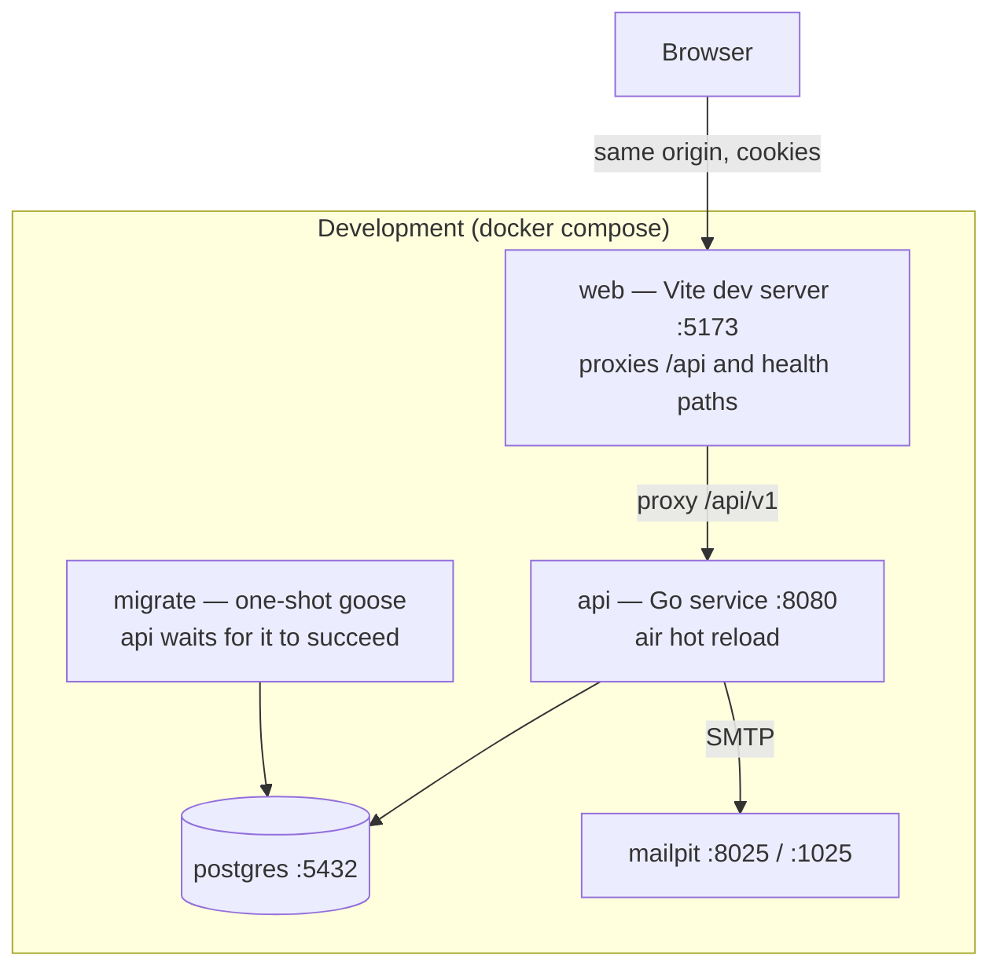
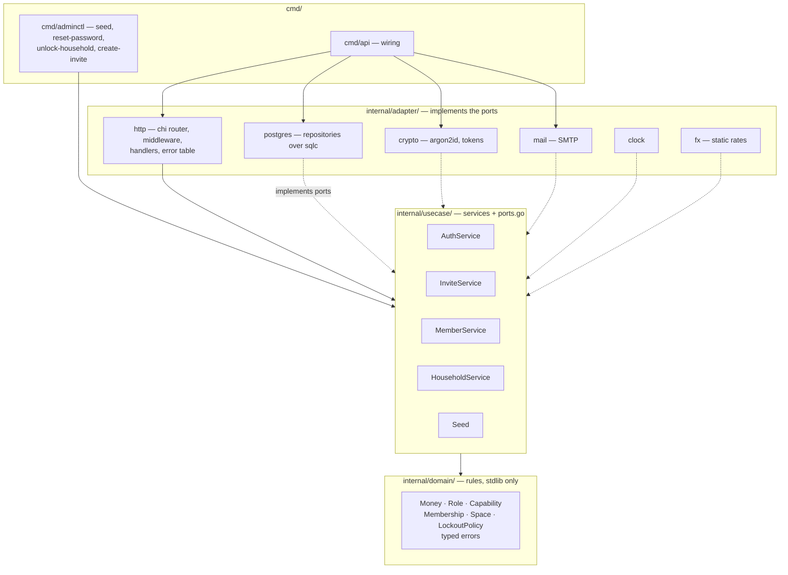
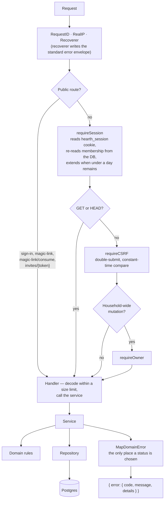
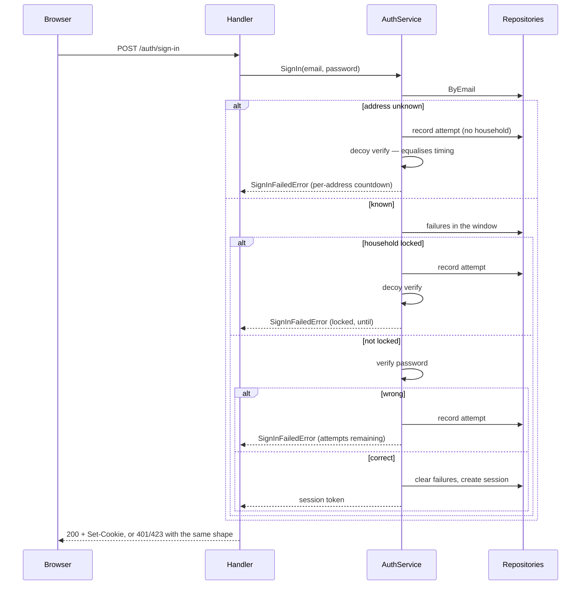
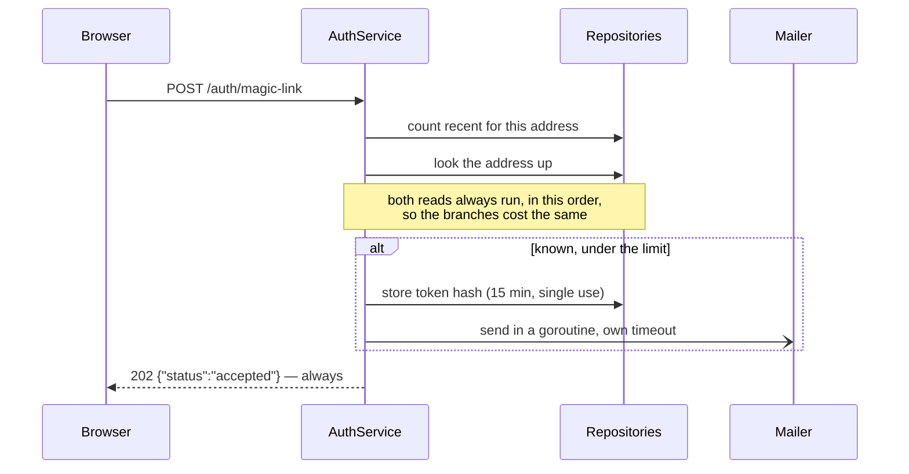
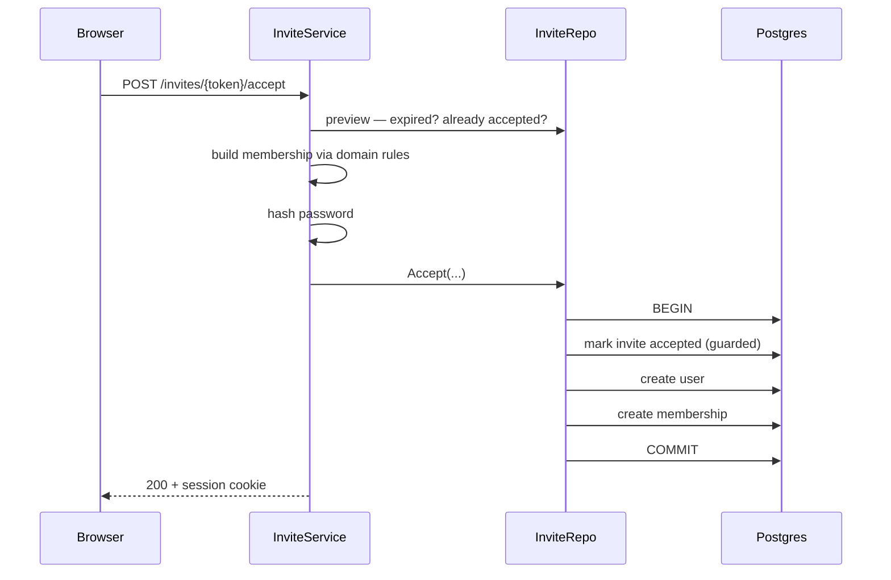
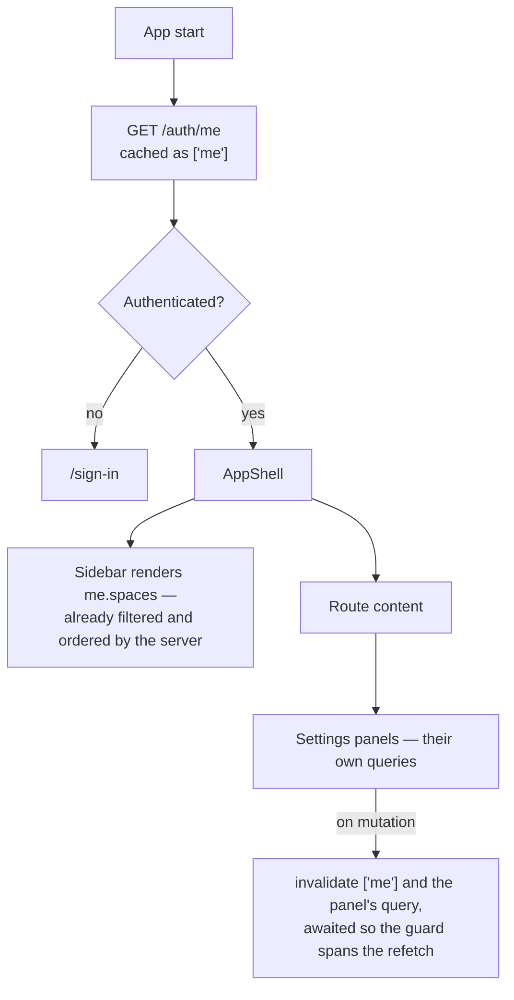
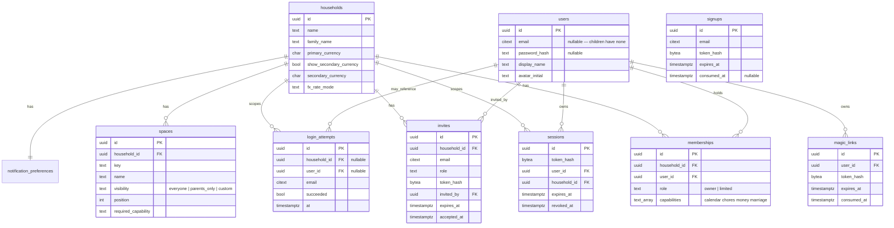

# Hearth — system design

How the system is put together, how a request moves through it, and what the
data looks like. Written so an engineer new to the project can orient in one
sitting.

**Scope:** what exists today — slices 0 and 1. Money, Marriage, Family and
Overview are not built; see `docs/FEATURE_TRACKER.md`.

---

## 1 · Containers

What runs, and what talks to what.



The browser only ever talks to one origin. In development Vite proxies `/api` to
the Go service; in production nginx serves the built bundle and proxies the same
path. There is no CORS configuration anywhere, because there is never a
cross-origin request.

`api` declares `depends_on: migrate` with `service_completed_successfully`, so
the schema is always applied before the service starts — including when someone
runs `docker compose up` directly rather than `make up`.

**Production differs in two ways that matter:** the `web` container is nginx
serving static files, and TLS termination in front is mandatory — cookies are
`Secure` outside development, so without TLS the browser never returns the
session cookie.

---

## 2 · Backend layers

Clean architecture. Dependencies point inward only, and `make lint-arch`
enforces it mechanically — including in test files.



Solid arrows are compile-time dependencies. Dotted arrows are adapters
satisfying an interface declared in `usecase/ports.go` — the dependency still
points inward, which is why every service is testable against in-memory doubles.

**Two rules that shape everything else:**

- No `pgx`, `chi` or other infrastructure type escapes the adapter layer. A
  missing row becomes `domain.ErrNotFound` at that boundary, never `pgx.ErrNoRows`
  further up.
- **No service takes an actor parameter.** Services enforce what is *valid*;
  middleware enforces who is *asking*. Authorisation exists in exactly one place.

---

## 3 · Ports and their adapters

`usecase/ports.go` is the contract between the layers.

| Port | Implemented by | Notes |
|---|---|---|
| `UserRepository` | `adapter/postgres` | Includes the transactional `CreateWithMembership` |
| `HouseholdRepository`, `MembershipRepository`, `SessionRepository`, `MagicLinkRepository`, `LoginAttemptRepository`, `InviteRepository`, `SpaceRepository`, `NotificationRepository` | `adapter/postgres` | Nine narrow repositories rather than one wide one |
| `PasswordHasher`, `TokenGenerator` | `adapter/crypto` | argon2id with cost from config; tokens are random, stored hashed |
| `Mailer` | `adapter/mail` | SMTP; TLS policy and credentials from config |
| `Clock` | `adapter/clock` | So lockout windows and expiry are deterministic in tests |
| `FXRateProvider` | `adapter/fx` | Static table today; a live provider drops in behind it |

`BankSyncProvider` is specified but has no consumer yet — it arrives with the
Money slice, with manual and CSV adapters. Automatic sync via SGFinDex is not
available to an app like this.

---

## 4 · Request pipeline

Every `/api/v1` request passes through the same chain. The order is the security
model.



**The membership is re-read on every request**, never cached in the session row.
A capability change therefore takes effect on the caller's very next request;
session revocation is belt-and-braces rather than the enforcement mechanism.

### Route table

| Method | Path | Guards |
|---|---|---|
| POST | `/auth/sign-in` | none — this *is* the credential check |
| POST | `/auth/magic-link` | none — always 202 |
| POST | `/auth/magic-link/consume` | none — the token is the credential |
| GET | `/auth/me` | session |
| POST | `/auth/sign-out` | session · CSRF |
| GET | `/invites/{token}` | none — the token is the credential |
| POST | `/invites/{token}/accept` | none |
| GET | `/household`, `/household/members`, `/spaces`, `/notification-preferences` | session |
| PATCH | `/household`, `/notification-preferences` | session · CSRF · owner |
| POST | `/household/members/invite`, `/spaces` | session · CSRF · owner |
| PATCH · DELETE | `/household/members/{id}` | session · CSRF · owner |
| GET | `/healthz`, `/readyz` | none — outside `/api/v1` |

Two test matrices walk the live router and assert this: every non-public route
rejects an unauthenticated caller, and every owner-gated route rejects a limited
member. A route added without its guard fails a test rather than shipping.

---

## 5 · Key flows

### Sign in, with the lockout



Three failures inside fifteen minutes lock the **household's password sign-in**
for fifteen minutes. Magic link is never gated by the lock — that is the
recovery path. The decoy verification exists so argon2's cost cannot distinguish
the branches.

### Magic link — deliberately silent



Nothing about the response reveals whether the address exists, including when
the rate limit is exhausted or the send fails. **The frontend is therefore the
only place a send failure can surface**, which is why the sent panel carries
retry copy.

### Invite acceptance — one transaction



All three writes are one transaction. Split apart, a failure in the middle leaves
an orphaned user holding the unique email index and the invite becomes
permanently unacceptable. The invite is claimed *first*, so two concurrent
accepts serialise on that row and the loser gets a clean conflict.

### What the frontend loads



`/auth/me` returns the user, household, membership, capabilities and visible
spaces in one response, so the shell renders without a request waterfall. The
sidebar never filters client-side — duplicating that rule is how the two drift.

---

## 6 · Data model



Notes that are not obvious from the shapes:

- **Only hashes are stored** — passwords, session tokens, magic-link tokens,
  invite tokens and sign-up tokens. A raw token exists in memory and in an
  email, never in a column.
- **Every household-scoped table carries `household_id`**, so scoping is
  structural. Repository methods take it as their first argument after the
  context. `magic_links` and `signups` are the exceptions: a magic link
  identifies a user, not a membership, so it scopes through `user_id`
  instead; a sign-up identifies a verified address with no user or
  household behind it yet, so it has neither.
- **`login_attempts` allows both foreign keys to be null**, so an attempt against
  an unknown address is recorded without revealing whether it exists.
- **`signups` has no `user_id`**, unlike `magic_links`. There is no user yet —
  only a verified address — which is also why the row carries no household
  name or display name: those are collected on the screen the mailed token
  leads to, after verification, so a stranger cannot submit a sign-up for
  someone else's address with a household of their own choosing. `email` is
  deliberately not unique; several live tokens for one address are fine,
  and the first one consumed wins.
- **Database constraints mirror the domain rules** rather than trusting the
  application: a limited member cannot hold `marriage`, an owner must hold all
  four capabilities, and capabilities must come from the known set.
- **Money is `int64` minor units plus an ISO 4217 code** everywhere. `float64`
  never appears in a monetary path.

---

## 7 · Frontend structure

```
web/src/
  api/client.ts        apiFetch — the only way the app talks to the server:
                       CSRF header, credentials, error envelope decoding,
                       401 handling
  components/          generic primitives only (Modal, on native <dialog>)
  features/
    auth/              sign-in, invite, magic-link screens and hooks
    shell/             AppShell, Sidebar, RequireAuth, RequireCapability
    settings/          members, spaces, currency, notifications
    placeholder/       named stand-ins for unbuilt areas
  routes/router.tsx    the route tree
```

**Route guards are presentation, not security.** The server enforces
independently; `RequireAuth` and `RequireCapability` exist so the UI does not
render something the user will be refused.

---

## 8 · Operational shape

| | |
|---|---|
| Migrations | goose, applied by a one-shot container before `api` starts |
| Generated SQL | sqlc, from `internal/adapter/postgres/queries/*.sql` — `make sqlc` |
| Sessions | opaque random token, hashed at rest, 30 days, extended on use, revocable |
| CSRF | double-submit cookie, compared in constant time, mutating methods only |
| Mail | Mailpit in development; TLS policy and credentials from config elsewhere |
| Seeding | `adminctl seed`, refused unless `APP_ENV=development` **and** the database host is local — both checked before the connection opens |
| Health | `/healthz` ignores the database; `/readyz` pings it |

---

## Keeping this document true

This describes the system as it is, not as it was planned. When a feature ships,
an interface changes, a table is added or a flow is reshaped, update the diagram
it affects in the same change — a diagram nobody trusts is worse than none.

Use the `maintaining-system-design` skill; it says what to check and how to keep
the diagrams honest.
