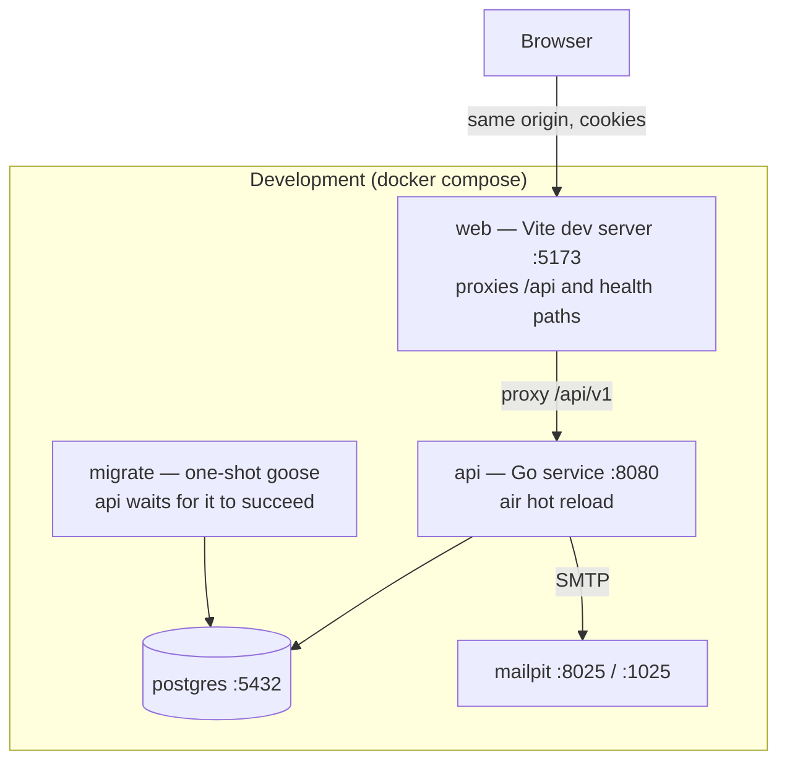
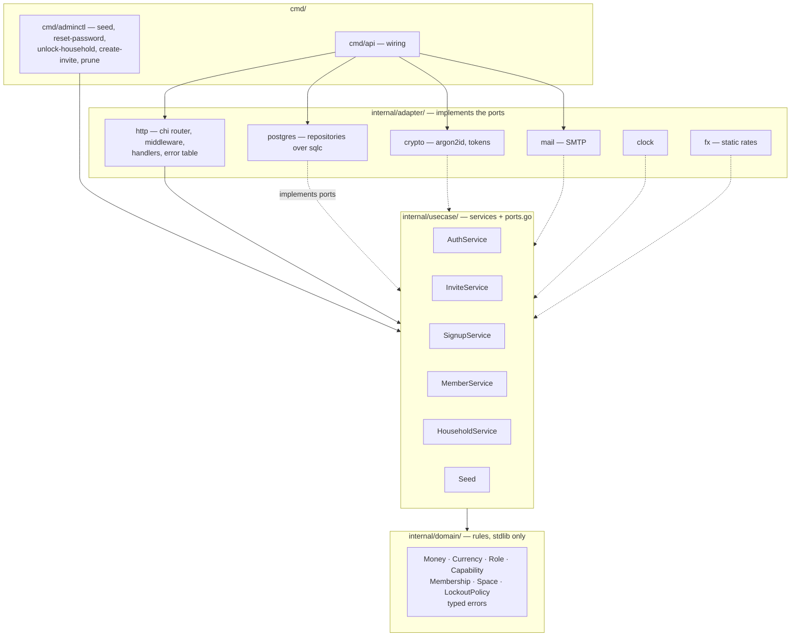
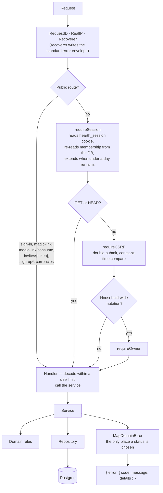
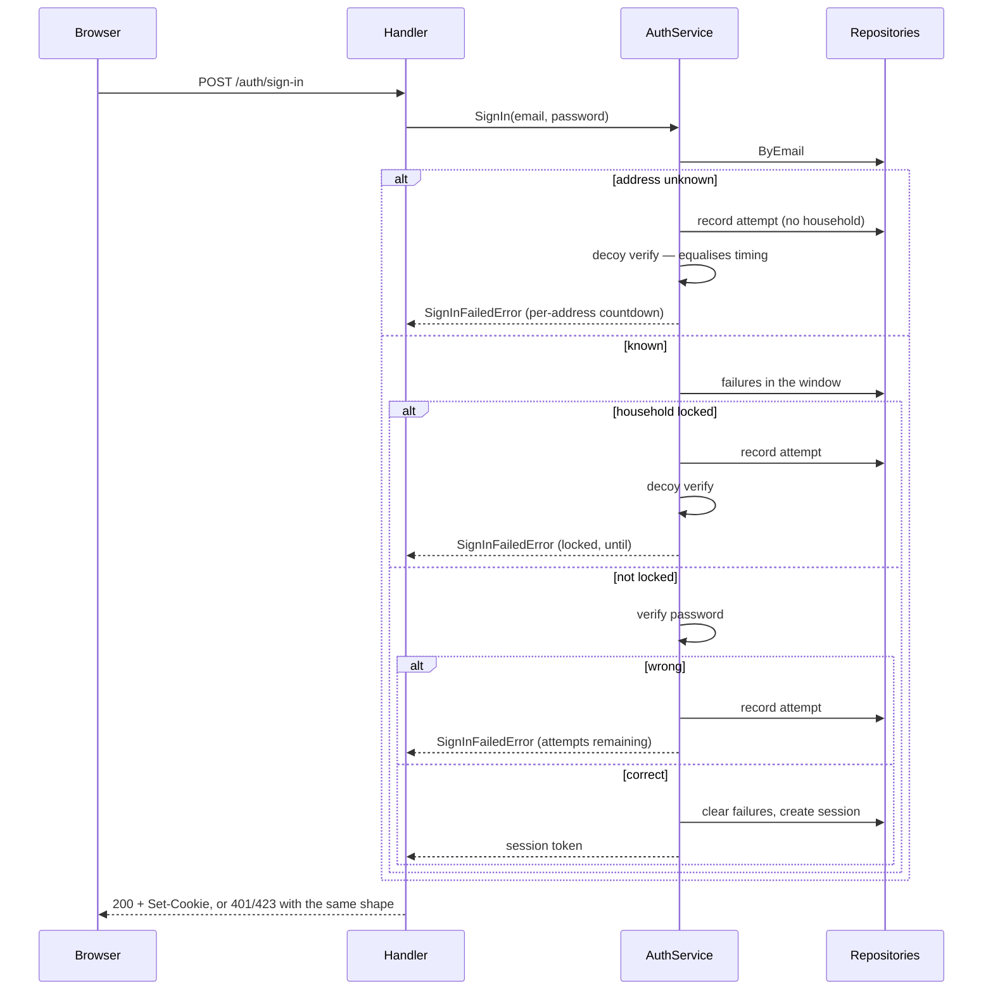
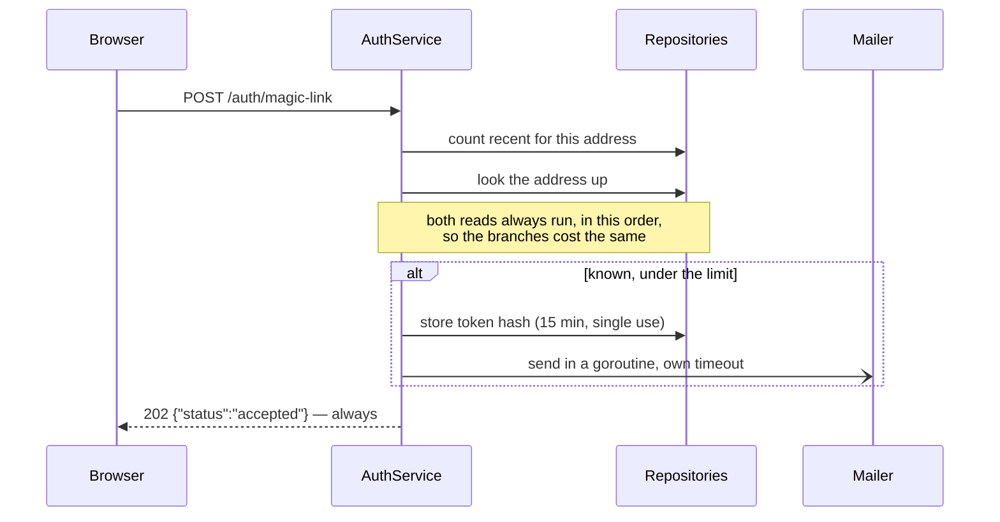
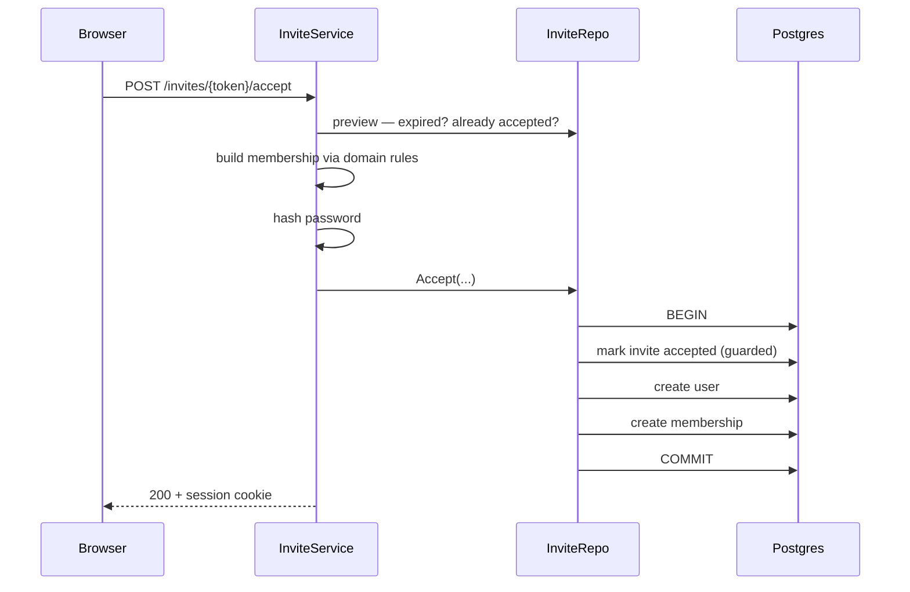
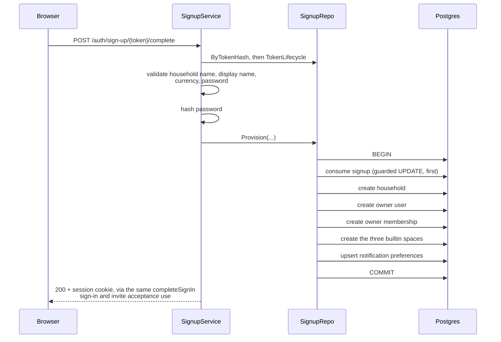
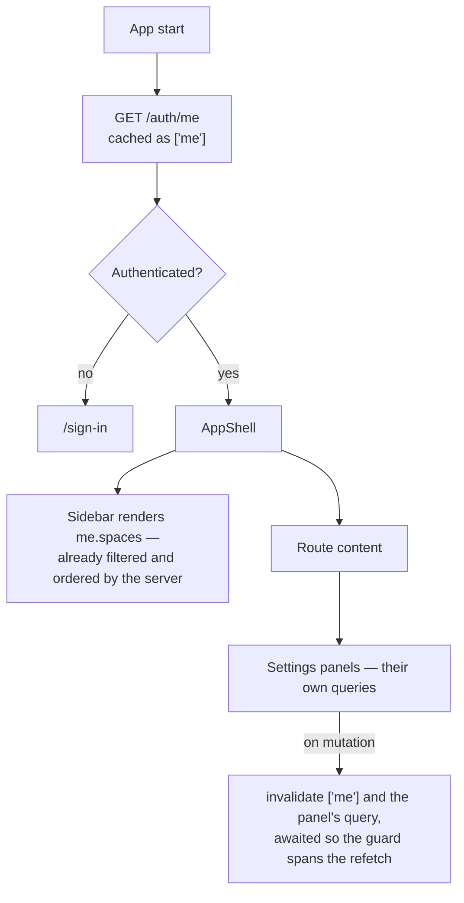

# Hearth — system design

How the system is put together, how a request moves through it, and what the
data looks like. Written so an engineer new to the project can orient in one
sitting.

**Scope:** what exists today — slices 0 and 1, plus self-serve sign-up and
household provisioning, which shipped ahead of slice 2 in the build order (see
`docs/HANDOVER.md`). Money, Marriage, Family and Overview are not built; see
`docs/FEATURE_TRACKER.md`.

---

## 1 · Containers

What runs, and what talks to what.



The browser only ever talks to one origin. In development Vite proxies `/api` to
the Go service; in production nginx serves the built bundle and proxies the same
path. There is no CORS configuration anywhere, because there is never a
cross-origin request.

`api` declares `depends_on: migrate` with `service_completed_successfully`, so a
fresh `docker compose up` always applies the schema before `api` starts. That
guarantee has a gap `make up` does not close: Compose only re-evaluates a
`depends_on` condition when it recreates the *depending* service, so a stack
left running across a newly added migration keeps its already-succeeded
`migrate` container and never reruns it — `make up` against an already-running
stack silently misses new migrations. `make dev-local` sidesteps this by
running `make migrate` explicitly before it starts anything; `make up` and a
bare `docker compose up` do not. See `docs/HANDOVER.md`.

**Production differs in three ways that matter:** the `web` container is nginx
serving static files; TLS termination in front is mandatory — cookies are
`Secure` outside development, so without TLS the browser never returns the
session cookie; and only nginx's config sets `X-Real-IP` to `$remote_addr` and
suppresses `True-Client-IP`, which is what stops a client from spoofing the
sign-up per-IP rate limiter's key (§4). Development has no nginx service at
all — Vite proxies `/api` straight to `api:8080` with no header rewriting — so
the per-IP limiter is fully spoofable there; see `docs/HANDOVER.md`.

---

## 2 · Backend layers

Clean architecture. Dependencies point inward only, and `make lint-arch`
enforces it mechanically — including in test files.



Solid arrows are compile-time dependencies. Dotted arrows are adapters
satisfying an interface declared in `usecase/ports.go` — the dependency still
points inward, which is why every service is testable against in-memory doubles.

**Two rules that shape everything else:**

- No `pgx`, `chi` or other infrastructure type escapes the adapter layer. A
  missing row becomes `domain.ErrNotFound` at that boundary, never `pgx.ErrNoRows`
  further up.
- **No service takes an actor parameter.** Services enforce what is *valid*;
  middleware enforces who is *asking*. Authorisation exists in exactly one place.
- **Which currencies are selectable is a domain rule, not an HTTP filter.**
  `domain.ParseCurrency` stays permissive — it accepts any active ISO 4217
  code, because the household `PATCH` path has always accepted arbitrary
  active codes and must keep accepting whatever is already stored.
  `domain.SelectableCurrencies`/`ParseSelectableCurrency` add a second, tighter
  gate on top for the one path that is choosing a currency for the first time.
  See §5's self-serve sign-up flow.

---

## 3 · Ports and their adapters

`usecase/ports.go` is the contract between the layers.

| Port | Implemented by | Notes |
|---|---|---|
| `UserRepository` | `adapter/postgres` | Includes the transactional `CreateWithMembership` |
| `HouseholdRepository`, `MembershipRepository`, `SessionRepository`, `MagicLinkRepository`, `LoginAttemptRepository`, `InviteRepository`, `SignupRepository`, `SpaceRepository`, `NotificationRepository` | `adapter/postgres` | Ten narrow repositories rather than one wide one |
| `PasswordHasher`, `TokenGenerator` | `adapter/crypto` | argon2id with cost from config; tokens are random, stored hashed |
| `Mailer` | `adapter/mail` | SMTP; TLS policy and credentials from config |
| `Clock` | `adapter/clock` | So lockout windows and expiry are deterministic in tests |
| `FXRateProvider` | `adapter/fx` | Static table today; a live provider drops in behind it |

`BankSyncProvider` is specified but has no consumer yet — it arrives with the
Money slice, with manual and CSV adapters. Automatic sync via SGFinDex is not
available to an app like this.

`LoginAttemptRepository` and `SignupRepository` both carry a `Prune(ctx,
before)` method, added together because both back the two tables a stranger
can grow without ever holding an account (§6 explains why). `adminctl prune`
is their only caller, and refuses an `--older-than` under seven days so it can
never reach inside `domain.LockoutPolicy.Window` and clear a lockout that is
still live.

---

## 4 · Request pipeline

Every `/api/v1` request passes through the same chain. The order is the security
model.



**The membership is re-read on every request**, never cached in the session row.
A capability change therefore takes effect on the caller's very next request;
session revocation is belt-and-braces rather than the enforcement mechanism.

`POST /auth/sign-up` is the one public route wrapped in an extra middleware,
`rateLimitByIP` — a per-process, in-memory token bucket keyed on the request's
resolved IP (5/hour). It is the only sign-up route that can trigger outbound
mail without a token already proving an address, so it is the one an unbounded
loop would hit; the preview and complete routes need a token that was mailed
to a real address and so are not on that path.

### Route table

| Method | Path | Guards |
|---|---|---|
| POST | `/auth/sign-in` | none — this *is* the credential check |
| POST | `/auth/magic-link` | none — always 202 |
| POST | `/auth/magic-link/consume` | none — the token is the credential |
| POST | `/auth/sign-up` | none, plus a per-IP token bucket (5/hour) — always 202, the same silent contract as magic-link |
| GET | `/auth/sign-up/{token}` | none — the token is the credential |
| POST | `/auth/sign-up/{token}/complete` | none |
| GET | `/auth/me` | session |
| POST | `/auth/sign-out` | session · CSRF |
| GET | `/invites/{token}` | none — the token is the credential |
| POST | `/invites/{token}/accept` | none |
| GET | `/currencies` | none — read before a session exists (sign-up's currency select) and after one (Settings) |
| GET | `/household`, `/household/members`, `/spaces`, `/notification-preferences` | session |
| PATCH | `/household`, `/notification-preferences` | session · CSRF · owner |
| POST | `/household/members/invite`, `/spaces` | session · CSRF · owner |
| PATCH · DELETE | `/household/members/{id}` | session · CSRF · owner |
| GET | `/healthz`, `/readyz` | none — outside `/api/v1` |

Three test matrices walk the live router and assert this: every non-public
route rejects an unauthenticated caller, every mutating route requires CSRF,
and every owner-gated route rejects a limited member. A route added without
its guard fails a test rather than shipping. All four sign-up-and-currency
routes are named explicitly, rather than exempted by prefix, in the
unauthenticated matrix; the CSRF and owner matrices name the two mutating ones
among them (`POST /auth/sign-up`, `POST /auth/sign-up/{token}/complete`) —
the two GETs are not mutating and so are not walked by those two matrices at
all. A route added later under `/auth/sign-up` is therefore checked like any
other, not silently waved through by a prefix skip.

---

## 5 · Key flows

### Sign in, with the lockout



Three failures inside fifteen minutes lock the **household's password sign-in**
for fifteen minutes. Magic link is never gated by the lock — that is the
recovery path. The decoy verification exists so argon2's cost cannot distinguish
the branches.

### Magic link — deliberately silent



Nothing about the response reveals whether the address exists, including when
the rate limit is exhausted or the send fails. **The frontend is therefore the
only place a send failure can surface**, which is why the sent panel carries
retry copy.

### Invite acceptance — one transaction



All three writes are one transaction. Split apart, a failure in the middle leaves
an orphaned user holding the unique email index and the invite becomes
permanently unacceptable. The invite is claimed *first*, so two concurrent
accepts serialise on that row and the loser gets a clean conflict.

### Self-serve sign-up — provisioning is one transaction



The `validate ... currency ...` step runs the currency the caller chose
through `domain.ParseSelectableCurrency`, not the more permissive
`domain.ParseCurrency` that the household `PATCH` path uses. `ParseCurrency`
is the single reference for "is this a currency at all" and stays that way —
it must keep accepting whatever currency is already stored on an existing
household. `ParseSelectableCurrency` adds a second, narrower gate on top:
only ISO 4217 codes with two minor units, the same list
`domain.SelectableCurrencies()` filters `GET /api/v1/currencies` down to, so
the sign-up form's own currency select and what `Complete` will actually
accept cannot drift apart. The reason either gate exists at all is
`Money.String()`: it renders an amount as `fmt.Sprintf("%s%s %d.%02d", ...)` —
two decimal places, hard-coded — so a household provisioned with, say, JPY
(0 minor units) or KWD (3) would have had every amount rendered 100× wrong
from the moment it existed. Delete `SelectableCurrencies` and
`ParseSelectableCurrency` only once `Money` itself knows about minor units;
until then they are what keeps the sign-up path from offering a currency the
money path cannot render.

A household can now come into existence three ways: `adminctl seed`
(development only), an invite accepted into a household that already exists,
and this — a stranger with no prior relationship to anyone provisions their
own. `Provision` is one transaction for the same reason
`InviteRepository.Accept` is: a failure partway through would leave a `users`
row occupying `users.email`'s unique index with no membership under it, and
that address could then never sign up again — there is no retry that could
create a second user with the same email.

The signup is consumed *first*, before any insert — not last, the way it reads
most naturally if you write it top-down. With consume-last, the guarded
`UPDATE` would still run, but it would not be what stops two concurrent
completions of one token: `users.email`'s unique index would be, because the
second `CreateUser` collides on it. That gets the loser `409 ALREADY_EXISTS`
instead of the correct `410 TOKEN_EXPIRED`, and turns the guard into
decoration. Consume-first makes the guarded `UPDATE` itself the real
serialiser — the same choice `InviteRepository.Accept` already made by
marking the invite accepted before writing anything else.

`Request` (not diagrammed — it always answers `202` with nothing to show for
it) mirrors the magic-link flow's silence: the per-address count and the
"does this address have an account" read both run unconditionally, in the
same order, on every call. **Both branches now write a `signups` row** too —
a fresh address via `Create`, a registered one via `CreateConsumed` (a row
born already consumed, so it can never provision anything and its token is
never mailed). That second write exists purely so the registered branch's own
rate-limit counter advances: without it, an already-registered address could
be sent unlimited "you already have an account" mail while a fresh address's
mail stopped at three an hour — the exact oracle this endpoint exists to
close, expressed as mail volume instead of a status code. See
`docs/LEARNING.md`.

### What the frontend loads



`/auth/me` returns the user, household, membership, capabilities and visible
spaces in one response, so the shell renders without a request waterfall. The
sidebar never filters client-side — duplicating that rule is how the two drift.

---

## 6 · Data model


Notes that are not obvious from the shapes:

- **Only hashes are stored** — passwords, session tokens, magic-link tokens,
  invite tokens and sign-up tokens. A raw token exists in memory and in an
  email, never in a column.
- **Every household-scoped table carries `household_id`**, so scoping is
  structural. Repository methods take it as their first argument after the
  context. `magic_links` and `signups` are the exceptions: a magic link
  identifies a user, not a membership, so it scopes through `user_id`
  instead; a sign-up identifies a verified address with no user or
  household behind it yet, so it has neither.
- **`login_attempts` allows both foreign keys to be null**, so an attempt against
  an unknown address is recorded without revealing whether it exists.
- **`signups` has no `user_id`**, unlike `magic_links`. There is no user yet —
  only a verified address — which is also why the row carries no household
  name or display name: those are collected on the screen the mailed token
  leads to, after verification, so a stranger cannot submit a sign-up for
  someone else's address with a household of their own choosing. `email` is
  deliberately not unique; several live tokens for one address are fine,
  and the first one consumed wins.
- **Database constraints mirror the domain rules** rather than trusting the
  application: a limited member cannot hold `marriage`, an owner must hold all
  four capabilities, and capabilities must come from the known set.
- **Money is `int64` minor units plus an ISO 4217 code** everywhere. `float64`
  never appears in a monetary path.

---

## 7 · Frontend structure

```
web/src/
  api/client.ts        apiFetch — the only way the app talks to the server:
                       CSRF header, credentials, error envelope decoding,
                       401 handling
  components/          generic primitives only (Modal, on native <dialog>)
  features/
    auth/              sign-in, invite, magic-link, sign-up screens and hooks
    shell/             AppShell, Sidebar, RequireAuth, RequireCapability
    settings/          members, spaces, currency, notifications
    placeholder/       named stand-ins for unbuilt areas
  routes/router.tsx        the route tree
  routes/publicRoutes.ts   the one list of pre-auth routes and API prefixes;
                           a test walks the route tree and fails if a
                           pre-auth screen escapes it
```

**Route guards are presentation, not security.** The server enforces
independently; `RequireAuth` and `RequireCapability` exist so the UI does not
render something the user will be refused.

`publicRoutes.ts` replaces two hand-maintained lists that used to live in
`api/client.ts` and `api/unauthorizedRedirect.ts`, with nothing tying either to
the route tree — the exact gap that once let the 401 handler bounce a pre-auth
screen off itself. Sign-up added two more pre-auth routes and one more API
prefix, which is what made the duplication stop being optional.

---

## 8 · Operational shape

| | |
|---|---|
| Migrations | goose, applied by a one-shot container before `api` starts |
| Generated SQL | sqlc, from `internal/adapter/postgres/queries/*.sql` — `make sqlc` |
| Sessions | opaque random token, hashed at rest, 30 days, extended on use, revocable |
| CSRF | double-submit cookie, compared in constant time, mutating methods only |
| Mail | Mailpit in development; TLS policy and credentials from config elsewhere |
| Seeding | `adminctl seed`, refused unless `APP_ENV=development` **and** the database host is local — both checked before the connection opens |
| Retention | `adminctl prune --older-than=<days>` (default 30, floor 7) deletes consumed/expired `signups` and stale `login_attempts`; `magic_links`, `invites` and `sessions` still grow forever |
| Rate limiting | Per-address (3/hour) and a global daily ceiling (1000, reset at midnight, not a rolling 24 hours), both counted from `signups` so a restart cannot reset them; per-IP (5/hour) is an in-memory token bucket in the HTTP layer — process-local, spoofable in development (see §1). The per-IP limit binds before the global one by construction (5 × 24 = 120 ≪ 1000) so one IP alone can never exhaust the global ceiling |
| Health | `/healthz` ignores the database; `/readyz` pings it |

---

## Keeping this document true

This describes the system as it is, not as it was planned. When a feature ships,
an interface changes, a table is added or a flow is reshaped, update the diagram
it affects in the same change — a diagram nobody trusts is worse than none.

Use the `maintaining-system-design` skill; it says what to check and how to keep
the diagrams honest.
