# Hearth — system design

How the system is put together, how a request moves through it, and what the
data looks like. Written so an engineer new to the project can orient in one
sitting.

**Scope:** what exists today — slices 0 and 1, self-serve sign-up and
household provisioning (which shipped ahead of slice 2 in the build order, see
`docs/HANDOVER.md`), and the first three features of slice 2 (Money):
Accounts — a household records what it owns and owes by hand and sees a net
worth built from it; Transactions — the ledger a household logs expenses,
income and transfers into, categorised and filterable, which is also what
turns an account's balance from a copy of its opening figure into a real
sum; and Budget — an envelope per category with pace, built directly on
Transactions' own month totals, plus the category management (rename,
create, archive) the design folds into its Edit-budget modal rather than a
dedicated screen. Goals and Bills, the rest of Money, and all of Marriage,
Family and Overview are not built; see `docs/FEATURE_TRACKER.md`.

---

## 1 · Containers

What runs, and what talks to what.

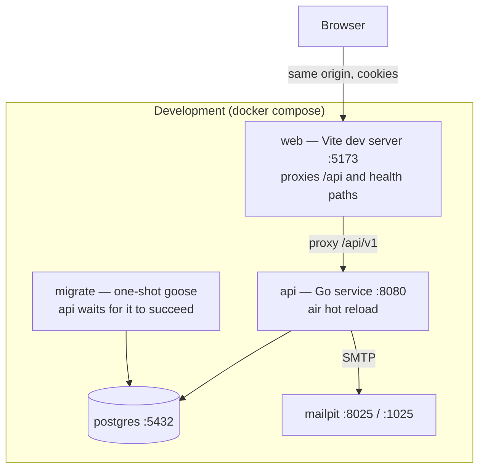

The browser only ever talks to one origin. In development Vite proxies `/api` to
the Go service; in production nginx serves the built bundle and proxies the same
path. There is no CORS configuration anywhere, because there is never a
cross-origin request.

`api` declares `depends_on: migrate` with `service_completed_successfully`, so a
fresh `docker compose up` always applies the schema before `api` starts. That
guarantee has a gap `make up` does not close: Compose only re-evaluates a
`depends_on` condition when it recreates the *depending* service, so a stack
left running across a newly added migration keeps its already-succeeded
`migrate` container and never reruns it — `make up` against an already-running
stack silently misses new migrations. `make dev-local` sidesteps this by
running `make migrate` explicitly before it starts anything; `make up` and a
bare `docker compose up` do not. See `docs/HANDOVER.md`.

**Production differs in three ways that matter:** the `web` container is nginx
serving static files; TLS termination in front is mandatory — cookies are
`Secure` outside development, so without TLS the browser never returns the
session cookie; and only nginx's config sets `X-Real-IP` to `$remote_addr` and
suppresses `True-Client-IP`, which is what stops a client from spoofing the
sign-up per-IP rate limiter's key (§4). Development has no nginx service at
all — Vite proxies `/api` straight to `api:8080` with no header rewriting — so
the per-IP limiter is fully spoofable there; see `docs/HANDOVER.md`.

---

## 2 · Backend layers

Clean architecture. Dependencies point inward only, and `make lint-arch`
enforces it mechanically — including in test files.

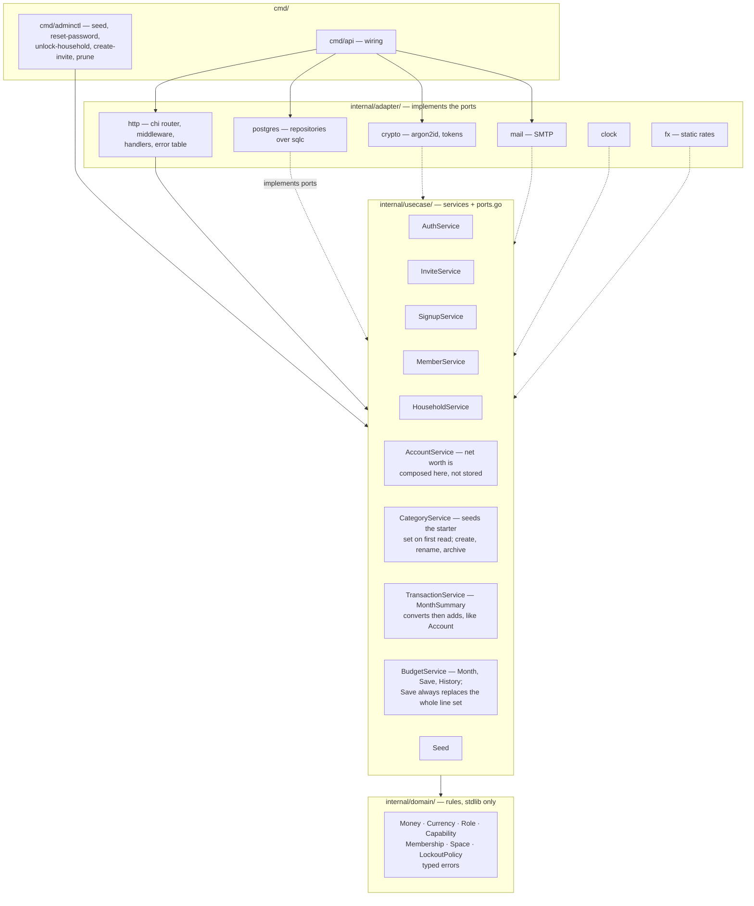

Solid arrows are compile-time dependencies. Dotted arrows are adapters
satisfying an interface declared in `usecase/ports.go` — the dependency still
points inward, which is why every service is testable against in-memory doubles.

**Two rules that shape everything else:**

- No `pgx`, `chi` or other infrastructure type escapes the adapter layer. A
  missing row becomes `domain.ErrNotFound` at that boundary, never `pgx.ErrNoRows`
  further up.
- **No service takes an actor parameter.** Services enforce what is *valid*;
  middleware enforces who is *asking*. Authorisation exists in exactly one place.
- **Which currencies are selectable is a domain rule, not an HTTP filter.**
  `domain.ParseCurrency` stays permissive — it accepts any active ISO 4217
  code, because the household `PATCH` path has always accepted arbitrary
  active codes and must keep accepting whatever is already stored.
  `domain.SelectableCurrencies`/`ParseSelectableCurrency` add a second, tighter
  gate on top for the one path that is choosing a currency for the first time.
  See §5's self-serve sign-up flow.

---

## 3 · Ports and their adapters

`usecase/ports.go` is the contract between the layers.

| Port | Implemented by | Notes |
|---|---|---|
| `UserRepository` | `adapter/postgres` | Includes the transactional `CreateWithMembership` |
| `HouseholdRepository`, `MembershipRepository`, `SessionRepository`, `MagicLinkRepository`, `LoginAttemptRepository`, `InviteRepository`, `SignupRepository`, `SpaceRepository`, `NotificationRepository` | `adapter/postgres` | Ten narrow repositories rather than one wide one |
| `AccountRepository` | `adapter/postgres` | Eleventh. Accounts joined to the owner's display name (`AccountView`); its `MembershipBelongsToHousehold` is what stops an account being assigned to a member of a different household. `AccountView.Balance` is now a real sum — see §5 |
| `CategoryRepository` | `adapter/postgres` | Twelfth. `List` respects `sort_order`, the order the design draws rather than alphabetical; `EnsureSeeded` is idempotent under two concurrent first requests through one `INSERT ... ON CONFLICT DO NOTHING` against `UNIQUE(household_id, name)`, never a read-then-write. Budget grows it with `Create`, `Rename` and `SetArchived` — a category is referenced by transactions and budget lines, so it archives rather than deletes, the same reasoning `accounts.archived_at` already uses for a different table; `sort_order`'s own concurrent-create window is a known, accepted, cosmetic tie (see `docs/LEARNING.md`) |
| `TransactionRepository` | `adapter/postgres` | Thirteenth. Keyset-paged `List` (a cursor is the last row's date and id, not an offset); `Update` never merges a patch — `TransactionService` turns a partial `PATCH` into a complete `domain.Transaction` first; `MonthTotals` returns rows rather than a SQL `SUM`, because a sum is only correct within one currency and the FX conversion lives in the service, not the repository |
| `BudgetRepository` | `adapter/postgres` | Fourteenth. `Get` returns `domain.ErrNotFound` for an unbudgeted month, which the service turns into the empty state, not an error; `Upsert` replaces one household-month wholesale in a single transaction — parent row upserted on `(household_id, month)`, every existing line deleted, every new line inserted, category ownership validated first — never a merge, so a category the caller left out of the payload is unambiguously gone after the call; `History` returns the closed months in range that actually have a budget row, never zero-filled |
| `AccountLookup`, `CategoryLookup` | `adapter/postgres` (`*AccountRepo` and `*CategoryRepo` already satisfy them) | Narrower ports `TransactionService` depends on instead of the full repositories above — interface segregation: it needs an account's currency and household, and whether a category id belongs to this household and what kind it is, never `List` or `EnsureSeeded` |
| `PasswordHasher`, `TokenGenerator` | `adapter/crypto` | argon2id with cost from config; tokens are random, stored hashed |
| `Mailer` | `adapter/mail` | SMTP; TLS policy and credentials from config |
| `Clock` | `adapter/clock` | So lockout windows and expiry are deterministic in tests |
| `FXRateProvider` | `adapter/fx` | Static table today (SGD↔IDR only); a live provider drops in behind it. `AccountService` is its second caller, converting each account into the household's primary currency before summing (§5) |

`BankSyncProvider` is specified but has no consumer yet. Accounts, the first
feature built against this port table, shipped manual entry only and needed no
port for it — a port with one implementation and no second caller is the wrong
shape. It arrives when CSV import gives it a second implementation to
abstract over, not automatically "with the Money slice". Automatic sync via
SGFinDex is not available to an app like this.

`LoginAttemptRepository` and `SignupRepository` both carry a `Prune(ctx,
before)` method, added together because both back the two tables a stranger
can grow without ever holding an account (§6 explains why). `adminctl prune`
is their only caller, and refuses an `--older-than` under seven days so it can
never reach inside `domain.LockoutPolicy.Window` and clear a lockout that is
still live.

---

## 4 · Request pipeline

Every `/api/v1` request passes through the same chain. The order is the security
model.

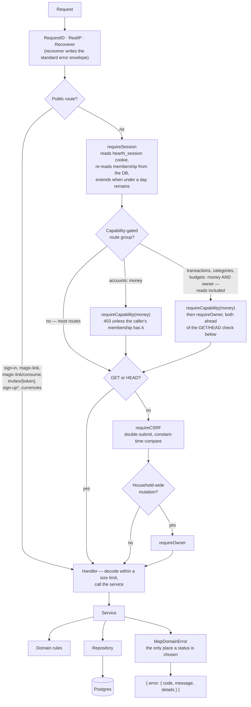

**The membership is re-read on every request**, never cached in the session row.
A capability change therefore takes effect on the caller's very next request;
session revocation is belt-and-braces rather than the enforcement mechanism.

**Accounts are the first routes `requireCapability` ever gates.** The
middleware existed since slice 1 with no route using it, which made the
promise that the server enforces capabilities independently of the UI
vacuous. It sits before the `GET`/`HEAD` check because reads need it too — a
member without the `money` capability is refused `GET /api/v1/accounts` just
as firmly as a write. On the four accounts write routes it is stacked ahead of
`requireOwner`: today that is redundant, because
`domain.ValidateMembershipChange` refuses an owner who does not hold every
capability, so "an owner without `money`" is not a representable state — but
the alternative is for these routes to lean on an invariant enforced in a
different layer for a different reason, and if that invariant is ever relaxed
every route depending on it would open silently. One extra middleware call is
the cheaper price. (This is unrelated to the frontend's own `RequireCapability`
component, §7 — a presentation guard that already existed for the `/money` and
`/marriage` placeholders; this is the first time the *server* enforces one.)

**Transactions, categories and budgets are the routes where `requireOwner`
gates a `GET`.** Every other owner-gated route in this table only reaches
`requireOwner` after the `CSRF` check, which by construction means never on a
read. This group instead runs `requireCapability(money)` then `requireOwner`
before the GET/HEAD branch even exists, so a limited member is refused the
ledger — and the budget screen — itself, not merely their writes. This is
deliberate, not copied from accounts by mistake: a limited member's accounts
view already renders names with every amount blank (§5); applied to a
ledger, or a budget screen, that is nothing but figures — a table whose every
figure would be blank, next to a "Spent this month" that has to be absent
rather than shown as zero, or a page of caps and pace with nothing left to
show — the page would read as broken rather than merely restricted. So for a
limited member the `money` capability on Transactions and Budget means only
"see which accounts this household has" (via `/accounts`), and nothing about
the ledger or the budget at all. Budget's spec named this explicitly as the
Transactions shape reused for the same reason (decision 8), rather than
inventing a new one.

**`PUT /budgets/{month}` sits in its own `requireCSRF` sub-group**, separate
from the one wrapping the category-write routes and the transaction writes,
even though both sub-groups sit at the identical point in the chain (inside
`requireCapability(money)` + `requireOwner`, ahead of the handler). The two
groups can now each grow their own route list without editing the other's —
a deliberate seam, not an accident of how the router file happened to be
structured.

`POST /auth/sign-up` is the one public route wrapped in an extra middleware,
`rateLimitByIP` — a per-process, in-memory token bucket keyed on the request's
resolved IP (5/hour). It is the only sign-up route that can trigger outbound
mail without a token already proving an address, so it is the one an unbounded
loop would hit; the preview and complete routes need a token that was mailed
to a real address and so are not on that path.

### Route table

| Method | Path | Guards |
|---|---|---|
| POST | `/auth/sign-in` | none — this *is* the credential check |
| POST | `/auth/magic-link` | none — always 202 |
| POST | `/auth/magic-link/consume` | none — the token is the credential |
| POST | `/auth/sign-up` | none, plus a per-IP token bucket (5/hour) — always 202, the same silent contract as magic-link |
| GET | `/auth/sign-up/{token}` | none — the token is the credential |
| POST | `/auth/sign-up/{token}/complete` | none |
| GET | `/auth/me` | session |
| POST | `/auth/sign-out` | session · CSRF |
| GET | `/invites/{token}` | none — the token is the credential |
| POST | `/invites/{token}/accept` | none |
| GET | `/currencies` | none — read before a session exists (sign-up's currency select) and after one (Settings) |
| GET | `/household`, `/household/members`, `/spaces`, `/notification-preferences` | session |
| PATCH | `/household`, `/notification-preferences` | session · CSRF · owner |
| POST | `/household/members/invite`, `/spaces` | session · CSRF · owner |
| PATCH · DELETE | `/household/members/{id}` | session · CSRF · owner |
| GET | `/accounts` | session · money |
| POST | `/accounts` | session · money · CSRF · owner |
| PATCH | `/accounts/{id}` | session · money · CSRF · owner |
| POST | `/accounts/{id}/archive`, `/accounts/{id}/restore` | session · money · CSRF · owner |
| GET | `/transactions`, `/categories` | session · money · owner — owner gates the read, unlike accounts |
| POST | `/transactions` | session · money · owner · CSRF |
| PATCH · DELETE | `/transactions/{id}` | session · money · owner · CSRF |
| GET | `/budgets/{month}`, `/budgets/history` | session · money · owner — same reasoning as the transactions/categories reads above |
| PUT | `/budgets/{month}` | session · money · owner · CSRF — its own CSRF sub-group, not the one below |
| POST | `/categories` | session · money · owner · CSRF |
| PATCH | `/categories/{id}` | session · money · owner · CSRF |
| POST | `/categories/{id}/archive`, `/categories/{id}/restore` | session · money · owner · CSRF |
| GET | `/healthz`, `/readyz` | none — outside `/api/v1` |

Three test matrices walk the live router and assert this: every non-public
route rejects an unauthenticated caller, every mutating route requires CSRF,
and every owner-gated route rejects a limited member. A route added without
its guard fails a test rather than shipping. All four sign-up-and-currency
routes are named explicitly, rather than exempted by prefix, in the
unauthenticated matrix; the CSRF and owner matrices name the two mutating ones
among them (`POST /auth/sign-up`, `POST /auth/sign-up/{token}/complete`) —
the two GETs are not mutating and so are not walked by those two matrices at
all. A route added later under `/auth/sign-up` is therefore checked like any
other, not silently waved through by a prefix skip.

**The owner-gated matrix signs in as a second limited-member fixture** —
`calendar`, `chores` **and** `money` — rather than the original one, which
holds only `calendar` and `chores`. Signing in as the original would have had
every accounts write route refused at `requireCapability` before the request
ever reached `requireOwner`, so the walk would have passed without ever
exercising the guard it is named after; see `docs/LEARNING.md`. Two more tests
pin the capability gate and the redaction rule directly:
`TestAccountsListRequiresTheMoneyCapability` and
`TestAccountsAreRedactedForALimitedMember`.

**Transactions needed a fifth, dedicated matrix rather than reusing the
generic owner-gated one**, because that one only ever walks mutating routes
and the whole point of Transactions' guard order is that `GET /transactions`
and `GET /categories` are owner-gated too.
`TestTransactionRoutesRequireMoneyAndOwner` asserts an exact expected status
per route rather than "not 401/403" — the looser form once let three routes
panic on a nil dependency in the test harness and pass anyway, recovered into
a `500` that the assertion could not tell apart from a correctly-enforced
guard; see `docs/LEARNING.md`.

**Budget adds two more matrices of its own, following the same shape rather
than folding into Transactions' existing one**: `TestBudgetRoutesRequireMoneyAndOwner`
plus `TestBudgetWriteRouteRequiresCSRF` for the three `/budgets` routes, and
`TestCategoryWriteRoutesRequireMoneyAndOwner` plus
`TestCategoryWriteRoutesRequireCSRF` for the four category-write routes —
kept separate from `TestTransactionRoutesRequireMoneyAndOwner` rather than
adding rows to it, so each feature's own route list can grow without editing
a test file it does not own.

---

## 5 · Key flows

### Sign in, with the lockout

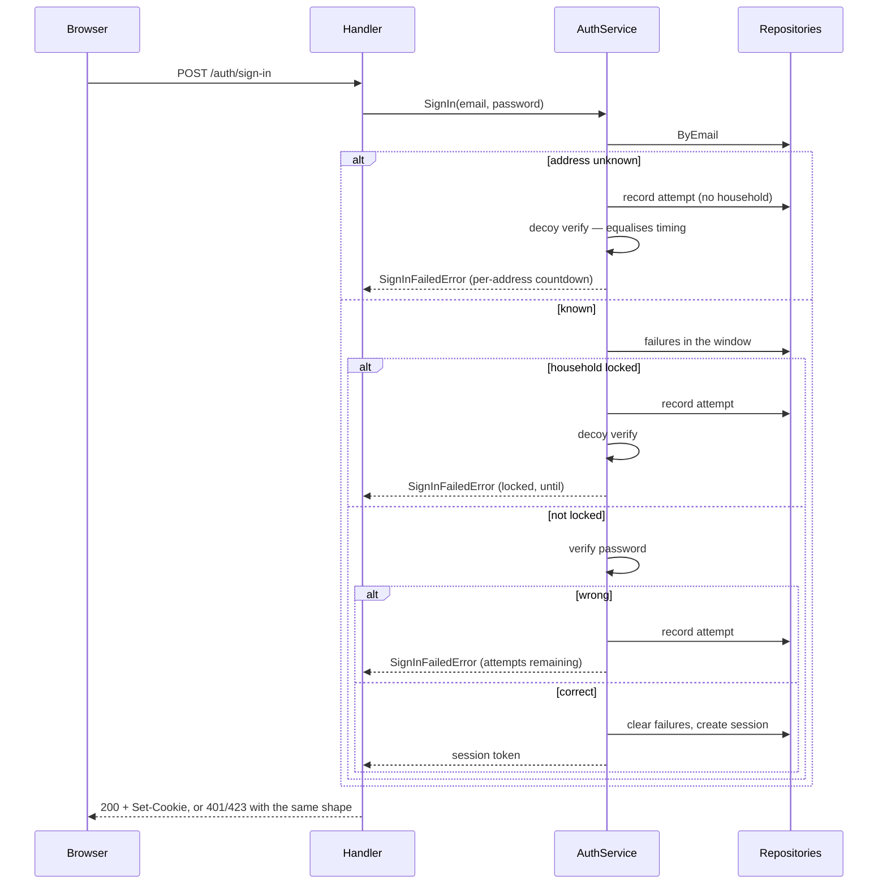

Three failures inside fifteen minutes lock the **household's password sign-in**
for fifteen minutes. Magic link is never gated by the lock — that is the
recovery path. The decoy verification exists so argon2's cost cannot distinguish
the branches.

### Magic link — deliberately silent

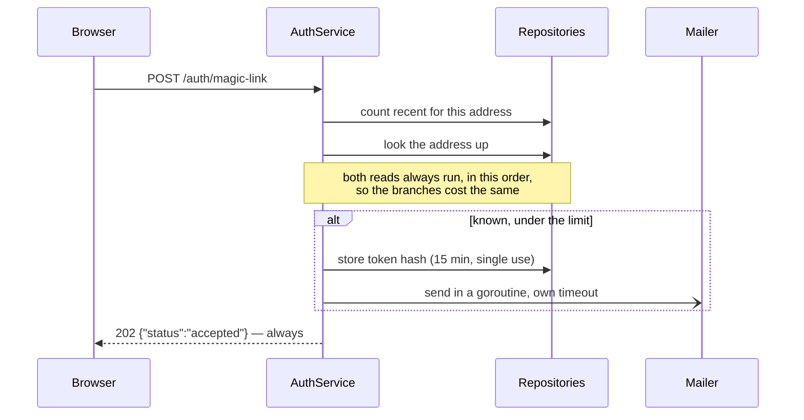

Nothing about the response reveals whether the address exists, including when
the rate limit is exhausted or the send fails. **The frontend is therefore the
only place a send failure can surface**, which is why the sent panel carries
retry copy.

### Invite acceptance — one transaction

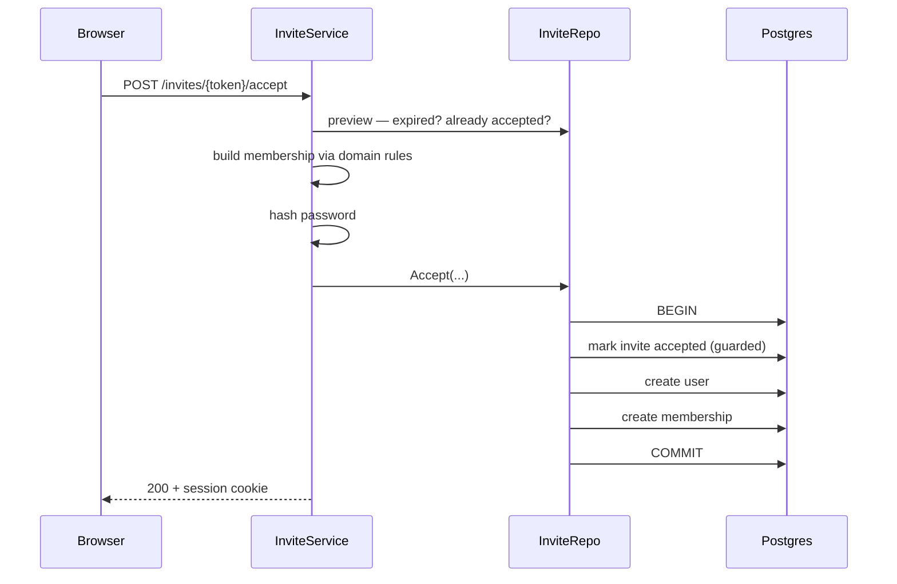

All three writes are one transaction. Split apart, a failure in the middle leaves
an orphaned user holding the unique email index and the invite becomes
permanently unacceptable. The invite is claimed *first*, so two concurrent
accepts serialise on that row and the loser gets a clean conflict.

### Self-serve sign-up — provisioning is one transaction

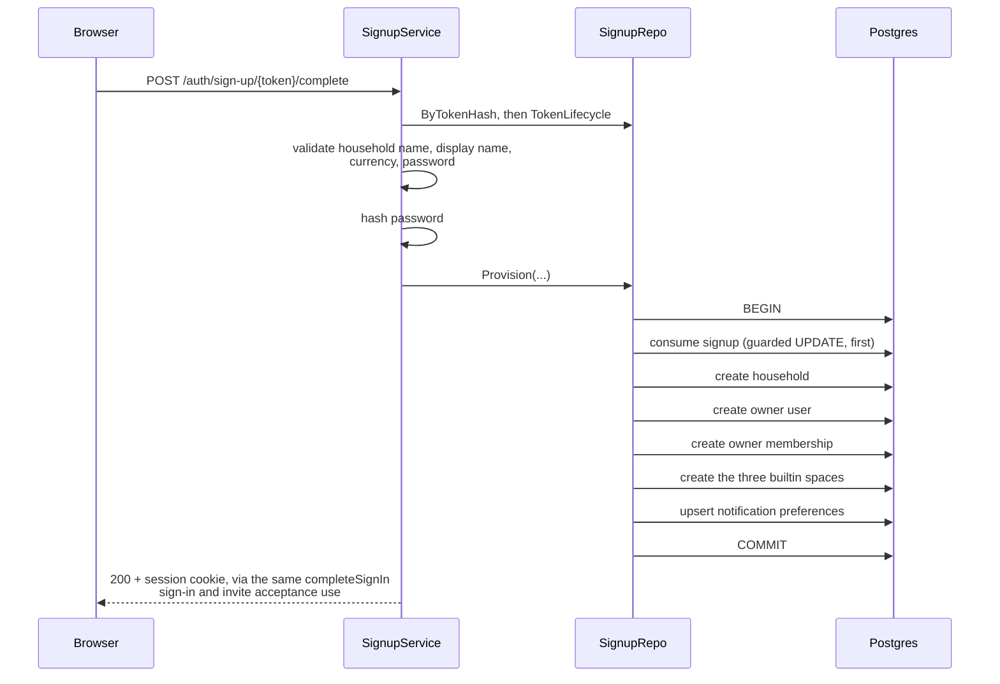

The `validate ... currency ...` step runs the currency the caller chose
through `domain.ParseSelectableCurrency`, not the more permissive
`domain.ParseCurrency` that the household `PATCH` path uses. `ParseCurrency`
is the single reference for "is this a currency at all" and stays that way —
it must keep accepting whatever currency is already stored on an existing
household. `ParseSelectableCurrency` adds a second, narrower gate on top:
only ISO 4217 codes with two minor units, the same list
`domain.SelectableCurrencies()` filters `GET /api/v1/currencies` down to, so
the sign-up form's own currency select and what `Complete` will actually
accept cannot drift apart. The reason either gate exists at all is
`Money.String()`: it renders an amount as `fmt.Sprintf("%s%s %d.%02d", ...)` —
two decimal places, hard-coded — so a household provisioned with, say, JPY
(0 minor units) or KWD (3) would have had every amount rendered 100× wrong
from the moment it existed. Delete `SelectableCurrencies` and
`ParseSelectableCurrency` only once `Money` itself knows about minor units;
until then they are what keeps the sign-up path from offering a currency the
money path cannot render.

A household can now come into existence three ways: `adminctl seed`
(development only), an invite accepted into a household that already exists,
and this — a stranger with no prior relationship to anyone provisions their
own. `Provision` is one transaction for the same reason
`InviteRepository.Accept` is: a failure partway through would leave a `users`
row occupying `users.email`'s unique index with no membership under it, and
that address could then never sign up again — there is no retry that could
create a second user with the same email.

The signup is consumed *first*, before any insert — not last, the way it reads
most naturally if you write it top-down. With consume-last, the guarded
`UPDATE` would still run, but it would not be what stops two concurrent
completions of one token: `users.email`'s unique index would be, because the
second `CreateUser` collides on it. That gets the loser `409 ALREADY_EXISTS`
instead of the correct `410 TOKEN_EXPIRED`, and turns the guard into
decoration. Consume-first makes the guarded `UPDATE` itself the real
serialiser — the same choice `InviteRepository.Accept` already made by
marking the invite accepted before writing anything else.

`Request` (not diagrammed — it always answers `202` with nothing to show for
it) mirrors the magic-link flow's silence: the per-address count and the
"does this address have an account" read both run unconditionally, in the
same order, on every call. **Both branches now write a `signups` row** too —
a fresh address via `Create`, a registered one via `CreateConsumed` (a row
born already consumed, so it can never provision anything and its token is
never mailed). That second write exists purely so the registered branch's own
rate-limit counter advances: without it, an already-registered address could
be sent unlimited "you already have an account" mail while a fresh address's
mail stopped at three an hour — the exact oracle this endpoint exists to
close, expressed as mail volume instead of a status code. See
`docs/LEARNING.md`.

### Accounts — net worth is composed on read, not stored

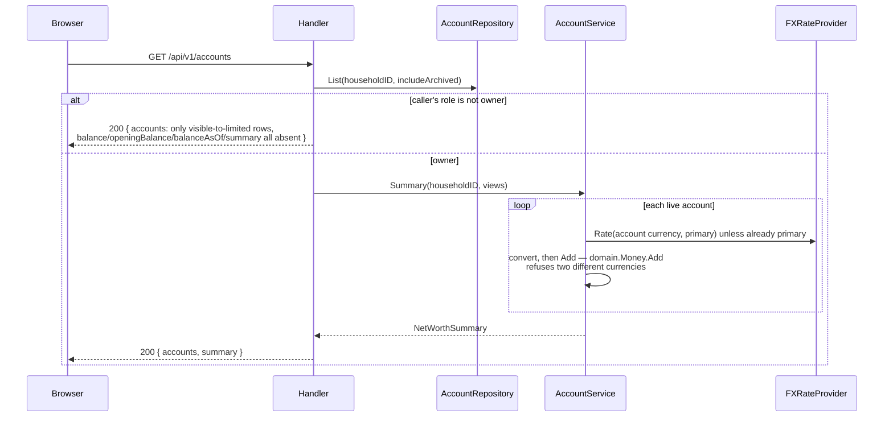

One endpoint answers both halves of the screen — the list and the summary —
because they describe the same set of rows and must agree; a second endpoint
would mean writing the redaction rule below twice.

**Convert, then add.** `domain.Money.Add` refuses to add two different
currencies, deliberately, so summing raw balances first and converting after
would fail the moment a household holds a second currency — invisible to a
single-currency test. Each account converts into the household's primary
currency before any `Add`; rounding happens once per account and the total is
never re-rounded, so the figure is deterministic. See `docs/LEARNING.md`.

**A limited member's response omits every amount, not just the totals.**
Showing the family total while hiding individual balances was rejected: with
the list of which accounts exist and a running total, the individual balances
become inferable as accounts are added and removed. So `summary` is omitted
entirely, and each visible account's `balance`/`openingBalance`/`balanceAsOf`
keys are absent — not zeroed, because a zeroed balance still reads as a real
one. `openingBalance` is redacted for the same reason as `balance`: it is an
amount, and on a young account it is close enough to the current one to be
just as revealing.

**An unconvertible account doesn't vanish from the total silently, and an
entirely unconvertible household never shows a zero.**
`NetWorthSummary.Computable` is false only when at least one live account
exists and none of them could be converted — the state a household reaches by
changing its primary currency in Settings while `fx.StaticProvider` knows only
SGD↔IDR. Zero is a claim about the household's money; the truth in that state
is that it cannot be computed, so the screen says so instead of showing S$0.00.
A household with no accounts at all is computable and genuinely zero — that
distinction is why the guard counts non-archived accounts actually considered,
not the raw row count (`docs/LEARNING.md`).

**`AccountView.Balance` is now a real sum, computed in SQL, not in Go.**
Before Transactions existed there was nothing to add, so `Balance` was a copy
of `opening_balance_minor`; `AccountRepository`'s query has always shaped
`Balance` as a sum for exactly this reason (see its doc comment). Now it is
one: the query subtracts every transaction on the `from_account_id` side and
adds every transaction — or its `received_amount_minor`, for the destination
leg of a cross-currency transfer — on the `to_account_id` side, both filtered
to `occurred_on >= opening_balance_as_of` — an opening balance is the figure
at the *start* of its day, so a transaction dated on that same day already
moves it (`docs/LEARNING.md`, pattern 13). That is the same boundary
Transactions' own ledger marks strictly-before and explains on each affected
row rather than hiding (§5's Transactions flow, below). The sum happens
once, in the repository's SQL; `AccountService.Summary` still converts and
adds each account's already-summed balance exactly as it did before this
feature, unchanged.

**Which is why `accountDTO` now carries `openingBalance` as well as
`balance`.** The two were one number until this feature, and a client that
has only `balance` to prefill the account edit form from will write today's
figure back as `opening_balance_minor` — moving the household's net worth by
every transaction since, on an edit that never meant to touch the balance.
The wire therefore carries both figures, the form is labelled "Starting
balance" so the field cannot be mistaken for the one on the account row, and
`AccountView`'s own doc comment says which of the two may ever be written
back. A value whose meaning changes has to change its consumers with it;
`docs/LEARNING.md` records what this cost when it did not.

### Transactions — the ledger and month-to-date spend, one request

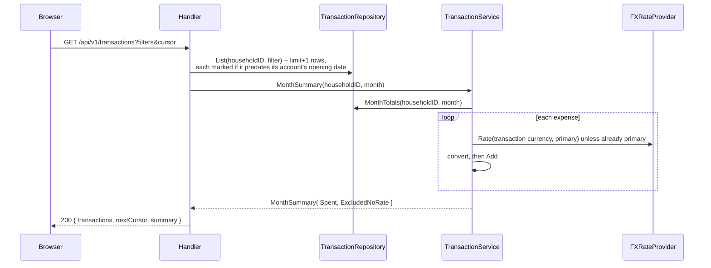

One endpoint answers the ledger and "Spent this month" together, for the same
reason `GET /accounts` answers the list and net worth together: the two
describe the same rows and a second endpoint risks them disagreeing.
`nextCursor` is opaque — the date and id of the last row of the page, never
something the frontend constructs — so a later change to sort order or paging
predicate cannot become a breaking change to the client; `transactions_household_date_idx
(household_id, occurred_on DESC, id DESC)` is what lets the keyset cursor walk
an index instead of sorting a heap.

**A transaction dated before its account's opening balance is kept, listed,
and marked — not refused, and not silently absorbed into the balance.** It is
still counted in `Spent`, because the money was actually spent; only the
*balance* — the sum described above — ignores it, because a balance is
anchored to a figure someone asserted was true on a date and this transaction
predates that assertion. A transfer can predate one side's opening date and
not the other's, so the mark is two independent fields
(`beforeFromAccountOpeningBalance` / `beforeToAccountOpeningBalance`), each
naming the account, not one flag that would be half true for a transfer.

### Budget — one screen, one request; the PUT always replaces the whole month

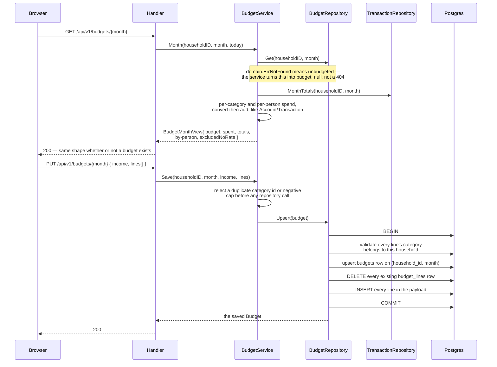

**A third endpoint answers a whole screen in one request**, the same shape
`GET /accounts` and `GET /transactions` already use: the figures and the raw
data describe the same rows and must never be free to disagree, so there is
one query to keep in sync, not two. `GET /budgets/{month}` returns `"budget":
null` plus the spend figures even for a month with no caps at all — the
empty state needs to know the month's spend to invite "Import last month",
and a 404 would make the frontend special-case the one screen that is
allowed to have nothing.

**`PUT` is a full replace, never a merge, in one transaction.** The
Edit-budget modal always holds the entire budget client-side — every capped
category, not a diff — so replace is what makes "the caller removed a cap"
unambiguous: a line simply absent from the payload is gone after the call,
rather than needing a separate "delete this line" operation the frontend
would have to track alongside "add" and "change". Category ownership is
validated *inside* the same transaction as the delete-then-insert, before
either runs, so a foreign-household category id in one line rolls the whole
month back rather than leaving the parent row updated with its lines
half-replaced — the same "any two writes that must both happen need a
transaction" rule invite acceptance and self-serve sign-up already apply
(§5 above), extended here to a delete-and-reinsert pair instead of a set of
inserts. `BudgetService.Save` also re-derives every cap through
`domain.NewMoney` before the repository ever sees it, so a caller cannot
make a stored `Budget` carry a currency the household does not have — the
repository still relabels to the household's own primary currency
regardless, but that must never be the only thing standing between a bad
currency and a stored row.

### What the frontend loads

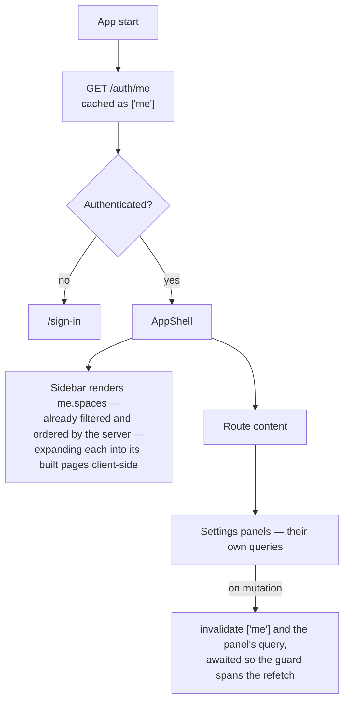

`/auth/me` returns the user, household, membership, capabilities and visible
spaces in one response, so the shell renders without a request waterfall. The
sidebar never filters or re-sorts `me.spaces` client-side — duplicating that
rule is how the two drift. It does expand each space into its built pages: a
client-side map (`SPACE_PAGES` in `Sidebar.tsx`) turns a space with several
shipped pages into the design's uppercase group label plus one link per page
— Money renders as "MONEY" over Finances, Transactions and Budget — while a space
with only one page still renders as a single link. The map, not the server
payload, decides how many links a space produces; the server payload still
decides which spaces appear at all and in what order.

---

## 6 · Data model

```mermaid
erDiagram
    households ||--o{ memberships : has
    households ||--o{ invites : has
    households ||--o{ sessions : scopes
    households ||--o{ spaces : has
    households ||--o{ login_attempts : scopes
    households ||--|| notification_preferences : has
    households ||--o{ accounts : owns
    memberships ||--o{ accounts : "may own (nullable = shared)"
    households ||--o{ categories : has
    households ||--o{ transactions : has
    categories ||--o{ transactions : "labels (nullable, SET NULL)"
    memberships ||--o{ transactions : "paid by (nullable, SET NULL)"
    accounts ||--o{ transactions : "from (nullable, CASCADE)"
    accounts ||--o{ transactions : "to (nullable, CASCADE)"
    households ||--o{ budgets : has
    budgets ||--o{ budget_lines : has
    categories ||--o{ budget_lines : caps
    users ||--o{ memberships : holds
    users ||--o{ sessions : owns
    users ||--o{ magic_links : owns
    users ||--o{ login_attempts : may_reference
    users ||--o{ invites : invited_by

    households {
        uuid id PK
        text name
        text family_name
        char primary_currency
        bool show_secondary_currency
        char secondary_currency
        text fx_rate_mode
    }
    users {
        uuid id PK
        citext email "nullable — children have none"
        text password_hash "nullable"
        text display_name
        text avatar_initial
    }
    memberships {
        uuid id PK
        uuid household_id FK
        uuid user_id FK
        text role "owner | limited"
        text_array capabilities "calendar chores money marriage"
    }
    invites {
        uuid id PK
        uuid household_id FK
        citext email
        text role
        bytea token_hash
        uuid invited_by FK
        timestamptz expires_at
        timestamptz accepted_at
    }
    sessions {
        uuid id PK
        bytea token_hash
        uuid user_id FK
        uuid household_id FK
        timestamptz expires_at
        timestamptz revoked_at
    }
    magic_links {
        uuid id PK
        uuid user_id FK
        bytea token_hash
        timestamptz expires_at
        timestamptz consumed_at
    }
    signups {
        uuid id PK
        citext email
        bytea token_hash
        timestamptz expires_at
        timestamptz consumed_at "nullable"
    }
    login_attempts {
        uuid id PK
        uuid household_id FK "nullable"
        uuid user_id FK "nullable"
        citext email
        bool succeeded
        timestamptz at
    }
    spaces {
        uuid id PK
        uuid household_id FK
        text key
        text name
        text visibility "everyone | parents_only | custom"
        int position
        text required_capability
    }
    accounts {
        uuid id PK
        uuid household_id FK
        text nickname
        text type "cash | investment | property | loan | credit_card"
        uuid owner_membership_id FK "nullable — NULL means shared"
        bigint opening_balance_minor
        char opening_balance_currency
        date opening_balance_as_of
        bool count_toward_net_worth "default true"
        bool visible_to_limited_members "default false"
        timestamptz archived_at "nullable — never deleted"
    }
    categories {
        uuid id PK
        uuid household_id FK
        text name
        text kind "expense | income"
        int sort_order "the design's order, not alphabetical"
        timestamptz archived_at "nullable — never deleted"
    }
    transactions {
        uuid id PK
        uuid household_id FK
        text kind "expense | income | transfer"
        date occurred_on "a date, not a timestamptz — a household has no timezone"
        text description
        uuid category_id FK "nullable — SET NULL, never on a transfer"
        uuid paid_by_membership_id FK "nullable — SET NULL"
        uuid from_account_id FK "nullable — CASCADE"
        uuid to_account_id FK "nullable — CASCADE"
        bigint amount_minor "CHECK > 0 — sign comes from kind, not the value"
        char amount_currency
        bigint received_amount_minor "nullable — transfer only"
        char received_amount_currency "nullable, paired with the amount above"
    }
    budgets {
        uuid id PK
        uuid household_id FK
        date month "always the first of the month"
        bigint expected_income_minor "nullable — not provided"
        timestamptz created_at
        timestamptz updated_at
    }
    budget_lines {
        uuid id PK
        uuid budget_id FK "ON DELETE CASCADE"
        uuid category_id FK
        bigint cap_minor "CHECK >= 0"
    }
```

Notes that are not obvious from the shapes:

- **Only hashes are stored** — passwords, session tokens, magic-link tokens,
  invite tokens and sign-up tokens. A raw token exists in memory and in an
  email, never in a column.
- **Every household-scoped table carries `household_id`**, so scoping is
  structural. Repository methods take it as their first argument after the
  context. `magic_links` and `signups` are the exceptions: a magic link
  identifies a user, not a membership, so it scopes through `user_id`
  instead; a sign-up identifies a verified address with no user or
  household behind it yet, so it has neither.
- **`login_attempts` allows both foreign keys to be null**, so an attempt against
  an unknown address is recorded without revealing whether it exists.
- **`signups` has no `user_id`**, unlike `magic_links`. There is no user yet —
  only a verified address — which is also why the row carries no household
  name or display name: those are collected on the screen the mailed token
  leads to, after verification, so a stranger cannot submit a sign-up for
  someone else's address with a household of their own choosing. `email` is
  deliberately not unique; several live tokens for one address are fine,
  and the first one consumed wins.
- **Database constraints mirror the domain rules** rather than trusting the
  application: a limited member cannot hold `marriage`, an owner must hold all
  four capabilities, and capabilities must come from the known set.
  `accounts` gets the same treatment: `liabilities_are_not_negative` refuses a
  negative balance on a `loan` or `credit_card` row, mirroring the sign rule
  `domain.AccountType.SignedNetWorthAmount` enforces in code — worth stating
  twice because the failure it prevents (a debt counted as an asset) is silent
  and wrong in the flattering direction.
- **Money is `int64` minor units plus an ISO 4217 code** everywhere. `float64`
  never appears in a monetary path.
- **`accounts.owner_membership_id` is nullable and means shared, not unset.**
  There is deliberately no separate `is_shared` boolean — a row that both
  names an owner and claims to be shared would have nothing to resolve that
  disagreement. `ON DELETE SET NULL` is what makes a removed member's accounts
  fall back to shared with no application code running.
- **An account is archived, never deleted.** `archived_at` takes it out of the
  accounts list, net worth and the breakdown, but a transaction that later
  references it keeps working — there is nowhere in the design to remove an
  account at all, so this is an addition the design does not draw.
- **An account's currency lives on the row, not inherited from the
  household.** A household's primary currency can change in Settings; the
  account's balance was denominated in whatever it was denominated in, and
  rewriting it on a household-currency change would silently restate history.
- **There is deliberately no `updated_at` on `accounts`.** No other table in
  this schema has one, nothing in the application would maintain it, and a
  column named "last updated" that nothing ever changes is a lie the next
  reader will believe. The question it would answer — when was this balance
  last true — is answered better by `opening_balance_as_of`.
- **`transactions.household_id` and `categories.household_id` are `ON DELETE
  CASCADE`**, the same as every other household-scoped table: a household's
  own bookkeeping and its own spending taxonomy leave when the household does.
  `category_id` and `paid_by_membership_id` are `ON DELETE SET NULL`, the same
  reasoning `accounts.owner_membership_id` uses for a removed member — losing
  a label is the least valuable thing a row can lose, and refusing the
  deletion instead would mean an owner cannot remove a departed member without
  first reassigning every transaction they ever paid for.
- **`from_account_id` and `to_account_id` are `ON DELETE CASCADE`, and
  `RESTRICT` was the first instinct.** The application never deletes an
  account — accounts archive, never delete — so a restrict looked free: this
  clause is unreachable in ordinary use. It is wrong anyway. It fires in
  exactly one case — deleting a household cascades to its accounts — and a
  `RESTRICT` from transactions would make that cascade fail partway through,
  with no way to delete a household that has ever recorded a transaction.
  `CASCADE` is the behaviour that is correct on the one path that ever reaches
  it and irrelevant everywhere else. Found by reasoning about the cascade
  before the schema shipped, not by a test; a test that deletes a household
  with transactions in it now exists (`docs/LEARNING.md`).
- **A transaction is hard-deleted; an account never is.** Nothing references a
  transaction, so there is no history to orphan by removing one — unlike an
  account, which transactions themselves reference. `DELETE
  /api/v1/transactions/{id}` really deletes the row and answers `204`, the one
  response in this product allowed to carry no body.
- **`budgets` and `budget_lines` carry no `currency` column at all.** A cap
  is a plan, not a transaction, and it lives in the household's primary
  currency by construction (Budget spec decision 9). Changing the
  household's primary currency in Settings changes what an existing cap
  *means* — the same accepted trade-off the accounts currency-change screen
  already documents, restated here rather than "fixed" by adding a column no
  other monetary-plan table in this schema has either.
- **`budgets.month` is the existence check for "is a budget set for this
  month".** A household's caps could have lived directly on `categories`
  instead, but a cap-on-category table has nowhere to hold expected income
  and no way to tell "never budgeted" apart from "budgeted, then every cap
  removed" — both would read as zero rows. The parent-and-lines shape keeps
  those two states distinguishable: `budgets` row present, `budget_lines`
  empty, is a real, closed-out zero; no `budgets` row at all is the empty
  state.
- **Archiving a category leaves its `budget_lines` rows exactly as they
  were.** `category_id` on `budget_lines` has no `ON DELETE SET NULL` the
  way `transactions.category_id` does, because there is no delete to guard
  against — a category only ever archives. A month capped against a
  category since archived still renders that cap, named and marked
  archived, so history stays true to what the household actually budgeted;
  only new caps and new transactions stop offering it.
- **`budget_lines.budget_id` is `ON DELETE CASCADE`** — nothing deletes a
  `budgets` row today, since Budget's own `PUT` upserts rather than
  replacing the parent, but the cascade exists for the same reason
  `accounts`'s cascade from `households` does: if a household is ever
  deleted, its budgets should not survive it as orphaned rows with no parent
  a query would ever reach.

---

## 7 · Frontend structure

```
web/src/
  api/client.ts        apiFetch — the only way the app talks to the server:
                       CSRF header, credentials, error envelope decoding,
                       401 handling
  components/          generic primitives only (Modal, on native <dialog>)
  features/
    auth/              sign-in, invite, magic-link, sign-up screens and hooks
    shell/             AppShell, Sidebar, RequireAuth, RequireCapability
    settings/          members, spaces, currency, notifications
    money/             Finances page — net worth, breakdown, accounts and
                       recent-transactions cards, the add/edit modal,
                       archive and restore; the Transactions page —
                       filterable ledger, the add/edit/delete transaction
                       modal (Task 15's component, this is its only
                       caller), mounted at /money/transactions (Task 17);
                       the Budget page — set state, empty state with
                       templates, the Edit-budget modal (category create/
                       rename/archive queued through it), the History
                       modal and month picker, mounted at /money/budget
    placeholder/       named stand-ins for unbuilt areas — /money/$ (Goals
                       and Bills, still to come) renders theirs
  routes/router.tsx        the route tree
  routes/publicRoutes.ts   the one list of pre-auth routes and API prefixes;
                           a test walks the route tree and fails if a
                           pre-auth screen escapes it
```

**Finances replaces the placeholder at `/money`**, and now carries a
recent-transactions strip — five newest, reading through the same
`useTransactions({})` query the Transactions page's own default (unfiltered)
state resolves to, so the two share one cache entry rather than the strip
standing up a second endpoint. `/money/transactions` and `/money/budget` are
both real routes, siblings of `/money` nested under the same
`moneyGuardRoute` (a literal path segment beats `/money/$`'s catch-all, so
each is declared and added to that route's children ahead of the splat).
`/money/$` now covers only Goals and Bills. The sidebar still renders from
the server's own filtered, ordered space list, but Transactions is what
expired the flat-links deferral and Budget is what grew it a third link:
Money takes the design's grouped form — an uppercase "MONEY" label over
Finances (`/money`), Transactions (`/money/transactions`) and Budget
(`/money/budget`) — via the `SPACE_PAGES` map in `Sidebar.tsx` (see "What the
frontend loads" above). Marriage and Family still have exactly one built
page each, so they still render as a single link; Goals and Bills join the
map, and add a fourth and fifth Money link, only once their own pages ship.

**Route guards are presentation, not security.** The server enforces
independently; `RequireAuth` and `RequireCapability` exist so the UI does not
render something the user will be refused.

`publicRoutes.ts` replaces two hand-maintained lists that used to live in
`api/client.ts` and `api/unauthorizedRedirect.ts`, with nothing tying either to
the route tree — the exact gap that once let the 401 handler bounce a pre-auth
screen off itself. Sign-up added two more pre-auth routes and one more API
prefix, which is what made the duplication stop being optional.

---

## 8 · Operational shape

| | |
|---|---|
| Migrations | goose, applied by a one-shot container before `api` starts |
| Generated SQL | sqlc, from `internal/adapter/postgres/queries/*.sql` — `make sqlc` |
| Sessions | opaque random token, hashed at rest, 30 days, extended on use, revocable |
| CSRF | double-submit cookie, compared in constant time, mutating methods only |
| Mail | Mailpit in development; TLS policy and credentials from config elsewhere |
| Seeding | `adminctl seed`, refused unless `APP_ENV=development` **and** the database host is local — both checked before the connection opens |
| Retention | `adminctl prune --older-than=<days>` (default 30, floor 7) deletes consumed/expired `signups` and stale `login_attempts`; `magic_links`, `invites` and `sessions` still grow forever |
| Rate limiting | Per-address (3/hour) and a global daily ceiling (1000, reset at midnight, not a rolling 24 hours), both counted from `signups` so a restart cannot reset them; per-IP (5/hour) is an in-memory token bucket in the HTTP layer — process-local, spoofable in development (see §1). The per-IP limit binds before the global one by construction (5 × 24 = 120 ≪ 1000) so one IP alone can never exhaust the global ceiling |
| Health | `/healthz` ignores the database; `/readyz` pings it |

---

## Keeping this document true

This describes the system as it is, not as it was planned. When a feature ships,
an interface changes, a table is added or a flow is reshaped, update the diagram
it affects in the same change — a diagram nobody trusts is worse than none.

Use the `maintaining-system-design` skill; it says what to check and how to keep
the diagrams honest.
