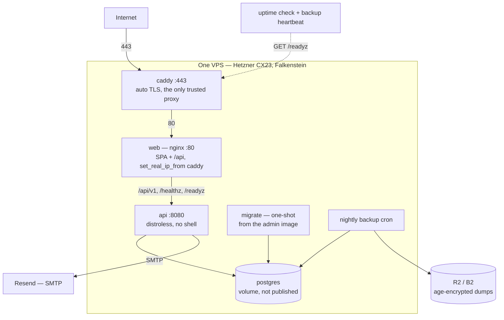

# Hearth — production deployment

Slice 2 (Money) is complete and browser-walked, self-serve sign-up works, and
nothing has ever run outside `docker compose` on a laptop. This is the design
for the first live install.

It is deliberately not a platform. One household, one box, one person operating
it. Every decision below trades scale and automation away for something that can
be understood, restored and left behind.

Two ADRs sit above this document and are not restated here:

- **`docs/adr/0001-optimise-for-exit-cost.md`** — the product owner intends to
  run Hearth for roughly forty years, so hosts are chosen for how cheaply we can
  leave them, not how long they are expected to last.
- **`docs/adr/0002-first-production-host.md`** — the concrete purchase: one
  Hetzner CX23 in Falkenstein (amended 2026-08-15 from CPX11/Singapore; ADR 2), Caddy for TLS, Postgres in the stack, Mailpit on the box for
  mail.

## Decisions

**1. Day one is a private soft launch.** The install goes up, Andreas and
Christine use it for real, and nobody else is given the URL. Sign-up is not
closed — there is no flag for that, and adding one means a new config value, a
route guard and a test for a state that "nobody knows the address" already
provides. What this buys is scope: no support path for a locked-out stranger, no
abuse monitoring, no status page, no on-call. Those arrive with the first real
customer, not before.

**2. Images are built by GitHub Actions and pushed to GHCR; the box only
pulls.** The alternative — building on the box from a git clone — wants roughly
1–1.5 GB of RAM for `npm ci` plus `vite build`, on a 2 GB box already running
Postgres and the API, so a deploy could evict the live app. It would also put
the full source tree on a public machine, which is the thing the distroless
images exist to avoid. Building on the Mac was rejected for a different reason:
it is arm64 against an amd64 server, so the web image builds under emulation, and
it makes one laptop the only machine that can ship a fix. Over a forty-year
horizon that is the wrong single point of failure.

**3. Deploys are manual: you SSH in and pull.** CI builds; a human decides when
production changes. This is not caution for its own sake — see decision 10, where
a bad migration is a restore-from-backup event rather than a rollback. Automatic
deploy on green `main` was rejected because it puts a deploy key capable of
restarting production on the box and lets an unattended merge reach the only copy
of a household's ledger. A pull-based agent was rejected for the same reason,
minus the audit trail.

**4. Images are tagged with the git SHA, and the Compose file names that tag
through `IMAGE_TAG`.** CI builds three images — `hearth-api`, `hearth-web`,
`hearth-admin` — and tags each `ghcr.io/oandrz/<name>:<git-sha>`. The Compose
file references `${IMAGE_TAG}`, read from `deploy/.env`; deploying is
changing that one value and running `up -d`.

A moving `:latest` was rejected for two reasons that only appear when you chase
them:

- **Rollback needs immutable tags.** Decision 10's "pull a previous tag" is
  meaningless against a pointer that always moves forward.
- **A migration-only change produces a byte-identical API image.** Migrations
  live in `api/migrations/*.sql` and are not embedded in the Go binary, so
  `go build` emits the same output and the api image digest does not change. If
  Compose does not recreate `api`, it never re-evaluates `depends_on: migrate`
  with `service_completed_successfully` — and **the migration silently does not
  run.** That is the `make up` gotcha from `docs/HANDOVER.md` §5 wearing a new
  hat, and it would arrive on precisely the deploys that are nothing but a
  schema change. Changing `IMAGE_TAG` changes the service's config, so Compose
  recreates `api` whether or not its digest moved.

CI may also push `:latest` for convenience, but the Compose file must never
reference it.

**5. Migrations run automatically, as a one-shot service, before the API
starts.** Same shape as development: `api` declares `depends_on: migrate` with
`service_completed_successfully`, so a failed migration blocks the new API rather
than half-upgrading the install. Decision 4 is what makes that guarantee hold on
every deploy rather than most of them.

**6. Backups are encrypted client-side, and the key is escrowed.** Each nightly
dump is a household's complete financial history plus email addresses and
password hashes, landing in a third-party bucket. It is encrypted with `age`
before upload, so the bucket holds ciphertext only. The key lives in the owner's
password manager **and** as an offline copy held by a trusted second person.

The escrow is doing double duty. `docs/HANDOVER.md` §5 records succession as the
one open item that cannot be retrofitted: today, if the owner is unavailable,
nobody can reach the box, the domain or the data. The same envelope that holds
the backup key holds the Postgres password, and is the first real answer to that.

**7. DNS only — no Cloudflare proxy, no tunnel.** Caddy is the outermost proxy,
so there are exactly two in the chain and nginx trusts exactly one static
address. Cloudflare's proxy would make it three, and Caddy would then have to
trust Cloudflare's published IP ranges to recover the real client address —
ranges that change and must be refreshed, where staleness silently breaks the
sign-up limiter and over-trust makes it spoofable again. That is the failure this
codebase already documents twice. The cost accepted: the origin IP is public,
which for a box with only 22, 80 and 443 open, on a private launch, is fine.
Adding Cloudflare later is possible and now flagged in `web/nginx.conf` as
requiring a revisit of `set_real_ip_from`.

> **Correction, 2026-08-11.** "nginx trusts exactly one static address" is not
> what shipped. `web/nginx.conf` carries `set_real_ip_from 172.28.0.0/16` — the
> whole Compose subnet, not a `/32` for Caddy — because Docker assigns Caddy's
> address from that range and a single address would have to be pinned. The
> accepted consequence is recorded in `docs/SYSTEM_DESIGN.md` §1: any container
> on that network can present an `X-Forwarded-For` nginx believes, which is
> tolerable only because such a container can also reach `api:8080` directly,
> where `middleware.RealIP` has no trusted-proxy list at all.
>
> **The decision itself is unaffected, and the correction sharpens rather than
> weakens it.** The argument against Cloudflare was never really about *one*
> address versus a range — it is that Caddy's range is a fixed, private,
> self-assigned `/16` that changes only when this repository changes it,
> whereas Cloudflare's ranges are public, externally owned, and must be
> refreshed: stale silently breaks the sign-up limiter, over-broad makes it
> spoofable again. Read the sentence above as "nginx trusts exactly one
> statically-configured range it owns".

**8. Production configuration lives in a `deploy/` directory in this repo, and
the box sparse-checks out only that directory.**

```bash
git clone --depth=1 --filter=blob:none --sparse https://github.com/oandrz/Household.git
git sparse-checkout set deploy
```

Config is version-controlled and reviewable beside the code it runs, updates are
`git pull`, and the box still never receives the source tree. Overriding the dev
compose file with `-f` was rejected: it hardcodes every value inline with no
`${VAR}` interpolation and carries bind mounts and Mailpit, so the override would
consist mostly of deletions — hard to read and easy to get wrong. Copying files
by `scp` was rejected because the running config would drift from the repo with
nothing recording it.

**The secret file is named `deploy/.env`, not `.env.production`, and the name is
forced.** Compose reads a file called exactly `.env` for `${VAR}` interpolation
in the Compose file itself; any other name has to be passed as `--env-file` on
every single command. Decision 4 requires `${IMAGE_TAG}` to interpolate, so the
file must be `.env` — or every break-glass command in the runbook grows a flag
that must be remembered at the moment an operator is least able to remember it.
The tracked template beside it is `deploy/.env.example`.

**9. `sslmode=disable` is correct for this topology, and is a decision rather
than an oversight.** Postgres sits on the Compose bridge network on the same
host and is never published, so the connection never crosses a network. Requiring
TLS would mean issuing and rotating certificates for a link that does not leave
the machine. (An earlier draft of `docs/HANDOVER.md` §4 listed `sslmode=require`
as a production change; that line is corrected by this document.)

**10. Rollback is image-only. A bad migration is a restore, not a rollback.**
Pulling a previous tag rolls the code back. It does not undo a migration: goose
`Down` migrations exist for every version here but **no test has ever run one**
(`docs/HANDOVER.md` §5), so they are correct by inspection only. This is why
decision 3 keeps a human watching the output.

**11. The effective mail budget is 100/day, not the 1000/day the code
believes.** The application's global daily ceiling is 1000 sends, counted from
`signups`. Resend's free plan caps at 100/day. Resend's limit therefore binds
roughly ten times sooner, and the application has no way to know: sends are
fire-and-forget (`usecase/auth.go`'s `sendMagicLinkAsync`), so a relay rejection
surfaces in no log a user or an operator reads — and the send being dropped is
the magic link that is the only way back into a locked household.

Recorded rather than fixed. Lowering the in-code ceiling below 100 would need the
constant to become configurable, with its own test, and a private launch will
never approach either number. **The condition to revisit it is the first paying
customer, not a date.**

> **Superseded, 2026-08-12 — there is no Resend account.** This decision and
> decision 6's mail row both assumed a hosted relay. The first install runs on a
> free DDNS hostname whose DNS refuses `TXT` records, so DKIM cannot be
> published and Resend cannot verify the domain at all. Mail runs on Mailpit, on
> the box, read over an SSH tunnel; see
> `docs/adr/0003-mail-stays-on-the-box.md` for the alternatives examined and the
> exit condition. The 100/day mismatch above becomes live again the day a real
> relay is configured, so it is left standing rather than deleted.

**12. Monitoring is two things and nothing else.** An UptimeRobot free check on
`/readyz` every five minutes (it pings the database, so it catches a dead
Postgres rather than merely a live nginx), and a healthchecks.io dead-man's-switch
pinged by the backup cron. No metrics, no dashboards, no log aggregation —
`docker compose logs` is the log story, which is honest at this size and would be
dishonest at ten customers.

**13. Production starts empty.** `APP_ENV=production` makes `adminctl seed`
refuse — it checks both the environment and that the database host is local — so
the first household is created through `/auth/sign-up` exactly as a stranger's
would be. Nothing is migrated from any development database. If real data exists
there, moving it is its own piece of work and is not in this spec.

## Topology



**Four long-lived containers** — `caddy`, `web`, `api`, `postgres` — plus
`migrate`, which runs once and exits. Five Compose services in total. The backup
cron is drawn inside the box because that is where it runs, but it is a host
cron calling `docker compose exec`, not a sixth container.

Firewall opens 22, 80 and 443 only. `restart: unless-stopped` on the four
long-lived services, so a reboot restores service without a human.

The box stays at 2 GB because decision 2 moved every build off it.

## What gets built

| Artefact | Where | Notes |
|---|---|---|
| `admin` Dockerfile target | `api/Dockerfile` | Distroless, carrying `adminctl`, `goose` and `migrations/`. No `ENTRYPOINT` — the binary is named at run time |
| `deploy/docker-compose.prod.yml` | new | Five services, `env_file`, no bind mounts, no Mailpit, Postgres unpublished |
| `deploy/Caddyfile` | new | One site block, reverse proxy to `web:80` |
| `deploy/.env.example` | new | Every variable `config.Load()` requires, plus `IMAGE_TAG`, with the two secrets blank |
| `deploy/backup.sh` | new | `pg_dump` → `gzip` → `age` → `rclone`, then the heartbeat ping |
| `deploy/README.md` | new | The deploy runbook and the restore procedure |
| `.github/workflows/images.yml` | new | Build **three** images — api, web, admin — tag each with the git SHA, push to GHCR on `main` (decision 4) |
| `set_real_ip_from` lines | `web/nginx.conf` | Two lines; mandatory once Caddy is in front |
| `.gitignore` | edit | `deploy/.env` |

## Configuration

Everything `config.Load()` requires, and nothing it does not. There is no session
signing key and no CSRF key — sessions are opaque random tokens hashed at rest,
CSRF is double-submit — so the application's own secret material is two
passwords: the Postgres password and the Resend API key.

**There is a third secret that is not an application variable.** The images are
private, so the box needs a GitHub fine-grained token with `read:packages` and
nothing else, supplied once via `docker login ghcr.io` rather than through
`deploy/.env`. It belongs in the escrow envelope alongside the backup key and
the Postgres password — without it a rebuilt box cannot pull the images it is
supposed to run.

> **Correction, 2026-08-11. There is no third secret.** The premise is wrong:
> `oandrz/Household` is a **public** repository, so the packages GHCR publishes
> from it are public too. Verified anonymously, with no credentials present:
> GHCR issues a pull token for `oandrz/hearth-admin` to an unauthenticated
> caller and the manifest returns `200`, and the image pulls on a machine whose
> `~/.docker/config.json` holds no `ghcr.io` entry.
>
> So the box needs no `docker login` and no token, and the escrow envelope holds
> **three** items, not four: the age private key, the `POSTGRES_PASSWORD`, and a
> printed copy of `deploy/README.md`'s restore section. Escrowing a token that
> grants nothing is worse than leaving it out — it is one more credential to
> rotate, and it implies a rebuilt box is blocked without it when it is not.
>
> This becomes live again the moment the repository is made private. If that
> happens, restore the paragraph above and add the token back to the envelope.

| Variable | Production value | Notes |
|---|---|---|
| `APP_ENV` | `production` | Makes cookies `Secure`; makes `adminctl seed` refuse |
| `PORT` | `8080` | |
| `DATABASE_URL` | `postgres://hearth:<secret>@postgres:5432/hearth?sslmode=disable` | Decision 9 |
| `SMTP_ADDR` | `smtp.resend.com:587` | |
| `SMTP_USERNAME` | `resend` | |
| `SMTP_PASSWORD` | the Resend API key | Secret |
| `SMTP_FROM` | an address on the verified domain | Resend rejects anything else |
| `SMTP_TLS_MODE` | unset | Defaults to `mandatory` outside development |
| `APP_BASE_URL` | `https://<domain>` | Wrong here mails broken links and fails nowhere visible |
| `ARGON2_*` | defaults | See `docs/HANDOVER.md` §5 on their long-horizon expiry |

`config.Load()` fails closed on every required variable, so a half-configured box
refuses to start rather than half-working.

## DNS and mail

An `A` record to the box. Resend domain verification adds SPF, DKIM and DMARC
`TXT` records; without them the mail this product depends on for recovery lands
in spam. `SMTP_FROM` must be on that verified domain.

The first action taken on the live install — signing up — sends mail, so a broken
relay announces itself immediately rather than on the day someone is locked out.

## Backups and restore

Nightly: `pg_dump` in **plain SQL** (per ADR 1, readable by any future Postgres
and by a human), gzipped, encrypted with `age`, uploaded by `rclone` to
**Cloudflare R2** — 10 GB free, S3-compatible, and no egress charge, which is
what you are paying on the day you actually need a restore. Backblaze B2 is the
equivalent fallback if R2 is unavailable. Not Hetzner Storage Box: ADR 1 requires
the copy to sit off the hosting provider, because a lapsed payment card takes the
server and its snapshots together.

Naming `hearth-YYYY-MM-DD.sql.gz.age`. Retention: every daily kept 90 days,
every monthly kept indefinitely. The data is megabytes; deleting is a larger
risk than storing.

On success the script pings a free dead-man's-switch, which emails if a night is
missed. A backup that silently stops is the standard way this fails, and the
alternative to a heartbeat is discovering it during a restore.

**The restore drill is part of this deployment, not a follow-up.** Fresh
throwaway Postgres, decrypt, `psql <`, point a local API at it, sign in. Timed
and recorded. It must be decrypted with the **escrowed** copy of the key rather
than the owner's own — otherwise the escrow has never been exercised, and it is
first tested at the one moment the owner cannot be asked.

## Deploy runbook

Lives in `deploy/README.md`:

1. CI green on `main`; images tagged and pushed to GHCR
2. `ssh box` and `cd Household/deploy` — every command below runs from there,
   since the sparse checkout puts the Compose file at `deploy/`
3. `git pull` if the Compose file or Caddyfile changed, then
   `docker compose -f docker-compose.prod.yml pull`
4. `docker compose -f docker-compose.prod.yml up -d` — `migrate` runs to
   completion before `api` starts
5. `curl -f https://<domain>/readyz`
6. `docker compose ps` — confirm nothing is restarting

Break-glass, from the admin image:

```bash
docker compose -f docker-compose.prod.yml run --rm admin /app/adminctl unlock-household --email=…
docker compose -f docker-compose.prod.yml run --rm -it admin /app/adminctl reset-password --email=…
```

`reset-password` prompts on stdin and never takes a flag, so it needs `-it` and
cannot leak into shell history.

## Testing

Nothing here is reachable from the Go suite: there is no unit test for a
Dockerfile stage, a Caddy config or a cron script. Verification is the walk
below, run against the deployed install, to the standard every feature in this
project has been held to.

Two things are checkable earlier and should be:

- The admin image builds and both binaries run, against a throwaway Postgres, on
  a laptop — before the box exists.
- `docker compose -f deploy/docker-compose.prod.yml config` parses, before it is
  ever run.

## Definition of done — the 12-criterion walk

1. HTTPS serves with a valid certificate; plain HTTP redirects to it
2. Sign-up completes from a phone on mobile data — a real network, not localhost
3. That mail arrives in a Gmail **inbox**, not spam
4. The link completes and the household exists
5. The session cookie is `Secure`, `HttpOnly`, `SameSite=Lax` on the real domain
6. An account, a transaction, a budget, a goal and a bill each save, and every
   derived figure moves
7. Three wrong passwords locks the household; a magic link recovers it
8. `adminctl unlock-household` works from the admin image against the live
   database
9. `goose_db_version` shows the migration applied
10. **The rate limiter keys on the real client, not on Caddy.** Exhaust the
    per-IP sign-up limit from one network, then confirm a *different* network can
    still sign up. Six rapid attempts from a single IP proves nothing: if
    `set_real_ip_from` is wrong every caller shares one bucket and the sixth
    still answers 429. Only two distinct clients receiving independent budgets
    distinguishes a working configuration from a broken one.

    **Restart `api` immediately before running this criterion.** The per-IP
    limiter is an in-memory token bucket of 5/hour, so criteria 2 through 4 will
    already have spent part of the budget for whichever network ran them — the
    sign-up walk of 2026-07-30 hit exactly this and recorded it
    (`docs/HANDOVER.md` §1). Run it as: restart `api`, exhaust from the laptop's
    network, then attempt from the phone on mobile data, which criterion 2 has
    already established as a genuinely separate client
11. The box reboots and every service returns without intervention
12. A real nightly backup ran, and a restore using the **escrowed** key
    succeeded. **This criterion spans a night**, since it waits for the scheduled
    run rather than a manual one — so the walk is two sittings, not one. A manual
    invocation of `backup.sh` passing is necessary but not sufficient: it proves
    the script, not the schedule, and a cron that never fires is the failure mode
    the heartbeat exists for

## Out of scope

- Any second box, load balancer, or high availability
- Log aggregation, metrics, dashboards, tracing
- A support path, status page or abuse monitoring — decision 1; these arrive with
  the first customer
- Closing sign-up behind a flag — decision 1
- Automatic deploys — decision 3
- Migrating any development data — decision 13
- Lowering the in-code mail ceiling to match Resend's — decision 11
- Postgres major-version upgrades: real, and a separate piece of work with its own
  restore-tested procedure
